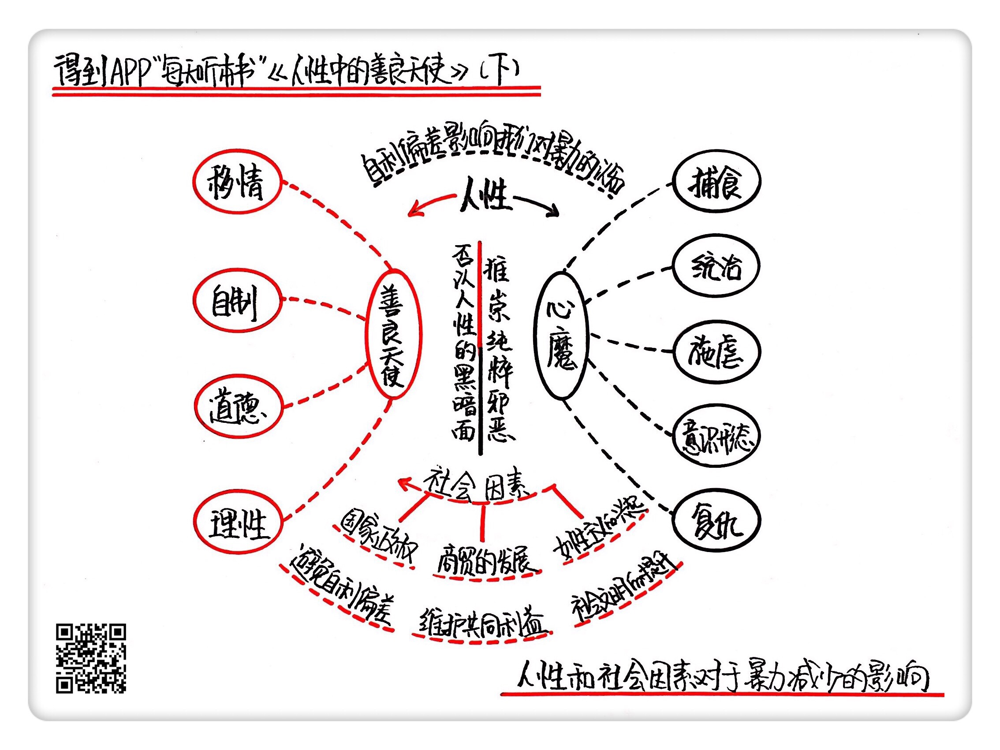

《人性中的善良天使（下）》| 韩巍解读
==========================================

购买链接：[亚马逊](https://www.amazon.cn/图书/dp/B00PI5VE6Q/ref=sr_1_1?ie=UTF8&qid=1507554115&sr=8-1&keywords=人性中的善良天使)

听者笔记
------------------------------------------

> 人性中“捕食”“统治”“复仇”等因素使人倾向暴力，但“移情”“自制”“道德”等善良天使会推动我们远离暴力；人性之外，国家、商贸、都市化等社会、经济、制度原因是带来暴力减少的外在动因。

关于作者
------------------------------------------

斯蒂芬·平克，哈佛大学心理学教授，当代著名的实验心理学家、认知心理学家、语言学家和科普作家，曾入选《时代周刊》“当今世界影响力最大的100人”之一。2016年，平克入选美国国家科学院院士。 

关于本书
------------------------------------------

在本书里，斯蒂芬·平克引用了大量图表和数据，解读了暴力减少的六大趋势，并分析了日常生活中我们对暴力趋势产生误判的原因。随后，他从心理学、认知科学等角度出发，讨论了人性中倾向暴力的“心魔”与守卫我们远离暴力的“善良天使”。人性之外，平克也解读了社会因素对于暴力减少的影响。 

核心内容
------------------------------------------

本书思想核心是：六大趋势体现了暴力的减少：从原始社会到国家出现，暴力事件有了明显的下降；从中世纪到20世纪的欧洲，凶杀率下降了90%，而且人们对于暴力的态度因为人道主义革命的影响也有了巨大的转变；二战以后，大国之间的战争几乎消失，各类武装冲突也越来越有节制；20世纪下半叶以来，由于权利革命的兴起，家暴、霸凌、虐待动物等暴力行为也都在减少。“历史近视眼”“认知预设”等因素造成了我们对暴力趋势的误判；人性中“捕食”“统治”“复仇”等因素使人倾向暴力，但“移情”“自制”“道德”等善良天使会推动我们远离暴力；人性之外，国家、商贸、都市化等社会、经济、制度原因是带来暴力减少的外在动因。 
 

一、关于“道德标尺的偏差”
------------------------------------------

因立场不同导致对事件的不同态度，被称为“道德标尺的偏差”。

“道德标尺的偏差”是“自利偏差”的一种，所谓自利偏差就是说人们总是希望自己看起来是个好人，从而导致在不同的立场上，对于道德的判断会有不同的标准。

近些年来，有很多文学作品或者电影电视作品开始致力于刻画更深层的人性，打破“好人-坏人”的二分印象，从多角度去刻画不同派别的人物，这正是利用了“道德标尺的偏差”。

二、关于“五个心魔”
------------------------------------------

在解答人性中是不是存在暴力的根源时，平克引用了社会心理学家罗伊·鲍迈斯特的框架，把人性里的暴力总结出了五个根源，也就是“五个心魔”。

第一类被称为“捕食”，也就是一种实用性的暴力，比如原始部落猎杀动物。

第二类是“统治”，追求的是一种控制权，这两类的暴力和霍布斯所说的“竞争”意思差不多。

第三和第四个根源分别是“施虐”和“意识形态”。种族大屠杀就是典型的例子，类似的还有十字军东征、法国大革命等等。

最后一类是“复仇”，或者说是“报复”，这同样是在电影里大受欢迎的题材，影片结尾好人报了仇，坏人受到了惩罚，正义得到了伸张。在更广泛的层面，“复仇”的存在是有一定的功能性的，那就是“威慑”。在真实世界里，冷战时期双方的剑拔弩张实际上就是一种对彼此的“威慑”。

著名的“囚徒困境”正是描述这种境况的一个模型：两个囚徒可以选择彼此忠诚，也可以选择背叛对方，彼此忠诚收益最大，互相背叛收益最小。当然，在日常生活中，所谓“冤冤相报何时了”，所以“复仇”不值得提倡。另外由于“道德标尺的偏差”，人们会倾向于认为自己受到了更大的伤害，回击也就更为粗暴、毫不理性。

三、关于“人性中的善良天使”
------------------------------------------

在我们的人性中，也有一些促使人类放弃暴力的心理因素。作者告诉我们人性中有四位善良天使在引导我们远离恶魔，走向和平。

1. 第一位善良天使：移情

其实就是我们常说的“感同身受”，站在他人的立场上，感受别人的感受，用对方的眼睛来看世界。移情中我们最常见的就是“同情”。在现实世界中，“移情”可以引导人们认识到超越一切文化的普世人性，“移情-利他假说”则相信“移情”可以推动我们帮助他人。
2. 第二位善良天使：自制

自制就是人们认识到冲动行事的后果，从而对自己的行为加以抑制。不过，自制力的强弱因人而异，人们也一直在思考提高自制力的方法。
3. 第三位善良天使：道德感

也就是说，存在一套神圣化的规则或者说戒律，用来约束人群的行为，不符合这些规则的就被称为“不道德”，要受到群体里其他人的鄙视。然而道德是一个相当主观的概念，随着不同人、不同社会的变化而不断变化，交战双方可能有着不同的道德观念。
4. 第四位善良天使：理性

伏尔泰曾经说过“荒谬导致暴行”，理性的存在就是帮助我们认清荒谬，从而破除暴力的思想基础。

此外，理性和其他三位天使都是好朋友，盲目的情感加上理性，相对更客观，“移情”可能把我们限制在小圈子里，理性的存在却能让我们认识到关怀应该上升到怎样的高度；一味的“自制”可能会带来疲倦和反叛，人们终有厌倦框框想要做自己的时候，理性的存在能让人们认识到自制的必要性，即使在放松自制的情况下，也有不能突破的底线。“道德”的存在相对主观，道德与理性的结合才能告诉我们究竟有哪些是真正的规范。

四、关于减少暴力的社会因素
------------------------------------------

平克总结了五个社会因素。“利维坦”是我们要说的第一个社会因素。利维坦原本的意思是巨大的怪兽，英国哲学家霍布斯用利维坦来比作一个强大的国家。正是因为国家垄断了暴力的使用，化解了民间层出不穷的暴力行为。

除此之外，国家和司法也可以作为一个相对公正的第三方，用统一的标准衡量暴力事件，规定相应的惩罚，避免“道德标尺的偏差”带来的不利影响。

第二个社会因素是商贸的发展。商业贸易虽然和暴力没有直接关系，但是两个国家的商贸交流使得国与国之间的联系越发紧密，共同利益越来越多，在这种情况下，和平是最符合双方利益的。在当今全球化的背景下，各个国家的利益都被或多或少纠缠在了一起，有的时候，贸易制裁远比暴力有效得多。

第三点是女性主义的兴起。这也是社会逐渐尊重女性的过程，妇女地位的提高其实也暗示着社会文明程度的提高。

金句
------------------------------------------

1. 平克指出，人性中有五个“心魔”，分别是“捕食”“统治”“施虐”“意识形态”和“复仇”。
2. 这种因立场不同导致对事件的不同态度，被称为“道德标尺的偏差”。
3. “移情”引导人们认识到超越一切文化的普世人性，引导暴力的减少。
4. 城市化、流动性与大众传媒的发展，带来的是不同思想的碰撞和交融，在这个过程中，理性就好像踩在一部滚梯上不断攀升。人们认识到暴力循环的弊端，并能够真正地重新认识暴力、反思暴力。
5. 我们在认清暴力本身之外，更要珍惜文明和启蒙的力量，如果我们掉以轻心，暴力也可能会卷土重来。

撰稿：韩巍

脑图：摩西

转述：杰克糖