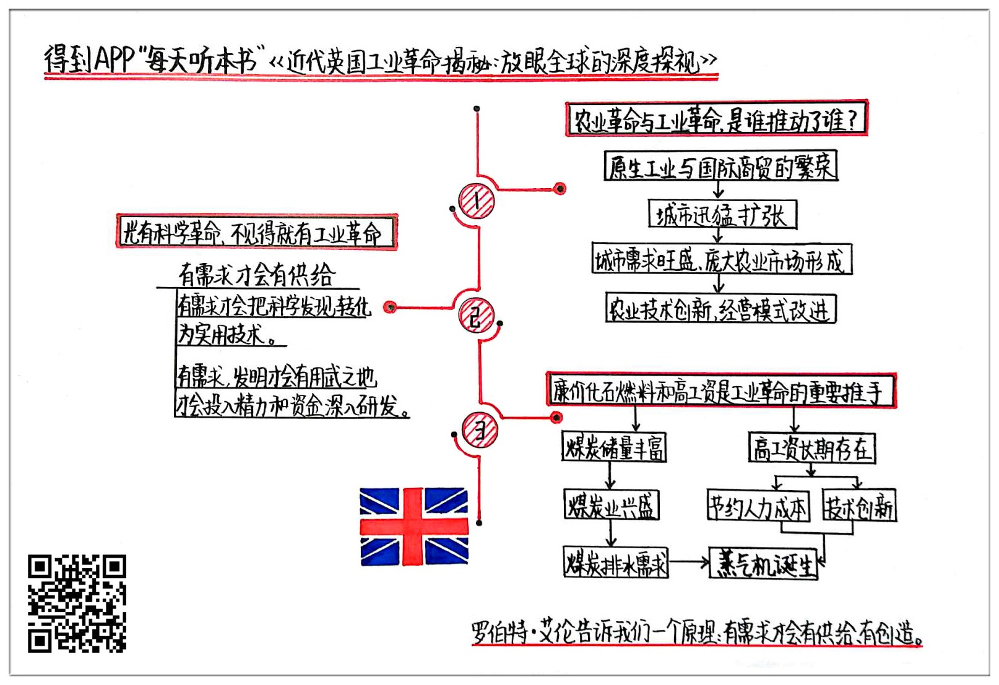

《近代英国工业革命揭秘》| 段宇宏解读
=============================

购买链接：[亚马逊](https://www.amazon.cn/社会经济史译丛•近代英国工业革命揭秘-放眼全球的深度透视-罗伯特•艾伦/dp/B008H1IACE/ref=sr_1_1?s=books&ie=UTF8&qid=1512226388&sr=1-1&keywords=近代英国工业革命揭秘)

听者笔记
-----------------------------

> 是工业革命也就是城市化和高工资导致了农业革命，而不是传统观念认为的农业革命导致了技术发展从而演化出了工业革命。
>
> 工业革命吸纳了大量的农村人口，还带来了城市化和高工资。
>
> 虽然蒸汽机助力了工业革命，但是并不是科学技术的发展导致的，蒸汽机发明了很久也没有导致，而是因为它们发现蒸汽机有生产实用价值。
>
> 英国的工资居高不下，但是还好英国的燃料资本比较便宜，所以英国工业品的总体成本不高，商品还有竞争力。这也促使英国能够最先完成工业革命。

关于作者
-----------------------------

罗伯特·艾伦，早年毕业于哈佛大学，获得博士学位，现在是牛津大学经济史教授，世界顶级的经济史专家，属于这个领域“扫地僧”一般的人物。艾伦的其他著作还有《极简全球经济史》《从农场到工厂：苏联工业革命的再阐释》《工业革命极简史》等等。牛津的研究风格相较于剑桥，更偏向“技术流”，所以艾伦的作品专业性非常强，工业革命更是他重点关注的领域。 

关于本书
-----------------------------

牛津的研究风格相较于剑桥，更偏向“技术流”，所以艾伦的作品专业性非常强。以前对工业革命的研究，往往把焦点集中在社会结构、法律制度、产权观念、科技水平、文化宗教等等领域。这本专著列举了已有的主要观点，进行了反驳或者修正，运用大量数据、模型、史料以及纵向和横向对比，支撑自己的论点。结论比较有颠覆性，能让人耳目一新。 

核心内容
-----------------------------

本书思想核心是：工业革命由诸多因素的合力推动产生。以前的教科书或专著都会提到诸如科技革命、农业革命、产权制度、法律环境、文化宗教等产生的作用。其实，有科技革命不一定带来工业革命，也不是农业革命为工业革命提供了动力，而产权、法律、宗教也不是主因，蒸汽机的出现也不是必然会带来产业革命。原生工商繁荣和城市化推进，加上高工资和便宜的化石燃料，是工业革命的主要推手。 
 

一、农业革命与工业革命的关系
-----------------------------

传统说法认为，工业革命前，英国由于圈地运动，使得大量农民失去耕地，农地变得集中，有条件进行近代化的资本主义农场经营，出现了一场农业革命。这种经营模式下农场主对创新农业技术，减少农业雇工，提升高产量有积极性。

农业革命发生后，产量增加，为城市扩张供应了充足食物，农业雇工减少也向原生工业部门提供了劳动力，使大量的人口转移到制造业领域，从而推动社会经济向前发展，直至促成了工业革命。

实际情况恰好相反，是城市化和高工资导致了农业革命。早期的国际商贸和原生型工业繁荣，促使了以伦敦为首的大都市急剧扩张，都市高工资像抽水机一样吸纳农村人口。城市人口规模上去了，食物需求猛增。

这个时候，农村小自耕农面临两种抉择，一是卖掉手头的耕地，迁入城市谋生，获取比种田收益更大的高工资；一是必须改进农业经营模式和耕作技术，提高产量，增加收入。

而乡绅阶层，也就是地主，也面临两个抉择，一是变卖掉耕地进城去从事商业和原生工业；二是收购其他小自耕农的土地，变成集约化经营的大农场，尽量减少雇工数量，拼命改进农业技术，提高收益。

二、有科学技术革命未必出现工业革命
-----------------------------

工业革命前的17世纪，在启蒙运动的推动下，物理学、工程学的理论都获得了较大的发展，蒸汽机就是这次革命的代表性产物。蒸汽机的出现，把英国推向了工业革命，从而把人类带向近现代世界。但是有了科技革命不一定带来工业革命，甚至有了蒸汽机，也不见得就会出现工业革命。

以前都说，英国人瓦特在1776年发明蒸汽机，从而推动了产业革命，这个说法并不准确。蒸汽机理论、技术的探索和完善，有一个漫长的过程，西欧各国都有贡献。

法国有个物理学家，名叫丹尼斯·巴本，比英国的瓦特更早一百年发明了蒸汽机模型。在此以后，也不断有人制造蒸汽机。只不过到了1712年，英国工程师托马斯·纽卡门发明了世界第一台有实有价值的蒸汽机，用于煤矿排水，但能耗极高。

准确地说，瓦特对前人的蒸汽机进行改良，制造了更节能、效率更高的蒸汽机，推动了产业革命。

纽卡门和瓦特发明的初衷，就是为了商用，帮企业解决问题，并指望发明获得巨额回报。当时英国是欧洲产煤大国，矿井积水问题严重，以前采用的是效率低下的马匹和水车抽水，迫切需要解决抽水问题。

当英国开始推广蒸汽机后，西欧其他国家仿制和购买非常容易，但却少有问津者，因为它们不需要。有实用价值的蒸汽机只能先出现在英国，并能得到普及。

三、高工资和廉价化石燃料和是工业革命重要推手
-----------------------------

高工资和廉价能源并存，是英国独特的现象。

英国从中世纪中后期开始，工资水平一直在欧洲位居前列，城市大扩张后，工资水平在欧洲更是首屈一指。

高工资原本是工商业竞争中的劣势，但英国由于有非常廉价的高效能源，抵销了这个劣势，使得它的商品没有降低竞争力。但由于工资不断上涨，使得英国很早就进入资本驱动型，而不是劳动力驱动型的生产经营模式，企业家、农场主、商人，都对能减少雇工，节约人力成本的技术发明以及经营模式非常感兴趣，成为发明创新的巨大推动力。

高工资使得民众的消费增长相当强劲，拉动了内需，也催动了工商业的发展。所以接下来几十年在英国，不光蒸汽机不断得以改良，价格越来越便宜，燃料消耗越来越少，其他各种提高效率的机器也如雨后春笋般涌现，并推动产业大发展。

其他国家的情况正好相反。作者对同时代中国的考察尤其值得我们关注。他选择了中英两国都有的瓷器业入手，从燃料、资本、劳动力三项要素比较英国瓷窑与中国瓷窑的情况。

作者指出，在中国，燃料价格贵得惊人，但人工费用比较便宜，所以中国瓷窑的设计思路与工作模式是从节省燃料，减少热量损失的角度来考量，但要雇佣大量的工人。而英国瓷窑与正好相反，优先考虑的是节省资本，减少工人，提升技术和效率。

这是两种不同的经济模式，英国是资本主导型，中国是劳动力主导型，所以后者很难对新技术新模式产生强烈兴趣。

金句
-----------------------------

1. 真正史无前例导致天翻地覆，彻底改变全人类社会结构、组织方式、生活模式和思想观念的革命，8000年来只有一场，就是工业革命。
2. 工业革命后，人类社会发展才呈现加速度式的突飞猛进，知识总量爆炸式增长，三百多年所取得的成就比过去上万年的总和还要多出千百倍。
3. 同时代的英国经济模式是资本主导型，中国是劳动力主导型，所以后者很难对新技术新模式产生强烈兴趣。
4. 工业革命离不开那些伟大的发明家，而发明家的诞生与家庭或者阶层出身有密切关联。

撰稿：段宇宏

脑图：摩西

转述：于浩