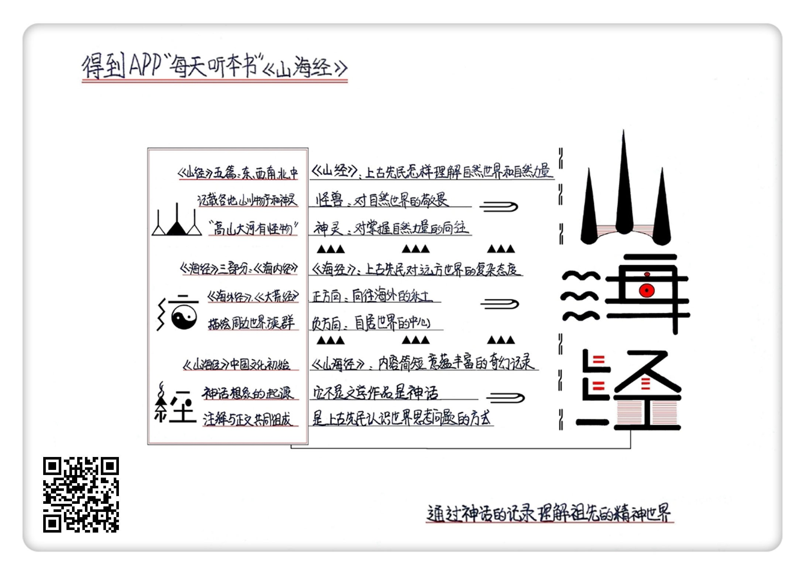

《山海经》| 郑学解读
================================

购买链接：[亚马逊](https://www.amazon.cn/图书/dp/B018X45L3K/ref=sr_1_2?ie=UTF8&qid=1506523294&sr=8-2&keywords=山海经)

听者笔记
--------------------------

> 《山海经》是先民看待未知事物的一种看法，也被视为古巫术时代的百科全书。
>
> 全书描述了大量的怪兽和神灵，认为中国是世界的中心，而周边的其他族群，多以奇异形态出现，常见的变形有，增加动物的特性、增加和减少器官、放大和缩小，也具备一些奇特的本领。

关于作者
--------------------------------

本书时代久远，作者已经无法考证，只能大致推测为战国到秦汉之间的巫师。书里的神话传说不是个人的创造，而是上古先民集体的思维产物。它们产生在比本书更古老的岁月里，作者只是对当时仍然流传的神话做了记录。     

关于本书
--------------------------------

《四库全书总目提要》把《山海经》看作中国的第一本小说。《山海经》是最能代表中国文化早期阶段的一本经典。它是原始神话思维的产物，是一本讲述神秘知识的巫书。本书内容繁杂，可以看作上古巫术时代的百科全书，包括了地理、历史、神话、民族、动物、植物、矿产、医药等一切古老知识。同时，本书也是中国文学的奇幻想象之源，《西游记》《镜花缘》等一切涉及奇幻世界的文学作品，都可以在这里找到渊源。

核心内容
--------------------------------

本书的主要内容是：古人在神话思维支配下，对世界的认识。人类理性发展成熟之前，上古先民用神话来认识世界，解释自然现象，把握自然力量。他们幻想出大量怪兽和神灵，作为自然力的象征；并且希望通过祭祀、预言等方法，趋利避害，掌控自然力。先民对陌生的远方怀有戒惧，把远方的族群看作异己的他者，因此把外国人想象成奇诡的外貌。但先民同时也把他们对美好乐土的向往寄托在海外，由此衍生出海外仙山的信仰。     
 

一、上古先民怎样用神话的思维方式，来理解自然世界和自然力量？
--------------------------------

我们把《山海经》里那些奇幻的记录叫做“神话”。神话不是文学作品，它是上古先民思考问题的方式。上古是人类文明的童年时期，当时人的理性还没有发展成熟，所以先民使用直观、具体、形象的神话来认识世界。一旦人类学会使用理性来认识世界，神话的时代就结束了。

在上古时代，先民和自然界的关系远比现代人密切。他们经常要面对各种险恶的自然力量，所以难免会感到敬畏。反映在《山海经》里，比如《山经》记载了很多怪兽，作者常常郑重提示：某种怪兽会吃人。另一方面，先民也幻想使用某种方式来控制自然力，所以他们虚构出很多神灵，作为自然力的主宰者。

因为敬畏，也因为原始稚拙，无论怪兽还是神灵，形象都被塑造得相当怪异和狰狞。《山经》里的大多数怪兽，都是从普通动物变形而来的，变形方法是增加多余的肢体器官，或者糅合不同动物的特征，也有一些怪兽是人和动物的合体。

看到怪兽是一种征兆，可以预示吉凶。不过，《山海经》描述的是一个危险的世界，凶兽要比瑞兽更普遍。一种怪兽到底预示吉祥还是灾祸，有时也是不固定的。比如九尾狐在《山经》里面，明明是一种吃人的恶兽，可是到了后面的《海经》里，它却变成预示天下太平的瑞兽。之所以九尾狐能够改邪归正，可能是因为汉朝人喜欢把它和皇帝的后妃联系在一起。班固《白虎通义》说，狐狸有九条尾巴，就好像皇帝有九个妃子。

《山经》记载了很多怪兽的味道，还有它们各种大补的疗效。吃，是占有自然物的一种方式，而通过“吃”获得某种好处，也意味着征服和利用了自然。这是先民最迫切的愿望。

《山经》里的神，外貌都很古怪，很多神都是由不同种类的生物拼合在一起构成的。人形的神灵要么手里拿着两条蛇，要么把蛇像耳环一样戴在头上，所以有人称之为“操蛇之神”。大概古人把降服毒蛇当作征服自然力的象征。

神灵需要按照特定的方式祭祀。掌握关于祭祀的知识，就能处理好你和神灵之间的关系，进而处理好你和自然界的关系。随着神话时代的结束，这些知识失去作用，只留下审美价值。《四库全书总目提要》把《山海经》看作中国的第一本小说。

二、上古先民想象中的世界格局是什么结构？他们怎样看待中国周边的其它族群？
--------------------------------

中国文化有安土重迁的特点，人们对遥远的异乡往往怀着一种本能的畏惧，生活在中国四周的各个族群就是先民眼里奇异而危险的陌生人。《山海经》建立了一个很有哲学意味的世界体系：世界的中心是我们生活的家园；而围绕在四周的，则是各种“异人”的国度。

“异人”一般相貌诡异。在怪诞的描写背后，隐藏着古人的一种身份认同原则。《海经》对“我们”和“他们”做了非常明确的区分：只有生活在中华的人群，才可以被“我们”接受，当作同类；而生活在四周的人群，则是受到排斥的异己力量。根据这种认识，《海经》设计了周边族群的形象。大体上，距离越遥远，那些人群的形貌就越怪诞。

为了营造怪诞感，《海经》对外国人的相貌做了种种变形。变形主要有三种方式：一是给人类增添某些动物的特征；二是是减少某些身体器官，或者增加多余的器官；三是放大或者缩小，也就是大人国和小人国。

《海经》判断“我们”和“他们”的标准，是距离远近，而不是其他因素，比如血缘关系。很多海外异人和我们一样，也是炎黄子孙，只因为生活在远方，就被异化成奇形怪状，甚至半人半兽的模样。

先民同时也把他们对天堂乐土的向往寄托在海外，由此衍生出海外仙山的信仰。《海经》描写的某些海外国度，已经大致具备仙境的雏形。那里的居民，也像仙人一样拥有超乎寻常的寿命，或者干脆就是长生不老。《山海经》认为，海外有很多延长寿命的宝物，比如掌握在巫师手里的不死药、生长在昆仑附近的不死树等等。一些海外异人还拥有飞天等令人向往的奇特本领，比如著名的奇肱国飞车。

《山海经》讲述的这些“远国异人”，在古人看来却是真实的世界图景。直到明朝末年，也就是西方传教士利玛窦来到中国的时代，社会上流传的各种世界地图，还是参考《山海经》来绘制的。在很多明代地图上，大海中既有真实存在的岛国，比如日本，也有来自《山海经》的奇幻国度。甚至明代很多通俗小说，还有意无意地将日本国和小人国相混淆。     

金句
--------------------------------

1. 如果把《山经》描述的神话世界总结成一句话，那就是“高山大河有怪物”。上古是人类文明的童年时期，当时人的理性还没有发展成熟，所以先民使用直观、具体、形象的神话来认识世界。一旦人类学会使用理性来认识世界，神话的时代就结束了。
2. 看到怪兽是一种征兆，可以预示吉凶。古人希望通过掌握这些关于怪兽的知识，来把握自然界，趋利避害。不过，一种怪兽到底预示吉祥还是灾祸，会受到文化的影响，有时也是不固定的。
3. 大家经常开玩笑，说中国人什么都敢吃。就连怪兽，也在我们的食谱上。吃，是占有自然物的一种方式，而通过“吃”获得某种好处，也意味着征服和利用了自然。这是先民最迫切的愿望。
4. 这本书建立了一个很有哲学意味的世界体系：世界的中心是我们生活的家园，而围绕在四周的，则是各种“异人”的国度。只有生活在中华的人群，才可以被“我们”接受，当作同类；而生活在四周的人群，则是受到排斥的异己力量。根据这种认识，《海经》设计了周边族群的形象。大体上，距离越遥远，那些人群的形貌就越怪诞。
5. 判断“我们”和“他们”的标准，是距离远近，而不是其他东西，比如血缘关系。很多海外异人和我们一样，也是炎黄子孙，只因为生活在远方，就被异化成奇形怪状，甚至半人半兽的模样。在奇幻世界里，人和动物之间并没有绝对的界线。这个世界可以说是人鬼混杂、人兽混淆。
6. 上古先民跟我们小时候一样，也曾经幻想过神秘的远方。在遥远的没有人去过的地方，有神奇的宝藏、神奇的动物、神奇的人和神灵。这种向往发展到后世，就衍生出道教宣扬的“海外仙山”。《海经》描写的某些海外国度，已经大致具备仙境的雏形。

撰稿：郑学

脑图：摩西

讲述：孙潇