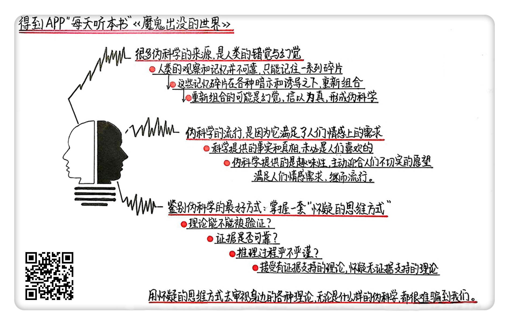

《魔鬼出没的世界》| 汪花生解读
====================================

购买链接：[亚马逊](https://www.amazon.cn/魔鬼出没的世界-卡尔•萨根/dp/B00YBGK356/ref=sr_1_1?ie=UTF8&qid=1507945363&sr=8-1&keywords=魔鬼出没的世界)

听者笔记
------------------------------------

> 这篇文章的名字中的魔鬼，是指“伪科学”。
> 
> 许多伪科学来源于人类的错觉和幻觉
>
> 有时候人们相信伪科学，是因为伪科学给了人们希望，但是科学可能又暂时无法解决，比如绝症。有时候也因为一切都过于理性，这个世界反倒变的无趣了，伪科学可能给人带来一些乐趣。
>
> 鉴别伪科学的最好方式是掌握“怀疑的思维方式”：
>
> 不能被检验的理论，一定是伪科学；如果一项理论的证据不可靠，就要保持怀疑；要看证据和理论之间的逻辑关系是否严密；
> 
> 简单地讲，就是如果遇到伪科学，就要看支持他的结论是否正确，论据是否科学、推理是否严密，否则，就需要保持怀疑的心态。

关于作者
------------------------------------

卡尔·萨根，NASA 顾问，天文学博士，美国太空计划最早的参与者之一。科普名家，制作过风靡全美的电视科普节目《宇宙》。同时，他写的科幻小说获得过雨果奖，并被改编成了电影。 

关于本书
------------------------------------

《魔鬼出没的世界》是卡尔·萨根人生中的最后一部作品，在当年的畅销书榜上排名第一。本书对各类流行的伪科学进行了揭露和反思，并较为全面地反映了卡尔·萨根对科学的理解。

核心内容
------------------------------------

卡尔·萨根在对大量伪科学案例进行分析后提出，很多伪科学来源于人类的错觉和幻觉。伪科学之所以流行，是因为它满足了人们情感上的需求，而科学常常难以做到这一点。如果要识别伪科学，就要树立起一套“怀疑的思维方式”。
 

一、许多伪科学来源于人类的错觉和幻觉
------------------------------------

人类的观察和记忆并不可靠。在各种暗示和诱导之下，人们极容易产生幻觉和错觉。这些幻觉时常成为伪科学的来源。

1. 人的观察和记忆很不可靠

人们常常认为“眼见为实”，但由于各种因素的影响，人类在观察中会产生很多错觉。

【案例】

很多人都可以在火星、太阳等各种地方看到人脸图案，这些当然不是真正的人脸，只是在观察时所产生的一种幻觉。但许多人却将此作为外星人存在的证据。
2. 人的记忆很容易被诱导

我们只能记住一系列的碎片，再把这些碎片组合起来，去形成一个故事，而这个过程极易受到诱导。

【案例】

有医生在心理治疗中发现，如果告诉病人她头顶上有盏灯，病人就可以自动编出一个 UFO 的故事;如果告诉她曾被外星人做过实验，她就可以编出一个被外星人绑架的故事，并且认为这是自己的亲身经历。

二、伪科学的流行是因为它满足了人类情感上的需求
------------------------------------

科学提供的是真相，但真相未必受欢迎。而伪科学虽然不提供真相，却能满足人们的情感需求。

1. 伪科学可以提供趣味

在真相和趣味相冲突的时候，人们更愿意选择趣味。

【案例】

“麦田怪圈”事件从头到尾只是一场恶作剧，但围绕该类事件的信息趣味性极强，媒体、爱好者不愿相信真相，而是一厢情愿地认为麦田怪圈是外星人的杰作。
2. 伪科学会迎合人们的愿望

科学能做到的事情是有限的，而伪科学给出的承诺往往是无限的，它会宣称自己可以做到科学都做不到的事，满足人们的愿望。

【案例】

澳大利亚曾出现过一位“大师”，宣称可以治愈任何疾病，帮人们摆脱困境。这一骗术虽然低级，但因为其满足了人们的愿望，还是有许多人上当。在骗局被揭穿以后，许多老年人甚至不愿意相信科学家，而是选择继续相信“大师”。

三、鉴别伪科学的最好方式是掌握“怀疑的思维方式”
------------------------------------

在看待一件事的时候，我们的第一态度不应该是相信，也不是拒绝，而是保持怀疑并寻找证据。只有在证据范围之内的事，才选择相信。

1. 不能被检验的理论，一定是伪科学

【案例】

卡尔·萨根提出了“车库里的飞龙”：有一个人说，自己的车库里有条会喷火的龙。但你打开车库门一看，什么都没有，于是他就辩解说，这条龙是隐身的，看不见。如果你说让这条龙喷火，然后用红外线检测，他就说，不行，这条龙喷出的火不会发热，检测不到。这条龙的存在无法被证明，那就是不可信的伪科学。
2. 如果一项理论的证据不可靠，就要保持怀疑

【案例】

传媒大亨默多克曾放出过一段解剖外星人的录像。但录像画面不清，且多个片段都可以通过剪辑、导演等方式进行拍摄，整个录像带漏洞极多，因此不能证明外星人真的降临地球了。
3. 要看证据和理论之间的逻辑关系是否严密

【案例】

如果要判断某种药可以治疗肝炎，那就要控制变量，进行“双盲测试”。比如让所有的人，除了医生给的东西之外，什么都不许吃，防止干扰。然后给一部分肝炎患者吃这个药，给另一部分肝炎患者吃安慰剂，剩下的肝炎患者什么都不吃。最后比较这三组患者的肝炎状况，我们才能得出结论，知道这个药到底有没有效。 

金句
------------------------------------

1. 人们通常只能记住一系列的碎片，然后在各种暗示和诱导之下，把这些碎片组合起来，形成一个幻觉，然后信以为真。
2. 科学满足的是人们对事实和真理的需求，但伪科学满足的，是人们的一厢情愿，是人们对情感的需求。
3. 在看待一件事情的时候，第一态度应该不是相信，也不是拒绝，而是保持怀疑，然后去寻找证据。
4. 只有在证据范围之内的事，才选择相信。在证据范围之外的事，就应当保持怀疑。

撰稿：汪花生

脑图：摩西

讲述：孙潇