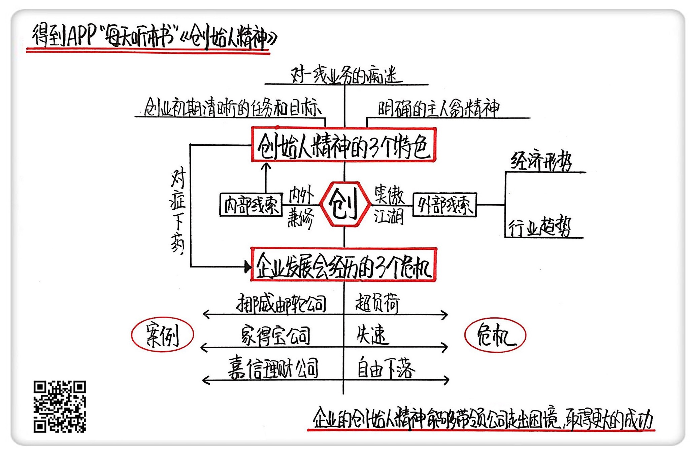

《创始人精神》| 冰柠解读
=============================

购买链接：[亚马逊](https://www.amazon.cn/创始人精神-克里斯·祖克/dp/B01MDP6AZD/ref=sr_1_1?ie=UTF8&qid=1508766290&sr=8-1&keywords=创始人精神)

听者笔记
-----------------------------

> 创始人精神的三个特点：创业初期清晰的任务与目标、对于一线业务的痴迷，以及明确的主人翁精神。
>
> 企业面临的三大危机：超负荷（规模太大，导致管理没跟上）、失速（企业增速突然放缓）、自由下落（各种原因导致业务突然停滞）。
>
> 解决办法：一、找回初创时的使命感。二、重视一线业务，确保决策接地气。三、恢复员工自主性和自主性，发挥主人翁精神。

关于作者
-----------------------------

克里斯·祖克、詹姆斯·艾伦，全球著名战略咨询公司贝恩公司的全球资深合伙人、全球战略业务联席主席。克里斯·祖克同时还是哈佛商学院技术与经营管理和综合管理的双料教授，著有《回归核心》《从核心扩张》《势不可挡》《创始人精神》等多本企业管理畅销书。 

关于本书
-----------------------------

克里斯·祖克和詹姆斯·艾伦通过长达10年，涵盖40多个国家的企业调查，分析了企业在成功的初创期之后，管理者如何将创始人精神融入他们的组织，并且利用创始人精神实现盈利增长。本书堪称初创企业的预防针，是发展中企业的一剂良药。 

核心内容
-----------------------------

企业在发展过程中将会面对三大可预见危机：超负荷、失速和自由下落。作者深入阐述了这些危机产生的根源，在于企业创始人精神的缺失。解决危机最根本的方式是明确创业初期的任务与目标，重拾公司对于一线业务的痴迷，并充分发挥员工的主人翁精神。创始人精神不仅是年轻企业取得成功所必需的东西，而且对于平稳发展的成功企业也同样至关重要。 
 

一、什么是创始人精神
-----------------------------

克里斯·祖克和詹姆斯·艾伦认为，创始人精神作为企业创始者在公司初创时期的正确方略，一般有三个特色：创业初期清晰的任务与目标、对于一线业务的痴迷，以及明确的主人翁精神。
创始人精神不仅仅是一个年轻企业取得成功所必需的东西，而且对于平稳发展的成功企业也同样至关重要，因为它有助于这类企业克服伴随增长而来的复杂性和惰性，创始人精神的保持和培养将会成为公司应对发展危机时最为重要的“内功”。

二、企业发展中遇到的三大危机
-----------------------------

企业在经营过程中，会遇到三大可预见危机，分别是超负荷、失速和自由下落。

“超负荷”是指在公司发展过程中，规模快速增长，而内部管理和运营还没有做好充分准备而导致的一种失衡。这通常发生在由年轻管理团队掌舵的高速成长型公司尝试迅速扩展其业务的阶段。就好像一个年轻人意外得到一本武林秘籍，但因为自己身体底子不够，最后发现根本没办法真正把这本秘籍用起来。

“失速”指的是许多成功的企业突然将增速放缓。这通常是因为，企业的快速发展导致了复杂的组织分层，同时也导致员工原本清晰的分工变得模糊，可是，正是清晰的分工协作才使公司具备专注力和动力。失速是一个公司的迷失时刻：发展的油门不再像曾经那样有效、灵敏，大部分公司一旦失速就再也无法恢复活力。

“自由下落”是指企业的核心市场份额增长完全停滞，一直行之有效的商业模式突然之间失效。它可能是因为外部因素，比如新技术出现带来的行业迭代，或者经济危机爆发对整个市场的冲击；也可能是内部因素，比如管理方法失效，商业模式失灵等等。

三、如何用创始人精神应对发展的危机
-----------------------------

超负荷、失速和自由下落这三个危机，虽然引发原因各不相同，对企业造成的影响也有所区别，但这三个危机的根源是有相通之处的。

它们产生的最根本原因是：公司在发展过程中，规模不断扩大导致公司内部机构复杂性增强，丢掉了“创始人精神”的魂儿，忽视了初创时期的使命感和对一线业务的重视，忽视员工主人翁精神的发挥。

面对三大可预见的危机，作者给出了三点忠告：

第一是找回公司在初创时期的使命感，并通过减少公司内部结构的复杂性来聚焦核心业务。

第二是重视一线业务，确保每一项决策都是接地气的。

第三是恢复员工的自主性和独立性，让他们在公司里充分发挥主人翁精神。

最后，作者还给出了一点提醒：创始人精神虽然对一家公司至关重要，但它并不是万能的。在作者看来，公司的发展有两条线索：一条是外部的线索（比如经济形势、行业趋势等等），另外一条是内部线索。创始人精神属于企业的内部线索。

内部线索要想发挥出最大的作用，离不开公司管理者对外部环境的准确把握和高效运作，只有“内外兼修”，才能实现公司运行的可持续化。

金句
-----------------------------

1. 创始人精神可以引导企业家完成日常的所有工作。所有这些创始人都把自己视为所在行业的新生势力，坚决致力于满足客户和一线员工的需求，并鼓励所有员工以公司主人翁的心态思考和行动。
2. 创始人精神不仅仅是一个年轻企业取得成功所必需的东西，而且对于平稳发展的大型企业也同样至关重要，因为它有助于企业克服伴随增长而来的复杂性和惰性。
3. 创始人精神作为企业创始者在公司初创时期的正确方略，一般有三个特色：创业初期清晰的任务与目标，对于一线业务的痴迷，以及明确的主人翁精神。
4. 我们每个人其实都是自己人生的创始人，树立一个与众不同的目标和使命感，提升自己的适应力和执行力，遇事不埋怨、不抱怨，主动去接纳、解决和放下。如果能做到这几点，相信我们将会从创始人精神中收获更多。

撰稿：冰柠

脑图：摩西

讲述：于浩