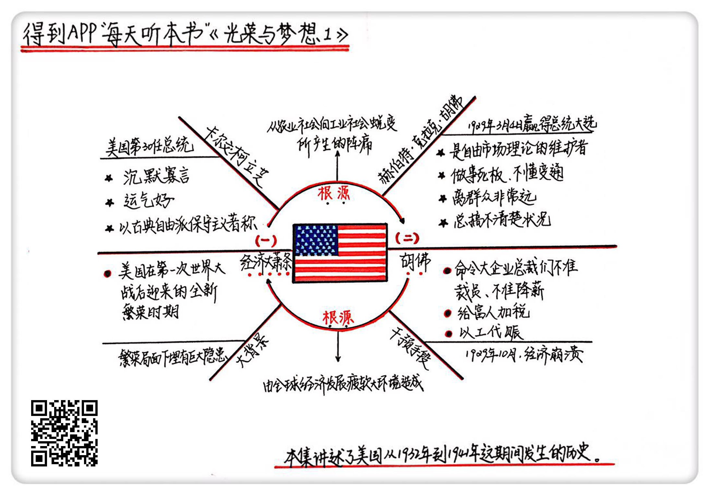

《光荣与梦想1》| 张凯解读
========================

购买链接：[亚马逊](https://www.amazon.cn/光荣与梦想-威廉·曼彻斯特/dp/B00T2DK826/ref=sr_1_1?ie=UTF8&qid=1511095554&sr=8-1&keywords=光荣与梦想&dpID=51oD2AjgCFL&preST=_SX258_BO1,204,203,200_QL70_&dpSrc=srch)

听者笔记
------------------------

> 柯立芝时代，美国经济属于上升期，肆意地发放贷款带来了虚假的经济繁荣，胡佛接手的时候，突然遭遇华尔街股市大跌，从此美国进入了大萧条，而胡佛采用的政策给大萧条雪上加霜。

关于作者
------------------------

威廉・曼彻斯特，20世纪中期美国著名的畅销书作家、记者。

关于本书
------------------------

本书讲述了美国1932-1972年间，从罗斯福总统上台前后到尼克松总统任期内“水门事件”共40年的历史，为我们详细描述了这个时期美国政治、经济、文化的全景图。

核心内容
------------------------

一、美国的经济大萧条是如何发生的；二、胡佛和经济大萧条。
 

一、美国的经济大萧条如何发生的
------------------------

一战结束后，美国的经济正处于上升期。时任总统柯立芝，以古典自由派保守主义著称，他绝对相信自由市场经济，主张减少税收、降低利率、鼓励投资。这个时期被称为“柯立芝繁荣”。
自由市场经济有一个先天性的特征，就是会波动。当时的美国，总统鼓励投资，银行鼓励贷款，贷款利率低，人们开始使劲地借钱，玩命地炒股。当时的信贷经纪人敢把钱借给任何人，银行对贷款人偿还能力的审查非常宽松，慢慢造成了严重的资产泡沫。另一方面，国家当时的生产效率也开始大幅地提升，把每个工时的工作效率提升了40%以上，但国内和国际的购买力都跟不上生产，这就给后面的灾难埋下了巨大的隐患。

二、胡佛和经济大萧条
------------------------

1929年3月胡佛赢得总统大选，作为共和党代表和慈善家，美国人民对他非常信任。他入职时，是在一片歌舞升平的簇拥下入主白宫的。

10月开始，华尔街的股市突然暴跌，短短两个星期之内，共有300亿美元的财富消失。它引起了可怕的连锁效应：股市崩溃、银行破产、工厂倒闭、工人失业、农民贫困、购买力下跌。失业人口增加到了1500万，美国的经济彻底崩溃。

【案例】

一个农厂主通过贷款买了些子弹，花2个小时把自己养的牲畜宰杀后运到市场，结果卖出去的价格连子弹的钱都赚不回来；如果把农民辛苦了一年的劳动成果折现，一马车的燕麦运到城里连一双球鞋都换不上；如果种小麦，一马车的小麦可能刚刚够换一双劣质球鞋，但是没人会去种小麦，因为种小麦的农民去掉抵押利息等一系列的费用外，每英亩的土地都会净亏损。直接用玉米做燃料，比把玉米卖掉换成炭做燃料更划算。

城市里的人们过着饥寒交迫的生活。

【案例】

长期在大街上晃荡的人也学会了一些生存的窍门。例如，用5美分买一杯咖啡，再要一杯免费热水，在热水里混入放在柜台上的番茄酱，就做成了番茄汤。冬季，你可以在你的衬衫下塞满报纸，以抵御寒冷。如果你知道要站在职业介绍所外排很长时间的队，可以用麻袋裹住你的双腿。鞋是一个非同寻常的问题，纸板可以用来补鞋里的洞，放一些棉花在脚后跟可以防止鞋子磨脚，但如果鞋破损得太厉害，什么方法也没用。因为路面会磨损纸板，然后就会露出打着补丁的袜子，雪浸入鞋里，在脚趾周围聚积，鞋钉会刺伤你的脚后跟，直到你学会用一种特殊的步态走路，才不至于太难受。

针对这个情况，胡佛尽力阻止政府的干预，拒绝政府发放救济。胡佛一直强调平衡财政预算，不能负债，不能通货膨胀。同时，胡佛做事很死板，远离群众生活，生活奢华，并对“补偿金远征军”向政府讨要工资的事件，采取暴力镇压。

他认为出现大萧条是一种公共关系问题，是一种心理现象，只要政府的形象能改善，这个噩梦就会结束。所以他开始采取的措施就是鼓励群众自救，呼吁大家要互相帮助。

但是没过多久，情况是愈演愈烈，数以百万的年轻男女露宿街头。他们白天在高速公路上游荡，晚上就随意露宿街头。胡佛的名声也是落到了历史最低。胡佛这个词就变成了贫困的代名词。

针对经济大萧条，胡佛采取了一系列措施：

首先，命令福特汽车、通用汽车、杜邦化工为首的大企业不准降低工人工资，不准裁员。但是工厂的东西卖不出去，工人工资还不能降，又不准裁员，只能倒闭。

其次，给富人加税，高收入人群的税收比例从25%增加到了63%。

再次，以工代赈，大搞政府工程，想用基础设施的建设来拉动就业率，但杯水车薪。

最后，通过《斯姆特-霍利关税法案》，大幅度提高关税，将2000多种进口商品的关税提升到历史最高水平，用来保护国内的农业不受外部冲击。这个法案带来了各国的报复性反击，短短几个月，美国的进出口额就骤降50%以上。

这一系列措施让胡佛和大萧条划上了等号。

金句
------------------------

1. 柯立芝虽然拿了一副好牌，基本上没怎么用力就获得了一个繁荣的局面，但是这个局面是带有一定的虚假性的，其中埋有巨大的隐患，只不过在他当政期间没有表现出来。
2. 柯立芝以古典自由派保守主义著称，就是他绝对相信自由市场经济，认为政府就应该少管闲事，少参与经济问题，任何的问题应该让市场自己去调节，政府绝对不要乱插手，因为这样会损害市场的自愈能力。
3. 自由市场经济有一个先天性的特征，就是会波动。
4. 收支平衡对一个普通的家庭来说当然是好的，但是宏观经济不能这么看，适度的负债和通货膨胀是有利于经济发展的。
5. 大萧条的经济根源基本与胡佛无关，那是美国从农业社会向工业社会蜕变产生的阵痛，也是由全球经济发展疲软的大环境造成的。

撰稿：张凯

脑图：摩西

转述：孙潇