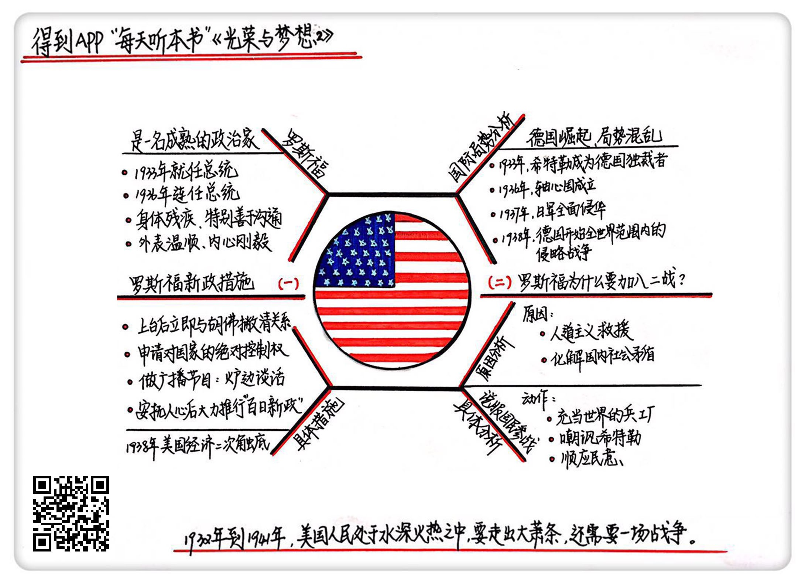

《光荣与梦想2》| 张凯解读
========================

购买链接：[亚马逊](https://www.amazon.cn/光荣与梦想-威廉·曼彻斯特/dp/B00T2DK826/ref=sr_1_1?ie=UTF8&qid=1511095554&sr=8-1&keywords=光荣与梦想&dpID=51oD2AjgCFL&preST=_SX258_BO1,204,203,200_QL70_&dpSrc=srch)

听者笔记
------------------------

> 罗斯福通过建立人民对它的新政，采用了和胡佛换汤不换药的政策，制造了美国经济的虚假繁荣景象。
>
> 1938年美国经济二次触底，罗斯福希望民众将注意力转移到第二次世界大战中，最后借着珍珠港事件加入了第二次世界大战。

关于作者
------------------------

威廉・曼彻斯特，20世纪中期美国著名的畅销书作家、记者。

关于本书
------------------------

本书讲述了美国1932-1972年间，从罗斯福总统上台前后到尼克松总统任期内“水门事件”共40年的历史，为我们详细描述了这个时期美国政治、经济、文化的全景图。     

核心内容
------------------------

一、罗斯福新政的措施；二、罗斯福在加入二战前做了哪些动作以及他是如何考虑的。
 

一、罗斯福新政的措施
------------------------

罗斯福的家族是政治世家，他特别善于沟通，是个典型的听大家意见、但最后自己做决策的、很成熟的政治家。

罗斯福上台先和胡佛撇清关系，并申请对这个国家的绝对控制权。另外，做了一个广播节目，叫做“炉边谈话”，为群众解释每一个发布的政策。这样的做法，让他迅速获得了民意支持。在安抚人心、取得信任之后，罗斯福开始大力推行他的“百日新政”，接二连三地推行各种各样的法案。

罗斯福推行的法案和胡佛其实都是一样的，但两者的巨大差别就在于群众对他们的信任度是完全不同的。

同时，罗斯福的政策更大胆、更激进。他干了一些胡佛不敢干的事，比如废除金本位，开始印钞票，这样虽然会通货膨胀，但是特殊时期特殊办法，美元贬值了17%之后就稳定了下来。相反，欧洲出现了比较严重的通货膨胀。相比之下，美国又拥有了世界市场上的竞争力。

他还颁布了一系列法案，如《农业调整法》《全国工业复兴法案》，同时，废除了《斯姆特-霍利关税法案》。

罗斯福的这一套组合药剂起到了立竿见影的效果。一个星期之内，全国四分之三的银行重新开业，证券交易所的铜钟再次响起，纽约股价上升了15%。

但是，罗斯福的新政和胡佛的政策基本上都是杀鸡取卵的招数，在短期内当然是会产生立竿见影的效果。但是长期来看，这些招数都会大大伤害这个国家的经济基础，自由市场制度在这个时期内被强力压制。罗斯福的新政其实并没有真正带人民走出大萧条，只是带来了一个即将走向繁荣的假象。

到了1938年，这个假象达到了极限，这时候美国政府终于发现，除了罗斯福口中说的，“唯一值得恐惧的就是恐惧本身”之外，还有其他很多事情值得恐惧。比如经济增长又陷入了疲软的状态，比如国外的局势越来越混乱，上流社会对罗斯福的态度已经从极度反感转变成了憎恨。

二、罗斯福在加入二战前做了哪些动作，以及他是如何考虑的
------------------------

1933年，罗斯福就任总统，同年，希特勒在德国成为了独裁者。1936年，美国国内的最高法院和新政之间的矛盾达到了顶峰，罗马 - 柏林轴心国成立。1938年，美国经济二次触底，比第一次大萧条还严重，这时德国吞并了奥地利，开始全世界范围内的侵略战争。

罗斯福经常会通过财政赤字的方式来一次一次地给国家打强心剂。但这种方法在1938年就达到了极限，经济增长又陷入了疲软的状态，上流社会对罗斯福的态度已经从极度反感转变成了憎恨。他急需一场战争才能转移大家的注意力。

罗斯福要想说服人民群众参加这场混战很困难，美国刚从第一次世界大战的噩梦中醒来，国内的反战情绪非常高涨。

为了参战，罗斯福主要做了3个动作：

1. 充当世界兵工厂

丘吉尔向罗斯福求助，罗斯福思考后拿出了著名的“租借法案”。这个法案，让美国有了“世界警察”这个角色。这个法案规定，任何一个国家，只要总统认为它的国防对美国国防至关重要，那么美国就可以为它提供援助。

2. 嘲讽希特勒

罗斯福派了一支海军陆战队去冰岛的首都登陆，来防止其他国家利用冰岛的地理优势对付西半球，并派船只在交战区挑衅，但希特勒并没有回应。

3. 顺应民意

日本发动了珍珠港事件，并请求希特勒和墨索里尼对美国宣战。从这个时候起，美国开始了太平洋战争，美国彻底进入第二次世界大战。

金句
------------------------

1. 罗斯福的新政和胡佛采取的政策基本上都是一些杀鸡取卵的招数，在短期内当然是会产生立竿见影的效果，但是长期来看，这些招数都会大大伤害这个国家的经济基础，自由市场制度在这个时期内被强力压制。
2. 罗斯福的新政其实并没有真正带人民走出大萧条，只是带来了一个即将走向繁荣的假象。
3. 自由市场经济里的那只大手偶尔会有失灵的时候，这时候政府天然的冲动就是会选择牺牲长远利益而维持短期利益。
4. 通常我们觉得美国是出于人道主义的精神才加入了第二次世界大战的，但除此之外，还有一股非常强大的国内力量也在推着美国加入这场战争，就是国内的社会矛盾和经济态势。
5. 同样的事情，不一样的人干，难道就能起到完全不同的作用？这中间的巨大差别就是群众对他们的信任度是完全不同的。

撰稿：张凯

脑图：摩西

转述：孙潇