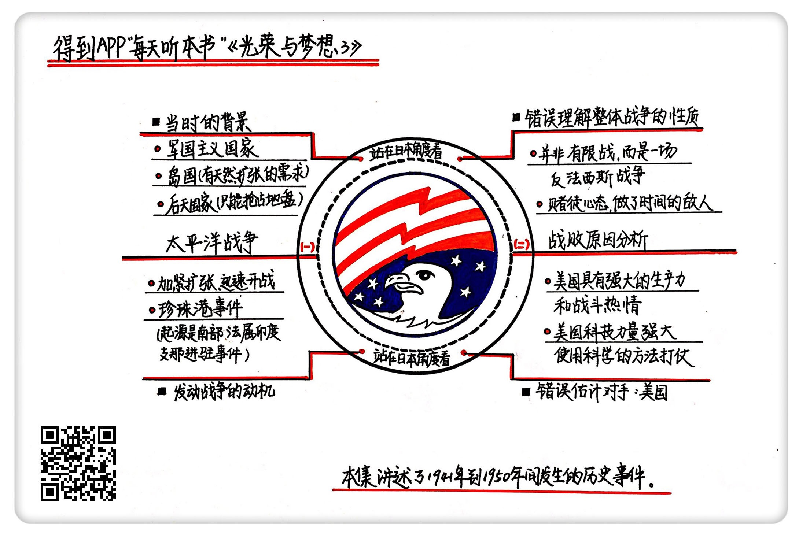

《光荣与梦想3》| 张凯解读
========================

购买链接：[亚马逊](https://www.amazon.cn/光荣与梦想-威廉·曼彻斯特/dp/B00T2DK826/ref=sr_1_1?ie=UTF8&qid=1511095554&sr=8-1&keywords=光荣与梦想&dpID=51oD2AjgCFL&preST=_SX258_BO1,204,203,200_QL70_&dpSrc=srch)

听者笔记
------------------------

> 日本内部管理混乱，导致前线军官经常擅自行动，原本可以和平进驻印度支那，最后搞成了强行进入，遭到了法国的抵制。美国日本认为此举威胁到了美属殖民地菲律宾，联合英国对日本实施石油禁运。日本决定解决石油问题，抢占菲律宾，为此，打算先从珍珠港下手削弱美国实力。当时预定的策略是宣战后马上进行快速打击，避免美国有所防备，结果宣战的时候，日本本土的译电员下班了，宣战书并没有发出去，结果变成了偷袭事件。
>
> 日本之所以第二次世界大战会输，首先是因为统治成本很高，必须靠武力镇压，稍有松懈就会遭到反击。而珍珠港事件后，遇到了现代化国家美国，整体实力差距太大，光是消耗体力都能把日本拖死。

关于作者
------------------------

威廉・曼彻斯特，20世纪中期美国著名的畅销书作家、记者。

关于本书
------------------------

本书讲述了美国1932-1972年间，从罗斯福总统上台前后到尼克松总统任期内“水门事件”共40年的历史，为我们详细描述了这个时期美国政治、经济、文化的全景。

核心内容
------------------------

一、日本当时的处境和发动太平洋战争的动机；二、第二次世界大战日本为什么会输。     
 

一、日本当时的处境和发动太平洋战争的动机
------------------------

日本和美国双方的实力差距实在太大，不论是经济、人口还是战争储备都不是一个等级。日本发动太平洋战争，并不是真的要攻打美国本土，而是要通过一系列强硬的手段给自己增加谈判的筹码。

军国主义扩张道路在当时很普遍，日本是个后发的岛国，岛国就意味着资源少，市场小，他们天然有扩张的需求。后发国家意味着那个时候世界基本已经瓜分完毕了。总的来说，日本走军国主义的道路是有一定必然性的，他们得罪西方国家，宣布开战也是迟早的事。

珍珠港事件的起源是南部法属印度支那进驻事件。印度支那位于印度和中国之间，这一块在当时是法国的殖民地。这个地方的资源很丰富，盛产大米和橡胶，隶属于法国维希政府。法国维希政府实际上是德国的傀儡政府。他们的情况是既不完全配合宗主德国，也不强烈反对德国的指导。

德国日本结成盟友，商定允许日军5万人进驻印度支那北部。日军第五师团的一个大队，在这个时候擅自从镇南关提前进入印度支那领土，法国维希政府开始强烈抵制日本的入侵。日本的高层处罚肇事者，然后接着谈判，再次商量进驻时间。刚刚商量妥当，日本在前线指挥战斗的两位参谋长，擅自作主从陆海两路向印度支那进攻。

国际社会听到这个消息后一片哗然，日本这个行为直接威胁美国的殖民地菲律宾，于是美国和英国联手，开始对日本进行石油禁运。这时候摆在日本面前的就两条路，一条是放弃“七七事变”后吞并的中国土地，退回到以前的状态。第二个选择就是投入所有的资源来一场速战速决的战斗，先打通石油的供应渠道，解决石油的供给问题。

日本选择了第二条道路，继续加紧扩张，迅速开战，争取6个月占领美国殖民地菲律宾。在这之前，日军准备先把珍珠港给炸了，削弱美军的实力，与此同时再攻打菲律宾。

偷袭珍珠港其实是一个乌龙事件。当时日美双方谈判，负责指挥战斗的山本五十六在旗舰长门号上等大本营的通知，如果谈判成功，则全部舰队返回基地，如果失败，就立马对美开战。山本五十六还反复叮嘱，一定要在规定的时间内宣战，然后再进行攻击，可是在宣战通告发到日本驻美大使馆的时候，译电员已经下班了，等第二天翻译出来宣战诏书送到美国国务卿赫尔手里时，珍珠港已经被炸了两小时了，一场奇袭变成了偷袭。

二、第二次世界大战日本为什么会输
------------------------

日本的战败，不是战术问题，而是一开始对整体战争性质的理解出现了误差。以前日本遇到的战争都是有限战，但第二次世界大战是一场反法西斯战争，是整体战。

日本面对中国骑虎难下，虽然占领了中国很多地方，但稍微松懈就可能会被武装力量反扑，统治成本非常巨大。德国也遇到了打死都不投降的英国，正是这两个国家的不投降行为硬是把战争拉到了后期。随着时间的推移，日本速战速决的幻想自然就破灭了。

日本以前的对手都是没有完全进入现代化的国家，现在遇到的对手是现代化国家美国，整个国民力量在罗斯福的号召下，一旦被激活，战斗力是超出了日本想象的。

【案例】

以前美国想要造一艘船，从打龙骨到最终的交付，一艘船平均耗时得有200天，然而加入战争后，一天就搞定了。德国发动第一次闪电战的时候，出动了3000架飞机、2500辆坦克，但是五年后美国造出了30万架飞机、10万辆坦克。

美国年轻人的参战情绪也很高涨。

【案例】

日本轰炸珍珠港后，罗斯福迅速策划了一场反击，对日本本土进行轰炸，可是航母开到一半的时候，被日军发现了，美军的飞行员只有提前起飞，意味着飞机的油不够支持回来的路。当时战舰上的将军就问，有没有人愿意做这个事，结果所有士兵都抢着去。

从美国参战以来，美国国内的经济状况一路好转，失业的人找到了工作，粮食价格开始增长，股市也回到了大萧条之前的状况，连和平时期最无所事事的妇女都参加了社会劳动，前面如噩梦般缠绕在美国人民身上的大萧条过去了。

为什么美国的战争越打越强大？因为美国的大萧条有一部分原因是由于生产力过剩造成的，战争开始后，所有的资源开始流动了。而且不管外面怎么打，美国本土一直都是安全的。

最后还有一个原因，也是日本人忽视的一个原因，就是美国的科技力量真是太强大了，每一次战斗都能出现新装备。比如夜视仪、雷达，包括后来的原子弹，都是科技发展带来的结果。

美国人一边创造，一边学习，不依赖经验，而是每次都推陈出新地用科学的方法打仗。

【案例】

美军当时是用飞机轰炸德国，跟英国轰炸德国就是炸居民区或者工厂不同，美国找了麻省理工学院的数学家分析德国哪个环节在工业系统中最重要。最后，美国炸掉了德国的两个大轴承厂。

最后形成了一个局面，日本这种要依靠外部资源的国家越打越弱，而美国这种有资源的国家是越打越强。

金句
------------------------

1. 日本是岛国，并且是个后发国家，这就意味着日本走军国主义的道路是有一定必然性的，他们得罪西方国家，宣布开战也是迟早的事。
2. 日本那种想要快速解决所有问题，想要一局定胜负的赌徒心态最终让他们走向了失败。
3. 美国这种强大的生产力和战斗热情就形成了一个局面，就是日本这种要依靠外部资源的国家越打越弱，而美国这种有资源的国家是越打越强。
4. 战争对美国人来说就是生意，美国其实就是个巨大的公司，他们不在乎是不是能在道义上占领高地，他们只关心输赢。
5. 日本最大的失败就是做了时间的敌人。他们是赢得了很多场战役，但是一步一步地输掉了整个战争。

撰稿：张凯

脑图：摩西

转述：孙潇