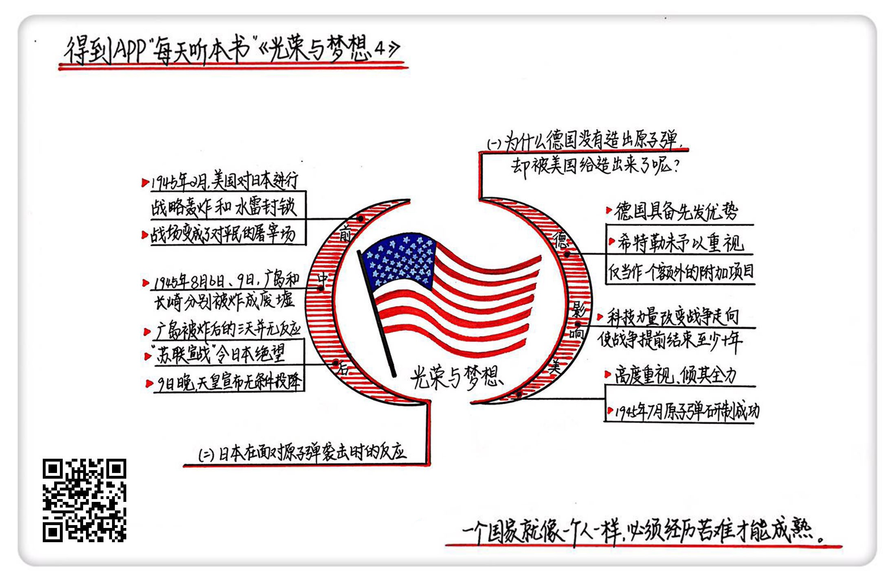

《光荣与梦想4》| 张凯解读
========================

购买链接：[亚马逊](https://www.amazon.cn/光荣与梦想-威廉·曼彻斯特/dp/B00T2DK826/ref=sr_1_1?ie=UTF8&qid=1511095554&sr=8-1&keywords=光荣与梦想&dpID=51oD2AjgCFL&preST=_SX258_BO1,204,203,200_QL70_&dpSrc=srch)

听者笔记
------------------------

> 美国对原子弹的制造倾尽全力，而德国只是把它当作附加项目，因此美国也更先制造出了原子弹。
>
> 原子弹并不是日本宣布无条件投降的唯一因素，苏联出兵东北让日本无路可退，让日本彻底失败。

关于作者
------------------------

威廉・曼彻斯特，20世纪中期美国著名的畅销书作家、记者。

关于本书
------------------------

本书讲述了美国从罗斯福总统上台前后到尼克松总统任期内水门事件共40年之间的历史，为我们详细描述了这个时期美国政治、经济、文化的全景。

核心内容
------------------------

一、为什么德国没有制造出原子弹；二、日本在面对原子弹袭击前后的反应。
 

一、为什么德国没有制造出原子弹
------------------------

在时间上，德国是最早研究原子弹的；在科技实力上，当时德国的科技实力一点都不比美国差；在资源上，德国占了世界上最大的铀矿，拥有世界上最大的化学工业；在人才储备上，他们有最好的科学家，原子的裂变现象就是两个德国人提出的，还有王牌科学家海森堡。

美国比德国先造出原子弹，最大的一个原因就是美国对制造原子弹这个事情是高度重视、倾其全力的。德国则是把这个事当作一个额外的附加项目。

罗斯福当时给“曼哈顿计划”的权力是：高于一切行动的特别优先权。这个工程在顶峰的时候曾启用了将近54万人，将近20亿美元。整个计划的目标就是在德国人造出原子弹之前先造出来。

美国当时并不知道德国的进度，假想德国离生产出真正的原子弹已经不远了，所以时间非常紧迫，他们是和假想中的敌人在赛跑。实际上德国这边并没有把原子弹工程提到一个战略的高度。

1945年5月，虽然欧洲战场盟军已经取得了胜利，但日本就像弹簧一样，逼得越紧，反弹的作用力越强。美国在硫磺岛、冲绳岛共损失11万人，麦克阿瑟当时就说，日本陆军有五六百万人，有数千吨炸药藏在地下洞穴里。原子弹出现之后救了无数人的命，把战争提前结束了至少10年。

同年7月，原子弹研制成功，试爆也相当顺利。就这样，美国在警告无效的情况下，先后扔下了两颗原子弹，广岛和长崎被夷为了平地。

二、日本在面对原子弹袭击前后的反应
------------------------

我们现在通常都说，日本在知道了原子弹的攻击后立马无条件投降了。其实真实的情况并不是这样，真实的情况要比想象中惊险得多。

从1945年2月开始，美国就开始对日本进行战略轰炸和代号为“饥饿战役”的水雷封锁，朝日本本土大量地扔燃烧弹和炸弹，这种攻击的破坏力比原子弹还要大。还有一招就是用水雷封锁所有的港口和航线，从海上彻底切断日本的供给。

当时的日本已经是穷途末路了，战斗的性质已经不是军人和军人之间的对决，战场已经变成了对平民的屠宰场。

日本的神风特攻队破坏力对美军来说根本不大，它带来的影响更多是心理层面的。但到后期，这种的自杀式攻击对美军造成的破坏力就微乎其微了。原因有二：首先是稍微有点技术的飞行员差不多都牺牲了，无法精准撞击；其次，后期美军的武器装备升级飞速，也总结出了一些应对自杀式袭击的经验。

1945年7月16日早晨，杜鲁门接到了一则加密的文件，得知原子弹试爆成功，杜鲁门手里突然有了能无损终止这场战争的武器。杜鲁门本人、丘吉尔还有蒋介石通过广播向日本发出了最后的《波茨坦公告》，要日本无条件投降，投降后美军保证不打击报复，并且承诺以后会帮助日本发展，否则就会对日本进行最后的打击。

但是这段广播在日本并没有产生多大的反响，于是杜鲁门批准了计划。在1945年8月5日下午，第一个代号“小男孩”的原子弹用三架飞机被运到了提尼安岛。为了防止原子弹提前爆炸，项目的负责人提议在飞机上临时组装原子弹。一切顺利，第一颗原子弹在距离广岛地面600米的地方爆炸。

同时，苏联向日本宣战。罗斯福为了让斯大林出兵，答应了斯大林很多条件，斯大林同意出兵东北。有人质疑罗斯福在雅尔塔会议上和斯大林签的协议是罗斯福一生最愚蠢的协议，其实这个决定很英明。

这个决定是在雅尔塔会议上达成，当时原子弹还没有被研制出来，美国和日本的战事还处在胶着的状态，虽然看起来美国是有优势的，但是要获得最终的胜利也明显要付出巨大代价。

就日本当时得知广岛被炸后的反应来看，原子弹并不是压垮他们的最后一根稻草。最让他们崩溃的就是苏联的介入，当时日本一直奉行的战略是“满蒙生命线”论，就是把东北一带当作最后的大本营。

日本知道广岛爆炸后的3天一点反应也没有，一直到9日早上，日本得知苏联出兵后才开了一场最高的战争会议，商议苏联的问题。开会途中，美国在长崎投放了原子弹。日本天皇在晚上作出决定，答应接受《波茨坦公告》，宣布无条件投降，但要求不能处置天皇。

日本老一点的军阀都剖腹自杀了，年轻一点的军阀开始叛变，他们杀掉接近天皇的近卫师指挥官，把天皇隔离了起来，伪造了一份命令，准备发动最后的反击，最后这些都被皇族成员给压下来了。

胜利犹如摇摇欲坠的拱门，而原子弹就是拱门的基石。意思就是原子弹像个结束战争的催化剂，表面上看它杀了很多人，实际上是避免了更多人身亡。     

金句
------------------------

1. 现在有很多大公司都是多面手，哪个领域都想占上一片地方，但是往往就会被那些能倾其全力，能 All in 的创业公司打败。
2. 当时的日本已经是穷途末路了，战斗的性质已经不是军人和军人之间的对决，战场已经变成了对平民的屠宰场。
3. 原子弹并不是压垮日本的最后一根稻草，最让他们崩溃的就是苏联的介入。
4. 胜利犹如摇摇欲坠的拱门，而原子弹就是拱门的基石。意思就是原子弹像个结束战争的催化剂，表面上看它杀了很多人，实际上是避免了更多人身亡。
5. 二战是人类的一场噩梦，但是最重要的意义在于，它让各个国家的决策开始成熟了起来，人们从此以后不再通过掠夺和殖民发展自己。

撰稿：张凯

脑图：摩西

转述：孙潇