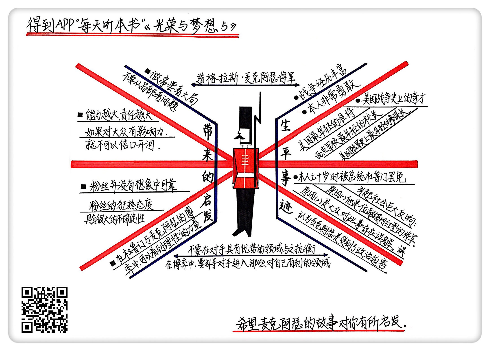

《光荣与梦想5》| 张凯解读
========================

购买链接：[亚马逊](https://www.amazon.cn/光荣与梦想-威廉·曼彻斯特/dp/B00T2DK826/ref=sr_1_1?ie=UTF8&qid=1511095554&sr=8-1&keywords=光荣与梦想&dpID=51oD2AjgCFL&preST=_SX258_BO1,204,203,200_QL70_&dpSrc=srch)

听者笔记
------------------------

> 麦克阿瑟是个优秀的军人，而且善于营销自己，在民众心中威望很高，但是习惯性违抗命令，最终超越底线，杜鲁门不得不将其罢免，搞得他晚节不保。
>
> 麦克阿瑟的故事告诉我们要有大局观，不能局限于每一场战斗的输赢。

关于作者
------------------------

威廉・曼彻斯特，20世纪中期美国著名的畅销书作家、记者。

关于本书
------------------------

本书讲述了美国从罗斯福总统上台前后到尼克松总统任期内水门事件共40年之间的历史，为我们详细描述了这个时期美国政治、经济、文化的全景。

核心内容
------------------------

一、麦克阿瑟的生平事迹；二、麦克阿瑟给我们的启发。
 

一、麦克阿瑟的生平事迹
------------------------

在老一代中国人心中，麦克阿瑟是个既冷酷又狂妄的职业军人。他是太平洋战场的最高指挥官，客观上给中国减少了很多的外部压力。朝鲜战争的时候，他又变成了我们中国人的对手。

首先，他的战争经历丰富。

麦克阿瑟的一生其实贯穿了美国二十世纪上半叶，很多重大历史事件他都参加了。比如说第一次世界大战、第二次世界大战，战后又去改造日本，朝鲜战争前半段他又是总指挥。

其次，他的成绩非常好。

他是美国最年轻的准将，西点军校最年轻的校长，美国陆军历史上最年轻的参谋长，他是美国战争史上的奇才。他的毕业成绩是98.43分，创下了西点军校毕业分数的记录，这个成绩到现在都没有人能打破。

最后，他非常的勇敢。

他上战场时拒绝一切防护措施，他说“能把我炸死的炸弹还没有被生产出来”。

军人精神在他身上是能表现得淋漓尽致的。

但是麦克阿瑟的晚节不保，在他70岁的时候被免职了。这个消息在当时的美国引起了轩然大波，许多地方还爆发了支持麦克阿瑟、反对杜鲁门的游行示威。民意调查表明，麦克阿瑟的支持率达到了69%，杜鲁门的支持率则暴跌。

这件事为什么有这么大的影响？原因有两个:

首先，麦克阿瑟是一位超级网红型的将军。他在众人心目中的形象非常好，自带光环和流量。当年他回国的时候，成群的少女晕过去被送到医院，他身上的任何装饰品配件都会被销售一空，小孩都以模仿麦克阿瑟为荣。

麦克阿瑟属于表现型人格，特别善于管理自己的各种形象。任何时候他都是一个统一的造型：军帽、烟斗和墨镜。他口才很好，不怕得罪人，经常干违反上级命令的事情，这种有胆识有能力又有形象的人，自然特别受大众的欢迎。

【案例】

麦克阿瑟坐船回到美国的时候，第一站是旧金山，老百姓夹道欢迎；到了华盛顿，30万人迎接；到了纽约，据说当时为了迎接他，抛洒纸屑将近3000吨。

后来麦克阿瑟在美国国会做演讲，一共36分钟，被掌声、欢呼声打断了30次，基本上一分钟就被打断一次，演讲结束后，据说大家都是热泪盈眶。

其次，人们对这次罢免有误解。大众觉得麦克阿瑟是一位反战的斗士，是受了政治迫害才落得这个下场。

当时美国还在打朝鲜战争，国内很多人都在用消极的行为抵制这场战争。麦克阿瑟回来了，人们就以为麦克阿瑟用这个方式来表达对和平的呼吁。其实他是主战派，因为他主动夸大战争规模，杜鲁门才不得不撤他的职。

通常的说法是，杜鲁门这个人能力弱，心胸狭窄，真实的情况是杜鲁门是个很有决断力、能力也很强的人。

杜鲁门为什么要顶着那么大的舆论压力非要撤麦克阿瑟的职呢？

首先，麦克阿瑟习惯性地违抗命令。在华盛顿的远征军惨案中，麦克阿瑟就违抗胡佛的命令，擅自出动军队来镇压退伍军人。在朝鲜战争刚开始的时候，麦克阿瑟就向杜鲁门要兵力，因为当时大量的兵力都调到欧洲去了，这时候麦克阿瑟自己跑到台湾见了蒋介石，但外交权是总统的权力。朝鲜战争后期，美国人迅速被赶到了三八线以南，麦克阿瑟叫嚣要向中国扔20颗原子弹。

朝鲜战争杜鲁门正准备谈判时，麦克阿瑟自己到朝鲜发表了演讲，说他一定会扩大战火，导致谈判的事必须向后延迟，麦克阿瑟的行为已经成了恶意发动战争，触动了美国政府的底线了。杜鲁门当机立断，撤了麦克阿瑟的职。

这个消息引发了轩然大波，美国的舆论一边倒地支持麦克阿瑟。杜鲁门从理性的方面表明了自己态度。

1951年5月3日，参议院举行朝鲜战争问题听证会。参谋长奥马尔·布雷德利指出：美国对中国发动全面战争，正好会给苏联提供在西欧乘虚而入的机会。麦克阿瑟也不得不承认：作为一名战区指挥官，他对欧洲局势并没有深入细致的了解，他也从来没有从全球角度考虑问题。

听证会后，麦克阿瑟的可信度大打折扣。社会舆论发生了戏剧性的逆转，麦克阿瑟的支持率跌到了30%。杜鲁门的支持率一路飙升，被美国评为“最受尊重的总统之一”。

二、麦克阿瑟给我们的启发
------------------------

1. 做事要看大局

麦克阿瑟总是从局部看问题，去纠结一场战斗的输赢，从而总是忽略自己的行为对大局的破坏性。

2. 能力越大，责任也越大

麦克阿瑟掌握着对大众的影响力，这也就默认了不能再乱说话，一份力量就是一份责任。

3. 粉丝并没有想象中那么可靠

很多时候舆论的态度是不可信的，它们具有很大的不确定性和欺骗性。在这个无粉丝不经济的时代，不管是企业还是个人，都不能在粉丝的狂欢中迷失自己。

4. 理性的力量

杜鲁门没有和麦克阿瑟在舆论上公然对抗，因为杜鲁门知道他在那个领域里是处于不利地位的。在听证会上，用事实、用证据来说话，最后一切自然水落石出。

金句
------------------------

1. 很多时候舆论的态度是不可信的，它们具有很大的不确定性和欺骗性。
2. 不要在对手具有优势的领域与之抗衡，相反，要引导对手进入那些对自己有利的领域，这是博弈中可以被借鉴的地方。
3. 老兵不死，他们只是凋零。
4. 美国对中国发动全面战争，正好会给苏联提供在西欧乘虚而入的机会。如果我们把战争扩大到中国，那我们就会被卷入一场在错误的时间、错误的地点同错误的对手进行的错误战争。
5. 麦克阿瑟作为一名战区指挥官，他对欧洲局势并没有深入细致的了解，他也从来没有从全球角度考虑问题。

撰稿：张凯

脑图：摩西

转述：孙潇 