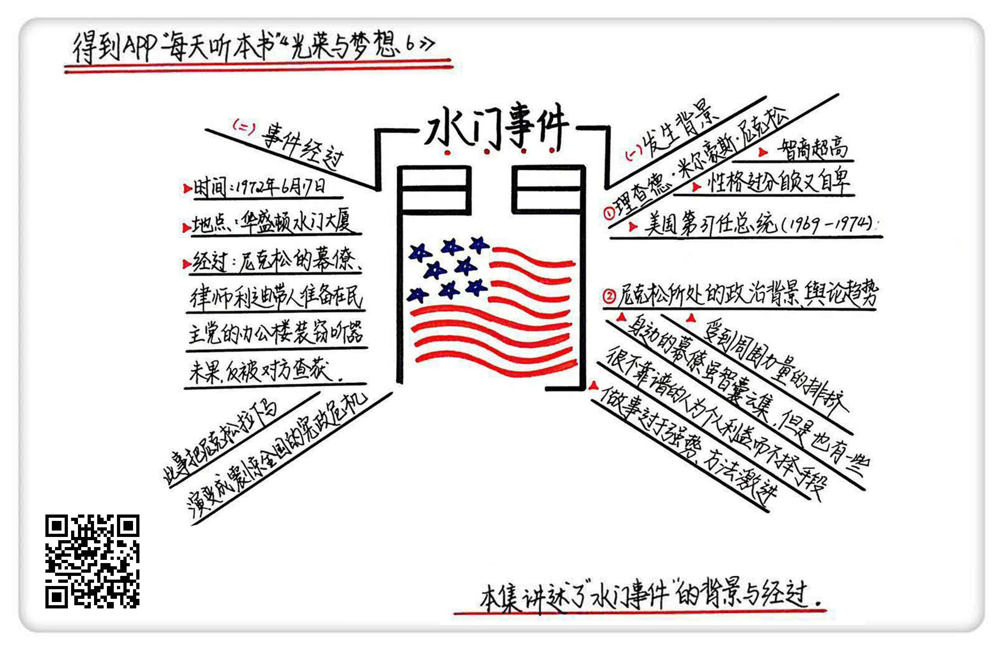

《光荣与梦想6》| 张凯解读
========================

购买链接：[亚马逊](https://www.amazon.cn/光荣与梦想-威廉·曼彻斯特/dp/B00T2DK826/ref=sr_1_1?ie=UTF8&qid=1511095554&sr=8-1&keywords=光荣与梦想&dpID=51oD2AjgCFL&preST=_SX258_BO1,204,203,200_QL70_&dpSrc=srch)

听者笔记
------------------------

> 尼克松用了很多激进的手段来进行外交，忽视了民主程序。尼克松的水门事件，是一场猪一样的队友事件，用非常愚蠢的做法，留下了证据。这件事并不是尼克松安排的，但是尼克松的幕僚，经常直接替尼克松把事情直接办了，这件事就是这样一件事。

关于作者
------------------------

威廉・曼彻斯特，20世纪中期美国著名的畅销书作家、记者。

关于本书
------------------------

本书讲述了美国从罗斯福总统上台前后到尼克松总统任期内水门事件共40年之间的历史，为我们详细描述了这个时期美国政治、经济、文化的全景。

核心内容
------------------------

一、水门事件发生的背景；二、水门事件的详细经过；三、水门事件带来的影响。
 

一、水门事件发生的背景
------------------------

尼克松家境贫穷但智商超高，他骨子里都特别焦虑和自卑。

在长达八年的副总统生涯中，他的角色相当于一个国务院礼宾司司长，他真正当选是从1968年到1972年，尼克松的任务就是一点一点地把美国小心翼翼地从越战这个泥潭当中给拖出来。

他结束越战的方针是“先打再谈，体面撤军”。施加军事压力，把对方逼到谈判桌上来，最后接受对美国有利的条件来停止战争。这种战略引起了国会、新闻媒体和广大人民群众的强烈反对。

美国的分权制衡体制，导致了政府的决策效率低下，政府效率低下严重影响两个领域：外交和军事。

在外交领域，本来需要参议院批准的，但外交事务具有高度的保密性，而且时机非常重要，做出的反应必须及时，所以在外交上总统是有支配地位的。

尼克松和基辛格对外交战略的看法基本一致，就是迷信秘密外交，忽视民主程序。

【案例】

基辛格像个超级间谍一样进行全球秘密外交活动，缓和中美关系、结束越南战争、中东和平谈判等重大外交活动竟然都以秘密外交的手段完成。尼克松则以突然袭击的方式，用电视讲话向全世界宣布秘密外交的惊人突破。

军事是一样，兵贵神速，当国家安全处于危急状况时，大家默认总统有权做出紧急军事决策。

美国立宪建国后短短200多年中，美国总统调遣军队出国作战高达150多次，但只有5次是走正常程序的，其中以尼克松秘密下令轰炸柬埔寨最为恶劣。轰炸事件曝光后，尼克松派遣数万美军大举入侵柬埔寨，这一系列战争升级行动激起了全美各地空前绝后的反战高潮。

这个时期的尼克松政府已经有了把这种掌控权扩展到国内的趋势。这些与宪政法治精神背道而驰的反常现象引起了国会和媒体的极大不安和警觉。恰恰在这个时候出现了水门事件。

到1972年的时候选举，尼克松对这一任总统志在必得。有两个原因：第一，他有很多事情刚刚开始启动；再有就是1976年是美国建国200周年，他特别想主持这一次美国建国200周年的典礼。

前面几次总统大选，尼克松要么是险败，要么是险胜。这一次竞选中，他就想保险一点，就用身边的幕僚团队筹建了一个总统班子。

美国总统的幕僚一般称为“白宫班子”。其实一开始就是身边的一些办事员和勤杂人员，后来到罗斯福执政，就正式成立了总统助理和幕僚班子，从罗斯福之后，历届总统都开始组建和扩大自己的幕僚班子。在尼克松时代，他把白宫班子的规模扩大到了3000多人，这些幕僚都是由总统直接任命的，不用走任何程序。

白宫班子虽然办事效率高，但是致命的地方也在于办事效率太高。很多事连总统自己都不知道，幕僚的势力越来越大，后来直接把内阁架空了。

白宫幕僚只对总统一人负责，他们溜须拍马、阿谀奉承，借机追求个人荣耀和影响高层决策的权势，总统就一定会慢慢地变得很自负。白宫幕僚的升降沉浮全凭总统一句话，为了得到赏识和重用，一些人就乐于铤而走险地办事，所以权力就容易滥用。

尼克松的幕僚除了基辛格，大部分都是他当年律师事务所的合伙人和帮他竞选的成员。这帮人虽然忠心，但是能力确实不敢恭维。

【案例】

尼克松就自己组建了一个组织“管子工”，开始对涉嫌泄密者进行大规模电子窃听和信件检查。他们直接破窗而入获取材料，他们还打算朝别人的办公大楼扔燃烧弹，乘乱找文件。原管子工成员里有一个叫利迪的，名义上担任竞选班子的法律顾问和白宫特别助理，实际上负责搜集民主党对手情报和实施特种行动。窃听民主党人电话，偷拍秘密文件，雇佣妓女勾引民主党竞选班子成员和总统候选人，用隐藏的摄像机偷拍淫秽场面，以此讹诈对手和换取情报。

二、水门事件的详细经过

水门大厦地处美国华盛顿特区西北区的波托马克河畔，大厦正门入口处有一个小型人工瀑布从高处飞流直下，所以大家称这座建筑为“水门”。这是民主党的办公所在地，1972年6月17日凌晨，利迪就带着几个人准备在民主党的那层办公楼装窃听器。

装窃听器的是几个古巴的流亡分子，这几个人白天先过去在门上偷偷贴了胶布，但被门卫留意到。这几个人晚上过来敲开门之后，又在门上贴了一块胶布，被警卫察觉后报警当场抓获。利迪发现情况不妙，直接留下罪证离开。

被抓的人没有承认，整个水门事件就这么结束了。

三、水门事件带来的影响

经过水门事件，总统的选举没有受到影响。1972年的选举尼克松大胜，选举这一年，整个议会也要大换班，因为众议员要全体改选，整个国会也休会。但是他万万没有想到，水门事件最后竟然把他拉下了马，最后还演变成震惊全国的宪政危机。     

金句
------------------------

1. 站队在政治上是个很常见的博弈手段，尼克松用摆明自己立场的方式赢得支持是个很平常的事，这和他个人真实的立场其实没啥关系。
2. 尼克松政府虽然在当时做得不错，效率也很高，他也是全心全意地在为国家为人民办事，但是方法太过激进，引得国会和媒体对他都不满。
3. 要体面地撤军只有一个办法，就是施加军事压力，把对方逼到谈判桌上来，最后接受对美国有利的条件来停止战争。
4. 制宪会议奉行分权原则不是为了提高效率，而是要杜绝专权。
5. 大量权力掌握在白宫幕僚手中，使国会对行政部门的监督失去意义，破坏了美国宪政体制中分权与制衡的基本原则。

撰稿：张凯

脑图：摩西

转述：孙潇