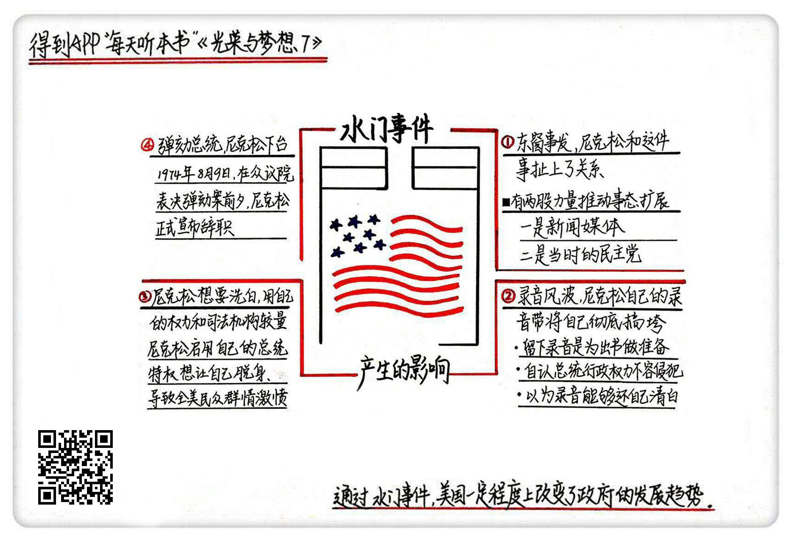

《光荣与梦想7》| 张凯解读
========================

购买链接：[亚马逊](https://www.amazon.cn/光荣与梦想-威廉·曼彻斯特/dp/B00T2DK826/ref=sr_1_1?ie=UTF8&qid=1511095554&sr=8-1&keywords=光荣与梦想&dpID=51oD2AjgCFL&preST=_SX258_BO1,204,203,200_QL70_&dpSrc=srch)

听者笔记
------------------------

> 尼克松的水门事件，是一场猪一样的队友事件。自己又喜欢录音，保留了大量的证据，最后在水门事件中败露出来，而且还选择了用自己的权力和司法机构对抗，把自己拉下水。

关于作者
------------------------

威廉・曼彻斯特，20世纪中期美国著名的畅销书作家、记者。  

关于本书
------------------------

本书讲述了美国从罗斯福总统上台前后到尼克松总统任期内水门事件共40年之间的历史，为我们详细描述了这个时期美国政治、经济、文化的全景。

核心内容
------------------------

水门事件后续产生影响的四个阶段：一、东窗事发，尼克松和这件事扯上了关系；二、录音风波，尼克松的录音带把自己彻底搞垮；三、尼克松想要洗白，用自己的权力和司法机构较量；四、弹劾总统，尼克松下台。
 

一、东窗事发，尼克松和这件事扯上了关系
------------------------

其实暗中有两股力量一直在推着这件事不断前进。

1. 新闻媒体

水门事件刚开始并不是很受媒体关注，当时的《纽约时报》只是在一个极不起眼的小角落刊登了这么一条消息，但《华盛顿邮报》的小记者去法院旁听法官审判，发现水门事件可能和白宫有关系。他开始频繁地给白宫打电话确认这个事，一篇又一篇的揭秘文章，像一颗又一颗炸弹在美国政坛不断爆炸。

在这中间他还得到了白宫里面一位神秘人士“深喉”的暗中帮助，后来被证实是联邦调查局的副局长。

2. 民主党

尼克松在1972年上台之后，民主党开始控制了两院，深入调查此事。尼克松觉得自己很清白，积极配合。

大法官西瑞卡拿出浑身解数审这个案子，用刑期恐吓几个犯人，慢慢牵扯的人越来越多，最后报出了一个尼克松幕僚团队里的人，叫做迪安。

迪安和尼克松走得很近，他们商量很多事迪安都在场，他爆出尼克松怎么在私下密谋，怎么找钱去当封口费，怎么去跟自己切割等等，这种行政干预司法的大罪就开始大白于天下。

西瑞卡把此事上报，美国参议院开始设立一个独立检查部门，开始全力调查这件事。

二、录音风波，尼克松的录音带把自己彻底搞垮
------------------------

1973年6月中旬，在向全国电视直播的国会水门案听证会上，迪安交代了白宫幕僚刻意销毁证据等行径，还说出了管子工干的事。

更为致命的是，迪安供出尼克松亲自参与了掩盖案情真相的犯罪活动。水门窃听案从三流政治案演变为总统和白宫幕僚滥用权力、掩盖罪证、妨碍司法的重大刑事案件。

迪安怀疑自己的那段谈话有被录音。检察院调查出了尼克松在白宫共录了将近5000个小时的音频。尼克松不肯交出磁带，检察院认为他在干预司法，两边一直僵持了几个月。

尼克松为什么不毁了这些录音呢？

首先，他觉得总统的行政权力是不容侵犯的，总统和自己亲信之间的谈话有很多国家机密。

其次，尼克松觉得法院有他自己的人。

最后，他觉得这些录音某种程度上能起到保护自己的作用。

最后尼克松做出了不销毁录音的决定，然后他与特别检察官、国会和联邦法院展开了一场影响深远的司法大战。

三、尼克松想要洗白，用自己的权力和司法机构较量
------------------------

特别检察官和国会水门委员会同时发出传票，要求总统交出录音带，尼克松启用总统行政特权，声称谈话录音中有外交和军事机密，拒绝交出磁带。

西瑞卡法官判定特别检察官索取磁带的要求合法，下令总统交出录音带。但尼克松当没听到，检察院将此案上诉到联邦上诉法院。

联邦上诉法院也作出裁定，要求尼克松交出录音带，尼克松这时答应交出剪辑过的一部分，遭到特别检察官严辞拒绝。

尼克松命令司法部长理查森立刻解雇当时的检察官考克斯。但理查森不愿从命，请求辞职。尼克松命令司法部副部长洛克肖斯解雇考克斯，这位副部长同样要求辞职，尼克松又下令司法部第三号人物博克解雇考克斯。博克犹豫再三，最后勉强同意。

白宫以保密为由，迅速查封特别检察官办公室，扣押全部调查文件。事情到此就告一段落，新闻媒体立刻抢发新闻“星期六之夜大屠杀”。

四、弹劾总统，尼克松下台
------------------------

尼克松政府这时在大众的心目中已经彻底变成了独裁者。新闻媒体开始对尼克斯口诛笔伐，全美民众群情激愤。水门事件从最初的一桩“小事”，演变为一场震撼全国的宪政危机。

这场危机使尼克松政府在内政和外交领域都处于半瘫痪状态，在这样的特殊情况下，最高法院打破常规，同意直接审理特别检察官的上诉。这个案子史称“美国诉尼克松案”。

在巨大的舆论压力和检察院的压力之下，尼克松被迫交出了剩下的录音。

1974年8月9日，在众议院表决弹劾案前夕，尼克松正式宣布辞职。水门案件就此告一段落。

尼克松晚年谈到水门事件时说道：“水门事件中让我后悔的事太多了。首先是我起初处理这个该死事件的方式。我跟它毫不相干，不应大动干戈。我应直接面对美国人民，告诉他们到底发生了什么事情。”

水门事件的发生实际上具有某种历史必然性。自20世纪30年代经济大萧条和50年代美苏冷战以来，行政部门权力急剧膨胀，总统和白宫幕僚逐渐成为联邦政府权力中心，美国总统既是国家元首又是政府首脑，甚至出现了独断专行的“帝王总统”。通过水门事件，美国一定程度上改变了政府的发展趋势。     

金句
------------------------

1. 大法官虽然经总统提名任命，但由于司法公开和新闻监督的制约，没有哪一位大法官愿意在宪政史上留下“总统的走狗”这样的名声。
2. 美国人的特点是吃软不吃硬，比较注重实际利益。只要国外的烂仗体面结束，国内经济保持增长，普通民众一般比较宽宏大量，容易原谅“主动认错”的总统。
3. 很多时候其实坦白和真诚就是最好的对策。
4. 失败固然令人悲哀，然而，最大的悲哀是在人生的征途中既无胜利，也无失败。
5. 千百年之后，如果美利坚合众国还存在，当有人要求拥护司法审查的人，举出实例证明法官们的裁决时常会有利于民主时，他们最先举出的案例就将是美国诉尼克松案。

撰稿：张凯

脑图：摩西

转述：孙潇