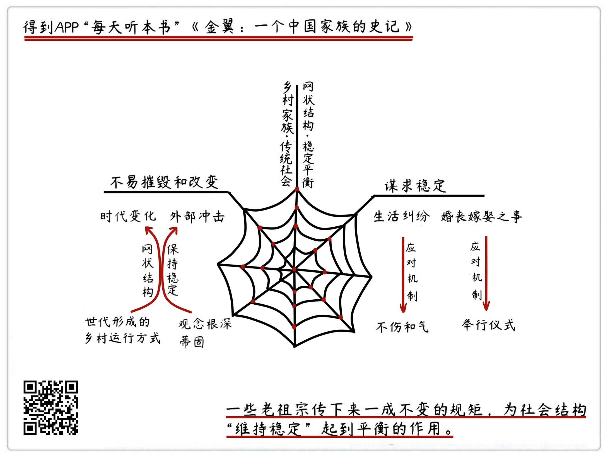

《金翼：一个中国家族的史记》| 暗蓝解读
======================================

购买链接：[亚马逊](https://www.amazon.cn/金翼-一个中国家族的史记-林耀华/dp/B00XJ7W19Y/ref=sr_1_1?ie=UTF8&qid=1508238205&sr=8-1&keywords=金翼：一个中国家族的史记)

听者笔记
--------------------------------------

> 作者用“网状”结构来描述乡村社会结构。
>
> 中国传统家庭通过乡邻之间的协同劳作以及礼仪习俗来维持这张网状结构。
>
> 这种网状结构在面对变局的时候，既可以使用团结的力量来保证家族利益，也通过深入人心的传统观念培养起人和人之间的感情，降低局势恶化情形下对这张网的冲击。

关于作者
--------------------------------------

林耀华，福建古田人，社会学家。曾在燕京大学读社会学，师从吴文藻，后赴美留学，在哈佛大学读人类学。林耀华在获得硕士学位后回国任教，培养出许多优秀学者，并主持了一系列社会学和人类学的研究，在我国社会学研究方面可谓是居功至伟。

关于本书
--------------------------------------

这是一部以小说形式写成的社会学作品。它以一个传统家族的兴衰沉浮为背景，通过主人公黄东林如何从分家之初接近“净身出户”的状态，发展到后来几乎凭借一己之力支撑整个家族的历程，从中展现出了中国乡村家族的组织与生活方式。作品既将中国传统家族生活的方方面面娓娓道来，同时又把中国乡村社会在面临时代变革时的种种反应表现出来，在开拓了人类学研究成果表达新途径的同时，又提供了真实可信的中国形象，意义非凡。

核心内容
--------------------------------------

中国传统家族和社会，呈现出“网状”的基本形态，它决定了中国传统社会的生活方式。千百年来，为了维持这一结构的稳定，人们一方面在日常生活中始终谨记“不伤和气”的处事原则，另一方面又会在面临重大变故时举行相应的仪式，保证社会结构的稳定。当面临外部条件改变的冲击时，这一结构体现出极强的稳定性与适应性，即便在当下，仍旧在发挥作用。
 

一、中国乡村家族及社会的组织方式
--------------------------------------

传统的家族就像是一张网。这张网时刻保持着一个平衡的稳定状态，一旦其中的某根线断了，或者长短粗细发生了变化，势必就要求整张网都要做出调整，才能继续维持平衡，不然就会出乱子。而另一方面，中国传统的农耕社会安土重迁，分家分的也只能是权力和财产，大家彼此仍然挨得很近，关系上并不会被切断，所以，从更大的范畴上看，他们仍然是一个共同体，这就形成了一张多中心的大网，根本上还是一个家族。

和家族的网状结构类似，中国传统社会本身也可以比作是一张更大的网。每个节点上的人都在努力谋求自己需要的联系，拓展自己的发展空间，新人的发展一定会对这个结构原本的平衡造成影响，矛盾由此产生，导致冲突，而冲突则会使得新的平衡得到确立，个体的位置也随之稳固。社会的网状结构没有血缘这样稳定的纽带加以维系，因而个人地位更容易受到冲击，这个时候相对稳固的家族关系就会凸显其作用；反过来，家族的声望往往也需要依赖于个人地位的提升来实现，正所谓“一荣俱荣，一损俱损”。

二、中国传统家族维持稳定的两种方式
--------------------------------------

一个族群的生活方式往往包罗万象，涉及到生活的方方面面，既包含了农耕与经商这样的日常生活，也包括很多仪式，像是婚嫁、祭祀、丧礼这些民俗方面的内容，这二者的目的是相同的，都是在原有的生活形态之上谋求稳定。

在日常的农耕生活里，有关家族成员分工、“日出而作日落而息”的稳定生活自然不用多说，它本身就是程式化的，而当农耕生活发生了纠纷，比如放鸭子的小弟不小心误伤了邻居家的鸭子时，为了邻里和睦，精于持家的大嫂会主动带着小弟上门道歉，并且给予对方优厚的补偿，为的就是不伤了和气，维护乡邻之间和睦友好的状态。这就是谋求稳定的第一种手段——不伤和气。

日常生活本身就是稳定的，因而只要有一套既定的规矩，发生纠纷时相互保持默契和谐，大事化小，小事化了，维持稳定其实并不难办，毕竟谁都想过安稳的日子。相比之下，婚丧嫁娶这些事情，就很难当作像是没发生过一样了，因而与它们相关的那些仪式，就要在维持家族整体稳定的过程中起到至关重要的作用。正像前面所提到的，在家族的网状结构里的任何一个点、一根线发生变化，都会改变原有的平衡状态，与之相关的其他成员必须作出调整才能重新找回平衡，仪式的意义，正是将族人召集在一处，宣告“变化”的发生，表示出族人将团结一心共同应对的态度。这就是谋求稳定、维持平衡的的第二个方法——举行仪式。

对于生活在传统社会中的每个人来说，以谋求稳定为目的的规则意识已经内化到了人们的生活之中，而发生的改变和调整，则是为了这些规矩能继续为“维持稳定”的目的来服务。至于生活中的种种仪式，更是在家族原有秩序被打破时进行再度整合的必要手段；定期进行的祭祀之类的活动，则是在一段时间内对家族秩序进行梳理和巩固。很多事情看似折腾，但都是为了折腾完能够更长久地风平浪静。

三、传统家族社会在应对“变局”时的稳定性及其作用
--------------------------------------

二十世纪初，伴随着西方列强的崛起，东西方接触日益频繁，中国自身的社会状态不可避免受到冲击，制度、器物、人们生活的方方面面都在发生着变化。时局的变化，也必然使原有的家族生活秩序较之以往有所不同，可是久而久之形成的观念与生活形态，还是在努力适应变局的过程中保留了原有的一些特质，并且依旧发挥着重要作用。

在人生道路的安排上，“学而优则仕”的观念根深蒂固，所以即便是在科举制度已经不复存在的日子里，人们仍然会支持孩子继续读书。在他们的观念里，读书依旧可以带来表面上的荣耀以及实际上的用途。比如书中提到的家族中的老三，虽然在表面上让人失望，不过通过留学经历，他最终还是得以走出村子，在城里谋得职位，实现了不错的自我发展。

再比如，因为时局动荡，加上自然经济日渐凋敝，使得乡村原有的生活结构被破坏，许多社会底层人士只能拉帮结伙，或加入军队，或自立山头成为土匪，才能维持生计。他们不安定的生存状态显然会威胁到乡村原本的生活秩序，成为非常严重的不稳定因素，但这种危害会因为传统的生活秩序而得到降低，毕竟都是乡里乡邻，他们暂时还不会做出杀人越货的勾当，只要拿到钱财便会罢手，遇到危险的平民甚至还可以凭借人脉关系全身而退。即便一时间土匪横行、强人林立，对平民的生活造成了暂时的威胁，但并不会对传统生活方式造成根本性的冲击。

《金翼》最大的价值，其实就是在一个大变局的背景下，探讨了中国传统社会里不变的、稳定的成分，而这些成分，即便到今天，我们仍然可以在自己的生活里找到影子，它记录了过去，也在启发着我们去思考当下与未来。

金句
--------------------------------------

1. 传统的家族就像是一张网，它保持着一个平衡的稳定状态，一旦其中的某根线断了，或者长短粗细发生了变化，势必就要求整张网都要做出调整，才能继续维持平衡，不然就会出乱子。
2. 分家不意味着切割，家族这张网在分家后仍然彼此照应，并在需要的时候可以再度进行整合和调试，从而保障整个家族的生存与繁衍。
3. 定期进行的祭祀之类的活动，是在一段时间内，对家族秩序进行梳理和巩固。很多事情看似折腾，但都是为了折腾完能够更长久地风平浪静。
4. 时至今日，中国传统的网状结构仍在运作，具有很强的稳定性。尽管会遇到外部环境的冲击，但骨子里想要改变它其实并不容易。
5. 在当下的社会，我们同样也正处于一个变局之中。在城市化的进程里，农村凋敝，传统乡村社会似乎遭到了冲击，但随着更多人涌向城市，名为“老乡”的网络结构其实又开始在城市里生成；而在家庭内部，随着二胎政策的放开，城市的“小家庭”结构似乎又要面临新的变化。这些改变的发生，又将会引起怎样的调整和连锁反应呢？这都是我们今天需要去观察和思考的问题。

撰稿：暗蓝

脑图：摩西

转述：于浩 