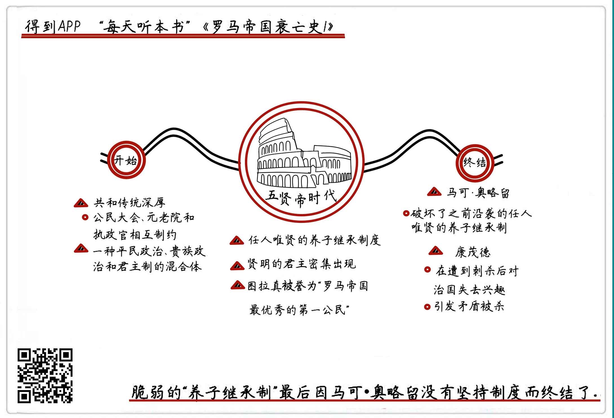

《罗马帝国衰亡史1》| 東西堂主解读
============================

购买链接：[亚马逊](https://www.amazon.cn/罗马帝国衰亡史-爱德华·吉本/dp/B00OAZ696U/ref=sr_1_2?ie=UTF8&qid=1511095842&sr=8-2&keywords=罗马帝国衰亡史)

听者笔记
------------------------

> 五贤帝时代之前罗马帝国处于上升期，衰亡从这个时代开始有了迹象。
>
> 之前之所以能够兴盛，主要是因为按照罗马共和国的传统，罗马的权力架构由公民大会、元老院和执政官相互制约，是一种平民政治、贵族政治和君主制的混合体。罗马帝国继承了罗马共和国的这一传统，不是将王位传给子女而是传给举国之内德才兼备的人，任人唯贤，才保证凯撒和屋大维时代之后，罗马帝国仍然维持了一百多年的兴盛。
>
> 五贤帝的最后一位皇帝没有按照传统寻找继承人，而是将皇位传给了自己的儿子，因为其儿子政治经验不足，最终导致帝国内乱，直到他死后，内乱也无法平息。

关于作者
------------------------

爱德华·吉本，启蒙运动晚期英国著名历史学家。他在对罗马帝国开展了历时20余年的研究后，用全新的历史写作手法创作了《罗马帝国衰亡史》，为启蒙运动的欧洲提供了深刻借鉴和反思。《国富论》的作者、著名经济学家亚当·斯密曾说，“《罗马帝国衰亡史》足可以让吉本列入欧洲文史界的首位。”     

关于本书
------------------------

本书是作者毕生智慧和研究成果的结晶，完整叙述了从罗马帝国“五贤帝时代”起至1453年君士坦丁堡沦陷1300多年的历史，其中涉及到了政治、经济、军事、宗教、文化和社会生活的方方面面。书中既有对罗马帝国衰亡原因的深刻剖析，也有对当时历史图景的呈现，是研究罗马史、解析中世纪欧洲的经典必读书目。

核心内容
------------------------

详细介绍了全书的创作背景和创作意图，分析了罗马帝国五贤帝时代产生和终结的始末缘由。
 

一、创作背景
------------------------

罗马帝国，是人类历史上少数几个世界级帝国之一，分量可以和中国的汉帝国、唐帝国相媲美，它的兴盛和衰亡，对欧洲乃至整个西方世界有着非常重要的意义。从古到今，每当欧洲人想要开展“文化寻根”的时候，总是很自然地会到希腊罗马的历史里去找。

本书中，作者之所以从五贤帝时代这个时间点起笔，就是要探究罗马帝国从衰落到灭亡的线索，为启蒙运动的欧洲提供历史借鉴。五贤帝时代是罗马最后的黄金时代，在这之前，整个帝国总体处于上升通道，在这之后就江河日下了。在作者看来，了解一个巨大帝国是怎么一步步瓦解的，对现在的社会有着更重要的现实意义。

在《罗马帝国衰亡史》成书的18世纪，距离欧洲人认为的“15世纪罗马帝国终结”不过两三百年，就像一座大厦倒了之后余波还在，这些余波就包括了刚才说的启蒙运动，这是继文艺复兴之后整个欧洲又一次重大的思想解放运动。这次运动以“理性主义”为原则，开展了一系列批判和自我反思。罗马帝国衰亡，既是反思的对象，也间接推动了启蒙运动的产生。

作者本人出生在英国中产家庭，年少时体弱多病，性格内向，反而让他养成了爱读书的习惯。在这段时间里，作者接触到了启蒙运动前期很多思想家的著作，对他的世界观、历史观产生了潜移默化的影响。这些影响，也不可避免地体现在他的作品当中。比如他早年曾经信仰天主教，由于受到启蒙运动“反教权”这个思想的影响，又改信了基督新教。在动笔写《罗马帝国衰亡史》以后，他甚至把基督教的兴起和传播看作是导致罗马帝国衰落的一个重要原因，给予了批评。

《罗马帝国衰亡史》是一部开创性的伟大著作，它开创了一种全新的写法，在这部书被创作之前，欧洲还从来没有过这样规模巨大的“通史”类著作，即便有一些历史题材的作品，要么就是对某一时代的描写，要么就是彻头彻尾的“神学史观”。在书中，作者坚持了启蒙时代“理性主义”的原则，按照时间顺序对罗马帝国的政治、军事、外交、民生进行了全方位的考察和分析。正是由于作者这种严谨的治学态度，这部作品才得以成为经久不息的传世经典。

二、五贤帝时代的开始
------------------------

从公元96年到180年，相继有五位贤明的君主担任罗马帝国皇帝，在这将近100年的时间里，罗马帝国无论是国力还是民生都得到了空前的发展，整个帝国政通人和、天下太平。由于这五位皇帝都以仁政著称，所以被称作“五贤帝”。

这个黄金时代之所以能够降临，是由于从公元96年开始，罗马帝国采取了一套举贤任能的皇帝传承制度。在五贤帝时代，皇位不是依靠血缘继承的，而是在上一个皇帝生前就开始寻找、挖掘帝国内部有才干的人，收为养子培养，然后让他继承王位。

凯撒和屋大维处在罗马共和国向罗马帝国转变的过渡时期，距离五贤帝时代不过100多年，因此，这时的共和思想依然非常深厚。按照罗马共和国的传统，罗马的权力架构由公民大会、元老院和执政官相互制约，是一种平民政治、贵族政治和君主制的混合体。公民大会是由罗马人从基层一级一级选上来的人组成的大会，是一种比较原始的直接民主；元老院代表贵族利益，是罗马特有的一种权力组织，最早可以追溯到部落时代的一百位家族首领；执政官，是负责执行公民大会和元老院决议的人。

理论上，执政官应当由元老院选举产生，但随着罗马共和国末期军事权力的上升，选举越来越流于形式，直到凯撒掌权，把自己任命为终身独裁官，共和制也走向解体。屋大维平定内乱，改组政府，建立了集军事、经济、宗教大权为一身的独裁政体“元首制”，他也被认为是罗马帝国的第一任皇帝，被授予“奥古斯都”的称号。

罗马帝国的皇帝和中国古代的皇帝，含义不太一样。

同时代汉朝的君主制里，讲的是“天子”的概念，主张皇帝的旨意就是上天的旨意。在权力等级上，中国古代皇帝的权力是绝对的，它的传承是按照“家天下”的原则，在家族内部按血缘继承。

罗马虽然也叫做“皇帝”，但本质上，这是一种披着共和制外衣的君主制。由于之前500年的共和传统，罗马的社会心理不允许出现像同时期中国那样的“家天下”的传承，但此时元老院的选举已经不起作用了，世袭的血缘传承又不被接受，所以屋大维死后到五贤帝这80多年间，刚刚诞生不久的罗马帝国出现混乱。起初，是把皇位传给养子，再往后，由于军事权力上升，军人阶层已经成为一个小集团，又出现了军人拥立皇帝的情况。

公元96年，涅尔瓦在登位后，找到了当时有很高声望的图拉真，将其收为养子，把他视为未来皇帝的继承人，就这样，任人唯贤的养子继承制度诞生了。这种制度既保证了权力的平稳交接，又让下一任皇帝的才干得以施展。正是由于这种继承制度的确立，才让罗马在接下来的80多年里，密集出现了高水平的皇帝，迎来了五贤帝的黄金时代。

三、五贤帝时代的终结
------------------------

五贤帝时代的最后一位皇帝马可·奥略留，是一位“哲学家皇帝”，著有《沉思录》。奥略留一生戎马生涯，文武兼备，但是，他没有坚持之前四位皇帝任人唯贤的养子继承制度，而是把皇位传给了自己的亲生儿子康茂德。康茂德从一开始就被内定为皇帝，但他缺乏政治经验，再加上少年成名，遭到了家族中其他人的嫉妒。

在一次刺杀风波后，康茂德对治理国家彻底失去了信心和兴趣，他开始任用近卫军，而对不了解的国家将领滥杀无辜，敌视元老院，不经过审判就抓人杀人，整个帝国上上下下，被他搞得乌烟瘴气。康茂德沉迷于狩猎和角斗，把国家大事都交给近卫军长官去处理，造成宫廷内臣大权独揽，权钱交易横行，百姓怨声载道。当矛盾激化的时候，他的处理方式也不是首先反省自己，而是把近卫军长官交出去顶罪，最后终于被近卫军合谋杀死。康茂德死后，罗马帝国又开始陷入了无休无止的内乱，并且再也没有恢复过来，曾经的黄金时代一去不复返。    

金句
------------------------

1. 了解一个巨大帝国是怎么一步步瓦解的，对现在的社会有着很重要的现实意义。
2. 罗马的权力架构由公民大会、元老院和执政官相互制约，是一种平民政治、贵族政治和君主制的混合体。
3. 元首制最主要的特征是：元老院已经不再对国家领导人具有关键性的抗衡能力。
4. 把德才兼备的人收为养子，当成未来的继承人加以培养，这种任人唯贤的制度既保证了权力的平稳交接，又让下一任皇帝的才干得以施展。
5. 奥略留一生唯一的污点，就是没有很好地坚持任人唯贤的养子继承制度，而是把皇位传给了自己缺乏政治经验的亲生儿子。

撰稿：東西堂主

脑图：摩西

讲述：于浩