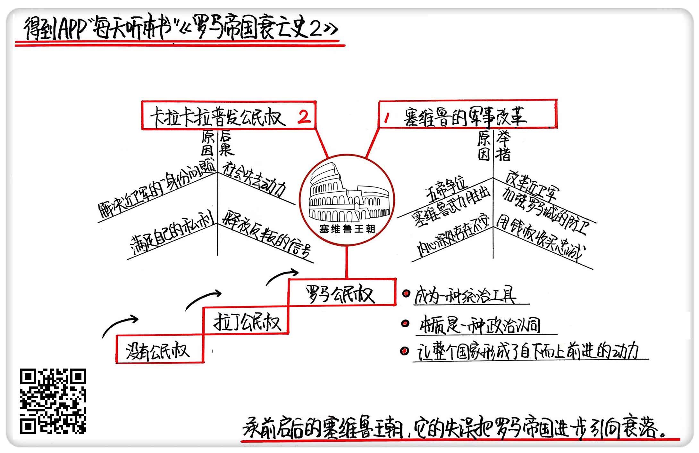

《罗马帝国衰亡史2》| 東西堂主解读
============================

购买链接：[亚马逊](https://www.amazon.cn/罗马帝国衰亡史-爱德华·吉本/dp/B00OAZ696U/ref=sr_1_2?ie=UTF8&qid=1511095842&sr=8-2&keywords=罗马帝国衰亡史)

听者笔记
------------------------

> 康茂德之后，先后五人争夺皇位，最后被塞维鲁平定，塞维鲁登帝之后，迅速进行了军事改革。
>
> 塞维鲁认为军队是自己统治的基础，给了军队特别的权力，重组了近卫军，破例从行省抽调兵力组建近卫军，用钱打造了整个军队，用钱打造的军队，也会因为钱而变得不牢固。
>
> 塞维鲁的儿子卡拉卡拉普发公民权的做法，让整个帝国散失了积极向上进取的力量，也让各个军团有了夺取皇位的合法性。

关于作者
------------------------

关于作者 爱德华·吉本，启蒙运动晚期英国著名历史学家。他在对罗马帝国开展了历时20余年的研究后，用全新的历史写作手法创作了《罗马帝国衰亡史》，为启蒙运动的欧洲提供了深刻借鉴和反思。《国富论》的作者、著名经济学家亚当·斯密曾说，“《罗马帝国衰亡史》足可以让吉本列入欧洲文史界的首位。”

关于本书
------------------------

本书是作者毕生智慧和研究成果的结晶，完整叙述了从罗马帝国“五贤帝时代”起至1453年君士坦丁堡沦陷1300多年的历史，其中涉及到了政治、经济、军事、宗教、文化和社会生活的方方面面。书中既有对罗马帝国衰亡原因的深刻剖析，也有对当时历史图景的呈现，是研究罗马史、解析中世纪欧洲的经典必读书目。

核心内容
------------------------

从塞维鲁的军事改革和卡拉卡拉普发公民权两条线索，详细分析了把罗马帝国引向深渊的塞维鲁王朝。
 

一、塞维鲁的军事改革
------------------------

塞维鲁王朝的名字来自于王朝的创建者。这个王朝之所以依赖军队的力量，和塞维鲁本人血雨腥风的登位过程有很大关系。在康茂德被杀以后，整个罗马帝国陷入了混乱，仅仅一年间，就相继出现了五个人争夺皇位，史称“五帝之年”。他们趁着皇位空虚, 不择手段地夺取权力，把国家带入灾难。塞维鲁结束了“五帝之年”，又用了两年的时间，把另外一些争权者一个个击败，自己当起了皇帝。正是由于皇位争夺得太过于惨烈，让塞维鲁清醒地认识到军队的力量，再加上他内心深处在政权的合法性上隐隐约约存在着不安，所以上任以后立刻开始了大刀阔斧的军事改革。

最先改革的是近卫军，这是负责保护皇帝和家属安全的军队，距离皇帝最近。吸取了康茂德被杀的教训，塞维鲁遣散了之前的近卫军，重新组建了属于自己的近卫军。他没有像之前的皇帝那样，只在罗马人和意大利人中招兵，而是选择了从地方行省的军团中抽调最强悍的士兵。

行省，是罗马在不断扩张中建立的一种行政单位，和现在理解的“省”的概念不一样，罗马早期对行省的管理，更多是出于税收方面的考虑。因为这些地方全是靠武力征服打下来的，罗马人在骨子里始终存在着优越感，所以行省人不允许加入罗马军团，更不能参加近卫军。塞维鲁从行省中抽调士兵，在罗马传统里是破天荒的，他招募的士兵中，有很多都是来自北方蛮族。

塞维鲁大大加强了他所在罗马城的防卫力量，专门设置了城市步兵大队和夜间巡查部队。夜间巡查部队的人数，从之前的几百人增加到了7000人。他还专门把整整一个军团驻扎在罗马城附近，这在罗马的历史上也是从来没有发生过的，在和平时期，军团一般只驻扎在行省或者边疆地区，很少离都城这么近。

为了维护士兵的忠诚度，塞维鲁几乎动用了整个罗马帝国的国库给士兵发军饷。和凯撒、屋大维时代相比，塞维鲁王朝的士兵年薪几乎翻了6到8倍，完全是一支用钱养起来的军队。除了经济收入的提高，士兵还可以在服役期间结婚，可以在犯有一些小错的时候不受处罚，这相当于把整个军队的纪律彻底放弃。塞维鲁在四处征讨的过程中，对战利品的处理非常慷慨大度，他甚至放纵士兵劫掠平民、搜刮百姓。在塞维鲁看来，军队是他统治的根基，只有把军队安抚好，才有一切。他曾经有一句著名的话：塞满士兵的腰包，不要管其他人。

罗马帝国从诞生以来就是军事立国，始终没有建立起一套文官治国的体系，因此按照这个思路，短时间内想要稳定，也只能走原来的老路。相似的教训，在同时期的中国也在发生。时值东汉末年，社会动荡也是因为武将掌权。之后中国进入了魏晋南北朝，出现多股力量、多个政权并存的局面，经过几百年的混战厮杀，一直到隋唐以后才总结经验，把军队的权力收上来。隋唐以后走的路，是在国家的顶层设计中把文官治国放在武将阶层之上，并且通过科举制建立起一整套官僚体系，国家的政权才得以稳定下来。

从武将掌权到文官治国，需要一个非常重要的条件，那就是没有外敌，罗马帝国没有这样的试错机会。在整个罗马帝国持续的历史阶段，外部入侵永远是心腹大患。塞维鲁王朝的时候，正面临北方的日耳曼人崛起，不断侵犯边境。想要政权稳固，除了要面对随时都有可能发生的国内政变，还要面对外部威胁，所以塞维鲁只能选择依赖军队。

塞维鲁在改组近卫军的同时，也把近卫军长官的权势和地位提高到了一个空前的高度，他授予了近卫军长官几乎和行省总督同样的权力，还给予他们司法权、行政权，让这些近卫军长官们大权在握、威震朝野。有的近卫军长官甚至有自己的法庭，形成了独立于帝国管理体系的小集团。这些都严重扰乱了帝国正常的管理体系，以至于在塞维鲁王朝结束以后，军人阶层的势力进一步坐大，有了废立皇帝的能力。

二、卡拉卡拉普发公民权
------------------------

卡拉卡拉，是塞维鲁王朝的第二任皇帝老塞维鲁的儿子。在塞维鲁死后的第二年，卡拉卡拉颁布法令：给予所有在罗马帝国境内出生的自由人以完整的罗马公民权。

当时的罗马帝国境内，并不是每个人都有公民权。罗马公民权在表面上看，代表着一种身份，有了这个身份，就能订立合同、缔结婚约、有投票权、参政议政等等，但在本质上，公民权是一种政治认同。

公民权的产生，起源于罗马早期的城邦战争。当时，罗马还不是帝国，只是意大利半岛上众多小城邦当中比较大的一个，它和其他小城邦共同组成“拉丁同盟”。在公元前四世纪左右，爆发了拉丁战争，其他城邦被罗马打败，同盟解散，公民权概念诞生。

罗马给予在意大利半岛上被自己征服的、离自己最近的几个城邦完整的公民权；比较远的城邦被给予“拉丁公民权”，这是一种没有参政议政权力的有限公民权，是罗马公民权和没有公民权的中间过渡层级 ；而殖民地，则没有公民权，但是如果表现得好，可以授予有限的拉丁公民权，如果表现得特别突出并且向罗马宣誓效忠，可以授予完整的罗马公民权。公民权是罗马人通过几百年实践摸索形成的治国策略，是一个完整的体系，让整个国家形成了自下而上前进的动力。

卡拉卡拉普发公民权，既有对当时社会现实情况的考虑，也有个人原因。上一任皇帝塞维鲁推行了全方面的军事改革，引入了大量的行省人参加近卫军，但按照惯例，只有罗马人才能作为正式士兵服役，身份问题和塞维鲁的近卫军改组本质是冲突的，再加上塞维鲁和卡拉卡拉父子不是罗马人，也一直有种要给自己改头换面的想法，于是采取发放公民权的政策。但卡拉卡拉好大喜功采取了冒进措施，完全没有顾及到整个体系各个因素之间的关联。更严重的是，原本有公民权的限制在，只有罗马人才能做皇帝，现在没了这个限制，任何行省的人理论上都可能成为皇帝，这让地方的军士长官们开始蠢蠢欲动，没过多久，第一批反叛者就开始起兵夺权了。

金句
------------------------

1. 夺权者竟然用竞价拍卖的手段得到了皇位，这在罗马帝国乃至整个世界历史上也都算是个新鲜事儿了。罗马鼎盛时代的光荣和伟大，这个时候也堕落得差不多了。
2. 帝国的内乱就像一部活的教科书，不是今天这个皇帝被杀，就是明天那个军官哗变，让塞维鲁见到了太多武力夺权的先例，所以他必须确保这支新组建的近卫军，有能力粉碎任何可能发生的叛乱。
3. 用钱买来的忠诚，效忠的并不是皇帝本人，而恰恰是钱本身。
4. 公民权这个概念，是罗马人通过几百年实践摸索形成的治国策略，它是一个完整的体系。

撰稿：東西堂主

脑图：摩西

讲述：于浩 