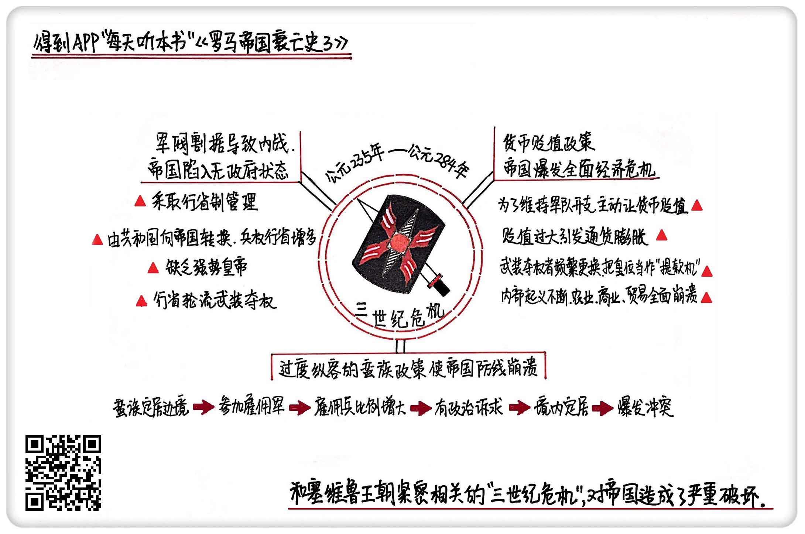

《罗马帝国衰亡史3》| 東西堂主解读
============================

购买链接：[亚马逊](https://www.amazon.cn/罗马帝国衰亡史-爱德华·吉本/dp/B00OAZ696U/ref=sr_1_2?ie=UTF8&qid=1511095842&sr=8-2&keywords=罗马帝国衰亡史)

听者笔记
------------------------

> 因为地方行省军权在握，不断对皇位发起攻击，导致长达半个世纪，政府形同虚设，内战混乱。
> 
> 维持军费需要大量的税收，但税收有限，经常需要用战利品充当军饷。最后只好减少货币含银量，导致货币贬值，经济衰退。
>
> 为了和蛮族保持和平，最开始允许蛮族在帝国边境生活，后来允许他们加入军队，但他们是为钱而来，因此忠诚度和战斗力都一般，后来卡拉卡拉普发公民权，导致他们也产生了政治诉求，挑起了反叛的大旗。

关于作者
------------------------

爱德华·吉本，启蒙运动晚期英国著名历史学家。他在对罗马帝国开展了历时20余年的研究后，用全新的历史写作手法创作了《罗马帝国衰亡史》，为启蒙运动的欧洲提供了深刻借鉴和反思。《国富论》的作者、著名经济学家亚当·斯密曾说，“《罗马帝国衰亡史》足可以让吉本列入欧洲文史界的首位。”     

关于本书
------------------------

本书是作者毕生智慧和研究成果的结晶，完整叙述了从罗马帝国“五贤帝时代”起至1453年君士坦丁堡沦陷1300多年的历史，其中涉及到了政治、经济、军事、宗教、文化和社会生活的方方面面。书中既有对罗马帝国衰亡原因的深刻剖析，也有对当时历史图景的呈现，是研究罗马史、解析中世纪欧洲的经典必读书目。

核心内容
------------------------

完整描述了罗马帝国全面衰落的状况，从政治、经济、蛮族政策三个方面详细分析了“三世纪危机”的过程和原因。
 

一、无政府状态
------------------------

三世纪危机最典型的一个特征，就是罗马帝国的无政府状态，不断有人从地方起兵杀进罗马城，改朝换代。49年当中，罗马帝国一共换了26位皇帝，除了有一位皇帝是自然死亡的，其他的不是被军队哗变处死，就是被其他从地方起兵的夺权者杀掉。

罗马人骨子里有优越感，行省的机构通常设置得非常简单，也没那么多层级和官吏。一个行省通常派驻一个总督，再配套几个法官和财政官。其中，法官负责处理一些当地纠纷，财政官目的很明确，就是收税。同时，根据地区性质不同，不同的行省还通常分为元老院行省和元首行省，区别就在于，元首行省有军团常驻，也称为武装行省。

后来，随着罗马由共和国向帝国转换，元首相对于元老院的力量对比大大上升，越来越多的元老院行省慢慢变为元首行省，越来越多的行省开始有兵权。但问题是，罗马的制度并不能保证每任皇帝都是强势的人，中央对地方的控制力越来越弱，最后造成了地方的军事割据。对军队的过度收买和依赖，让士兵失去了对国家的忠诚，普发公民权又让手握兵权的行省人产生了造反当皇帝的念头，在没有“忠诚”这个信仰支撑的情况下，塞维鲁王朝末期，第一支反抗军开始出兵，终结了塞维鲁王朝。从这以后的半个世纪里，地方军阀的混战此起彼伏，他们不是手握军权的行省总督，就是被当地士兵推举为皇帝的篡位者，罗马城变成了野心家谋取私利的战场，帝国政府陷入瘫痪状态。

二、货币贬值政策
------------------------

很多三世纪危机期间的钱币，并不是像一般考古发现的那样，是陪葬品，而是人在生前的时候“有意”埋进土里的。英国的经济学家格雷欣曾经对这种现象做出解释：罗马帝国这段时间的货币，无论是金币还是银币，它们的贵金属含量都直线下降，人们为了应对货币贬值，在日常交易当中只使用那些新发行的低纯度货币，而把之前纯度高的都藏起来，以备不时之需。

塞维鲁在军事改革期间，为了收买和讨好士兵，把军队的军饷提高到了之前的6到8倍。钱当然是从国库里抽，从各个行省搜刮，但问题是行省每年能够上缴的税收是维持在某一个水平的，怎么可能像军饷一样突然就暴增？在这种情况下，想要给士兵发饷，就只能靠不断挑起对外战争，用战利品充当军饷，可打仗需要钱，士兵战死补充兵源还需要钱，这种以外部矛盾解决内部缺口的手段到头来只能是个死循环。之后的卡拉卡拉又采取了普发公民权，想借此把所有行省人都变成罗马人，但罗马公民是不需要缴纳所得税的，所以总税金不仅没增加，反而大幅度减少了。

帝国早期，货币贬值的情况偶尔也出现，但幅度通常很小，到了三世纪危机前夕，主动的货币贬值成了常态，货币含银量一路走低，最后出现了断崖式下跌。三世纪危机期间，各个行省靠武力夺权的皇帝仅仅是把皇位当作提款机，需要用钱的时候，就把货币再次贬值，只做表面的数字游戏。他们武装夺权的过程本身，又进一步扩充了军备，在增加了所在地区士兵比例的同时，也减少了实际生产的人。在产出没有增加的情况下，提高货币的面额，让通货膨胀进一步恶化。截止到三世纪危机结束前，货币含银量已经不足2%。当罗马公众反应过来，货币贬值的效果就失灵了。到了帝国晚期，罗马政府甚至开始用粮食来征税和发军饷，在民间很多地方也恢复到了用实物交换实物的原始状态，整个社会经济遭受了一次大倒退。

倒退影响最大的就是农业。早期罗马的农业，主要靠奴隶制经营。罗马共和国末期，大规模奴隶起义爆发，罗马调整了策略，给奴隶一定人身自由，让他们用租种土地的方式继续从事生产，但货币短期内快速贬值，土地的租金也飞速上涨，奴隶除了自身的劳动力，手头没有闲置资金，即便是有，钱也在货币贬值下变得一文不值，为了维持生活，奴隶只能选择逃跑或者起义。三世纪危机期间，各种奴隶起义此起彼伏，罗马帝国赖以生存的经济基础——奴隶制支撑起来的农业经济也全面崩溃。土地被抛荒，没有人去耕种，粮食大规模减产，使得购买力下降，商品滞销，商业和贸易也遭受了严重的冲击，最终，整个罗马帝国陷入了全面的经济危机。

三、蛮族政策
------------------------

罗马帝国最终被蛮族毁灭只是表面现象，根本原因在于长期以来的蛮族政策。可以说，是罗马人自己敞开了让蛮族涌入的大门。

因为罗马靠近地中海，自然资源比较丰富，所以很早就进入了农耕社会，发展出城市文明。蛮族生活在罗马文明的边缘地带，自然条件没那么好，资源也不丰富，基本上还处在食物采集或者游牧状态。罗马在不同时期对蛮族的政策呈现出不同特点，但总体上是一个不断纵容的过程。条顿森林堡战役以后，罗马人尽量与蛮族和平共处；五贤帝时代末期，一些蛮族被允许在帝国边境外定居，但不能入境；最关键的转变在于——罗马实行军事改革以后，为了扩大兵源，允许大量蛮族以“雇佣兵”的身份加入部队。

三世纪的军事改革太过激进，迅速增兵导致了罗马军队当中蛮族雇佣兵的比例大幅度提高。这些人和罗马人不是同一种文化，参加雇佣兵也只是为了钱，所以，并没有忠诚度，反而降低了部队整体的战斗力。为了拉拢蛮族雇佣兵，维持部队的忠诚度，皇帝卡拉卡拉发放了罗马公民权。既然成为了罗马人，自然产生了政治诉求，也挑起了反叛的大旗。纵容的顶点，在瓦伦斯的皇帝任内。西哥特人大举迁徙，首领派人拜见瓦伦斯，希望把20万哥特人安置在帝国境内，瓦伦斯接受了哥特人的请求。大量哥特人源源不断地涌进多瑙河流域，而罗马帝国这个地区兵力又十分薄弱，当一些罗马士兵开始虐待哥特移民的时候，这些人开始反抗，瓦伦斯本人也被哥特人烧死。    

金句
------------------------

1. 当所有人看重的只是皇位和权力的时候，再也没有人去关心国家的治理，罗马城变成了野心家谋取私利的战场，帝国政府陷入瘫痪状态。
2. 人们为了应对货币贬值，在日常交易当中只使用那些新发行的低纯度货币，而把之前纯度高的都藏起来，以备不时之需。
3. 以外部矛盾解决内部缺口的手段，到头来只能是个死循环。
4. 是罗马人自己，为蛮族的涌入敞开了大门。政策上的纵容，让帝国的领土被不断蚕食，直到最后灭亡。

撰稿：東西堂主

脑图：摩西

讲述：于浩