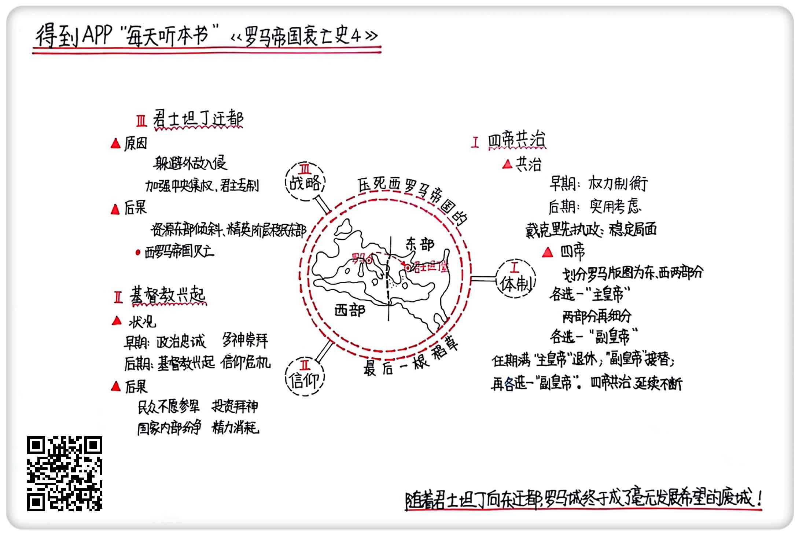

《罗马帝国衰亡史4》| 東西堂主解读
============================

购买链接：[亚马逊](https://www.amazon.cn/罗马帝国衰亡史-爱德华·吉本/dp/B00OAZ696U/ref=sr_1_2?ie=UTF8&qid=1511095842&sr=8-2&keywords=罗马帝国衰亡史)

听者笔记
------------------------

> 戴克里先创立了四帝共治的制度，将罗马分为东西两部，并分别再选出两位副皇帝。但后来君士坦丁继任后，将另外三个皇帝杀死，自己独揽大局，后来将帝国传给自己的两个儿子，分别执掌东西罗马帝国，自此罗马帝国分裂。
>
> 欧洲启蒙运动推动了基督教的兴起，同时国内战火连连，民不聊生，基督教对来世的向往成了人民的精神寄托，随着加入的人越来也多，君士坦丁被迫宣布基督教合法化。
>
> 君士坦丁选择了拜占庭作为东罗马帝国的新首都，因为位置好，而且有很多政治考量，导致老罗马城变成了毫无发展的废城，导致了西罗马帝国的灭亡。

关于作者
------------------------

关于作者 爱德华·吉本，启蒙运动晚期英国著名历史学家。他在对罗马帝国开展了历时20余年的研究后，用全新的历史写作手法创作了《罗马帝国衰亡史》，为启蒙运动的欧洲提供了深刻借鉴和反思。《国富论》的作者、著名经济学家亚当·斯密曾说，“《罗马帝国衰亡史》足可以让吉本列入欧洲文史界的首位。”

关于本书
------------------------

本书是作者毕生智慧和研究成果的结晶，完整叙述了从罗马帝国“五贤帝时代”起至1453年君士坦丁堡沦陷1300多年的历史，其中涉及到了政治、经济、军事、宗教、文化和社会生活的方方面面。书中既有对罗马帝国衰亡原因的深刻剖析，也有对当时历史图景的呈现，是研究罗马史、解析中世纪欧洲的经典必读书目。

核心内容
------------------------

从体制、信仰、战略三个方面，详细分析了西罗马帝国最终灭亡的原因和过程。
 

一、四帝共治
------------------------

罗马起源于分散的部落城邦，早期大家各自为政，出于大规模生产和共同防卫的需要，国家诞生。罗马共和国虽然是统一的共同体，但成员始终保持警惕，所以早期很多重要职位都是由两个以上的人担任，这么做是为了把权力和责任分散，防止产生独裁。这个做法形成惯例，被保留下来，到罗马帝国时期还经常出现。不过这个时候，罗马社会已经有了很大变化，随着军事权力的上升，尤其是屋大维建立了元首制，共治在更多的情况下只是形式上的意义，不是为了制衡权力，而是出于实用考虑。

戴克里先40岁才成为皇帝，并且是被地方军队拥立的，他完整见证了混乱的全过程，所以一上台立刻开始着手改革。改革中最重要的一点，就是把罗马帝国划分成四个大的管理区，交给包括自己在内的四个人去统治。

第一步，他先从权力的合法性入手，给皇帝正名。由于之前500年的共和国传统，在罗马帝国早期，统治者虽然在名义上也叫“皇帝”，但和中国古代的“皇帝”不一样，它没有神权合一的“天子”概念。一个人哪怕武力上台，最终也要得到元老院的认可。理论上，权力的源头是来自元老院，来自罗马人民。戴克里先从权力的源头抓起，直接把自己设定成最高君主，把权力完全神化，让人们管自己叫做“主和神”。除此以外，他还建立了一套繁琐的仪式，比如说，有人拜见他的时候，需要先趴在地上，亲吻他的长袍。

随后，戴克里先把整个罗马帝国的版图划分为东西两部分，他和一位朋友分别担任这两部分的“主皇帝”，然后再把这两部分进一步细分，再选两个人分别做“副皇帝”，就这样，一个完整的罗马帝国被戴克里先划分成了四块，交给四个皇帝管，历史上被称作“四帝共治”。

按照戴克里先的制度设计，东西部皇帝都是有任期的，期满之后，之前的主皇帝退休，副皇帝接替，然后再选任新的副皇帝，这样保证四帝共治不断延续下去。但再好的制度也是人执行的，而人的欲望是没有限制的，在他退位后的第二年，内战又开始了。君士坦丁获得这次战争的胜利，杀死了本来应该共治的其他三个皇帝，把整个帝国再次归在自己的统一之下。但之前的四帝共治已经像一次大手术一样，把帝国做过了切割，即便重新统一，之前切割的伤口也不可能愈合了。几十年后，君士坦丁的继任者再次把皇位传给他的两个儿子，分别执掌东部和西部，罗马帝国正式分裂成为了西罗马帝国和东罗马帝国。

二、信仰危机
------------------------

作者在写这部著作的时候，正处在欧洲的启蒙运动时期，科学权威开始取代宗教权威，医学、哲学、艺术等领域都出现了“非宗教”的现代思想。生活里，和作者非常熟的百科全书派思想家，也遭到了宗教势力的打压。这些都促成了他在创作的时候，对基督教和罗马帝国的关系进行反思。他本来计划要用整整一卷来写，但后来考虑再三，缩减到了两章。这两章内容形象地描述了在罗马帝国衰落的关键阶段，基督教所带来的影响。

基督教兴起之前，整个罗马社会信仰多神。很多神都是在征服各个殖民地以后被移植到罗马的，因为每个殖民地供奉的神都不一样，所以罗马的神话体系非常庞杂，它本质上是一种多神崇拜。基督教刚进入罗马的时候，普通民众并不敌视，也有很多人先后加入基督教，不过随着入教的人越来越多，引起了罗马的警惕，很多皇帝甚至对基督徒进行过迫害。罗马政府的宗教宽容，以对政治忠诚为前提，而越来越多的基督徒，让罗马感受不到忠诚。

到了二三世纪，罗马帝国开始走下坡路，甚至发生了社会体系全面崩盘的三世纪危机，人们早期崇拜的多神没有带来丰产和平安，一个个皇帝被杀也让皇帝自动走下神坛，整个罗马社会的信仰发生了动摇。盛世时代对现世生活的享乐，变成了乱世下对来世的向往，越来越多的罗马人不愿意参军，军队的整体实力慢慢开始下滑，帝国只能从蛮族中招募雇佣兵，导致军队的蛮族化，为后来内部防线的瓦解留下隐患。基督教的平等观念给奴隶的解放带来了希望，大规模的奴隶起义发生。越来越多的普通罗马公民，在乱世当中向往死后升入天堂，也不再像以前那样对国家忠诚。财富没有重新回流进社会，而是用于各种敬拜活动，严重影响了社会经济体系的健康发展。

尽管和原有的信仰有很大冲突，但随着越来越多的人加入，帝国最终还是迫于压力向基督教妥协了。公元313年，君士坦丁颁布《米兰敕令》，宣布基督教合法化。刚刚诞生不久的基督教此时又开始出现了内部理论分歧，尽管皇帝本人参与了分歧的调停，但基督教内部派别的纷争还是带来了社会动荡，国家的很多精力都被消耗在对这些争议的解决上。

三、西罗马帝国灭亡
------------------------

公元330年，君士坦丁在帝国东部建立了整个罗马帝国的新首都，取名叫做“新罗马”。之所以迁都，是出于对当时处在危亡中整个罗马帝国形势的考量：外部，罗马帝国正遭受着北方蛮族的大举入侵，无论在规模还是势头上都非常强大；内部，则是为了从源头上解决政权的合法性问题。

戴克里先把自己封为最高君主，把权力神化，让权力的源头直接指向神，他之后的继任者包括君士坦丁也是这么做的，但罗马有太长的共和传统，是绝对君主专制的牵绊。比如，元老院曾经是罗马共和国时代的权力机构，形式上，皇帝想要做任何重大决定还是要和元老院商量的。如果想要摆脱这种传统的束缚，唯一的办法只有换一个地方，重新建一套班子，所以君士坦丁决定迁都。

迁都的目标，就选在希腊地区的一个小海港——拜占庭。这里既远离了蛮族进攻的主要风口，又远离了元老院的视线，更远离了罗马城几百年沿袭下来的军事官僚喋喋不休的争吵。手握大权、专横跋扈的近卫军被取消，元老院也完全变成了一个单纯的咨询机构，没有了实权，君士坦丁发布命令、管理国家的自由度大大提高。他引入了当时东方波斯帝国的很多君主专制礼仪，这时候罗马帝国的皇帝才真正称得上有绝对权力的皇帝。

随着君士坦丁向东迁都，整个罗马帝国的战略重心自然就发生了转移。在这种转移之下，东、西部的差异越来越大：君士坦丁堡的发展越来越快，而之前的罗马城却越来越衰落。一方面是由于整个罗马帝国的首都切换到了东部，所有资源都向东倾斜；另一方面，君士坦丁堡所处的位置本来就是一个天然的交通枢纽，它扼守着黑海和地中海的咽喉要道，又控制着丝绸之路东西方的商道，不仅易守难攻，并且贸易发达，所以之前在西部的大量贵族和精英阶层都开始向东移民，罗马城成了毫无发展希望的废城，最终西罗马帝国灭亡。

金句
------------------------

1. 罗马帝国晚期，共治已经不像早期那样是为了制衡权力，而是出于实用考虑。
2. 在实行“四帝共治”之前，罗马帝国已经像一条破船，在内忧外患当中风雨飘摇。
3. 罗马政府的宗教宽容是以对政治忠诚为前提的，但越来越多的基督徒让罗马感受不到忠诚。
4. 之前在西部的大量贵族和精英阶层都开始向东移民，罗马城几乎成了个毫无发展希望的废城。

撰稿：東西堂主

脑图：摩西

讲述：于浩  