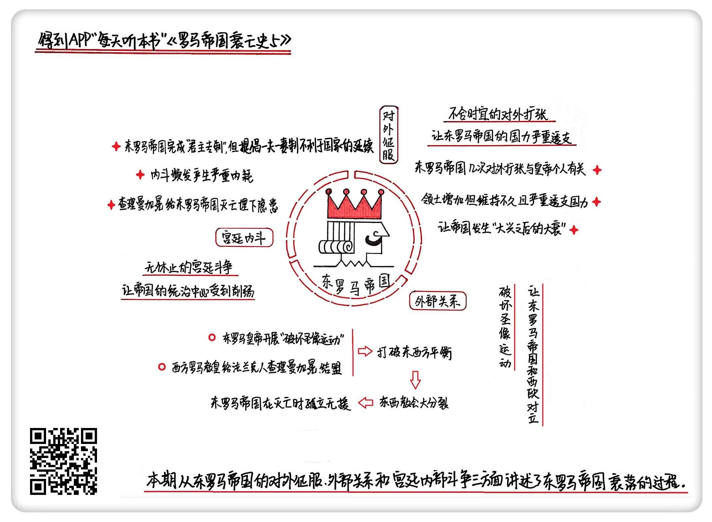

《罗马帝国衰亡史5》| 東西堂主解读
============================

购买链接：[亚马逊](https://www.amazon.cn/罗马帝国衰亡史-爱德华·吉本/dp/B00OAZ696U/ref=sr_1_2?ie=UTF8&qid=1511095842&sr=8-2&keywords=罗马帝国衰亡史)

听者笔记
------------------------

> 东罗马帝国是一个以守为主的国家，一旦发起进攻都会导致国力衰退，也因为几次不合时宜的扩张导致走上了衰落的道路。
>
> 西罗马帝国灭亡后，四分五裂变成了几个小国家，人民还是信奉基督教，奉罗马教皇为大主教，后来与东罗马帝国的利奥三世以及大牧首彻底决裂，分别开出对方教籍。西欧发展出了天主教，东欧发展出了东正教。罗马教皇为法国国王加冕为“罗马人的皇帝”为自己寻求到了武装保护，使自己实力大增。
>
> 东罗马帝国几代人的努力后，变成了彻底意义上的皇帝，但同时信仰基督教遵从一夫一妻制，帝国的未来，就寄托在皇帝一家人身上了，这种体制并不能保证每一代都能产生优质的皇帝，给帝国的统治带来了隐患。

关于作者
------------------------

爱德华·吉本，启蒙运动晚期英国著名历史学家。他在对罗马帝国开展了历时20余年的研究后，用全新的历史写作手法创作了《罗马帝国衰亡史》，为启蒙运动的欧洲提供了深刻借鉴和反思。《国富论》的作者、著名经济学家亚当·斯密曾说，“《罗马帝国衰亡史》足可以让吉本列入欧洲文史界的首位。”

关于本书
------------------------

本书是作者毕生智慧和研究成果的结晶，完整叙述了从罗马帝国“五贤帝时代”起至1453年君士坦丁堡沦陷1300多年的历史，其中涉及到了政治、经济、军事、宗教、文化和社会生活的方方面面。书中既有对罗马帝国衰亡原因的深刻剖析，也有对当时历史图景的呈现，是研究罗马史、解析中世纪欧洲的经典必读书目。

核心内容
------------------------

由东西罗马分裂为起点，从东罗马帝国的对外征服、外部关系和宫廷内部斗争三个方面，详细分析了东罗马帝国衰落的过程。
 

一、不合时宜的扩张
------------------------

罗马帝国以军事立国，东罗马虽然也延续了这种风格，但在它存续的1100年里，绝大多数情况下还是采取守势。这个本应该防守为主的帝国，每当它试图开展对外征服，都会陷入一阵大衰退。

第一个发动扩张的，是查士丁尼皇帝。他在位期间开展的很多对外战争，是明显超过当时国家经济发展水平的，之所以这么做，和他个人的成长经历有关。

查士丁尼来自之前东西罗马帝国的交界地带，他出生的时候，西罗马帝国灭亡还没几年，他一直想要恢复罗马帝国的光荣，所以在他当皇帝后没多长时间，就开始了一系列对外战争。但无论他怎么打，都逃不开东、西两线作战的命运。在世界战争史上，两线作战一直以来都是个忌讳，但这个时候的查士丁尼，由于贪功心切，甚至主动挑起两线战争。他先是派兵进入意大利半岛，和占据原来罗马城的东哥特作战，随后又转过头和东边的波斯帝国开战，他甚至还横跨过整个地中海，深入到北非地区。打仗是需要钱的，为了维持连年的战争，查士丁尼不得不动用国库维持庞大的军费开支，结果造成了帝国内部的经济危机。虽然形式上收回了之前罗马帝国时代的大部分领土，但没过多久，这些领土又一个个地相继丢掉了。

到了巴西尔二世登位，这位善于骑射的马上皇帝不仅是两线作战，并且是四面出击：向东，他深入亚美尼亚；向西，他打到意大利半岛；向南，他对阿拉伯人采取强硬措施；向北，又消灭了保加利亚王国。但和查士丁尼时代时期一样，巴西尔二世时代也没能长久。他们继任者的命运，无一例外的都是大兴之后的大衰，资源都被前任皇帝用来发动战争，连年征兵，土地荒芜，国库空虚，再也没办法应对更多新的敌人，国家从此走上衰落的道路。

二、破坏圣像运动
------------------------

西罗马帝国在公元5世纪灭亡了，但以罗马城为中心的教会组织却完整地保留了下来。原来统一的西罗马政府被推翻以后，国家四分五裂，变成了一个个小王国，历史上管欧洲西边的这半部分叫做“西欧”。西欧依然还是信仰基督教，并且，由于之前罗马城在历史上的崇高地位，罗马的主教自然就成了整个西欧的精神领袖，被称作“罗马教皇”。东罗马帝国教会的首领叫做“大牧首”，和“罗马教皇”的区别是，这个时候东罗马的皇帝还在，所以东部的“大牧首”并没有那么大权力，很多时候要听命于皇帝。

“破坏圣像运动”是指在8到9世纪这一百多年当中，东罗马帝国发生的一系列声势浩大的毁坏基督教画像的行为。这次运动，不仅给帝国内部带来混乱，也让它和西欧的关系恶化，甚至由此引发了东西教会大分裂。

基督教的兴起，让罗马帝国产生了严重的信仰危机，最终成了西罗马帝国灭亡的一个重要原因。它所衍生的一些内部纷争直到后来也没解决，一直延续到了东罗马时代。其中重要的争议之一就是——要不要对耶稣和基督教其他圣人的画像进行崇拜。本来这只是个基督教内部的理论问题，但由于它和经济、社会甚至军事问题相互纠缠，最后演变成了一个政治问题。

按照早期基督教的教义，是不允许偶像崇拜的，这也包括耶稣本人的形象。但早期的基督教徒，很多都是来自之前的希腊、罗马地区，这些地区原来是多神教，有着非常浓厚的形象情结，教会为了吸纳更多信徒，也默许了圣像的存在。这种情况一直维持了很多年，都没什么问题。但7世纪以后，伊斯兰教兴起，他们严格禁止偶像崇拜。由于和东罗马帝国距离非常近，潜移默化地影响了很多边境地区的军事贵族。并且，基督教势力越来越大，教会已经成了东罗马帝国一股不能忽视的力量，它们通常盘踞大量土地，享受着税收减免，这对国家财政的收入也是个阻碍。

8世纪开始，皇帝利奥三世发起了破坏圣像运动，想要借着这次运动打击教会势力。但罗马城所在的西欧地区已经完全基督教化了，而这些地方的宗教领导人是教皇，借着这次破坏圣像运动的导火索，罗马教皇索性宣布：开除皇帝利奥三世和君士坦丁堡大牧首的教籍。利奥三世作为报复，也派兵活捉了教皇。在这个过程中，法兰克人崛起，他们虽然也占据了罗马的土地，但在政权的合法性上始终存在问题。公元800年，法兰克人的国王查理曼，在罗马圣彼得教堂做礼拜的时候，被当时的教皇加冕为“罗马人的皇帝”。罗马教皇原本只有宗教上的权力，没有世俗权力，但在这之后，罗马教皇就有了武装保护人，大大增强了自己的实力，完全可以和东罗马帝国的基督教抗衡了。

东西教会的分歧越来越大，终于酿成了1054年的基督教会大分裂。罗马教皇和君士坦丁大牧首分别把对方开除教籍，两方面的教会开始各自独立发展：在西欧形成了后来的天主教，使用拉丁语传教；而在东罗马形成了东正教，用希腊语来祈祷和礼拜。这种分裂一直延续到了今天。

三、宫廷斗争
------------------------

经过从戴克里先到君士坦丁几代人的努力，东罗马帝国现在已经完成了向君主专制国家的转变。到了东罗马时代，“皇帝”的含义已经更接近人们理解的常规意义上的皇帝。

东罗马帝国本质上是个基督教国家，遵循严格的一夫一妻制。皇帝也是基督徒，所以，他除了妻子之外没有其他配偶。这首先造成一个问题，就是皇帝后代“断档”的概率大大增加了，一旦某个皇帝没有后代，就相当于这个王朝绝嗣了。作为对一夫一妻制的补充，东罗马帝国规定：皇帝的配偶、兄弟、姐妹甚至女婿都可以在一定条件下继承皇位。

骨子里，东罗马帝国属于皇权专制，皇帝的能力、才干甚至包括他的寿命，都对国家非常关键，但宫廷制度又不支持产生足够多、足够强的继承人，所以就造成了后劲不足，再加上它允许那些“亲友团”参与到皇位的事情上来，必然会造成宫廷内斗。据统计，整个东罗马帝国的历史中，有将近三分之一的皇帝由于没有结婚或没有合法后代造成皇位空缺；而93个皇帝当中，有40人非正常死亡，其中被处决和暗杀的有34个，被流放、监禁或迫害的有42个。     

金句
------------------------

1. 这个本应该防守为主的帝国，每当它试图开展对外征服，都会陷入一阵大衰退，这几乎成了贯穿整个帝国的规律线索。
2. 查士丁尼在位的38年，可以说绝大多数时间都用在这些战争当中。一个最致命的问题是，无论他怎么打，都逃不开东、西两线作战的命运。
3. 利奥三世发起的破坏圣像运动，从字面上理解，只是捣毁基督教的圣人画像，但实际上，他是醉翁之意不在酒。
4. 早期的罗马帝国，并不存在真正意义上的皇帝，所以描述那个时候的权力中心，更妥当的词不是皇宫、王宫之类，而是罗马帝国政府。

撰稿：東西堂主

脑图：摩西

讲述：于浩 