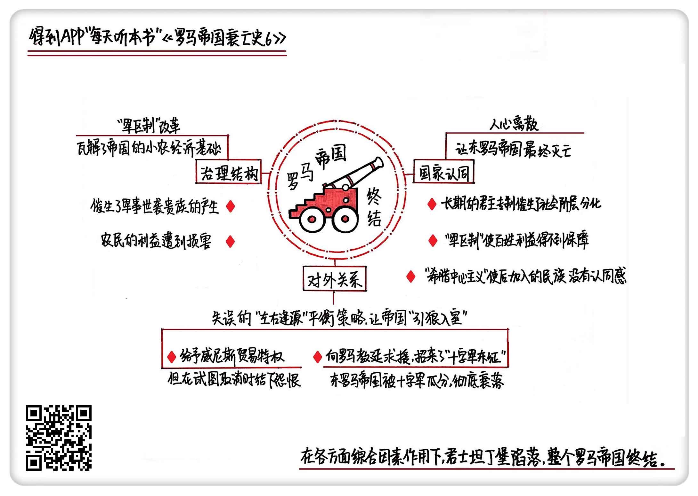

《罗马帝国衰亡史6》| 東西堂主解读
============================

购买链接：[亚马逊](https://www.amazon.cn/罗马帝国衰亡史-爱德华·吉本/dp/B00OAZ696U/ref=sr_1_2?ie=UTF8&qid=1511095842&sr=8-2&keywords=罗马帝国衰亡史)

听者笔记
------------------------

> 军区制导致了地方军阀压榨，最终在经济和军事产生了双重危机。
>
> 采用平衡策略，在帝国出现危机的时候，寻找外部力量来协助抵御，但因为交换的权利有时候代价太大，导致后面想要收回这些条件变得不可能。
>
> 随着经济不行，人心涣散，奥斯曼帝国来袭，根本无力抵御，很快东罗马帝国就随之灭亡了。

关于作者
------------------------

爱德华·吉本，启蒙运动晚期英国著名历史学家。他在对罗马帝国开展了历时20余年的研究后，用全新的历史写作手法创作了《罗马帝国衰亡史》，为启蒙运动的欧洲提供了深刻借鉴和反思。《国富论》的作者、著名经济学家亚当·斯密曾说，“《罗马帝国衰亡史》足可以让吉本列入欧洲文史界的首位。”

关于本书
------------------------

本书是作者毕生智慧和研究成果的结晶，完整叙述了从罗马帝国“五贤帝时代”起至1453年君士坦丁堡沦陷1300多年的历史，其中涉及到了政治、经济、军事、宗教、文化和社会生活的方方面面。书中既有对罗马帝国衰亡原因的深刻剖析，也有对当时历史图景的呈现，是研究罗马史、解析中世纪欧洲的经典必读书目。

核心内容
------------------------

深刻剖析了帝国最后二百年的衰败原因，从帝国的治理结构、对外关系和国家认同三个方面，详细描绘了东罗马帝国的最终灭亡。
 

一、军区制改革，瓦解了帝国经济基础
------------------------

军区制，是一种军政合一的组织体系。

罗马帝国早期采取的是行省制，是在罗马对外扩张时期产生的，随着帝国版图越来越大，它把那些被征服的殖民地都收归成行省。靠着行省制，罗马帝国把自己打造成了地跨亚非欧三洲的大帝国。但疆域大了以后，它慢慢开始鞭长莫及，为了收税，也为了地区稳定，很多行省都有兵权，这也造成了后来的地方割据。东罗马对行省制进行改革，推行总督制，把地方的行政权和军权分离。不过总督制没有维持多久，希拉克略皇帝在任期间开始了军区制改革，又恢复到了军政合一的老路。他把零零散散的行省合并，建立了军区，由军事长官一手包办地方的行政权、司法权和军事权。希拉克略之所以这么做，是因为7世纪开始，外部入侵再次增多，这样做可以随时组织军队，应付战争威胁，但它带来了副作用，就是对经济的破坏。

东罗马帝国以农业为经济基础，和军区制改革配套实行的农兵制，让农民完全处在被领导的地位，当军事长官对辖区内的农民有生杀予夺的大权，压榨农民就成了常态。军事贵族开始对农民进行土地兼并，农民要么死走逃亡，要么沦为农奴，东罗马帝国赖以生存的农业经济基础被破坏殆尽。帝国晚期，小农阶层几乎完全消失，国家不仅征不上兵，还收不上税，带来了军事和经济的双重危机。

二、形势判断失误，让帝国“引狼入室”
------------------------

东罗马帝国继承了之前罗马帝国的东部领土，也继承了易攻难守的地缘政治，它有着很长的边境线，尤其是还要面对浩瀚的地中海，使得外部形势非常严峻。纵观帝国存在的1100多年，绝大部分时间都是在和四周虎视眈眈的强敌打交道。这种四面受敌的严峻形势，让东罗马帝国练就了一套左右逢源的平衡战略。假设有敌人 A 前来入侵，它就会找到和 A 有竞争关系的 B 从背面牵制住敌人；如果有 C 对它形成威胁，它又会找到 D 甚至是 E 来协助防卫。

不过这种平衡战略不是每次都管用。9世纪以后，诺曼人闯入地中海占据西西里，为了应对这种威胁，东罗马帝国找到威尼斯人，开出了非常丰厚的条件：允许威尼斯进出帝国境内所有港口，并免去它的海关税收。威尼斯派出舰队击败了诺曼人，获得了东罗马的贸易特权，当帝国后来想要把贸易特权收回来的时候，反倒和西欧结下了怨恨。这个时候，来自亚洲草原的塞尔柱突厥占据了耶路撒冷，耶路撒冷皇帝阿历克修斯写信向罗马教廷求援，罗马教皇顺势发起了“十字军东征”。十字军，由当时西欧的一群落破骑士、失地农民和宗教狂热者组成，他们打着“收复圣地”的名义，过境东罗马，大肆劫掠。在第四次十字军东征当中，他们攻击、洗劫了君士坦丁堡，东罗马帝国从此彻底地衰落了下去，再也没有恢复过来。

三、人心离散，让东罗马帝国最终灭亡
------------------------

早在1453年之前的很多年，所谓的东罗马帝国就已经名存实亡了。它原来是一个地跨亚、非、欧三洲的大国，但随着在亚洲、欧洲、非洲的领土全部丧失，东罗马慢慢沦落成了一个二三流的小国。这一百多年里，奥斯曼攻打东罗马城池的战役几乎可以用摧枯拉朽来形容，很多地方，比如说塞尔维亚、保加利亚、小亚细亚一些城镇，甚至没做任何抵抗，主动开城欢迎奥斯曼大军。

东罗马帝国采取的是中央集权的君主专制，这个体系发展到末期就出现了社会阶层分化，和皇族有关的官僚机构把持了大部分社会资源，老百姓陷入贫苦无依的境地。奥斯曼进军的早期，没有实行严酷的杀戮，相反采取了相对宽容的宗教政策：只要你肯皈依伊斯兰教，就可以免收人丁税，甚至还可以在军队中谋一份差事。这样，随着奥斯曼大军的推进，队伍就越来越壮大。奥斯曼军中，不仅有当时的主体民族突厥人，还有大量的拉丁人、希腊人、马其顿人、塞尔维亚人等等，他们很多都是不堪忍受东罗马的压迫，投奔到了奥斯曼阵营当中。

这其中，还有一个重要原因就是，很多“非希腊人”在以希腊文化为中心的东罗马帝国找不到归属感。这些人没有发言权，还时不时会遭到帝国上层希腊人的歧视。对他们而言，帝国处在盛世怎么都好办，反正就算没有发展，也可以跟着混一口饭吃，但随着帝国慢慢衰落，连饭也吃不上了，他们索性就在最后时刻加入了奥斯曼的队伍。

在1453年最后的首都保卫战之前，东罗马帝国城中的军民加在一起大约有40000人，可真正投入战斗的只有7000人，而奥斯曼一方，除了志在必得的气势、不断壮大的队伍，还有当时先进的攻城武器：火炮。尽管保卫战坚持了将近两个月，这座千年古城最终还是被攻破了。随着君士坦丁堡的陷落，不仅标志着东罗马帝国的灭亡，也宣告着整个罗马帝国的灭亡。从此以后，欧洲中世纪结束，世界开始进入现代。     

金句
------------------------

1. 总督制没有维持多久，希拉克略皇帝在任期间开始了军区制改革，又恢复到了军政合一的老路。
2. 军事组织讲的是服从文化，也就是上级对下级是一种绝对领导。在农兵制下，农民不像一般理解的那样租地主的土地然后交租就可以了，他们完全是处在被领导的地位。
3. 正是这种四面受敌的严峻形势，也让东罗马帝国练就了一套左右逢源的平衡战略。
4. 所谓十字军，名字虽然好听，但不过是当时西欧的一群落破骑士、失地农民和宗教狂热者。他们打着“收复圣地”的名义，过境东罗马，大肆劫掠。
5. 早在1453年之前的很多年，所谓的东罗马帝国就已经名存实亡了。它原来是一个地跨亚非欧三洲的大国，但随着在亚洲、欧洲、非洲的领土全部丧失，东罗马慢慢沦落成了一个二三流的小国。

撰稿：東西堂主

脑图：摩西

讲述：于浩