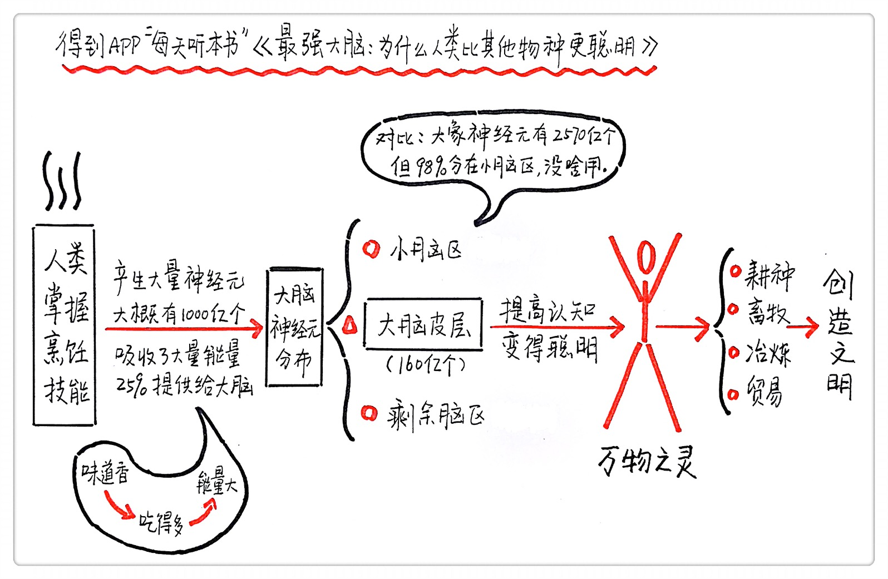

《最强大脑》| Kerena解读
=============================

购买链接：[亚马逊](https://www.amazon.cn/最强大脑-为什么人类比其他物种更聪明-苏珊娜·埃尔库拉诺-乌泽尔/dp/B01M9G7ONJ/ref=sr_1_12?s=books&ie=UTF8&qid=1512225923&sr=1-12&keywords=最强大脑)

听者笔记
-----------------------------

> 认知能力只与大脑皮层中的神经元数量。
>
> 熟食能够提供比生肉更丰富的能量，也就让人脑能够有更多的能量得以消耗，从而促进了人脑神经元数量的增长。

关于作者
-----------------------------

苏珊娜•埃尔库拉诺-乌泽尔，神经学家，美国范德堡大学心理学与生物科学系副教授，TED大会演讲人。苏珊娜从经常被大众忽略的神经元数量入手，以一种全新的理论解释了为什么人类比其他物种更聪明。

关于本书
-----------------------------

本书是一本探讨人类大脑进化的新锐研究作品。它开创了崭新的研究方法，同时以简明易懂的语言为读者阐明了影响智力水平的因素。更重要的是，本书针对人类大脑为什么更聪明这个问题提出了与以往研究截然不同的全新理论。

核心内容
-----------------------------

大脑皮层的神经元数量决定了动物的智力水平，人类大脑皮层中的神经元数量远高于其他物种，所以人类比其他物种更聪明。由于神经元数量越多，大脑的重量越大，对应的身体重量也越大。因此在进化过程中，可用卡路里量的有限性强迫大型类人猿在身体重量和脑子重量之间做出选择。人类因为掌握了烹饪技术而使在短时间内摄入大量卡路里以支持大脑运转成为可能。其他物种则不得不牺牲神经元数量，将摄入的卡路里用于维持身体运转。
 

一、神经元缩放规则
-----------------------------

简单来说，就是每种动物的大脑在进化过程中，都要遵循一定的规则。这种规则规定了神经元数量和大脑体积之间的关系。有的动物进化程度比较高，在相同体积的情况下，能拥有更多的神经元。有的动物进化程度比较低，在相同体积的情况下，神经元数量比较少。需要注意的是，所有动物大脑的重量和体积呈正相关的关系，体积越大，重量也越大。所以在研究的过程中，有的科学家把体积当作参数，有的科学家把重量当作参数，但他们得出的结论是大致相同的。

【案例】

比如以老鼠为代表的啮齿类，它们就属于进化程度比较低的，大脑体积不大，拥有的神经元数量也很少。人类作为一种极其聪明的物种，拥有高达1000亿个神经元。如果我们不幸地遵循了老鼠的神经元缩放规则，为了保持1000亿个神经元，我们的大脑重量就得超过60斤，对应的体重将高达80吨！

二、人类的大脑遵循类灵长动物的进化规则
-----------------------------

人类的大脑之所以展现出异于其他物种的高级能力，是因为作为灵长类动物的一员，人类的大脑严格遵循了灵长类动物的神经元规则，在更小的大脑皮层和小脑里塞进了更多的神经元，在智力水平上把其他物种远远甩在身后。但是人脑也有其自身的特殊性，比如：相对于同等体型的非灵长类动物，人类的脑子足足比大了7倍；人脑每天消耗的能量占人体全部耗能的25%；大猩猩脑子的体积只有人类大脑体积的1/3，在人类面前实在是不值一提。

三、“脑之汤”的实验方法
-----------------------------

在“脑之汤”这种方法出现之前，对神经元计数的难点在于大脑内的细胞并不是均衡分布的。通过把固体的大脑变成细胞核在其中自由浮动的、具有均衡性的汤，苏珊娜只要取一小部分汤出来，数清楚里面有多少细胞核，也就知道了大脑中有多少细胞。大脑中除了重要的神经元，还有一些其他类型的细胞。苏珊娜的下一步是将一种只能把神经元染色的抗体加入脑之汤，再数一数被染色的细胞核有多少，从而计算出神经元占大脑所有细胞的比例，以及神经元的真实数量。

四、决定动物聪明程度的是神经元数量而不是脑容量
-----------------------------

在科学领域，聪明程度通过“认知能力”的高低来体现。认知能力只与一个东西有关系，那就是大脑皮层中的神经元数量。其他动物的脑子虽然大，但人类大脑皮层中的神经元数量远比其他动物要多，所以人类比其他物种更聪明。

【案例】

苏珊娜选择了重量巨大的大象的脑子与人脑进行比较，试图找出到底是全脑重量还是大脑皮层神经元数量影响了大象和人类的认知水平。

人类显然要比大象聪明，我们会说话、会写字、还能把大象拉到实验室里研究一番。但是人类的全脑重量只是大象全脑重量的三分之一，所以首先可以排除全脑重量对认知能力的影响。我们再来看大脑皮层神经元数量。整个大象脑子总共有2570亿神经元，但是其中98%的神经元都存在于大象的小脑。在大脑皮层神经元数量这个最关键的数据上，大象只有56亿，无法与人类的160亿神经元相提并论。

这些实验数据有力地证明了这个结论：大脑重量并不重要，大脑皮层的神经元数量才是决定人类聪明与否的关键。

五、烹饪在人类进化的过程中的作用
-----------------------------

在进化早期，大脑的地位并不太重要。因为觅食能力相对低下，人类和其他动物一样，摄取能量的绝大部分被用于维持身体机能运转。大脑消耗能量的多少跟其拥有的神经元数量密切相关，神经元数量越多，人越聪明，大脑耗能越大。分配给大脑的能量变少了，我们就自然而然地更笨了。

人类掌握烹饪技巧之后，在同样的时间里、耗费同样的体力，能够获得更多的能量。在进化的过程中，更多的能量意味着人类有机会把多出的能量分配给大脑。久而久之，大脑就有机会拥有更多的神经元，变得更聪明，聪明到学会耕种、学会畜牧，开始农业文明。从这个角度看，如果没有某位祖先在某天突然掌握了烹饪技巧，我们的大脑还会和其他近亲一样，只能沦为身体的附庸，起不到决定性作用。所以我们在潜意识里把烹饪视为极其重要的技能，进而影响了我们对其他人的判断。

金句：
-----------------------------

1. 人类的优势在于我们是唯一研究自己和其他事物，并且在研究的过程中产生知识，完好无损地传播开来的物种；我们能改变自己，用戴眼镜、植入和手术等方式弥补自己的缺陷，从而改变自然选择的规律；我们彻底改变自己所在的环境，使我们能在任何地方居住；我们使用工具制造工具，使工具变得更强大，能解决更多更困难的问题；我们不断寻找更复杂的问题的解决方案，这让我们自己的能力也随之增长；我们创造描述知识的方法，让后人学习知识时不再需要直接的演示—这些都使我们变得特别。虽然所有需要的认知能力都不是人类独有的，我们应用这些认知能力的复杂性和灵活性显然是其他任何物种难以望其项背的。
2. 我进行了一项名为“你了解你的大脑吗”的调查，其中一个问题是“我们仅使用了大脑的10%”，60%接受过大学教育的里约本地人的答案为“是”，我对此感到非常震惊。我在流行科学杂志甚至宣传片中都看到过这个易使人上当的描述，但是从没预料到它在公众的意识中如此根深蒂固——而且这个说法还是虚构的。我们在任何时候都需要使用整个脑子，我们学习和进步，成就伟大的事业，甚至在睡觉时都使用了100%的脑子，只是使用的方式不同。
3. 我们已经到达这个位置，我们中只有极少的人主宰了现在的技术。谁知道怎么融化和加工金属？更不用说用它来从头制造一辆汽车、一部手机或者一台电脑。能自称科学家甚至不等于我知道怎么制作一支简单的铅笔。当今技术中的很多不再掌握于一个个体。我们夸口从古希腊以来走了很长的路—但是我们不再同时是建筑学、生物学和理学专家。这就是为什么科学（知识）和技术（工艺）必须被小心地栽培、记录和传授给下一代。拥有令人瞩目的大脑皮层神经元数量从而能达到令人瞩目的成就是不够的：我们站立于前人的肩膀之上，并且现在我们这一物种的成就作为一个整体远远超过任何一个个体。人类很久以来就超越了个人。它自强化地匹配了我们大脑皮层中惊人数量的神经元促成的技术发明和文化传播，后者又将我们的性能成形为能力，并让我们成为人——无论情况好还是坏。

撰稿：Kerena

脑图：摩西

讲述：于浩