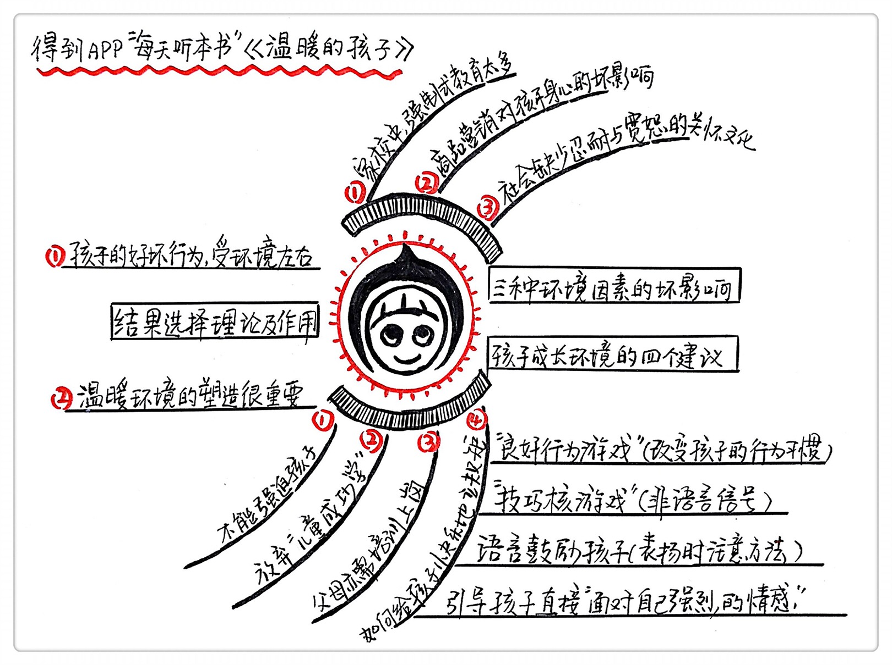

《温暖的孩子》| 李睿睿解读
=============================

购买链接：[亚马逊](https://www.amazon.cn/图书/dp/B01K12EBU6/ref=sr_1_1?ie=UTF8&qid=1506347596&sr=8-1&keywords=温暖的孩子)

关于作者
-----------------------------

安东尼·比格兰，美国预防研究学会的主席，预防科学领域发展的领导人物，行为学家和心理学家，致力于利用预防科学在全球建设滋养型的家庭、学校和社区，解决孩子的心理问题。安东尼花费了40年时间去研究儿童兴趣、技能、能力、习惯与后天养育环境之间的关系。

关于本书
-----------------------------

在本书里，安东尼从行为学和心理学角度出发，为我们解读了孩子的心理特征和心理需求。并分析了强迫型环境与孩子性格、人格缺陷之间的关系。安东尼在这本书里呼吁改造我们的家庭、社区和学校人际关系环境，让创造滋养型环境成为大多数社会成员的共识和行为规范，为孩子的健康成长创造条件。

核心内容
-----------------------------

《温暖的孩子》的思想核心是：减少家庭、学校和更广阔社会环境里的强迫关系，并代之以更多的关怀。这对于培养儿童的学习能力、社交能力，预防青少年行为问题至关重要。安东尼站在人类发展的高度指出，建设有利于儿童健康成长的滋养型社会是大势所趋。今天，我们已经积累了足够多知识和数据来改变世界。
 

一、关于结果选择
-----------------------------

在这本书里，最颠覆认知的是名叫“结果选择”的行为理论。它重新排列了人类思想与行为之间的因果关系。

结果选择指的就是，人类的行为顺序总是：先评估结果如何，再反过去组织行动。而不是相反。

以前人们认为，人类行为有自主选择能力，遇见事总是先缜密思考、精心谋划之后再采取行动。而动物是靠适应环境的本能反应。行为科学家的研究却发现，我们行为选择的理性成分并不比鸽子、老鼠高很多。尤其遭遇未知环境时，我们往往不是坐下来思考行动计划而是闭上眼睛先打一杆子，再低头看看有没有枣儿。要是有枣儿，这“一杆子”就会固化成习惯和兴趣，影响日后的行为。越来越多证据证明，儿童的习惯养成是在行为后果中不断学习的结果。譬如幼儿教育工作者发现，爱打人的孩子并不是天生喜欢打人的感觉，而是偶然发现击打能够赢得父母的关注，这种兴趣是在责怪中强化的。避免养出“暴力小孩”最好的办法是，减少对“暴力行为”的过度反应。

孩子的好行为或者坏行为多半不是与生俱来的，而是特定环境产生的功能。想培养出亲社会的宝宝，先要塑造出滋养亲社会行为的温暖环境，其中包括家长对孩子良好行为的关注、赞扬、欣赏和公开褒奖；也包括在学校里和社会范围内大力宣扬优秀事迹、树立楷模，以及肯定亲社会行为的价值观等等。

二、关于强迫
-----------------------------

作者认为我们的家庭和学校里存在很多强迫行为。这一点对儿童学习和社交能力的养成伤害极大。强制的形式包括：责打、呵斥、讥讽、嘲笑、漠视、嫌恶，以及唠叨。强制式互动在成年人的人际交往中也很常见。“后果选择”论可以解释我们偏爱强制手段的原因。早期人类发现，用令人反感的方式制止对方的侵害行为，有立竿见影的效果。人类基因便将强制偏好记录下来，使之成为一种下意识行为。被强制的痛苦体验会给孩子种下反社会行为的萌芽。如果老师和家长总是动粗，孩子就会有样学样。他将因此学不到更高级的能力，比如互相体谅、抑制冲动或者以幽默的方式缓和矛盾。长大以后，不但知识学的少，还很难掌握得体的社交礼仪和情绪控制技巧。大量证据显示，高度强制的家庭和社会组织会造成成本高昂的行为问题。

大量的强迫会给孩子带来诸多的成长问题。例如逆反心理、强迫他人、反社会人格等等。

三、“儿童成功学”是有害的
-----------------------------

家长过早向孩子灌输成年人的“成功”理念，并将孩子引向激烈的竞争，对孩子的成长是有害的。

与我们的一般认知相反，行为学家们认为竞争激烈的环境反而会对孩子的学习和成长造成损害，特别是对早期青少年需要建立学习自信的时候。有证据显示，有关爱且没有竞争的学习环境更利于孩子的自我发展。过于强调竞争的环境会让孩子产生抑郁和愤怒的情绪，并因自尊心受伤而学习动力不足。

家长也不必担心没有了成功欲望的驱动和竞争的热情，孩子会失去学习动力。美国的教学实验发现，在宽松的学习环境里只要孩子掌握学习选择和自主学习两项能力，就能学得更好。为此家长和老师要做到精心设计教学内容和顺序，引导儿童发现必须学习的核心知识和技能。同时强化促进孩子自觉努力的情境，让他觉得好好学习是一件很酷的事。

四、发现孩子做的“不对”时别急着纠正，要先顺着他的想法再加以正面的引导
-----------------------------

家长经常遇到过话讲了10遍，孩子却无动于衷的情况。这时，父母通常会吼孩子。因为觉得他听懂了大人的话却故意不照做。安东尼指出这是典型的养育误区，成年人总是从自己的视角出发，忽略了儿童的视角，从而过高估计了孩子的理解能力和行为能力。他认为：“教育的第一要诀是顺应孩子的需求。虽然有时命令也能让孩子接受正确的行为，但是强迫的压力会让更多孩子选择不合作，实际效果远不如先保持关注再加以正面引导的做法。”只要可能，不妨尝试给孩子多种选择，轻柔地问他“你愿意自己走到车那边还是希望我抱着你去”，要比命令他“我要你坐到车里去”，有效得多。

五、立规矩不是越多越好，改变孩子的行为习惯要善于使用良好行为游戏和正面鼓励的方法
-----------------------------

“良好行为游戏”源于20世纪60年代中期的一次教学实验。小学老师穆里埃尔·桑德斯被课堂纪律问题弄得焦头烂额，于是向心理学家蒙特罗斯·伍尔夫求助。伍尔夫问她：“你的学生在做什么活动时表现比较好？”穆里埃尔回答：“在组队进行拼字游戏时表现很好，而且比较兴奋。”伍尔夫教她把学生分为若干组，在一小段时间内如果哪一组没有人违反课堂纪律，就奖励额外五分钟课间休息时间。如果所有的小组都表现良好，游戏时间就自动延长。通过这种游戏，穆里埃尔发现违反纪律的现象基本消失。

 “良好行为游戏”后来成为辅助教学法，在美国38个州和加拿大马尼托巴省推行。有研究显示，这项活动能够有效预防儿童出现学习和社交障碍，甚至能降低成年后被捕和成为瘾君子的可能性。

此外，“技巧核”也是一组实用的良好行为管理游戏。所谓“技巧核”是指能刺激良好行为习惯的非语言信号，有超过50种之多。比如“表扬便条”，当孩子的行为值得表扬，父母就写一张有鼓励言辞的纸条给他，当然写纸条的人也可以是兄弟或同学。再比如“注意力开关”，发现学生上课走神了，老师并不直接批评他，而是打开或者关闭他面前的一盏灯。

“技巧核”依靠影响人的心理来强化正面行为，比絮叨、批评和责骂更有助于培养孩子的好习惯。

金句：
-----------------------------

1. 人类所有行为问题的根源都在于：缺乏一个让儿童自觉自愿拥抱健康生活的后天培养环境。
2. 教育的第一要诀是顺应孩子的需求。虽然有时命令也能让孩子接受正确的行为，但是强迫的压力会让更多孩子选择不合作，实际效果远不如先保持关注再加以正面引导的做法。
3. 我们应该认识到儿童多样性的价值，尊重他们的独特的技能、兴趣、价值观和潜能，那些用标准化考试无法反映出来的特质，对我们的社会更有意义。

撰稿、讲述：李睿睿

脑图：摩西