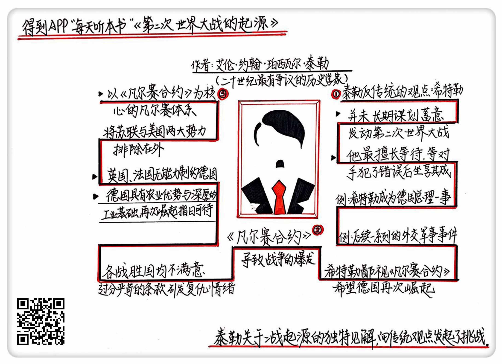

《第二次世界大战的起源》| 何东城解读
=============================

购买链接：[亚马逊](https://www.amazon.cn/第二次世界大战在亚洲及太平洋的起源-入江昭/dp/B018QCP7LU/ref=sr_1_1?s=books&ie=UTF8&qid=1512226477&sr=1-1&keywords=第二次世界大战的起源)

听者笔记
-----------------------------

> 《凡尔赛合约》不仅没能让各战胜国满意，而且对德国过于严苛。美、苏被排除在合约之外，导致了无法对德国产生制约。

关于作者
-----------------------------

艾伦·约翰·珀西瓦尔·泰勒，二十世纪最杰出的历史学家之一，曾任教于曼彻斯特大学与牛津大学。其代表作为《第二次世界大战的起源》，挑战了学界对二战爆发原因的传统解释。 
    
关于本书
-----------------------------

本书主要着眼于从凡尔赛合约到二战爆发前这一时期的国际政治外交活动，对主导凡尔赛体系的英国、法国领导人的意图和顾虑，战败国德国的战略以及美国、苏联等国参与国际外交活动的目的和手段进行了描述。最终认为二战的爆发并非个人的决定，而是国际体系不稳定的结果。 
    
核心内容
-----------------------------

核心内容分为三部分：一、希特勒没有蓄意谋划第二次世界大战；二、《凡尔赛合约》不仅没能让各战胜国满意，而且对德国过于严苛；三、美、苏两国被排除在一战后的世界体系之外。    

一、希特勒没有蓄意谋划第二次世界大战
-----------------------------

希特勒没有长期谋划蓄意发动第二次世界大战，他仅仅是鄙视凡尔赛条约并希望德国再次富强。1937年希特勒主持秘密会议，会议记录被后人称为“霍斯巴赫备忘录”。1938年3月12日纳粹德国与奥地利第一共和国合并，六个月后德国进一步占领捷克斯洛伐克的苏台德地区，1939年9月1日德国为了占领但泽自由市而入侵波兰，第二次世界大战正式打响。这些军事事件的发展似乎正是按照“霍斯巴赫备忘录”中所记载的德意志称霸未来“三步走”战略进行的，奥地利、捷克斯洛伐克、波兰北部的但泽走廊，甚至连顺序都没有变。

传统观念认为，希特勒动用武装力量分明是发动世界大战的前奏。然而，在泰勒看来，很多事实都与这一传统逻辑冲突。在“霍斯巴赫备忘录”希特勒提出了战争威胁，但他同样深信“英国不会参加”，法国也不可能“对德国采取交战行为”，他对战争爆发的可能性有很大保留。另外，这苏台德地区与但泽自由市在一战结束前本属于德国，是凡尔赛合约从德国手中夺走的。奥地利又是日耳曼人占大多数，本就属于大德意志。因此泰勒认为，希特勒其实对下一步自己要干什么也并不清楚，只是他一旦不知道应当干什么时，便望向那可恶的制约着德国的《凡尔赛条约》，找到一项他现在能摧毁的条款，然后毫无顾忌地撕毁。

二、《凡尔赛合约》不仅没能让各战胜国满意，而且对德国过于严苛
-----------------------------

1. 一战结束后英、法、美诉求不同

法德两国历史上是宿敌。经过了第一次世界大战，法国为胜利付出了巨大代价，500余万军民伤亡，而且西线战场绝大部分在法国，几乎毁掉了所有农业与工业基础。因此法国希望新仇旧怨一起报，在凡尔赛条约谈判中主张对德制定十分严格的条款。

美国则截然相反，态度最温和。在一战中，美国通过贸易与军事订单积累了巨额财富，并凭借这个超越英国成为世界第一经济强国，美国政府也因此倾向于弱化矛盾，他们希望战后能够安抚德国并保证英法德各国平等的贸易机会。美国在一战期间给各国提供了大量军事、民用物资，均转化为战争债务，如果能保证欧洲市场的稳定，美国便能顺利收回各国在战争期间欠下的债。

英国的立场则又不一样，英国不仅地理上独立于欧洲大陆，英国长期以来在心理上也独立于欧洲大陆，他希望自己作为资本主义老大哥，让欧洲大陆上最容易威胁到英国的德法两国相互掣肘相互制衡，从而达到自己掌控欧洲局势的目的。一方面，一旦法国提出的条件全都得到满足就会成为欧陆的超级强国并破坏欧陆均势，这和英国意图维持一个均衡的欧洲的传统政策相悖。另一方面，德国还是英国的第二大贸易伙伴，过分削弱德国的经济同样会使英国经济受损。因此英国则表面上扮演和事佬，走中间路线，似乎总是在告诫法国不要那么心急不要那么狠毒。

2. 德国人对战后赔款怨恨至极

《凡尔赛合约》中的巨额赔款，无时不刻侵害到每一个德国人。德国出现严重的通货膨胀、大面积的失业，赔款虽然不是唯一原因，但却是所有德国人感受最深刻的原因。常识告诉我们，一个人是因为付出钱财而变得贫穷，对于某个人是真实的东西，对于一个民族也同样。德国正在支付巨额的赔款，所以因此也会变穷。

通过这样简易的类比，战争赔款成了德国贫穷最重要的原因。一个商人因缺少资金而陷入困境，一位教室因政府没钱而工资低廉，甚至一个挨饿的孩子的哭喊都是因为那该死的合约，都是对赔款的抗议，几乎所有的德国人都将自己的不幸归结为赔款，进而将仇恨引发至整个凡尔赛合约。德国人相信他之所以穿得差，吃不饱，没工作，就是因为但泽是个自由市，就是因为波兰走廊把东普鲁士从帝国隔开，或者就是因为德国没有殖民地。

三、美、苏两国被排除在一战后的世界体系之外
-----------------------------

一战后建立的凡尔赛国际体系中缺少了美国与苏联成为了最终崩塌的重要原因。美国是一战德国战败最重要的非欧洲因素，而随后凡尔赛体系美国的退出，让无法撑起门面的英法逐渐不能制约德国。而俄国的重要性体现在，它是法国长期对抗德国的盟友，能够帮助法国从另一侧对德进行夹击。     

金句
-----------------------------

1. 希特勒最擅长的是等待，等待反对他的各种势力被他们自身的混乱逐步削弱，最终把胜利拱手送给他。
2. 常识告诉我们，一个人是因为付出钱财而变得贫穷，对于某个人是真实的东西，对于一个民族也同样。德国正在支付巨额的赔款，所以因此也会变穷。
3. 第一次世界大战结束后签订的《凡尔赛合约》不仅没能让各战胜国满意，而且对德国过于严苛，足以使德国人产生复仇和怨恨之情，却不足以彻底摧毁德国潜在的军事威胁，导致战争的爆发。

撰稿：何东城

脑图：摩西

转述：于浩 