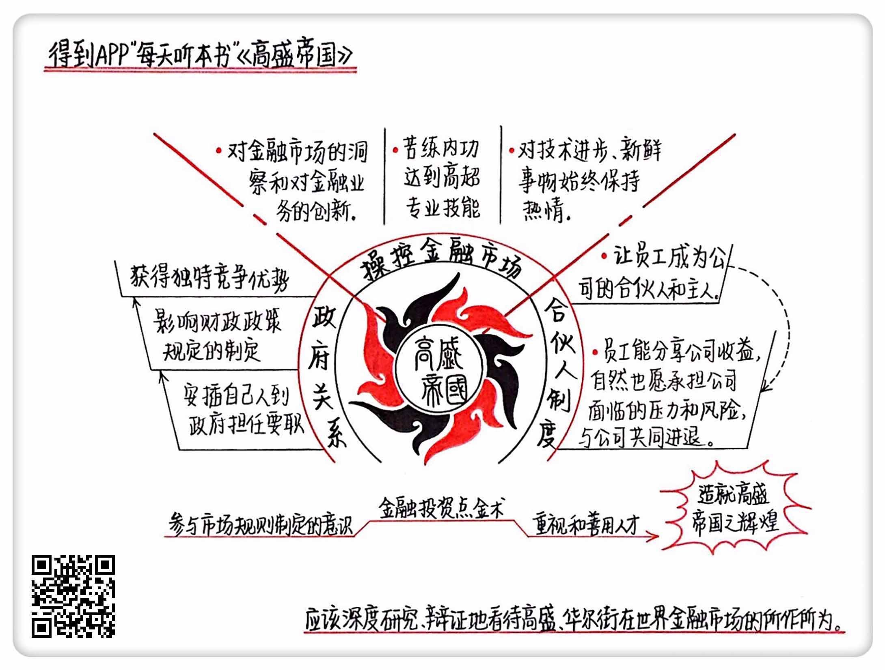

《高盛帝国》| 戈小羊解读
====================================

购买链接：[亚马逊](https://www.amazon.cn/高盛帝国-查尔斯•埃利斯/dp/B00ZCA495U/ref=sr_1_1?ie=UTF8&qid=1507945263&sr=8-1&keywords=高盛帝国)

听者笔记
------------------------------------

> 高盛之所以成功，先是依靠强大的政府关系，成为规则的制定者，从而改变所处的环境，为自己牟利。
>
> 其次是，专业知识扎实，能够操作非常复杂的大型交易。
>
> 最后是有良好的制度建设，消除了内耗，且提升了效率。
>
> 总结一下，就是想要获得商业上的成功，首先要搞清楚情况，有能力的最好能改变外部来迎合自己的需要，其次要自身水平过硬，最后就是要做好自我管理，对于组织就是要消除内耗提升效率，对于个人可能就是要提高专注力、执行力。

关于作者
------------------------------------

查尔斯·埃利斯，华尔街首屈一指的投资专家，出版过十余本著作，致力于让投资者了解股市的运作方式。他被美国媒体称为“华尔街最聪明的人”。     

关于本书
------------------------------------

《高盛帝国》这本书，就建立在埃利斯为高盛提供超过30年的战略咨询服务基础之上。作为一个华尔街的局内人，埃利斯有足够的优势近距离观察高盛，揭示它巨大成就背后的秘密。

核心内容
------------------------------------

高盛集团成功的三个秘诀：一、强大的政府关系；二、对金融市场的控制力；三、合伙人制度。
 

一、强大的政府关系
------------------------------------

高盛成为华尔街最顶级投行的一个秘诀：影响政府，进而掌控市场。通过不断地将自己人安插到政府部门担任要职，高盛不仅是参与资本市场竞争的运动员，更是成为了掌握游戏规则的裁判员，这种独特的竞争优势使得高盛不仅成为华尔街最会赚钱的投行，也是最有权势的公司。

关于高盛的政府关系，外界褒贬不一。但作者认为，其中有一点值得今天的企业家、职场人重视，那就是高盛参与市场规则制定的意识。人们习惯在现有规则的框架下工作、竞争，但没有意识到，也许这个规则不是最完善的，也许社会的进步导致规则已经过时了。如果你能参与新规则的制定和完善，也许就能把握未来的主动性。当然，这一切都要在法律的框架下进行。

【案例】

尝到了从政的甜头之后，高盛集团的传奇 CEO 温伯格，后来还跟包括艾森豪威尔在内的多位总统都保持着非常不错的交情，他也因此能够长期深入到政府最高决策层，在政府内阁成员的任免、行业政策规则的制定甚至是外交领域都可以向总统直接提建议。温伯格为高盛打下的深厚政治基础，被高盛的历任 CEO 延续下来。

二、对金融市场的控制力
------------------------------------

凭借对金融市场的洞察和对金融业务的创新，高盛在大公司的夹缝里找到了生存空间。苦练内功达到的高超专业技能，帮助高盛拿下其他同行无法完成的各种金融交易。对技术进步、新鲜事物始终保持热情，也是高盛一百多年来越来越有活力的重要原因。正是因为如此，高盛几乎在每个关键的历史时期都能把握住千载难逢的机会，更重要的是能够将机会转化为胜利。

【案例】

福特是当时世界上规模最大的私营企业，人人都知道，它一旦上市绝对会创下当时的最大规模股票发行记录，但是因为福特的高度私有化，它的财务状况不公开透明，而且涉及的家族继承人、原始股东等利益相关方也非常多，华尔街很多投行都知难而退。温伯格和他的高盛团队却没有放弃，呕心沥血工作了两年，前后起草了56种交易结构复杂的重组方案，才帮助福特公司成功上市。福特公司上市取得了前所未有的成功，高盛也由此名声大噪，为日后统治华尔街和金融市场打下了坚实基础。

三、合伙人制度
------------------------------------

这也是最容易被今天的企业管理层和公司借鉴学习的一点：让员工成为公司的合伙人，成为公司的主人。员工能够分享公司成长壮大的收益，自然愿意承担公司面临的压力和风险，与公司共进退。

上市之前，合伙人制度帮助高盛解决了公司资本积累的问题，高盛因此获得了长足发展；上市之后，高盛将合伙人制度与股份制公司相结合，有效地解决了上市公司所有权和治理权分离带来的种种问题，并且设置了很好的激励制度，保持了战斗力，这是高盛基业长青的重要原因。

【案例】

在高盛，合伙人要尽可能参与到员工的生活大事中，比如出席婚礼庆典等，而且还得早早到场，这样才能确保融入到下属的生活里，并且要展现自己的社交能力，能跟员工的亲戚朋友们打成一片才行。高盛合伙人出席员工家庭活动的次数比其他公司多得多，融洽的氛围很大程度上促进了团队的合作。

金句
------------------------------------

1. 让我晚上从梦中惊醒的，不是我们的传统竞争对手在做些什么，而是我们没有预见到那些可能利用高科技成长起来的巨大竞争对手。
2. 对于温伯格而言，帮助罗斯福获选正是一个与对手们对着干的机会，也是接近未来总统的最好机会，他当然不会轻易放过。
3. 一个公司最重要的三大财富是员工、资本和声誉。

撰稿：戈小羊

脑图：摩西

讲述：杰克糖 