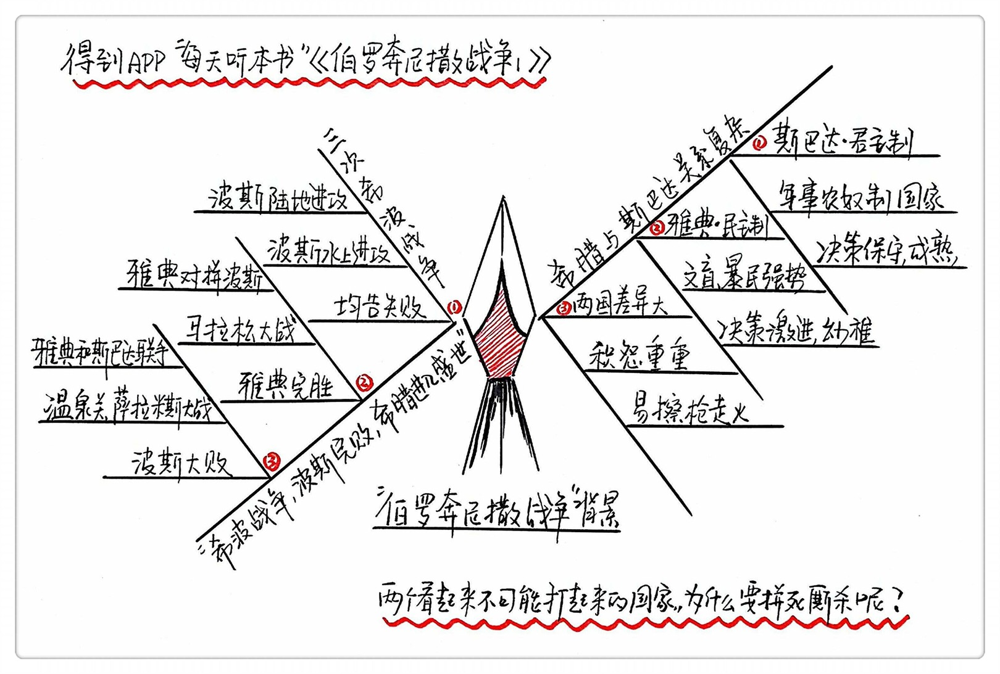

《伯罗奔尼撒战争1》| 张凯解读
============================

购买链接：[亚马逊](https://www.amazon.cn/图书/dp/B01DZWP6SK/ref=sr_1_1?ie=UTF8&qid=1506184090&sr=8-1&keywords=伯罗奔尼撒战争)

关于作者
----------------------------

唐纳德•卡根，是一位美国著名的历史学家，古希腊研究的权威学者，耶鲁大学古典学与历史学斯特林教席荣誉退休教授。

关于本书
----------------------------

伯罗奔尼撒战争被称为第一次古代世界大战，这场战争整整持续了30多年，所有的希腊国家几乎都被拖入了战火。彻底转变了希腊民主化的趋势，把希腊彻底推向了寡头垄断的方向，几乎摧毁了希腊国家的全部文明。

核心内容
----------------------------

第一部分，战争的历史背景；
第二部分，从一位雅典领导人的视角弄清楚这场仗是怎么打起来的；
第三部分，从一位将军的视角来看一场关键的战役。
 

第一部分  历史背景
----------------------------

公元前490年，波斯帝国的国力非常强大，进攻了希腊，打响了波希战争。波斯入侵希腊总的来说共有3次。

第一次兵分两路，陆军直接被希腊联军给团灭，水路遇到了飓风。第二次，在希腊各个国家进行威胁，在雅典和斯巴达受挫，2年后又派了10万大军直奔希腊，被雅典的区区一万人给打得片甲不留，这就是马拉松战役。第三次，30万大军入侵希腊，雅典和斯巴达联合共同抵抗侵略，斯巴达300勇士和其他国家的兵力共7000多人，死守温泉关，最后因为出现了叛徒被围剿。但最后波斯人发现雅典已经是空城，另一路水军被打得落荒而逃，不但没占到便宜还吃了大亏，希波战争至此以波斯人的完败告终。波斯人元气大伤，雅典开始了全面繁荣。

斯巴达和希腊的特点：

斯巴达是君主制，是一个军事化管理的农奴制国家，粗活都由奴隶负责，斯巴达人负责军事训练，奴隶经常起义但都被打压下去，就好比囚犯和狱警。但斯巴达人不愿意参与战争，一方面他们自己内部的矛盾很激烈，士兵只要出去了就有可能会有奴隶起义。另一方面是他们的贫富差距特别小，财富、文化不能把人给区分开。一个人的威望来源往往是年龄，长老会的成员基本上都是60岁以上的老头子，这就让这个国家的决策很保守。

雅典是民主制国家，雅典人每周都要开几次万人大会，一起出主意，但是参与的人大多数都是文盲，领导者需要通过煽动情绪，迎合大多数人价值观的手段来获得支持。辩论真实的应用场景其实很小，它更多的是给人们提供一种思考角度，辩论比的就是口才、风度、个人魅力，所以个人魅力在民主这种体制面前其实起到了关键性的作用，这其实会埋没掉很多真正有价值的声音。

【案例】

两个人在一个万人广场上辩论，其中一方不支持战争，他分条列出不能开战的原因，对方用“你就是怂”这句话来煽动大家的情绪，在这样的局面下，那些文盲、暴民，喊声最大、情绪最激动的人往往就天然占便宜。

斯巴达表面上看起来好战、斗狠，但是他们整个国家做出的决策往往很保守，成熟。而雅典表面上看到处都是贤者，都是文化人艺术家，但是整个国家做出的决定往往就像孩子一样激进、幼稚。

总结：
----------------------------

这一集的内容，我们说了波希战争的整个过程，说了雅典和斯巴达这两个国家的性格特征，还说了民主制在制定具体决策时的弊端，理解了这些背景之后，我们再看下面发生的事情，你就不难理解当时的人是怎么思考，怎么做决策的了。

启示：

对我们现代人来说，不管是个人、公司还是国家，建立危机意识都是必要的事，和平在历史的长河中真的是很少见的。我们还能从这本书中看到，民主这种现代人觉得千好万好的制度，在刚刚出现时是扮演着多么丑恶的角色，任何的好东西都不是一开始就那么完美的。总之在这场战役中，不同的人都能学到不同的东西，只要你稍微复原一下当时的情景，这场战争给我们带来的启发是超出想象的。

金句：

1. 随着暴力冲突的扩散，作为文明生活基础的习惯、体制、信仰和约束都土崩瓦解。人们变得凶残好斗，词语的含义也相应发生了变化：鲁莽的蛮勇现在被认为是忠诚盟友的勇敢；审慎的犹豫被当作似是而非的怯懦；克制被看作缺乏男性气概。宗教丧失了约束人的力量，但用冠冕堂皇的花言巧语来达成罪恶目标的做法，却得到颂扬。
2. 斯巴达人：用无损于斯巴达荣耀的方式，投票支持战争吧！不要让雅典人发展得更强大，不要背叛你们的盟友！让我们在诸神佑助下，出征讨伐那些伤害我们的人！
3. 历史中经常会发生这样的事：一个联盟的领袖被势力较小的盟邦牵制，不得不去采纳自己原本不会采纳的政策。

撰稿：张凯

讲述：孙潇

脑图：摩西