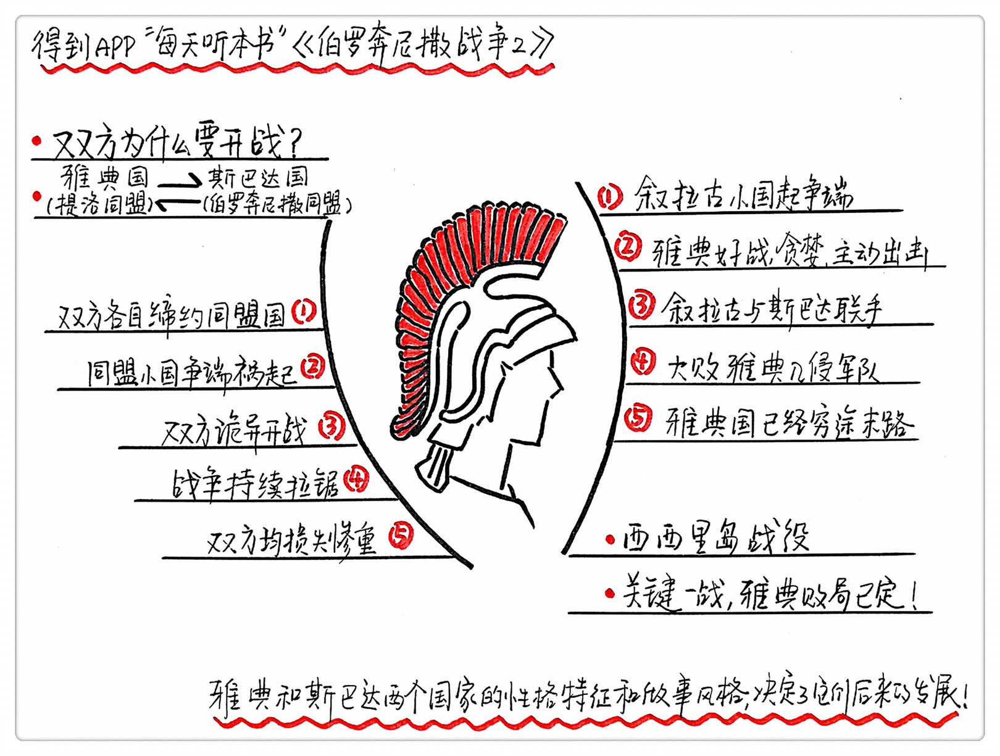

《伯罗奔尼撒战争2》| 张凯解读
============================

购买链接：[亚马逊](https://www.amazon.cn/图书/dp/B01DZWP6SK/ref=sr_1_1?ie=UTF8&qid=1506184090&sr=8-1&keywords=伯罗奔尼撒战争)

关于作者
----------------------------

唐纳德•卡根，是一位美国著名的历史学家，古希腊研究的权威学者，耶鲁大学古典学与历史学斯特林教席荣誉退休教授。

关于本书
----------------------------

伯罗奔尼撒战争被称为第一次古代世界大战，这场战争整整持续了30多年，所有的希腊国家几乎都被拖入了战火。彻底转变了希腊民主化的趋势，把希腊彻底推向了寡头垄断的方向，几乎摧毁了希腊国家的全部文明。

上集回顾：
----------------------------

雅典和斯巴达这两个国家的性格特征，雅典看起来民主，实际上他们做出的决策往往像小孩子一样激进，斯巴达看起来很暴力，但是他们却往往很保守。

核心内容：
----------------------------

聚焦两个时间点来看这场战争，第一个是战争爆发前的那一刻，雅典和斯巴达到底遇到了什么不可抗力必须要打这么一架；第二个是我们聚焦到一场最关键的战役，西西里岛战役。
 

第一点，当时的斯巴达和雅典的背景。
----------------------------

当时人对未来的恐惧，是发动大多数战争的主要原因。

当时雅典的最高领导人伯里克利，是古希腊历史上最出色的政治家之一，他把雅典周围的小国都聚集起来，形成了提洛联盟；斯巴达的首领阿希达穆斯二世，是一位很有远见、很成熟、行为风格比较克制的人，他在伯罗奔尼撒岛上也有联盟，就叫伯罗奔尼撒同盟。

使者求见伯里克利，请求雅典援助克基拉，击退来侵略的伯罗奔尼撒联盟。伯里克利害怕斯巴达赢得战争后力量壮大，派了10艘船威慑入侵者，在政策上对帮助对面国家发动侵略的一个小国家进行了海上禁运。入侵者找到阿希达穆斯二世求助，强调如果雅典获得胜利后力量将会壮大。

斯巴达与雅典的谈判，要求解除对克基拉的海上禁运，但是谈判失败。

伯罗奔尼撒战争就在诡异的局面下开启了,因为开始时入侵的一方本意上不愿意入侵，防守的一方却又是挑起事端的人，双方共同动机又都是出于自卫，都是出于对未来的恐惧做出的一系列攻击性的动作。

当时的雅典国力确实非常的强，并且使用雅典纯防守，不和斯巴达人正面交战的战略，打一场消耗战。但雅典爆发了一场瘟疫，夺走了雅典城3分之一的人口，伯里克利也死在了这场瘟疫中。最后让雅典彻底被攻陷，人民死掉了一大半，提洛同盟就此解散。斯巴达人同样损失惨重。

第二点，一场关于雅典命运扭转的战役，西西里岛战役。
----------------------------

这场战役让雅典从互相消耗的局势下彻底走向了失败，而且这场战役的过程更是传奇和曲折。

公元前415年，距离斯达巴人第一次入侵雅典已经过去了20年了，雅典这时的国力也被消耗的差不多了。西西里岛上有2个小国家打了起来，其中一个来找雅典求助攻打叙拉古，利用当事人对未来的恐惧说服雅典投入战争。

这时候的雅典已经是一个极具侵略性的国家，开始主动侵略叙拉古。当时有两位将军，一个好战，一个反战。反战派摆事实、讲道理，好战派依然用“你就是怂”这句话来煽动大家的情绪。雅典舰队来到西西里岛，叙拉古人和斯巴达人联手，雅典人全军覆没。这是扭转了伯罗奔尼撒战争最关键的一场战役。雅典人摇摇晃晃地又坚持了10年，最后才被斯巴达攻陷，被迫拆除城墙，解除联盟，雅典就再也没有恢复过来。伯罗奔尼撒战争最后以斯巴达人的胜利告终。

总结：
----------------------------

这本书给我们清晰地讲述了伯罗奔尼撒战争的来龙去脉，让我们可以清晰地看这段历史，我们说了斯巴达人和雅典人的生活习惯和性格特征，分析了民主制的弊端，讲了战争的前一刻伯里克利和阿希达穆斯二世的所思所想，还讲了雅典人远征西西里岛的情况，从这些历史战争中我们能体会到一个活生生的雅典和斯巴达，从他们的经历中我们能吸取到无数的经验教训。

启示：
----------------------------

1. 民主的成熟还要靠时间来滋养。我们在一个集体中的时候要注意不被周围人的意愿所绑架，不能丢掉独立思考的能力。
2. 我们在做决定时，不要被脑海中的既有经验和恐惧绑定，根据事实做决定才是聪明人的做法。被恐惧抓住心智的人往往是最危险的。
3. 战争从历史的视角来看太频繁了，一座城市说没就没，一个国家说倒就倒，一切坏事都有可能发生，我们应该更加珍惜现在的和平。

金句：
----------------------------

1. 尼基阿斯和亚西比德都不渴求财富，他们也都不愿意将政权交给群众。他们都野心勃勃地想成为雅典的领导人，却都缺乏客蒙或伯里克利所具备的极高政治才华。雅典的不幸在于，尽管两人都希望成为奥林匹亚大神一般的伯里克利，但他们能做的仅仅是干扰对方的计划而已。
2. 即使在敌人得到波斯帝国的支持之后，雅典人仍然掌握制海权，并迫使斯巴达人又一次求和。复苏的民主政权从“五千人”赢得的胜利中获益不少，解决了城邦的实际问题，并使民众的忠诚和能量发挥了作用，而正是这种忠诚和能量使雅典人如此伟大。
3. 雅典虽然暂时失败了，但它的真正力量和潜能超过它的表象，假以时日注定会重新崛起。雅典人在获得自由之后立刻开始计划恢复帝国基业、权力和荣耀，并反抗斯巴达对希腊各城邦的主宰。

撰稿：张凯

脑图：摩西

讲述：孙潇