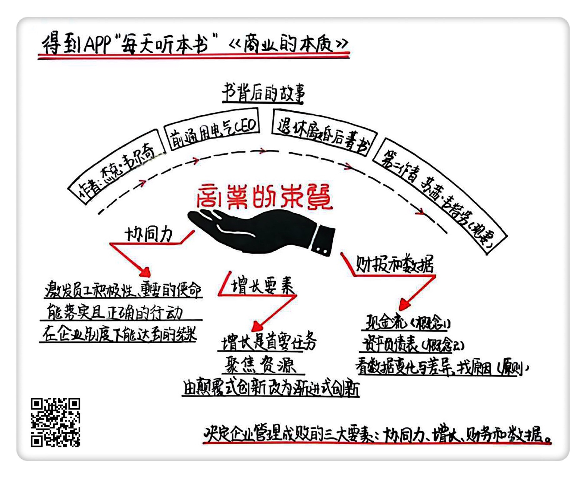

《商业的本质》| 王其解读
======================================

购买链接：[亚马逊](https://www.amazon.cn/商业的本质-杰克·韦尔奇/dp/B01COZU1M0/ref=sr_1_1?ie=UTF8&qid=1508238225&sr=8-1&keywords=商业的本质)

听者笔记
--------------------------------------

> 作者指出企业所追求的协同力，就是要有一个共同的使命（目标），知道通过什么样的行动，达成正确的结果。
>
> 企业管理者要学会集中资源，而不是将有限的资源分散到无限的事情中去，这样更容易出成果。同时要鼓励渐进式创新，而不是跳跃式创新，渐进式创新是可以全员动员的，但是跳跃式创新通常会给人造成很大的心理压力，而且也很难成功。
>
> 学会看财报和核心数据，抓住企业运行的重点数据，而且看数据的时候更多是看差异，而不是绝对值。

关于作者
--------------------------------------

杰克·韦尔奇，1960年加入通用电气公司，1981年至2001年担任该公司的董事长兼首席执行官，是通用电气历史上最年轻的董事长。他在任期间，通用电气的市值从130亿美元增长到4800亿美元。杰克·韦尔奇被誉为“全球第一CEO”“美国当代最成功、最伟大的企业家”。2010年，他创办杰克·韦尔奇管理学院，这一在线MBA项目获得了广泛赞誉。 

关于本书
--------------------------------------

本书由杰克·韦尔奇及其妻子苏茜·韦尔奇共同撰写。杰克·韦尔奇用了10年时间，为世界各大公司CEO提供管理咨询，此后在互联网飞速发展的背景下，重新梳理了自己对企业管理方法论的思考。对于企业如何在当今的经济环境下继续保持增长、企业管理者如何将公司使命顺利传达给员工并使其达到目标、如何遵从商业规则并找到企业增长的突破口等问题，都结合大量案例进行了深入解释。 

核心内容
--------------------------------------

本书的核心观点是：首先，在管理中只有领导力是不够的，要发挥企业的协同力，必须将使命、行动和结果协同起来，才能让公司从上到下发挥巨大的作用。其次，企业的本质是增长，要达成这个目标，需要领导者集中资源，并且刷新自己的创新定义。最后，针对很多管理者非常头痛的财务问题，作者认为你只需要关心现金流和资产负债表，搞清楚企业的核心数据，就可以了。 
 

一、什么是协同力
--------------------------------------

很多人都非常疑惑，协同力到底要协同什么。作者给出了非常明确的答案，企业需要协同的是三件事情：使命、行动和结果。

使命是什么？使命与价值观不同，它代表了一家公司要去往的终点。任何一家公司都不可能解决人类所有的问题，只要把一个小痛点钻研得足够深入，它就很有可能成为一个商业上成功的公司。典型的例子是Uber和滴滴，他们通过新的商业模式，把出行这件事给变容易了，现在这两家公司的估值都很惊人。

使命是目标，是去往的方向，但还得有交通工具让员工知道怎么过去。这个时候行动就发挥了它的作用。行动是你要告诉员工在公司的使命之下，他应该怎么理解这个目标，怎么思考，什么样的做事方式是保证自己不用太绕弯路的。

然后怎么让使命和行动都落实下去呢？得有结果。

结果存在的意义是：管理者通过结果来定义什么样的行为是正确的，是能够抵达使命的。一个最极端的例子是解雇员工，如果管理者发现一个员工的所作所为明确违背了公司的使命，也不符合公司的行为模式，果断解雇员工或许是更理想的选择，不然双方持续在一个不能互相认同的关系当中，都会非常痛苦。

二、只有集中资源，才能保证企业的增长
--------------------------------------

增长的重要性不用多说，企业只有实现了增长，才能保证自己长远地生存下去。无论是老板还是员工，才会有职业安全感和成就感。

如何才能实现增长？杰克·韦尔奇认为，管理者必须学会集中资源。一家公司无论规模多大，它的资源都是有限的。即使有1000万美元预算，也不能满足公司各个部门的扩张计划。但一个要点是，不管你手上的资金是充裕还是不充裕，都不应该将它分散在不同的项目里。

三、鼓励员工进行渐进式创新
--------------------------------------

资源有限还会引发另一个问题，那就是即使资源集中也无法满足需求，这时候该怎么办？这个时候，管理者应当鼓励员工通过创新的方式去解决问题。

但是，创新有一个前提，就是作为管理者，你必须刷新对创新的定义。对于一家公司来说，你并不需要像在马车社会发明汽车这样改变人类社会进程的创新，对你而言更重要的是让每个员工都觉得自己有创新的能力。所以，这个时候要打消大家对创新的恐惧，在公司里创造氛围，不要让员工觉得这是一件很难的事，要让他们认为创新是一件平常的、努力一下就能做到的事情。

作者认为，在商业领域，最好将创新定义为渐进式改进。这是每一个人都可以做到，并可以循序渐进、持续不断去做的事情。如果一直提倡颠覆式创新的话，大多数人会认为创新太难了，虽然我挺聪明的，但还没有乔布斯那么聪明，所以创新跟我没有关系。

在企业中，渐进式创新随处可见。比如一张工资表，可能别人花8天时间才能完成，但一个新来的HR找到了新的工作方法，只花了6天就把表做好了。再比如在一项新技术的帮助下，一个销售员每天可以拜访4名客户，而不是原来的3名，这些都属于渐进式创新。特别重要的是，公司的领导者一定要对这样的进步做出明确的鼓励。不管是发奖金，还是请大家吃个蛋糕，或者送两张演出门票，要让周围所有的人都感受到，原来这样的创新也是可以被嘉奖的。这样一来，就会渐渐形成一个良好的创新氛围。

四、如何看财报与核心数据
--------------------------------------

作者认为，只要你的目标不是去当企业的首席财务官，了解下面的两个概念和一个原则就足够了：两个概念——现金流和资产负债表；一个原则——不要只看具体的数据，要看差异。

现金流的意思很简单，顾名思义，就是这家公司进账多少钱、出账多少钱以及还存着多少钱。所有的公司都通过三种方法去追踪现金流，一个是经营活动现金流，比如，如果你开着一家以卖牙刷为主要业务的公司，经营活动现金流就是你卖出去牙刷的收入；另一个是投资活动现金流，如果你这家牙刷公司生意不错，有些闲钱，然后去投资了两家牙膏公司，那你买卖这两家公司的股票所得的收益和损失，也会在这张表里；还有一个是融资活动现金流，如果你的牙刷生意做得很好，这会儿有新的基金想要入股，银行也想给你贷款，那么它们给你带去的现金和到期你需要归还的现金，也属于现金流的范畴。

资产负债表是什么呢？它总结了一个公司的资产、债务和它股东手里的股权情况。还拿你的牙刷公司举例，你的资产可能会包含你的现金、应收的账款、厂房、原材料、公司大楼和各种固定资产，无形资产也要算在里面，比如你是一家全国知名的品牌，那么这个品牌、商标也会被算在里面。负债是什么呢？你可能为了扩大生产线，找银行借了一笔钱，你要还钱和利息，这就是所谓的负债；最后是股权，就是你有5个投资者，他们都是谁，在你的公司里投了多少钱，分别占多少股。

了解了这两个概念之后，还有一个重要的原则：看差异。

数据不仅是用来做计算的，更是用来做比较的。差异可以是财报上的实质性变化，比如现金流的变化，或者负债的变化；也可以是预期结果与实际结果的差别，比如你这个季度之初打算花200万的营销费用，最后只花出去50万，这个差异和它背后的原因，才是企业管理人员需要关心的问题。

所以，不懂财务并没有关系，了解了上述关于现金流和资产负债表的基本知识，搞清楚公司的核心数据是什么，并且通过差异去分析、假设和挖掘事情的真相，你就可以搞清楚这家企业的经营状况到底好不好；作为管理者，你到底需要改进哪些地方。

金句
--------------------------------------

1. 使命和价值观不同，它代表了一家公司要去往的终点。只要把一个小痛点钻研得足够深入，它就很有可能成为一个商业上成功的公司。
2. 在企业管理中，结果不是数据，数据只是表达结果的手段。
3. 一家公司无论规模多大，它的资源都是有限的。即使有1000万美元预算，也不能满足公司各个部门的扩张计划。但一个要点是，不管你手上的资金是充裕还是不充裕，都不应该将它分散在不同的项目里。
4. 作为管理者，你必须刷新对创新的定义，打消大家对创新的恐惧，在公司里创造氛围，不要让员工觉得这是一件很难的事，要让他们认为创新是一件平常的、努力一下就能做到的事情。
5. 只要你的目标不是去当企业的首席财务官，了解下面的两个概念和一个原则就足够了：两个概念——现金流和资产负债表；一个原则——不要只看具体的数据，要看差异。

撰稿：王其

脑图：摩西

转述：郑磊