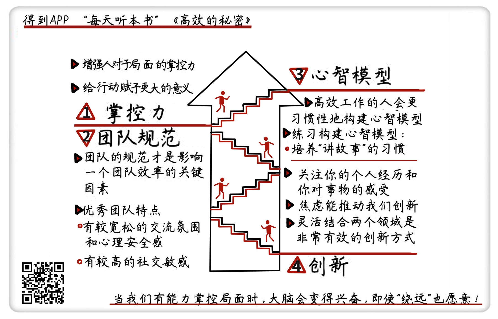

《高效的秘密》| 冰柠解读
==================================

购买链接：[亚马逊](https://www.amazon.cn/高效的秘密-查尔斯-都希格/dp/B06Y416X21/ref=tmm_pap_swatch_0?_encoding=UTF8&qid=1507814924&sr=8-2)

听者笔记
----------------------------------

> 下面的四个词有助于高效：
>
> 掌控力：当人对某件事物拥有掌控力之后，他可能会更高效的完成它。
>
> 团队规范：有了团队规范之后，团队成员之间能够参与其中并建立彼此信任，获得安全感，从而提高效率。
>
> 心智模型：能够提前在大脑中模拟一些未知的场景，当类似的场景出现的时候有助于提高效率。
>
> 创新：掌握更多的知识，有助于我们在不同的知识之间组合、关联，形成创新。

关于作者
----------------------------------

查尔斯·都希格，《纽约时报》商业调查记者，曾荣获号称“新闻界诺贝尔奖”的普利策奖。他具有耶鲁大学历史系学士和哈佛商学院企业管理硕士的教育背景。都希格的上一本畅销书《习惯的力量》，是2003年最热门的商业类书籍。 

关于本书
----------------------------------

本书选取了美国各领域高效人士和公司的大量案例，总结出高效的八大秘诀：激发动力、团队合作、保持专注、设定目标、发挥掌控力、更好地做出决定、推动创新、获取并应用数据。虽然这些秘诀基本上是人们熟知的要素，但作者查尔斯·都希格却从独特的视角给出了新颖的分析。更重要的是，作者认为是否高效更多取决于你做选择和处理信息的思维模式，构建高效的思维模式，才是高效人士真正的杀手锏。此书受到了《彭博商业周刊》《经济学人》《华尔街日报》等媒体的大力推荐。 

核心内容
----------------------------------

本期音频为你分享了实现高效的四个关键词。第一个关键词：掌控力。增强对于局面的掌控感，给行动赋予更大的意义，可以有效提高效率。第二个关键词：团队规范。好的团队规范让每一位成员都有发言的机会，员工的心理安全感会极大地提升他们的效率。第三个关键词：心智模型。构建有力的心智模型能让我们的注意力快速抓住重点，工作更有成效。第四个关键词：创新。具有创造力的人，其实是“知识的中介”，他们善于把一个领域的概念应用到另一个领域，用创新来不断提升效率。 
 

一、掌控力
----------------------------------

在缺乏动力的情况下要想提高效率，一般有两种方式：一是增强人对于局面的掌控力，二是给行动赋予更大的意义。

养老院里那些容光焕发的老人，能对养老院里严格的时间表、固定的食谱等死板的规定做出反抗。这其实证明了这些老人内心强大的力量，他们依然强烈希望，也能够掌控自己的生活。

我们用做选择的方式证明自己能够掌控局面，动力也就自然而然地产生了。海军陆战队的新兵在进行体能训练时，因为强度太大，很多人都想选择中途放弃。这个时候，教官会要求他们彼此问一下：你为什么来这儿？回答了这个问题的士兵基本都能坚持下来。如果把一项艰巨的任务和你在意的目标联系起来，任务会转化成有意义的决定，动力也会被激发出来。

作为一家企业，要想提高效率，激发员工的掌控力就意味着把决策权交给能直接解决问题的人。美国联邦调查局改造内部系统时，取消了繁琐的程序后，程序员和特工被赋予了更多控制权，他们投入巨大的热情研究新功能，最终开发出了功能强大的内部系统。

二、团队规范
----------------------------------

团队规范是指一个团队遵照的传统、行为标准和不成文的规定，它是影响一个团队效率的关键因素。

所有优秀团队都具备两种特点：

第一，每个成员都有发言的机会，团队成员可以把自己脆弱的一面暴露在别人面前，人们可以自由地提出建议，不用担心受到惩罚，这些规范给团队成员带来了归属感和心理安全。只要每个人都有发言的机会，这个团队就能合作得很好，但是，如果只有一个人或者几个人有机会发言，这个团队的群体智商就会下降。

第二，优秀团队的成员都有比较高的社交敏感，每个成员都真正在乎别人的感受。大部分人擅长通过其他成员说话的语气、面部表情等来判断对方的真实想法，主动揣摩别人的感受，并且主动去接受和适应。

三、心智模型
----------------------------------

“构建心智模型”能提高我们的注意力的效率。高效人士构建的心智模型非常具体，对于设想的谈话和要做的事，他们能够想象出更多的细节，从而更好地决定应该关注什么或者忽略什么。他们对未来有自己的设想，一旦生活和他们的预测发生冲突，他们的注意力就会快速聚焦在真正重要的事情上。一般人的注意力被调动起来的时候，会出现只关注眼前的事物，无法很好地掌控注意力的现象。

心智模型之所以能够帮助我们，是因为它能帮助我们快速确定关注的对象，让我们能够主动做出决定，而不是面对突发情况手忙脚乱的被动反应。要想练习构建心智模型，培养“讲故事”的习惯就是一个很好的方法。

四、创新
----------------------------------

极具创造力的人其实是“知识的中介”，他们善于把一个领域的概念应用在另一个领域，用创新来提升效率。

乔布斯曾经说过，“如果你问那些有创造性的人是怎么做到的，他们会感到惭愧，因为他们实际上并没有做很多事情，只是看了很多东西，然后跟自己的经历结合起来，形成了新的东西。他们之所以能这么做，是因为他们比其他人有更丰富的经历，或者能更深入地思考自己的经历。”其实我们每个人都有创造性，但有时候需要有一种压力来推动我们去激发它。

金句
----------------------------------

1. 是否高效更重要的是取决于你做出选择和处理信息的思维模式，因此构建高效的思维模式才是高效人士真正的杀手锏。
2. 把决策权下放给员工带来的好处比起可能的损失要大得多，如果员工们连犯错的机会都没有，会是企业最大的损失。
3. 让每一个人在团队中可以自由表达观点，拥有心理安全，虽然会暂时浪费一些时间，但从长远来看，心理安全会带来更高的团队效率。
4. 高效人士构建的心智模型非常具体，对于设想的谈话和要做的事，他们能够想象出更多的细节，从而更好地决定应该关注什么或者忽略什么。

撰稿：冰柠

脑图：摩西

讲述：孙潇