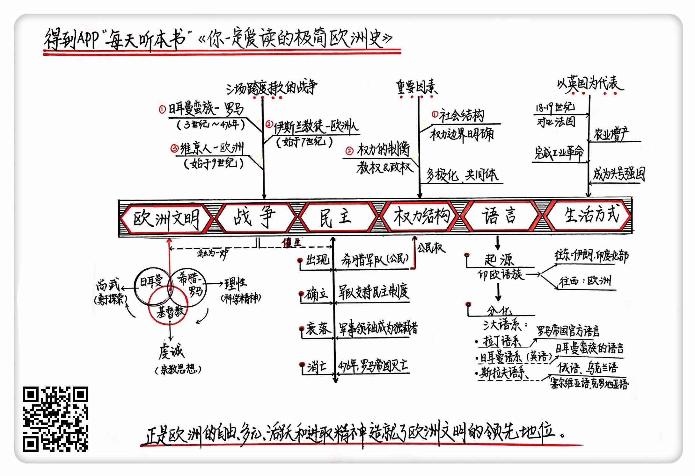

《你一定爱读的极简欧洲史》| 曲飞工作室解读
================================

购买链接：[亚马逊](https://www.amazon.cn/你一定爱读的极简欧洲史-约翰-赫斯特/dp/B008FV39WW/ref=tmm_pap_swatch_0?_encoding=UTF8&qid=1509111571&sr=8-1)

听者笔记
--------------------------------

> 欧洲文明的三大源头是：古希腊-罗马、基督教、日耳曼传统。
>
> 战争使得三种文明彼此交融。
>
> 民主制度在欧洲的演化史：少数服从多数的民主，到军阀统治下散失了民主，到后现代代议制民主的回归。
>
> 欧洲的各个社会阶层、基督教等力量彼此制约，使得没有一家独大的现象。
>
> 欧洲的语系：拉丁语系、日耳曼语系、斯拉夫语系。
>
> 作者从工业化和城市化两个方面来讲述了欧洲生活变化历史。

关于作者
--------------------------------

本书的作者，约翰·赫斯特，是澳大利亚的历史学家，专攻欧洲史。同时他还是一位历史教授，任教于墨尔本大学，另外还担任澳大利亚联邦公民教育委员会主席。可以说，他不单是一位书斋型的知识分子，更是致力于对历史的推广普及。

关于本书
--------------------------------

这是一本已经在全球范围内火了六七年的书，2011年简体中文版推出以来，很多名人大腕，从学界的北大博导钱理群，到商界的知名企业家任志强，都推荐过本书。本书是作者面向澳大利亚大学生，写的一本普及读本，作者介绍了他眼中欧洲文明的六个基本特征，分别是欧洲文明的来源、战争对欧洲的影响、欧洲的民主、多极化的权力结构、欧洲人的语言和独特的生活方式。作者讲解了这些都是怎么来的，也就是说本书用最经济最简洁的方式，在有限的篇幅里把欧洲的历史，以上述的六个视角讲了六遍。     

核心内容
--------------------------------

本书从六个方面梳理了欧洲历史的发展历程，为我们讲解了欧洲文明的三大源头，战争对欧洲的影响，欧洲的民主、社会结构和权力结构、语言、生活方式，这些都是怎么来的，又是怎么发展的，最后，又探讨了欧洲文明为什么能取得对其他文明的领先地位。作者认为，在欧洲“不是所有的东西都是国王的”，正是这种社会结构和权力结构，带给欧洲自由、多元、活跃，还有进取精神，这是欧洲能获得优势地位的基础。     
 

一、欧洲文明的三大源头
--------------------------------

1. 古希腊-罗马。带来的影响：理性、逻辑、崇尚科学。
2. 基督教。带来的影响：虔诚、自律、自省意识、勇于探索外部世界。
3. 日耳曼传统。带来的影响：尚武、勇敢、重视荣誉。

通过彼此融合，这三大文明源头共同构成了欧洲文明。

二、战争对欧洲的影响
--------------------------------

1. 日耳曼蛮族与罗马帝国的战争，从公元3世纪到476年西罗马帝国灭亡，在西欧，前面说的三大文明源头，通过战争，彼此交融，从此融为一炉。
2. 欧洲人与穆斯林民族的战争，从公元7世纪到1453年，在中东、北非和西班牙，穆斯林民族夺取了罗马帝国的行省叙利亚、埃及，这些地方成为了伊斯兰世界，而西班牙在15世纪被基督徒收复。在上述地区，作为征服者的穆斯林摧毁了基督教的教会组织，但是保存并翻译了大量希腊罗马时代的学术典籍，这为将来的文艺复兴保留了火种。
3. 来自北欧的维京人的入侵，维京人的后裔诺曼人征服了英格兰，但从文化上，他们被纳入了基督教世界。

三、民主制度
--------------------------------

民主就是每个人都有表达自己诉求的权利，少数服从多数。作为一种理念，民主起源于古希腊城邦的公民广场，而作为一种具有可操作性的制度，民主起源于由公民构成的古希腊军队。

在罗马时代，以公民军队为基础的民主制度进一步发展，但形成了民主权利大小与财产挂钩的局面，后来随着日耳曼雇佣军的加入，军事独裁程度加强，民主制度衰落，直至西罗马帝国灭亡。不过民主传统的遗风，让欧洲可以在近代以后重新适应代议制为主的现代民主。

四、社会结构与权力结构
--------------------------------

1. 欧洲各个社会阶层之间都有比较明确的权力边界，国王和贵族都不能无限地支配自己的臣民，一旦一方试图打破边界，就会引起反弹。
2. 基督教作为欧洲权力的一级，始终制约着世俗政权。这些都使得欧洲权力格局中不会出现一家独大。

五、欧洲的语言
--------------------------------

欧洲的语言从大的分类上属于印欧语族，下面又分为三大语系，分别是：

1. 拉丁语系，南欧，包括意大利语、西班牙语、法语等。
2. 日耳曼语系，西欧和北欧，包括英语、德语等。
3. 斯拉夫语系，东欧，包括俄语、塞尔维亚语等。

六、欧洲的生活
--------------------------------

作者总结了两条线索，分别是：工业化，城市化。最先实现工业化和城市化的是英国，因为他们的技术革新精神，而基础更好的法国由于过于保守，而失去先机。     

金句
--------------------------------

1. 欧洲文明的三大源头：希腊-罗马、基督教、日耳曼。它们带给欧洲的影响分别是：理性、虔诚、爱打仗。
2. 在一些很专业、技术性很强的问题上，要是也简单依据民主的多数原则，那很可能是一些情绪化的、短视的，甚至没有可操作性的外行意见占上风，这样肯定会坏事儿。
3. 各个社会阶级之间的权力边界，教权与政权的彼此制衡，造就了欧洲这种多极化的社会结构与权力结构。各方之间，一旦谁试图打破平衡，就会引起其他方面的反弹。
4. 罗马教廷把拉丁文版的《圣经》作为最高权威，而耶稣是个犹太人，没学过拉丁文，所以，假如耶稣来到中世纪的罗马教廷，他是看不懂《圣经》的。
5. 欧洲的自由、多元、活跃，还有进取精神，这是欧洲能获得优势地位的基础。

撰稿：曲飞

脑图：摩西

转述：于浩