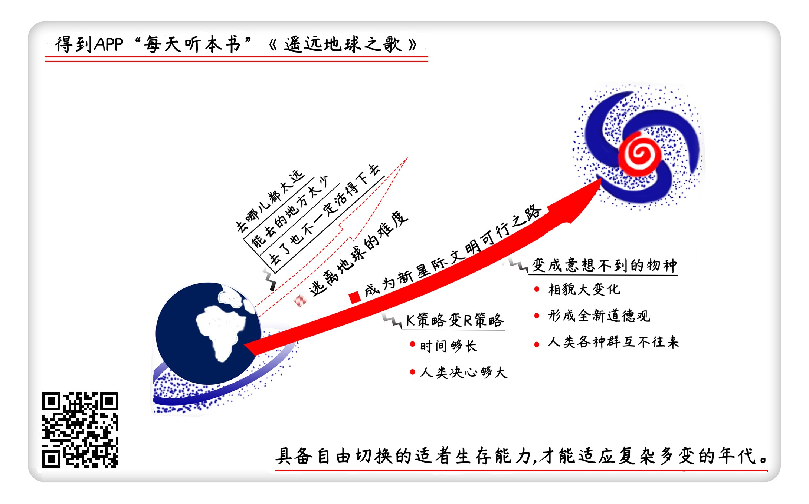

《遥远地球之歌》| 怀沙解读
=============================

购买链接：[京东](https://e.jd.com/30227837.html)

听者笔记
-----------------------------

> K 策略变 R 策略 是一种和风险投资类似的策略。
>
> 人类文明到了不同的星球之后会变成不同的文明。

关于作者
-----------------------------

亚瑟·克拉克，世界现代科幻三巨头之一，硬科幻的代表作家，获过三个雨果奖和三个星云奖，是20世纪用科幻预言未来最成功的小说家。  
   
关于本书
-----------------------------

《遥远地球之歌》是克拉克“地球末日三部曲”的最后一部，在这本书里，他讲述了人类在地球爆炸之后，继续在宇宙里谋生活的故事。据说这是克拉克自己最喜爱的一个故事，人类在宇宙里到处播种，用冷冻胚胎把基因留存下来，人类的后裔被载往任何一个适合生存的星球，人类在整个宇宙里遍地开花，变成了一个真正的跨星际的种族。   
  
核心内容
-----------------------------

本书的思想核心是：太阳将在1600年后变成一颗超新星，人类通过分批次的“播种计划”，开始了长达几千年的宇宙殖民之路。在地球毁灭后，载着最后一批地球人的飞船飞出了太阳系，要在宇宙中流浪500年。中途他们到萨拉萨星补给水源，遇到了700年前已经在这颗星球生根发芽的地球人，萨拉萨人是冷冻胚胎培养出的人类。这本书讲的就是这两拨已经在文明上发生分野的人类的故事——他们的交往非常友好，但他们的分离是永远的诀别。     
 

一、撤离地球的难度
-----------------------------

如果用引力边界来定义太阳系大小的话，太阳系周围太空旷；如果以今天的人类的观测水平计算，目前宇宙中能观测到的行星只有1000多颗；如果拿能否具备生命条件为标准，暗淡的行星数据观测难度太大。所以，21世纪的人类如果要撤离地球，将会面临“去哪都很远”“能去的地方很少”“去了也不一定活得下去”这三个问题。但离地球的毁灭只剩1600年的时间，人类必须想出靠谱、可执行的对策。

二、K 策略变 R 策略
-----------------------------

对于星际移民，本书给出的解决方案是“K策略变R策略”。“K-R策略”是罗伯特·麦克阿瑟在1970年提出的一个生态学概念。K变R，也就是讲人类从一个靠个体的高质量和长寿命来维持种群的物种，变成一个靠后代的数量来维持种群的物种。所以人类在得知太阳将变为超新星之后，制定了通过宇宙飞船，分批次将冷冻胚胎送到宇宙中的地球撤离计划。

三、新人类小传
-----------------------------

星际移民后的人类，会在不同的星球环境下演变成差异巨大的生物。首先是人类的相貌会根据生存的需要发生大变化、大分叉，有的可能会越来越像海豚，有的没准会越来越像蝙蝠；其次是新星球上的胚胎没有传统观念的束缚，星际人类会形成全新的道德观；最终，R策略下的人类分布在宇宙的各个角落，离得实在太远，不同星球间可能会老死不相往来。最后一批在地球上出生的人类在飞往移民星球的途中，降落到萨拉萨星补给水源，萨拉萨人作为早期胚胎移民的一支，已经在这里发展出了独特的相貌和文明，地球人跟萨拉萨人友好相处一年后，继续上路前行。

四、感慨
-----------------------------

在小说的笔下，克拉克为人类开出了一个“从K策略物种变R策略物种”的宇宙生存药方，这意味着如果人类走上星际殖民的道路，未来我们会变成形态差别巨大、道德差别巨大、并且老死不相往来的不同物种。到时每个星球上的人类后裔仰望星空，会知道满天闪烁的星星里，有很多自己的同类，但大家相貌不同、文化不同，并且相互隔绝。唯一相同的是，他们会知道，有一颗蓝色的星球，是一个遥远的传说，是一个永远也回不去的故乡，是我们的地球。     

金句
-----------------------------

1. 我们打个比方，如果八大行星都是在一个乒乓球这么大的范围里的话，那太阳系的引力最边界，就有一个足球场那么大。
2. 人类在地球上就是一个典型的K策略物种，就是不追求生物后代的数量，而追求单个个体的成活率和寿命的物种。比较典型的K策略物种还有大象和鲸鱼。
3. 任何生存策略里，没有低级高级，也没有丢人不丢人一说，只有适应不适应环境。一定要说丢人，宇宙里只有一种情况最丢人，就是最后你死了，死亡才是最丢人的。
4. 其实人类文明在刚刚兴起的时候，伦理问题、两性问题远没有今天这么制度森严，克拉克的小说让我们看到了人类文明刚刚起步时的样子。

撰稿：怀沙

脑图：摩西

讲述：怀沙   