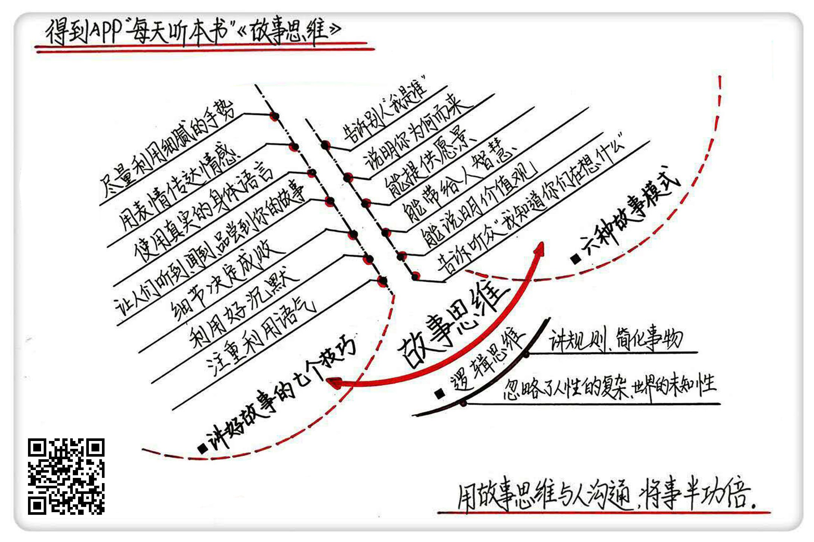

《故事思维》| 张玥解读
===========================

购买链接：[亚马逊](https://www.amazon.cn/故事思维-安妮特•西蒙斯/dp/B01N3C25MI/ref=sr_1_1?s=books&ie=UTF8&qid=1506439663&sr=1-1&keywords=故事思维)

听者笔记
---------------------------

> 学会讲六种故事：告诉别人“我是谁”、说明“我为何而来”、能带给人智慧的故事、能说明价值观的故事、告诉听众“我知道你们在想什么”的故事
> 学会讲故事的七个技巧：手势、表情、身体、感染力、细节、沉默、正面的。

关于作者
---------------------------

安妮特·西蒙斯，美国著名公共演讲人和培训师，曾创办美国团体程序咨询公司，致力于提高公私领域组织的团队建设及整体协调水平，曾服务的客户包括美国国家航空航天局（NASA）、美国国税局、微软公司等，曾出版《你的团队需要一个会讲故事的人》等书，是将故事思维应用在商业领域的先驱。     

关于本书
---------------------------

无论是在生活中还是在工作中，如何影响别人、打动对方，都是一项重要的技能。本书作者认为，讲故事是实现这一点的最佳方式，讲一个好故事永远胜过讲道理。讲故事不是与生俱来的天赋，而是可以通过后天训练形成的本领。什么样的故事能够打动别人？通过哪些方法可以讲好一个故事？在这本书中都有答案。

核心内容
---------------------------
一个好故事总是充满温情的，不像数据那样冷冰冰，所以总是能打动人心里最柔软的部分，不管一个人多么有心机，多么强硬，都会被好故事影响。想要影响别人，你应该会讲六种类型的故事。而在内容之外，手势、语气、表情等许多技巧的使用，也会帮你讲出一个引人入胜的故事来。你会发现，影响力的魅力并不在于我们说了什么，而在于我们如何去说。   
 

一、想影响别人，应该学会讲六种故事
---------------------------

这六种故事分别是：第一种，告诉别人“我是谁”；第二种，说明“我为何而来”；第三种，能提供愿景的故事；第四种，能带给人智慧的故事；第五种，能说明价值观的故事；最后一种，是告诉听众“我知道你们在想什么”的故事。

1. 告诉别人“我是谁”

关于“我是谁”这个问题，最好的答案，就是讲自己的亲身经历。
2. 说明“我为何而来”

一个善于讲故事的人，就要清楚地告诉对方，我为什么在这和你聊天。很多时候，你不必掩饰自己想要得到什么，因为只要不是过分自私，人们通常不在意你的目的是什么。他们在意的反倒是：你有没有在骗人。
3. 能提供愿景的故事

人们更希望从故事里听到的是一些积极的东西。所以，一个好故事要能带来愿景。
4. 能带给人智慧的故事

“授人以渔”的故事，是指导性质的故事，要告诉人们，为什么要让他们这样做。授人以渔的故事通常都有很巧妙的启发性，促使人们举一反三，发现更智慧的东西。
5. 能说明价值观的故事

通常我们会宣扬很多价值观，把它们印成标语、卡片。但是当人们读这些东西的时候，其实不是特别往心里去，因为这些口号太抽象，距离生活太远，没有具体的事例做支撑，人们很难感受到其中的意义。

所以，讲一个具有行动价值的故事，就至关重要。
6. 告诉听众“我知道你们在想什么”的故事。

在讲故事的时候，如果你能让听众觉得，你读懂了他们的心思，那么他们就会喜欢你讲的故事。做到这一点并不难，只要你做了必要的准备工作就行，事先了解一下你打算影响的人，看看他们可能会在哪些方面对你不满意，就从此入手，想办法消除他们的戒心。

二、讲一个好故事应学会的技巧
---------------------------

听众只能注意到故事里15%的词汇，剩下的注意力，都被讲述者的表情、姿势、着装等等吸引了，所以你需要注意以下这7个方面的技巧。

1. 越细腻的手势越让故事有说服力

练习配合不同场景使用的手势，需要你同时提高自己的想象力，想象面对不同场景的时候，你应有的反应，想象力越丰富，手里的东西就越有真实感。
2. 用表情提升故事的感情色彩

面部表情所传达的情感，比其他任何形式所传达的情感都要深刻。但表情有一个缺陷，就是它太诚实，能把你内心深藏不露的情感全都泄露出来。所以使用表情有一个前提，就是先控制自己的情绪。如果你本身就感到沮丧，就先不要给别人讲一个充满希望的故事。
3. 使用真实的身体语言，不要被“演讲专家”的教条理论影响。
4. 让人们听到、闻到或者品尝到你的故事，就是要在故事里增加声音效果，或者描述出某种气味、口感。
5. 注重故事的细节，决定讲述成败，要注意故事中的数字细节，平常要留意生活中的细节，把它们应用到故事当中，增强故事的感染力。
6. 利用沉默制造讲故事的张力: 讲故事不一定要一直说话，适当的停顿，有时会让故事意味深长。有时候我们甚至会发现，千言万语都不如沉默有力量。
7. 不要让讲故事的语气带有“绝望的味道”，不要带出负面的情绪，更不要显得虚假或者夸张，不要让听故事的人觉得你别有所图。  

金句
---------------------------

1. 一个好故事总是充满温情的，不像数据那样冷冰冰，所以总是能打动人心里最柔软的部分，不管一个人多么有心机，多么强硬，都会被好故事影响。
2. 很多时候，你不必掩饰自己想要得到什么，因为只要不是过分自私，人们通常不在意你的目的是什么。他们在意的反倒是：你有没有在骗人。
3. 通常我们会宣扬很多价值观，把它们印成标语、卡片。但是当人们读这些东西的时候，其实不是特别往心里去，因为这些口号太抽象，距离生活太远，没有具体的事例作为支撑，人们很难感受到其中的意义。
4. 在听故事的时候，听众大约只能听到15%的词汇，剩下的注意力，都被讲述者的表情、姿势、着装等等吸引了。
5. 使用表情有一个前提，就是先控制自己的情绪。如果你本身就感到沮丧，就先不要给别人讲一个充满希望的故事。
6. 大部分时候，我们的生活轨迹是没有逻辑性可言的，因为我们是感性的人。逻辑性思维虽然省事，但它忽略了人性的复杂，也忽视了世界的未知性。

撰稿：张玥

脑图：摩西

转述：于浩