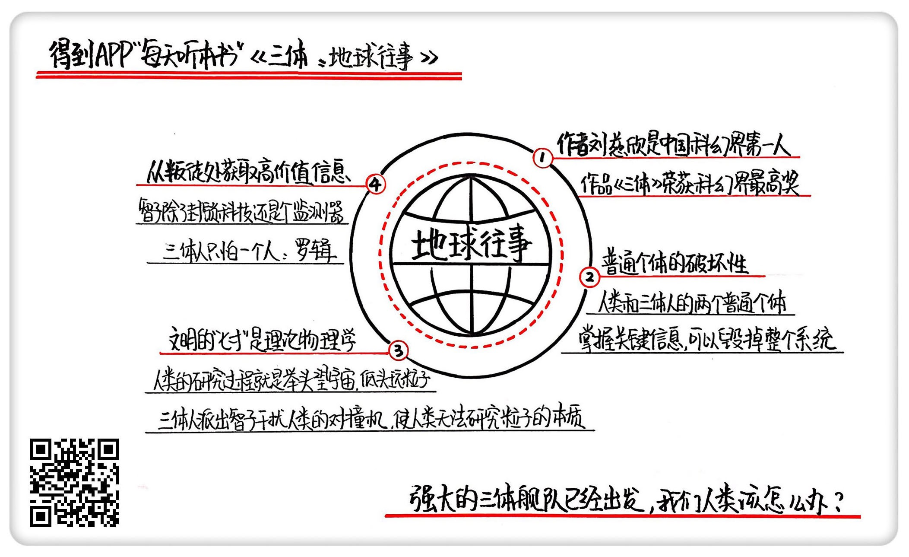

《三体：地球往事》| 怀沙解读
=============================

购买链接：[亚马逊](https://www.amazon.cn/三体-刘慈欣/dp/B00OB3SNMY/ref=sr_1_1?ie=UTF8&qid=1506350471&sr=8-1&keywords=三体)

关于作者
-----------------------------

刘慈欣，科普作家、高级工程师，被誉为“中国当代科幻第一人”。自上世纪90年代开始，他一边在发电厂担任计算机工程师，一边利用业余时间出版了13本小说集，连续数年获得中国科幻文学最高奖银河奖。2015年，凭《三体》获世界科幻界的最高奖项——世界科幻大会颁发的“雨果奖”，这是亚洲作家第一次获此殊荣。

关于本书
-----------------------------

《三体》是刘慈欣创作的系列长篇科幻小说，由《三体》、《三体Ⅱ·黑暗森林》、《三体Ⅲ·死神永生》组成，讲述的是一个叫“三体”的外星文明与地球文明交流、搏杀以及各自兴衰的故事。这本书是“三体三部曲”的第一部，经刘宇昆翻译后获第73届雨果奖最佳长篇小说奖。     
核心内容
-----------------------------

本书的思想核心是：对人性绝望的天文学家以太阳为放大器，向宇宙发射代表文明的信号，被临近星系的三体人截获，引发了三体人对地球的侵略之心。一小撮试图毁灭人类的成员与三体人勾结，成为了叛军，内外夹击之下，地球进入到了生死存亡的危机时刻。     
 

一、什么是思想实验
-----------------------------

《三体》这部小说，可以看做是一个“思想实验大合集”。刘慈欣说“他只写可能的世界”，就是在想象里设定一个极端的情况，然后沿着真实可能的逻辑推理，把可能发生的故事写出来。这就是思想实验，使用想象力去进行那些在现实中无法做到的实验。由于所有事都是在脑子里想象出来的，所以做思想实验，可以不用真的面对极端情况，能用很低成本想明白很重要的问题。

二、实验01：在信息时代，一个普通个体，能在多大程度上破坏系统
-----------------------------

小说对这个问题的回答是：在信息时代，一个小小普通个体，完全可以毁掉一个系统。三体人生活在离太阳最近的恒星系里，科技发达，远超人类，但他们的恒星系极不稳定，不适合生存。当他们监听宇宙信号寻找新行星的时候，三体人1379和地球人叶文洁发生了对话，而就是这两个普通个体的偶然对话，引起了未来人类几百年的动乱，几十亿人死亡。

三、实验02：我们知道打蛇要打七寸，那打一个文明的“七寸”，应该打什么地方
-----------------------------

一个文明的七寸，就是科技，再具体一点，是基础科学。2017年，人类的理论物理学，是在大跨步前进的。人类的探索方向，就是极化的两个方向，一个是极大，一个是极小。极大靠望远镜，极小靠对撞机。三体人派出了一个叫智子的东西来封锁住人类科学，智子能干扰粒子对撞机，制造大量的假信息，破坏人类对微观世界的继续探索。对撞机无法工作，人类基础科学的探索就被封上了一层天花板。

四、实验03：一旦发现系统出现叛徒，最应该做的事情是什么
-----------------------------

答案是，要获取叛徒和对手的聊天记录，对手想抢占的要点，就是你要抢占的要点。叶文洁在地球上还组织了一支地球叛军，配合三体入侵地球，他们的通信往来留下了大量的聊天记录，获得叛徒和对方的聊天记录，可以获得高质量的反馈，看清自己的优势和劣势，同时，还能知道对手的重点是什么。

五、尾声
-----------------------------

小说的最后，强大的三体舰队已经出发，大概在450年后，地球上人类的子孙后代就会面对这些异星侵略者。他们具备无与伦比的科技力量，他们用智子封住了人类的科学发展，他们每时每刻都在监控地球的动态，面对这样的对手，人类要如何应对？敬请关注《三体》第二部《黑暗森林》。     

金句
-----------------------------

1. 过去的时代，是谁知道答案谁牛的时代。而现在这个时代不一样了，很多问题的答案太复杂了，几乎没有正确答案。所以，那些能提出好问题的人是最牛的，那些能用问题，把所有人的所有知识搅动起来，然后去无限接近真相的人是最牛的。
2. 人类历史里，一个普通个体决定一个民族、一个国家的命运，在农业社会和工业社会都不会发生。但一个信息通畅的时代，赋予了普通个体极大的破坏力。
3. 有了化学家，原始人就离造出枪近了一步。同时，如果这个部落里还有一个原始人，每天都研究几何和数学，那我们也倾向于把他干掉，因为他只要能计算抛物线和弹道，他就离造出炮近了一步。
4. 一个叛徒能从前所未有的客观角度，来对你进行判断，因为这话是要说给你的对手听的，所以更大概率是实话，你自己到底什么方面很强，什么方面很弱，这个反馈是有很高的价值的。

撰稿：怀沙

脑图：摩西

讲述：怀沙