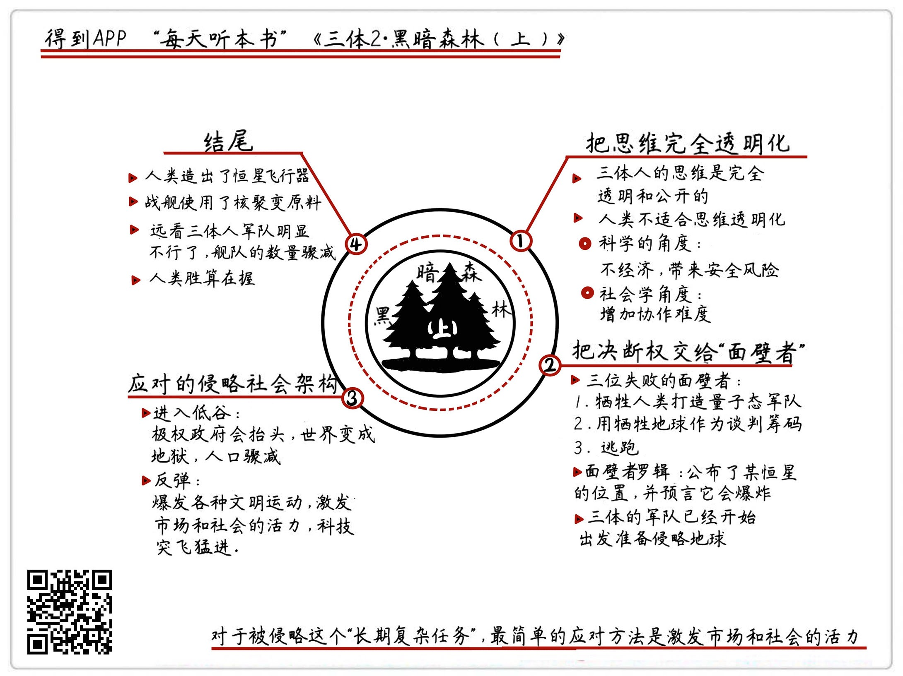

《三体II：黑暗森林（上）》| 怀沙解读
=============================

购买链接：[亚马逊](https://www.amazon.cn/三体-刘慈欣/dp/B00OB3SNMY/ref=sr_1_1?ie=UTF8&qid=1506350471&sr=8-1&keywords=三体)

关于作者
-----------------------------

刘慈欣，科普作家、高级工程师，被誉为“中国当代科幻第一人”。自上世纪90年代开始，他一边在发电厂担任计算机工程师，一边利用业余时间出版了13本小说集，连续数年获得中国科幻文学最高奖银河奖。2015年，凭《三体》获世界科幻界的最高奖项——世界科幻大会颁发的“雨果奖”，这是亚洲作家第一次获此殊荣。

关于本书
-----------------------------

《三体》是刘慈欣创作的系列长篇科幻小说，由《三体》、《三体Ⅱ·黑暗森林》、《三体Ⅲ·死神永生》组成，讲述的是一个叫“三体”的外星文明与地球文明交流、搏杀以及各自兴衰的故事。这本书是“三体三部曲”的第二部，人类社会既临三体侵略外患、又陷政治制度内忧，但最终，科技全面勃兴，战舰蓄势待发。

核心内容
-----------------------------

本书的思想核心是：人类的科技被三体人锁死，行为被三体人监听，人类社会面对严峻的外星人入侵，决定实施“面壁计划”加以抵御。但面壁计划的执行困难重重，人类社会在三体人朝地球行进的日子里，经历了全面的大低谷和大繁荣两个时期，最终恢复信心，准备迎战。
 

一、前情回顾
-----------------------------

在离太阳最近的恒星上，有一种叫三体人的外星人。他们的科技领先人类很多，但是他们行星的自然环境特别恶劣，所以打算向地球殖民。三体人朝地球发射了一种叫智子的超级机器人，智子不光能锁死人类的科技，还能实时监控地球人的所有举动。在做好所有准备之后，三体人的庞大舰队杀气腾腾地朝地球出发了，大概在450年之后到地球。

二、实验04：如果人类社会变成一个思维完全透明的世界，是好事吗
-----------------------------

三体人的思维，是完全透明的，在他们的世界里，想和说，是一个词儿。如果人类社会也变成一个思维完全透明的世界，所有真实的想法和信息都共享，是好还是坏？从科学的角度来讲，这个技能耗散能量大、信息筛选成本高；从社会学的角度讲，这会加大人们协作的难度，所以，这种“想”等于“说”的信息沟通模式，不适合人类社会。

三、实验05：如果真有外星人入侵，我们应该把决断权交给谁
-----------------------------

面对外星人的入侵，最好的方法只能是把决定权交给少数人，给他极大的权力，天下一盘棋。这一次人类选出了四位“面壁者”来做决策人，这四位人类精英分别想出了不同的对策：第一位选择了直接打；第二位选择了掌握谈判筹码；第三位选择了让人类逃跑来自我保护；第四位，选择了迂回的公布一个无关的恒星坐标位置。

四、实验06：如果面对外星人的侵略，我们应该采取什么样的社会架构来应对
-----------------------------

选择什么样的社会架构来应对，取决于外星人什么时间到达地球：如果敌人降临近在眼前，那么这就是一个短期单一任务，我们可以选择集权政府式的政治架构，短期内提高战斗力。如果是400年后到达地球，那这就是一个标准的“长期复杂任务”，应该选择自由市场，释放社会活力，实现更多创新。

金句
-----------------------------

1. 它能让我们以后再碰到隐瞒、谎言、阴谋的时候，观点不那么简单。也可能对一些必要的隐瞒，一些白色灰色的谎言，甚至还有一定程度上的套路，会是一个宽容的态度。
2. 这个战术的逻辑就是，我是打不过你，但只要我有毁掉你想要的东西的能力，那我就有谈判筹码。经济学家诺斯说过一句话，一个系统里制度的建立，不是由双方的强弱关系来决定的，而是双方的谈判能力来决定的。
3. 在平时的生活里，如果一件事情，你根本就没什么信息量，对这个事情也根本没有经验，那可能你最正确的决定就是：相信那些信息比你完备、并且和你在一条船上的聪明人。请注意，这个人是不是和你在一条船上，这点非常重要。
4. 人类就是这样，经历了苦难之后，会出现一大拨哲人，进行一个大拨反省，这次人类提出了一句掷地有声的口号，叫：“给岁月以文明，而不是给文明以岁月”。

撰稿：怀沙

脑图：摩西

讲述：怀沙 