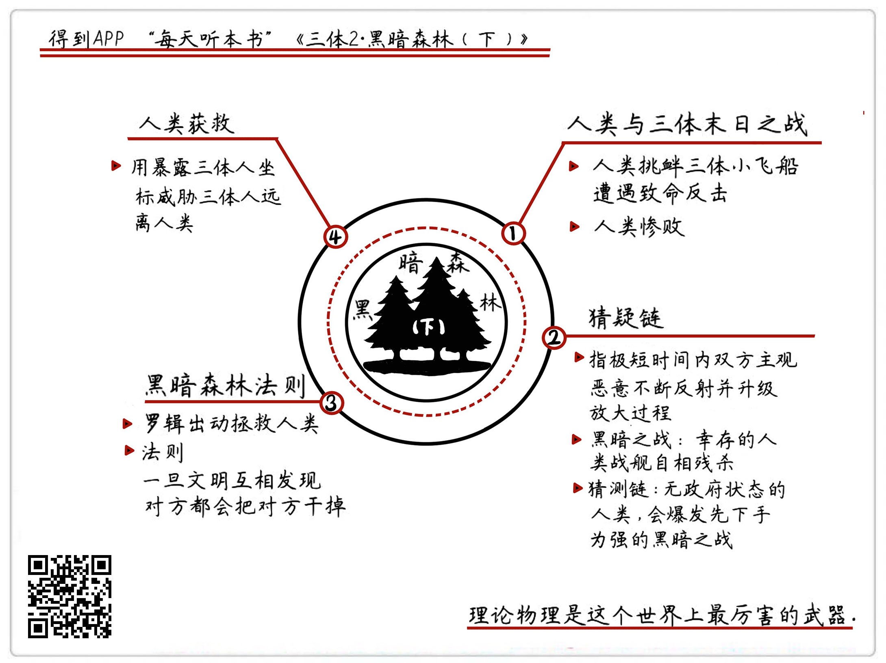

《三体II：黑暗森林（下）》| 怀沙解读
=============================

购买链接：[亚马逊](https://www.amazon.cn/三体-刘慈欣/dp/B00OB3SNMY/ref=sr_1_1?ie=UTF8&qid=1506350471&sr=8-1&keywords=三体)

关于作者
-----------------------------

刘慈欣，科普作家、高级工程师，被誉为“中国当代科幻第一人”。自上世纪90年代开始，他一边在发电厂担任计算机工程师，一边利用业余时间出版了13本小说集，连续数年获得中国科幻文学最高奖银河奖。2015年，凭《三体》获世界科幻界的最高奖项——世界科幻大会颁发的“雨果奖”，这是亚洲作家第一次获此殊荣。

关于本书
-----------------------------

《三体》是刘慈欣创作的系列长篇科幻小说，由《三体》、《三体Ⅱ·黑暗森林》、《三体Ⅲ·死神永生》组成，讲述的是一个叫“三体”的外星文明与地球文明交流、搏杀以及各自兴衰的故事。这本书是“三体三部曲”的第二部，宇宙是一座无政府的黑暗森林，危险与威慑的一念之间，也是生存与毁灭的转换。

核心内容
-----------------------------

本书的思想核心是：宇宙是一个零和博弈，每个文明都是以生存为第一要务，这是一个冷酷的战场，就算文明再弱小，也可能发生技术爆炸。因为猜疑链的存在，所以，一旦文明互相发现对方，第一反应就是先灭亡对方，保证自己的安全。黑暗森林法则让人类通过威胁手段，与敌人达成了一个暂时的平衡。
 

一、22世纪的人类社会
-----------------------------

经过一轮大低谷后，人类迎来了一次大繁荣。基因改造技术和可控核聚变技术，让世界发生了重大改变，食物和能源都不再是问题，地缘政治和传统国家都趋于消失，舰队成为了最有实力的组织实体，人类积极乐观，充满了必胜的信念。

二、实验07：如果在理论物理水平上有差距的两个文明作战，会出现什么样的情景
-----------------------------

为了截击一艘三体的先行军小飞船，人类派出2000多艘恒星级战舰到太阳系边缘迎战。这艘名叫“水滴”的小飞船向人类展示了三体文明的实力，上演了一场仅有50分钟的末日之战，除了7艘逃出，人类战舰全军覆没。这场战役告诉我们，世界上最狠的武器的是理论物理，文明间最大的差距是科学层级差距，人类所有的荣光，一朝破灭。

三、实验08：什么是猜疑链
-----------------------------

从末日之战逃生的7艘战舰，马上迎来了一场关于人性的“黑暗之战”。因为燃料和配件有限，人类战舰之间爆发了一场自相残杀的战斗。最后，仅存的两艘战舰，满载燃料和补给，各自朝太阳系外飞去。猜疑链是这场战争的动因，也是宇宙生存必须面临的基本概念。

四、实验09：宇宙里的黑暗森林法则是什么
-----------------------------

在跟罗辑见面的时候，叶文洁告诉过他宇宙社会学的两个公理和两个概念，经过思考，罗辑推导出了“黑暗森林法则”：整个宇宙就像是一个黑暗森林，每个文明都是一位带枪的猎人。一旦有一个猎人发出了动静，其他文明根据猜疑链做出的第一反应就是——先消灭它再说。三体人忌惮罗辑的原因，即在于此。罗辑掌握了这条法则，就掌握了制约三体人的办法。

五、雪地计划
-----------------------------

罗辑根据黑暗森林法则，在太阳系外圈布置了许多核弹，核弹一旦引爆，就会排列成一副代表恒星位置的立体图形，三体星和太阳的坐标就全都暴露在了宇宙里，也就是成为了暴露行踪的猎人，这就是“雪地计划”。雪地计划一旦实施，三体人和地球人就会成为其他文明枪口下的靶子，所以三体人停止了所有侵略计划，与人类进入了一个崭新的外交时代——威慑纪元。

金句
-----------------------------

1. 人类就给“水滴”做了一个简单的体检，在测量水滴的物质构成的时候，得到了一个惊人的结论，人类发现“水滴”表面的物质，就算把显微镜放大到一千万倍，显示的还是光滑的镜面，没有任何细微的分子构造——这说明“水滴”的硬度是难以想象的。
2. 让我们来回到这个思想实验的题目：有科学层级差距的文明相互交战的结果是什么？结果就是，根本不可能打得有来有往，肯定是完全还不上手。
3. 两个原来并没有主观恶意的个体，只要有一方在想象里出现了一个小恶意，那就会被猜疑链快速放大，这个放大过程只有一个办法中断，就是某一方死了。
4. 由于宇宙是一个零和博弈，每个文明都是以生存为第一要务，所以这是一个非常冷酷的战场，就算是其他文明再弱小，但随时可能发生技术爆炸。而且因为猜疑链的存在，所以，一旦文明互相发现对方，第一反应就是先把它干掉再说。

撰稿：怀沙

脑图：摩西

讲述：怀沙 