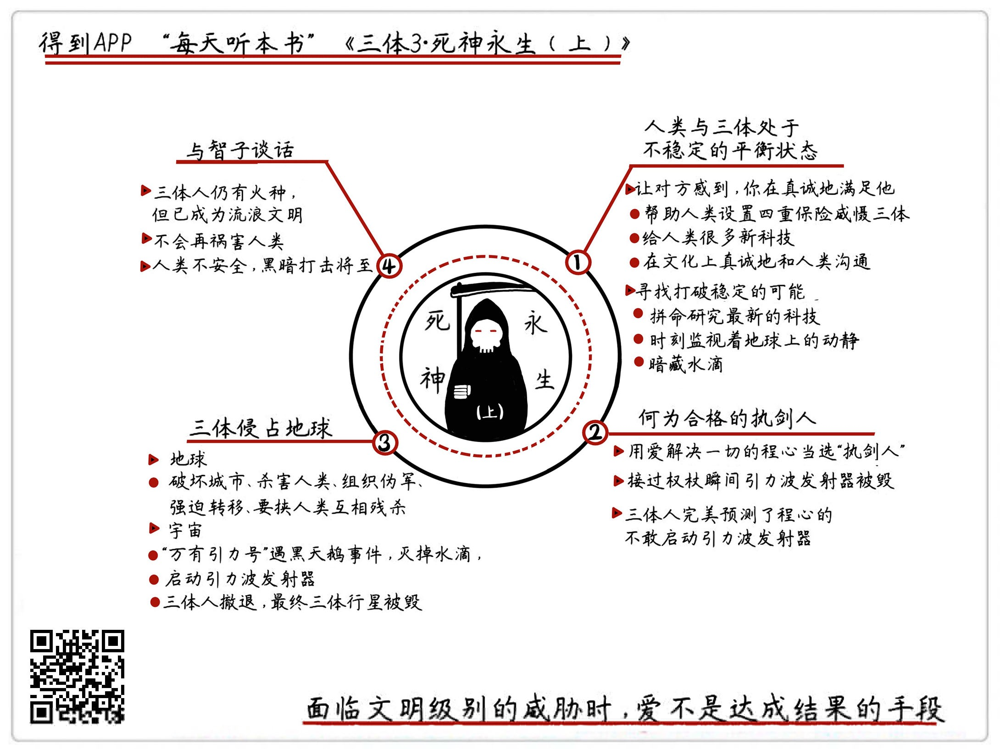

《三体II：死神永生（上）》| 怀沙解读
=============================

购买链接：[亚马逊](https://www.amazon.cn/三体-刘慈欣/dp/B00OB3SNMY/ref=sr_1_1?ie=UTF8&qid=1506350471&sr=8-1&keywords=三体)

关于作者
-----------------------------

刘慈欣，科普作家、高级工程师，被誉为“中国当代科幻第一人”。自上世纪90年代开始，他一边在发电厂担任计算机工程师，一边利用业余时间出版了13本小说集，连续数年获得中国科幻文学最高奖银河奖。2015年，凭《三体》获世界科幻界的最高奖项——世界科幻大会颁发的“雨果奖”，这是亚洲作家第一次获此殊荣。

关于本书
-----------------------------

《三体》是刘慈欣创作的系列长篇科幻小说，由《三体》、《三体Ⅱ·黑暗森林》、《三体Ⅲ·死神永生》组成，讲述的是一个叫“三体”的外星文明与地球文明交流、搏杀以及各自兴衰的故事。这本书是“三体三部曲”的第三部，人类凭借黑暗森林威慑建立的平衡，将被伺机打破。

核心内容
-----------------------------

本书的思想核心是：在受到黑暗森林法则威慑后，三体人表现出了一个成熟文明的理性和克制，但从来没有放弃寻找拿回优势的机会。在人类选择执剑人失误后，三体果断展开了反击，将地球变为了他们的殖民地。外太空的一艘战舰成了人类仅存的希望，它将三体星的坐标公布在了宇宙中，三体恒星遭到了毁灭性的黑暗打击。
 

一、前情回顾
-----------------------------

在离太阳最近的恒星上，就有一种叫三体人的外星人，科技水平远远超过人类，他们一心要侵略地球。经过一番很复杂的较量，一位叫罗辑的中国人，成功利用宇宙的黑暗森林法则，在太阳系建立了一套可以随时暴露三体人恒星坐标的装置。人类就凭借着这个威慑，成功把三体人拉到了谈判桌前，让两个文明进入了一个彼此对峙的平衡状态。

二、实验10：如果两个敌对势力处于不稳定的平衡状态，那“强势”的一方应该注意些什么
-----------------------------

在罗辑建立的威慑平衡里，三体是强势的一方，人类是弱势的一方。三体人通过“让地球人感知他们的真诚”和“不停寻找打破稳定的可能”这两点，为这次实验提交了一个满分答卷。在这段平衡对峙的状态里，三体人帮助地球人建设了能够威胁到他们自己的引力波发射装置，这为后来的毁灭埋下一颗种子。

三、实验11：一个合格的执剑人，应该具备什么性格
-----------------------------

“执剑人”是指人类掌握黑暗打击按钮的那个人，这个角色的工作并不难：一旦发现三体人违约，就按下按钮，双方同归于尽。在罗辑卸任执剑人、继任者接过权杖的那一刻，三体人认为新的执剑人不具备同时毁灭两个文明的魄力，发起了对地球的进攻，果然迅速扭转了对峙的局势。

四、情节不停反转
-----------------------------

人类在十几分钟内就丧失了所有的威慑能力，开始接受三体人的极权统治。地球上形成了治安军和反抗军两股势力，前者帮助三体人维护他们在地球上的统治秩序，后者在罗辑的带领下坚决与三体势力作斗争。但在外太空发生的两件黑天鹅事件，让剧情再次反转，三体人的母星，很快就遭到了来自更高级文明的毁灭性打击。

五、实验12：一个成熟的文明，应该怎样面对已经没有威胁的敌人
-----------------------------

三体星被毁灭后，三体人跟地球领袖罗辑和程心展开了一次对话。这是一场成熟的对话，也是一个得体的告别。三体人用无对无错、无怨无恨、有礼有节的态度，结束了跟人类这场300年的对决。故事最后，三体人告诉罗辑，人类其实可以避免黑暗森林的打击，但人类能够躲开吗？

金句
-----------------------------

1. 在我们的生活里，也大量存在这种“不稳定平衡状态”的组合，比如有的情侣、夫妻、公司合伙人、商家和供应商之间，表面上看着不错，但其实有一方是不情愿的，甚至弱势的那方自己都不知道。
2. 一个执剑人应该具备什么性格，小说里其实给出了明确的答案，要的是一个不讲情面、恪守信念的狠人。比如说，心狠手辣的黑社会老大，杀伐决断的企业老总，或者能是挥泪斩马谡的诸葛亮。总之，绝对不是一个老好人。
3. 领袖的一个重要素质，就是坚决地执行规则，哪怕在执行规则的过程里，有再大的阵痛，都要优先执行规则。只有长期地这么对待事情，才能形成别人对你的一个可以预期的判断，这样的人才适合做领袖。
4. 在宇宙生存面前，这些是非曲直，是最苍白的东西。如果一个文明老是揪住这些东西不放，那它就不是一个成熟的文明。

撰稿：怀沙

脑图：摩西

讲述：怀沙 