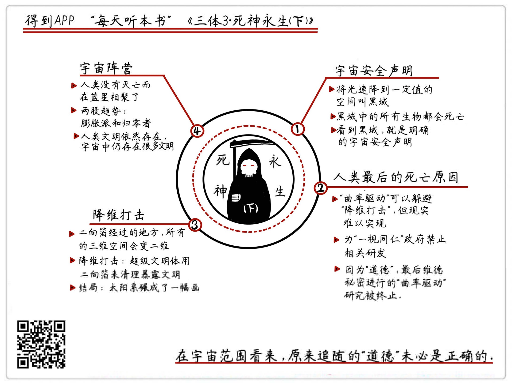

《三体II：死神永生（下）》| 怀沙解读
=============================

购买链接：[亚马逊](https://www.amazon.cn/三体-刘慈欣/dp/B00OB3SNMY/ref=sr_1_1?ie=UTF8&qid=1506350471&sr=8-1&keywords=三体)

关于作者
-----------------------------

刘慈欣，科普作家、高级工程师，被誉为“中国当代科幻第一人”。自上世纪90年代开始，他一边在发电厂担任计算机工程师，一边利用业余时间出版了13本小说集，连续数年获得中国科幻文学最高奖银河奖。2015年，凭《三体》获世界科幻界的最高奖项——世界科幻大会颁发的“雨果奖”，这是亚洲作家第一次获此殊荣。

关于本书
-----------------------------

《三体》是刘慈欣创作的系列长篇科幻小说，由《三体》、《三体Ⅱ·黑暗森林》、《三体Ⅲ·死神永生》组成，讲述的是一个叫“三体”的外星文明与地球文明交流、搏杀以及各自兴衰的故事。这本书是“三体三部曲”的第三部，遭受黑暗后，三体和地球两个文明在宇宙格局下展开了全新的征途。

核心内容
-----------------------------

本书的思想核心是：三体星系覆灭，人类也暴露在危险重重的宇宙之中。面对即将到来的黑暗森林打击，人类受制于地球文明的道德枷锁，做出了错误的防御反击。太阳系不复存在，小宇宙无法独存，生于斯，灭于斯，在浩瀚宇宙，永恒的只有死神和面对死神的抗争。     
 

一、前情回顾
-----------------------------

三体人和地球人发生了一场长达300年的战争，最后，地球人借助宇宙里其他文明的力量，将整个三体星系毁灭，三体人从此变成了宇宙里的流浪者。但同时，人类自己也暴露在了宇宙的黑暗森林中，毁灭性打击随时可能降临。

二、实验13：在宇宙里，什么才是宇宙安全声明
-----------------------------

阴差阳错，程心的同学云天明在三体行星生活了很久，在随三体人流浪宇宙之前，云天明通过三个故事，向地球人透露了能够躲避黑暗打击的三个方法。其中，通过降低光的速度，执行宇宙官方认可的自杀，也就是把自己所在的星系变成“黑域”，是宇宙中最明确的一种安全声明。

三、实验14：最后把人类害死的，最可能是什么
-----------------------------

能够逃避黑暗打击的另一个方法，是制造一种依靠“曲率驱动”的宇宙飞船。但是这种飞船带来了一个社会学问题：制造它将耗费大量的资源，最后却只能带走一小部分人，这将人类社会带入一个公平与道德的困境之中。但也正是这种出于道德的考量，使人类终止了飞船的建造，这一决定，最终毁灭了太阳系里的所有人类。

四、实验15：宇宙分为几个阵营
-----------------------------

在太阳系遭到降维打击彻底毁灭之后，只有程心一个人逃了出来。她来到跟云天明和自己都颇有渊源的蓝星，在那里碰到了已经为人类找到新行星的关一帆。但两人被困到空间褶皱里，再出来的时候，宇宙已经度过了1800万年。两人开始在云天明为他们准备的小宇宙里生活，彻底了解了宇宙的格局，看清了宇宙中走向死亡和阻止死亡的两大阵营。

五、三体终极大点评：四个人物、两点收获
-----------------------------

《三体》系列小说，成功塑造了四个主要人物，分别是：一个成功的好人，罗辑；一个失败的好人，程心；一个成功的坏人，叶文洁；一个失败的坏人，维德，展现了复杂的人性。同时给我们带来两点收获：第一要复杂、不要简单；第二要前进、不要后退。这都让我们鼓足勇气，走向更美好的明天。

金句
-----------------------------

1. 宇宙里的安全声明，对于太阳系来说，就是把光速从现在的每秒30万公里，降低到太阳系的第三宇宙速度每秒16.7公里以下，这么一来，光就飞不出太阳系。这样的空间，叫做黑域。黑域和黑洞很像，区别是黑域不会坍缩。黑域是宇宙中公认的死亡，是一个明确的宇宙安全声明，没人会对黑域进行黑暗森林打击。
2. 维德对程心说了一句意味深长的话，他说：“失去人性失去很多，失去兽性失去一切。”程心毫不犹豫地说，我选择人性。
3. 小说给我们模拟了一个平时不常见的极端情况，面对一次针对人类的毁灭性打击，我们知道怎么躲开，我们有资源，有科学，有人才，有路径，但是我们没有一个跟得上这些的道德水准，所以我们最后被拍死了。
4. 所以说，宇宙，就像一座双向运动的自动扶梯，一边是向上运行，通向有序，另外一边是向下运动，通向无序。对不起，我们一出生就是在向上电梯上的。但如果作为出生在上升电梯上的生物，却偏偏硬要往下走，那我们将变成所有宇宙生物里，最荒谬的一个。

撰稿：怀沙

脑图：摩西

讲述：怀沙