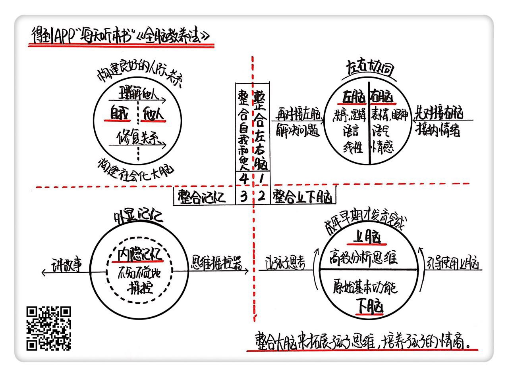

《全脑教养法》| 苏菲解读
==================================

购买链接：[亚马逊](https://www.amazon.cn/全脑教养法-拓展儿童思维的12项革命性策略-丹尼尔·西格尔/dp/B01N7LX5WC/ref=sr_1_1?ie=UTF8&qid=1506932940&sr=8-1&keywords=全脑教养法)

听者笔记
----------------------------------

> 如果孩子生气的时候，其实是孩子的右脑（负责感性的部分）在起主要作用，这个时候如果用理性的方法来和孩子沟通，通常不奏效，因为这时候孩子无法启动左脑和你沟通，需要先缓和孩子的情绪，再找时间和孩子的左脑进行沟通，看看如何理性地解决问题。
> 
> 大脑还分成下层和上层，下层负责比较原始的举动，上层则负责决策、控制力等，下层大脑在人出生的时候已经基本成熟，但是上层大脑要到二十几岁才能完全发育成熟，因此需要经常锻炼孩子使用上层大脑进行思考，在孩子情绪激动的时候，更要利用这个特点，锻炼上层大脑的能力。
> 
> 外显记忆大概就是我们所回忆的一些画面等内容，内隐记忆则是指过去的经验对我们产生的心理模式，比如心理阴影等。可以通过讲故事的方式，讲产生内隐记忆的内容外显出来，可以帮助孩子越过心理阴影。
>
> 孩子只有在和别人的互动中，才会不断发展出同理心，学会与别人合作。父母需要和孩子协调，才能帮助孩子变得情绪饱满。

关于作者
----------------------------------

本书作者丹尼尔·西格尔是美国著名的积极心理学家、哈佛大学医学博士、加州大学洛杉矶分校精神病学临床教授，在大脑研究、心理治疗和儿童教养领域有好几本开创性作品问世。

关于本书
----------------------------------

在本书里，西格尔为我们解读了大脑的结构，以及如何整合大脑。并分析了大脑如何影响孩子的思维和情感。西格尔在这本书里告诉父母，孩子的大脑还在发展过程中，父母的养育方式其实就是在影响他们大脑的发育。

核心内容
----------------------------------

本书思想核心是：大脑的各个部分功能不同，只有让各个部分整合协同运作，才能让孩子拥有良好的思维、情感和人际关系。书中介绍了整合左右脑、上下脑、外显记忆和内隐记忆、自我和他人等方法。 
 

一、整合左脑和右脑，帮助孩子改善情绪
----------------------------------

左脑喜欢秩序，是逻辑的、语言的和线性的。而右脑是全面的、非语言的，它发送并接收表情、眼神、语气等信号，负责接收和解读情感信息。

要想拥有和谐的生活和良好的人际关系，必须让左右脑协同工作。连接左脑和右脑的结构叫做胼胝体纤维，它帮助左右脑之间交流，成为一个整体进行工作，这是左右脑整合的生理基础。
如果只有左脑发生作用，一个人就无法理解情感，就无法建立起亲密而良好的人际关系，就像是生活在情感荒漠中。而如果只有右脑发生作用，这个人就会被情绪淹没，无法理性地思考和控制自己。

当孩子产生情绪时，父母应该通过“聆听与关注”，先让孩子感觉到自己被理解，再去尝试理智地解决问题。也就是先和孩子的右脑建立联结，帮助他平缓情绪；接下来再把孩子引导到左脑上，关注如何理性地解决问题。孩子情绪爆发的时候，并不是讲道理的最佳时机。只有当孩子情绪平稳，能够启用左脑时，才能听得进去我们说的话。

二、整合下层大脑和上层大脑，教会孩子自我控制
----------------------------------

下层大脑包括脑干和边缘区域，也就是从脖子的上端到鼻梁的位置，这部分比较原始，主要负责人的基本功能，比如呼吸和眨眼；与生俱来的一些反应和冲动，比如打斗和躲避；还有剧烈的情感，愤怒和恐惧。

上层大脑完全不同。它由大脑皮层及其各个部分构成，尤其是额头后面那部分，比如前额叶皮层。上层大脑进化程度更高，负责高级分析思维功能，比如决策、控制力、自我认知、共情、道德等高度复杂的能力，帮助一个人以更加全面的视角看待世界。

下层大脑在孩子出生时就已经十分发达，而上层大脑要到一个人二十几岁时才能完全发育成熟，这也是大脑最后发育的一个部分。

了解了上下层大脑的构造，就能更好地帮助孩子整合上下脑。我们需要帮助孩子建立上下层楼之间的连接，使得上层大脑可以监视下层大脑的行为，并帮助下层大脑平息强烈的冲动反应。

建立连接的方法就是唤起和锻炼上层大脑。比如在商店没有给孩子买玩具，孩子非常生气，在回家的路上，大喊，“我恨你！”这时候可以跟孩子说，“那个玩具是最后一个，已经有人买了，如果你想继续生气也可以。但是如果你愿意，我们可以一起想几个办法解决问题”。

这样的对话，会帮助孩子把关注点引入到上层大脑，当孩子开始问“我们还能怎么做呢”，他就开始启动上层大脑，也就可以一起讨论问题了。

父母要有意识地引导孩子经常使用上层大脑，锻炼上层大脑的功能，帮助他们建立控制自己的能力。比如可以教给孩子一些控制过激反应的方法，如深呼吸、数数、用语言表达愤怒而不是用拳头等。

三、整合外显记忆和内隐记忆，给孩子建立完整的心理拼图
----------------------------------

外显记忆指的是意识层面回想起的过去的经验；而内隐记忆以过去的经验为基础，为我们建立起某种特定的心理模式。比如，一个孩子在体育课上多次受到老师的批评和嘲笑，他就会创建出“我不喜欢运动，我没有运动天赋”的心理模式。

内隐记忆是以一种不被觉察的方式来操纵我们。那么我们怎么才能变被动为主动，更加有意识地控制和使用内隐记忆呢？

大脑中有一个部分叫做“海马”，我们可以把它看做提取记忆的“搜索引擎”。除了提取，海马还负责拼图——把记忆碎片组合成完整图像，这叫做内隐记忆的外显化。只有当内隐记忆被海马整合，形成外显图像时，我们才能反思它们对我们生活的影响。

最好的回顾经历的方式就是讲故事。如果那段痛苦经历对孩子有强烈影响，他可能还没有准备好去回忆，这时候可以给他一个虚拟的思维遥控器，对一些情节快进，让他增加掌控感。通过多次这样的重温，孩子就可以去面对这段令他不安的往事。

四、整合自我和他人，构建良好的人际关系
----------------------------------

我们的大脑是被经验重塑的，每一次和他人的互动，都会影响和改变这我们自己的大脑，同时也会影响他人的大脑。孩子不会生下来就具有和他人合作的能力，这就是为什么低龄的孩子经常显得非常自我，把“我的”、“我要”挂在嘴上。父母需要示范并教给孩子如何构建人际关系，其中一个很有效的方法就是帮助孩子发展同理心。

父母对待孩子的方式，会影响到孩子的同理心。如果亲子之间协调，那么孩子就会具有饱满的情绪。而如果孩子的情感受到父母不协调的回应，他们就会回避表达情绪，也不再会感受他人的情绪，变得冷漠。

构建同理心就是要用他人的视角看问题，以及帮助孩子理解非语言的信息，更深入地去理解他人。在人际冲突之后，我们也需要帮助孩子学会如何修复关系。

金句
----------------------------------

1. 孩子的大脑还在发展过程中，我们的养育方式其实就是在影响他们大脑的发育。
2. 先和孩子的右脑建立联结，帮助他平缓情绪；接下来再把孩子引导到左脑上，关注如何理性地解决问题。
3. 对于消极的内隐记忆，我们需要把它显性化，帮助孩子去探索，让他意识到这个内隐记忆，去理解自己的经历以及主动处理。
4. 危机也是契机，“生存式教育”可以转变为“发展式教育”，那些令人崩溃的“生存时刻”都可以变为促进孩子发展的“成长时刻”。

撰稿：苏菲

脑图：摩西

转述：孙潇