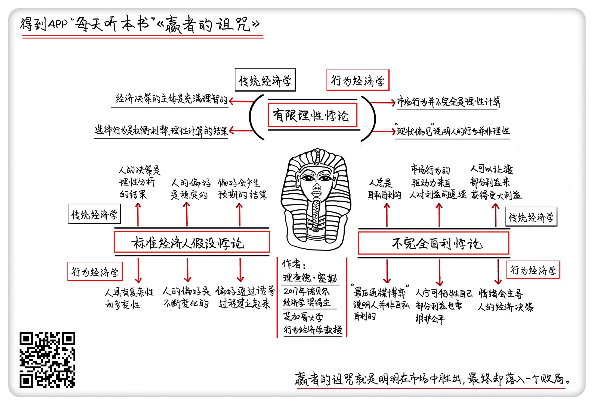

《赢者的诅咒》| 大卫解读
================================

购买链接：[亚马逊](https://www.amazon.cn/赢者的诅咒-经济生活中的悖论与反常现象-理查德·H·泰勒/dp/B00CFGWPYQ/ref=sr_1_1?ie=UTF8&qid=1509111660&sr=8-1&keywords=9787300170749)

听者笔记
--------------------------------

> 这是一本讲述行为经济学的书籍。以全新的视角来看解释很多传统经济学没法解释的现象。
>
> 有限理性悖论：传统经济学的理性人假设太过绝对，人并不总是理性权衡。因此很多时候基于理性假设推导出来的结论，实际上并不成立。
>
> 不完全自利悖论：传统经济学关于人是自利的假设也不正确。有时候并不是完全受到利益的支配，有时候人们会追求公平而舍弃利益。
>
> 标准经济人假设悖论：传统经济学过于机械地看待了人的经济行为，忽视了经济选择的多变性。人并不是一个标准的动物，哪怕是同一个人也会针对同一件事作出不同的反应，所以不能把人都标准化，进而套用各种标准的假设，任何因素都可能导致结果的不同。

关于作者
--------------------------------

理查德·塞勒，2017年诺贝尔经济学奖得主，芝加哥大学金融和行为科学教授，行为经济学理论的开创者之一。     

关于本书
--------------------------------

这本《赢者的诅咒》，是塞勒20世纪八九十年代发表的14篇论文的合集，探讨的都是行为经济学领域的研究成果和进展。这本书研究的正是人类的非理性决策行为，运用了很多行为经济学的知识，解释了很多传统经济学没法解释的现象。这能帮我们在经济学的基本思维框架上做进一步延伸，更科学地认知现实世界。     

核心内容
--------------------------------

本书告诉我们，传统经济学在现实层面遭遇很多适用上的尴尬，主要原因是这门学科的基本假设出现了偏差。     
 

一、有限理性悖论：传统经济学的理性人假设太过绝对，人并不总是理性权衡
--------------------------------

1. 经济学上的基本假设就是理性人的假设，也就是在市场上，人选择做这种行为，不做那种行为，做这种选择，不做那种选择，其实是一个权衡利弊、理性计算的结果，我们最终会选出一个最优解。但行为经济学却发现，并不总是这样。
2. 我们都觉得，拍下油田开采权的公司肯定赚得盆满钵满，但真实的情况是绝大多数开采油田的公司都赔本。这是因为他们处于严重的信息不对称，不知道这个油田的真正价值，所以只能靠主观猜测，而这就会带来判断失误。
3. 大部分时候，大公司之间的并购也是不挣钱的，往往高估了标的公司的价值。大公司是市场上的赢家，赢家就往往会过于自负，总认为自己比市场上的其他参与者判断更为准确，而且求胜心切，这样的心态，很容易犯错。
4. 经济学的基本假设是人是理性人，而价格是市场的反应，但我们总是高估手里东西的价值，又总是低估别人手里的价值，这种状况就叫做现状偏见。人们宁愿维持现状，既不愿意买进，也不愿意卖出，这也是一种奇怪的非理性。

二、不完全自利悖论：传统经济学关于人是自利的假设也不正确
--------------------------------

1. 传统经济学家觉得，一切市场行为的驱动力是人对利益的追逐，每一个人从经济层面来说都是自私自利的。有些人看上去在追求公平，其实也是为了让渡出一部分利益后，可以获得更大的利益。
2. 最后通牒博弈的实验表明，人在即便是涉及到金钱这种直接的利益的时候，也不完全只想着让自己利益最大化。人天然的会去追求公平，遇到特别不公平的东西，还会激起他的一些负面情绪，他宁可牺牲掉自己一部分利益也要维持公平。所以，传统经济学家认为人的行为是出于自利，明显是错误的。
3. 人在快乐的情绪下，容易接受不公平的分配策略，在愤怒的情绪下，宁可牺牲自我收益也要拒绝不公平。这就反映了，我们的经济行为和决策不完全是自私自利决定的，情绪有时候都比人的逐利性强大得多，它会主导我们的经济决策。

三、标准经济人假设悖论：传统经济学过于机械地看待了人的经济行为，忽视了经济选择的多变性
--------------------------------

1. 不存在什么标准的经济人，人是一种非常多变的动物，并不是铁板一块。即便条件完全一样，不同的人也可能做出完全相反的选择，传统经济学把人的反应想得太过于标准化了。
2. 传统的经济学家认为，我们在比较不同选项的时候，有点像我们翻书或者是查字典，能够清晰地查到我们每一个偏好的优先级，哪个排前哪个排后，这是很清楚的。我们查到各种偏好的排列顺序后，就能根据现实情况作出选择，优先满足我们比较靠前的偏好。
3. 真实的情况是这两种假设都不成立，我们在经济生活中经常面对偶发事件，人的偏好顺序没法提前建立，大多是临时建立的，做选择和判断的时候，背景和程序也会影响偏好。
4. 传统经济学认为，你偏好足球这种活动，不偏好歌剧，就证明足球带给你的价值比歌剧更大。行为经济学认为，偏好是不断变化的，价值也是在不断变化的，人的经济选择也有多样性，没那么铁板一块，你我都不是一个标准化的经济人。 

金句
--------------------------------

1. 明明在市场竞争中胜出了，最终却落入了一个败局，这个悖论就叫做“赢者的诅咒”。
2. 大公司是市场上的赢家，赢家就往往会过于自负，总认为自己比市场上的其他参与者判断更为准确，而且求胜心切，志在必得。抱着这样的心态，不犯错误那才叫反常。
3. 人天然的会去追求公平，遇到特别不公平的东西，还会激起他的一些负面情绪，他宁可牺牲掉自己一部分利益也要维持公平。
4. 不存在什么标准的经济人，人是一种非常多变的动物，并不是铁板一块，即便条件完全一样，不同的人也可能做出完全相反的选择，传统经济学把人的反应想得太过于标准化了。

撰稿：大卫

脑图：摩西

转述：于浩