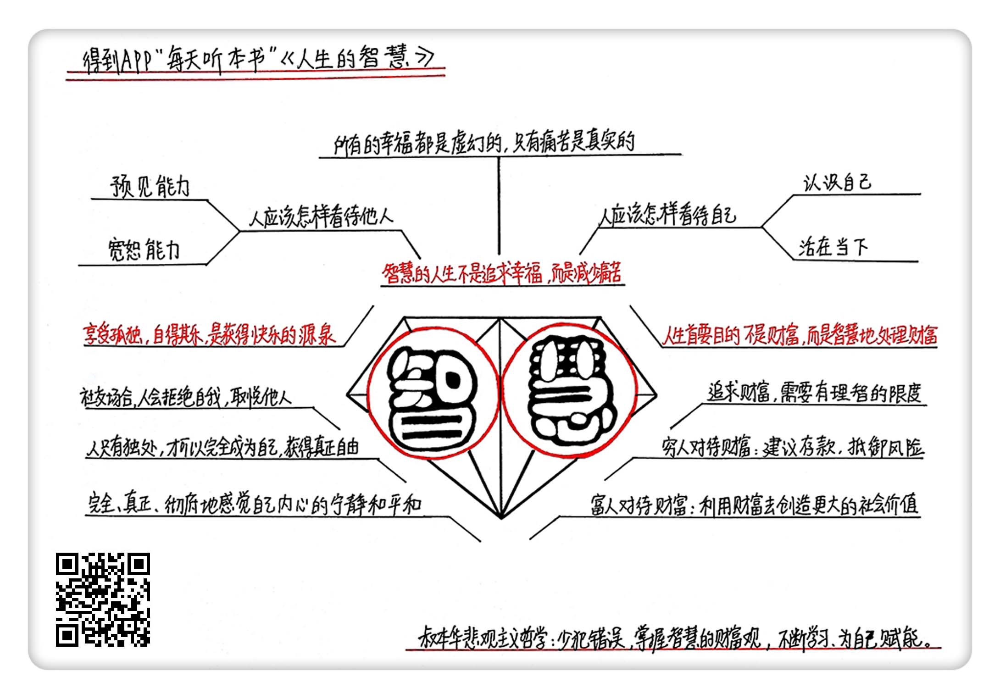

人生的智慧
==================================

购买链接：[亚马逊](https://www.amazon.cn/图书/dp/B01J4RHQ0Q/ref=sr_1_1?ie=UTF8&qid=1506780375&sr=8-1&keywords=人生的智慧)

听者笔记
----------------------------------

> 我们应该忘掉过去、关注现在和计划将来。
> 
> 我们既不应该期待别人改变个性、也不谴责别人的个性与我的不一样。
>
> 追求财富要有限制，穷人要用来防身，富人要用来求再发展，这样才能更好地利用财富。
>
> 人只有在独处的时候，才可以完全成为自己。

关于作者
----------------------------------

阿尔图·叔本华，德国哲学家，唯意志主义和现代悲观主义创始人，19世纪上半叶欧洲最伟大的哲学家之一。叔本华30岁时写成《作为意志和表象的世界》，奠定了他的哲学思想基础。但此后，他在哲学界一直默默无闻。直到晚年的著作《附录和补遗》发表后，他才成名。

叔本华把伏尔泰、卢梭和康德看作是自己的精神导师，他在自己的书中经常引用这三个人的论述和观点。叔本华还有一个名气比他更大的学生，那就是尼采。他的思想还影响了后世很多文学和艺术大师。比如，俄国的托尔斯泰、屠格涅夫；英国的托马斯哈代；法国的莫泊桑、左拉；以及德国音乐大师瓦格纳。这些人的作品里，都有叔本华思想的影子。

关于本书
----------------------------------

这是一本用来理解幸福和痛苦本质的“人生的参考书”，今天讲的《人生的智慧》，就是《附录和补遗》中的一部分。作者以“人是有意志的动物”为前提，解释了“幸福”与“痛苦”之间的关系。在厘清了这两者的关系后，叔本华提出了“智慧”获得人生幸福的方法。本书提出的问题包括：人应该怎样看待与自身的关系；怎样看待和处理与他人的关系；怎样看待和利用财富，以及用以什么样的状态体验幸福和快乐。

核心内容
----------------------------------

1. 人生本来就是痛苦的，不要妄想实现什么绝对的幸福，而要懂得放弃不适当的欲望，尽量减少烦恼。
2. 人生追求的首要目的不是财富，而是智慧地处理财富。
3. 享受孤独、自得其乐是获得幸福和安乐的源泉。
 

一、幸福和痛苦的关系
----------------------------------

人之所以痛苦，就是因为有欲望。欲望越多就越痛苦。智慧的人生不是追求幸福，而是减少痛苦。所有的幸福都是虚幻的，而只有痛苦是真实的。

1. 调整看待自己的态度

人要认清自己生命总体发展的大概脉络，并且有大概的发展计划。我们要学会“认识自己”，明白自己应该从事什么职业、需要扮演什么角色，以及自己和这个世界是什么关系。既要低头认真工作，也要偶尔抬起头看看远方的目标，这样才能确保自己的步伐朝着目标方向直线前进。

正确对待自己的另一方法是，活在当下。我们应该忘掉过去、关注现在和计划将来，让这三者达到平衡，互不干扰。活在过去的失败中，人会无法体验现在的快乐。过于担心将来可能发生的祸患，等于提前兑现人生的痛苦。
2. 调整看待他人的态度

人生在世，永远需要和别人合作或者打交道。与人相处要掌握两个能力：一个是“预见能力”，它能帮助我们避免受到伤害；另一个是“宽恕能力”，它能避免我们受到人群中是是非非的困扰。中国有句俗语：“防人之心不可无，害人之心不可有”。人要在社会中生存，就必须容许别人有他们自己的个性。我们既不应该期待别人改变个性、也不谴责别人的个性与我的不一样。这就是“自己生活，也让别人生活”。

二、财富越多痛苦越多，智慧越多幸福感越多
----------------------------------

在追求财富的问题上，要有一个理智的限度。财富欲望能否得到满足，不是由财富的绝对数量决定的，而是由相对数量决定的；财富就像咸咸的海水：人喝海水越多，就会越感到口渴。

人都是有欲望的物种，满足欲望最直接的方式，就是追求财富、地位和名誉。有了财富、地位、名誉，才可能满足人们的欲望。欲望无止境，对财富的追求也就无止境。而承担巨大的财富，却不会理智利用财富的人，往往就会被财富所坑害。

对穷人来说，恰当地追求财富也是无可厚非的。叔本华建议人们应该把现有的财富，看做是抵御未来发生不测事件的城墙。如果花钱大手大脚，入不敷出，总有遇到重大挫折、无法应对的情况。缺钱的痛苦，比钱多的痛苦，是更加真切的。叔本华建议，人至少要把赚来的钱的八分之一存起来，应对未来的需要。

对于富人，想从财富中获得幸福，要具有“高级精神禀赋”。富人要知道怎样利用财富创造更大的社会价值，而不是用来个人享受和消费。富人得天独厚的优势不是财富，而是用财富可以做到别人做不了的事情，能创造出对于全社会都有意义的更大财富。如果能做到这些，那么他就是具有了“高级精神禀赋”的富人。

三、享受孤独是获得快乐的源泉
----------------------------------

生活在社交人群当中，必然要求人们相互迁就和忍让。而且聚会的场面越大，就越容易变得枯燥乏味。一个社交聚会的人越多，那聚会的本质就会变得越平庸。

人只有在独处的时候，才可以完全成为自己。不热爱独处的人，也就是不热爱自由的人。只有当一个人独处的时候，他的个性、才气、好恶能够无拘无束地抒发，这才是真正的自由，这种体验才是真正的快乐。放弃社交聚会以换回独处，才是最智慧的选择。

年轻人学习人生智慧的第一课，就是要学会承受孤独，因为孤独是幸福、安乐的源泉。一个人自身拥有的越多，他需要从别人那里获得的东西就越少。这样内心丰富的人，即使长时间独处，也不会感觉到孤独。 

金句
----------------------------------

1. 智慧的人生不是追求幸福，而是减少痛苦，放弃欲望才能获得幸福。
2. 人生追逐的不应该是财富，而是智慧。
3. 享受孤独，自得其乐，是获得快乐的源泉。
4. 自己生活，也让别人生活。
5. 一个人自身拥有的越多，他需要从别人那里获得的东西就越少。
6. 社交聚会的人越多，聚会的本质就会变得越平庸。 

撰稿：王旭

脑图：摩西

讲述：杰克糖