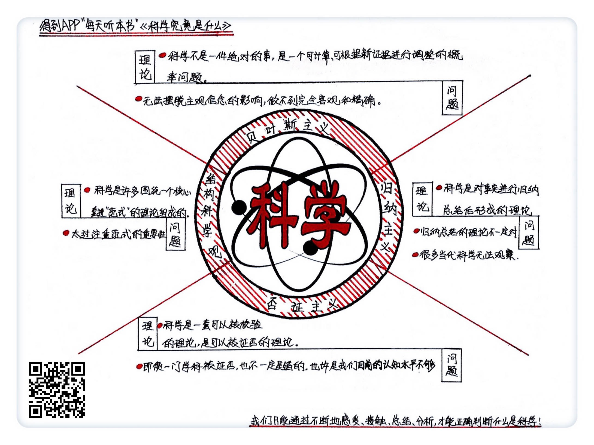

《科学究竟是什么》| 汪花生解读
==================================

购买链接：[亚马逊](https://www.amazon.cn/科学究竟是什么-A-F-查尔默斯/dp/B0012YS0IM/ref=sr_1_1?ie=UTF8&qid=1508077883&sr=8-1&keywords=科学究竟是什么)

听者笔记
----------------------------------

> 作者介绍了四种科学思想：
>
> 1. 归纳主义科学观：基于事实的总结和归纳，局限性在于事实的不足会影响结果正确性。
> 2. 否证主义科学观：认为科学应该是可以被证实的。即便被证明是错的，可能在一些范围内仍然是正确的。
> 3. 结构主义科学观：一套科学理论应当有一个核心的、被广为接受的“范式”。
> 4. 贝叶斯主义科学观：一套科学理论的对错不是绝对的，而是一个概率问题，通过寻找概率的条件，来不断调整概率。
>
> 本文和[《智识分子》| 王海解读](intellectural-thinking.md)中的一些观点相近。

关于作者
----------------------------------

A.F.查尔默斯，英国著名学者，畅销书作家，同时也是一位科学家。他本科、硕士、博士学的都是物理，还在弗林德斯大学哲学系做了很多年的访问学者。现在是悉尼大学科学史和科学哲学部的副教授。 

关于本书
----------------------------------

本书是科学哲学领域的必读书之一。查尔默斯在书中介绍了归纳主义科学观、否证主义科学观、结构主义科学观、贝叶斯主义科学观等多种科学思想，试图通过对不同科学思想的梳理，来考察科学的本质究竟是什么，科学到底有哪些特别之处。

核心内容
----------------------------------

不同的科学思想中对科学的定义不同，对科学本质的描述也各有侧重。在归纳主义科学观看来，科学是对事实进行归纳推理之后所得到的理论；在否证主义者看来，可以被检验的理论才能被叫做科学；在结构主义科学观看来，一门科学是遵循同一范式的多个理论的集合；在贝叶斯主义科学观看来，科学理论的对错未必是绝对的，而是一个概率问题。
 

一、归纳主义科学观
----------------------------------

归纳主义科学观认为，科学就是对事实进行归纳总结之后，所得到的理论。

这种观点也被称为“常识科学观”，有力地推动了现代科学的发展。

1. 科学是以事实为基础的

我们应当先观察事实，接受事实，再去建立一套符合这些事实的理论。

【案例】

伽利略通过比萨斜塔实验，证明了不同重量的物体具有同样的下落速度，推翻了亚里士多德的断言。这一案例被许多人视为现代科学的开端。
2. 通过观察和归纳总结，未必可以获得正确的结论

人类的观察受到多重因素影响，有可能出错。归纳推理这一方法本身在逻辑上也是不严谨的。

【案例】

伽利略曾提出过一种测量恒星直径的方法，这个方法在数学算法上是完全正确的，但由于人类观察的局限性，采用这种方法只会得出错误的结论。

二、否证主义科学观
----------------------------------

在否证主义科学观看来，科学是可以被检验的，并且有可能被证明是错的。如果一个理论无法被检验，或者无论怎么说都有道理，那就是伪科学。

1. 科学是可以被检验的

“可证否性”是科学必备的条件，一套不能被检验的理论是没有价值的。

【案例】

在星座学中，无论一个人的运气好不好，它都有一套解释。但这种解释太过宽泛，无法被检验，因此星座学就是伪科学。
2. 被证否的理论也未必就是错的

所有的理论在诞生之初都是不够完善的。由于人类认识的局限性，有些理论即使被证否，也未必就是错的。

【案例】

哥白尼所提出的关于地球公转和自转的理论，在几百年间一直被质疑，质疑者还提出了许多无法反驳的证据。但事后证明，这些否证只是人类认识不足的产物而已。

三、结构主义科学观
----------------------------------

在结构主义科学观看来，科学是许多理论在一起所组成的一套理论结构。一套科学理论应当有一个核心的、被广为接受的“范式”。

1. 一套理论是不是科学，就看它有没有核心“范式”

有核心范式的理论，就可以进行常态科学的研究，可以发展。没有核心范式的理论就不是科学。

【案例】

现代化学的核心范式是元素论，所有的研究都在这一范式下进行。而星座学等理论就没有一套被广泛接受的范式，因此是伪科学。
2. 过于注重核心范式会阻碍科学的进步发展

不同的科学范式所面对的问题，对事实的判断，都完全不同。在这种情况下，就算出现了一个新的范式，科学家也很难接受。

四、贝叶斯主义科学观
----------------------------------

贝叶斯主义科学观认为，一套科学理论的对错并不是绝对的，而是一个概率问题。

1. 可以利用算法来计算理论成立的概率

一套科学理论的对错是一个概率问题，我们可以根据新证据对理论的支持程度，来调整这个概率。

【案例】

在赛马比赛中，我们会根据一匹马的过往战绩等来判断它赢得比赛的概率。但如果我们发现这匹马受伤了或生病了，就会调整它获胜的概率。贝叶斯主义科学观对科学理论成立概率的计算，就跟这个过程类似。
2. 贝叶斯理论受到主观判断的影响，无法做到客观精确

在贝叶斯理论的算法中，我们必须要先给一个理论赋予一个概率，再来进行计算。而这个主观赋予的概率，会影响到最终结果。

金句
----------------------------------

1. 我们通过观察所得到的事实，并不一定都是可靠的。如果根据这些事实来进行推理，就得不出正确的理论。
2. 一套什么都能解释的理论，就是什么也解释不了。一套不能被检验的理论，就没有价值。一套不可能出错的理论，就是伪科学。
3. 所有成熟的科学，都要有一个处于核心地位的基础理论，要有一个被广泛接受的范式。
4. 一套科学理论的对错未必是绝对的，也有可能是一个概率问题。

撰稿：汪花生

脑图：摩西

讲述：孙潇