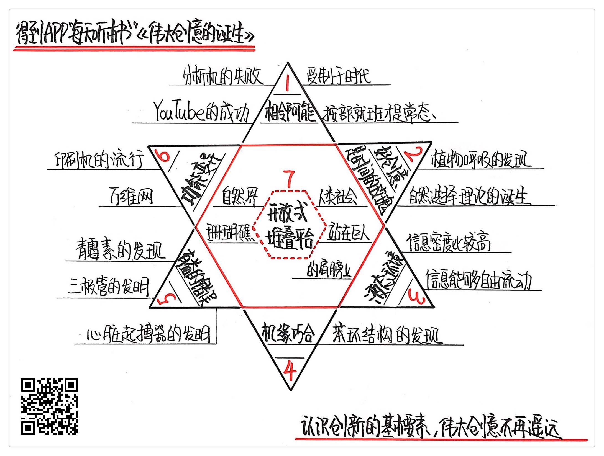

《伟大创意的诞生》| 田正赓解读
==============================

购买链接：[亚马逊](https://www.amazon.cn/图书/dp/B00MO11O7G/ref=sr_1_1?ie=UTF8&qid=1506607118&sr=8-1&keywords=伟大创意的诞生)

听者笔记
------------------------------

> 作者通过分析最近600年以来的人类创新史，总结出创新的七大关键模式：
> 
> 1. 创新受制于时代的相邻可能：创新通常依赖于同时代的一些其他东西的成熟，比如计算机和晶体管的技术密不可分。
> 2. 创新往往需要经过漫长时间的孕育：不一定是盯着一件事物很久，可能某个灵感在内心的深处搁置了，在合适它的时间，又会发光发热。
> 3. 创新来源于液态环境：液态相对于固态和气态，是个折衷态，这样的时机更可能成功。
> 4. 机缘巧合的力量在创新领域格外大：很多创新是灵光一现的结果。
> 5. 在创新领域，有时错误也是有益的：有时候某个错误会带来意想不到的结果。
> 6. 功能变异是创新一个捷径：事物之间可能是相通的，在第一个领域普通的事物可能颠覆第二个领域。
> 7. 开放式堆叠平台可以产生大量创新：站在巨人的肩膀上可以事半功倍。

关于作者
------------------------------

史蒂文·约翰逊，美国著名的科普作家和媒体理论家，被《展望》杂志誉为“数字化未来十大科技思想家”之一，他还被畅销书《乔布斯传》的作者沃尔特·艾萨克森称为是“科技界的达尔文”。他的著作大多聚焦在科学、技术和创新领域，多部畅销书还被译成10多种语言，在世界范围传播。而这本《伟大创意的诞生》正是他最重要的著作之一。 

关于本书
------------------------------

在本书中，约翰逊通过分析最近600年以来的人类创新史，总结出了关于创新的七大关键模式，向我们展示了人类创新的关键规律和所需条件。他告诉我们，现实中的创新不同于浪漫的幻想，绝大多数创新都严格受到时代背景的制约，并且需要经过长年累月的孕育才能够诞生。 

核心内容
------------------------------

本书的思想核心是：创新往往受制于时代背景，超越时代的创新难以诞生。长年累月的孕育也是创新最重要的条件之一，一瞬间的灵感不足以独自支撑起伟大的创新。信息环境对创新有很大的影响，而且机缘巧合和错误的尝试都对创新有着意想不到的益处。通过作者总结的创新七大模式，你可以更好、更真实地认识创新，摒弃对创新的种种刻板印象，甚至可以从现在开始尝试去进行创新。 
 

一、创新受制于时代的相邻可能
------------------------------

无论科学思想还是科学技术，按部就班地发展才是常态。人们往往幻想的那种可以推动人类往前发展几十年的天才创新，在这个世界上几乎不存在，时代背景严格地约束着创新的诞生。

查尔斯·巴贝奇被称为“现代电子计算机之父”。他曾经设计出来的一种叫做“分析机”的机器，是世界上最早的可以编程的计算机。尽管他把人生的最后三十年都用来去制作一台分析机，但是由于分析机原理太过复杂，在没有真空管和集成电路的时代，巴贝奇至死都没有让他的设计成为现实。

而 YouTube 的三位创始人就幸运得多，假如他们早十年，而不是在2005年建立这个视频分享网站，等待他们的注定是失败。因为1995年时，互联网网速还不足以支持视频的缓冲和下载，并且也缺乏成熟的视频播放平台，YouTube 不在当时的相邻可能空间之中。只有到了2005年，时代背景才能够支持一个伟大视频网站的诞生。

二、创新往往需要经过漫长时间的孕育
------------------------------

更多情况下，创新不是来自所谓一瞬间的灵感，大部分好创意的最终形成，都需要很长的时间。达尔文的自然选择理论，并不是来源于传说中的顿悟，而是经过漫长的思考才诞生的。实际上，在他最终总结出自然选择理论之前好几个月，就已经对这个理论进行了几乎完整的论述。而发现“植物能产生氧气”的普利斯特利，则将这个灵感孕育了20年。他在少年时期就有把蜘蛛关在玻璃瓶中的爱好，经过漫长时间之后，才最终成就了人类的伟大发现。

三、创新来源于液态环境
------------------------------

以分子间的反应为例，固态环境里，原子间结合太紧密，很难发生各种随机反应；气态环境里，虽然原子间结合不再那么紧密，但是原子间密度太低，发生随机反应的数量太少。所以这两种环境，都很难产生足够的有机物去形成生命，只有液态环境才是分子反应的最佳环境。

同理，创新也是如此，只有在信息密度比较高，信息又能够自由流动的“液态”环境里，创新才有可能大量出现。在城市诞生以前，人类的创新数量极少，而在城市出现之后，思想的交流碰撞促进了创新的大量产生，并且创新拥有了更好的流传环境。在这里，城市就可以看做人类社会的“液态”环境。

四、机缘巧合的力量在创新领域格外大
------------------------------

如果所有的东西都可以完全预测，不会出现意外的话，世界上也就不可能出现创新。意外和机缘巧合，都是创新很重要的来源。在科学界有一个很有名的故事，德国化学家凯库勒一次在梦中，梦到了一条蛇咬住了自己的尾巴，从而灵光一闪猜想出了苯分子的结构。如果不是凯库勒这个梦的机缘巧合，人类这个发现没准还会晚上很多年。

五、在创新领域，有时错误也是有益的
------------------------------

亚历山大·弗莱明因为一次实验的失误，而意外发现青霉素的杀菌效果；李·德福雷斯特因为错误的实验现象而发明三极管；格雷特巴奇拿错电阻器而发明心脏起搏器。你看，好创意很有可能出现在错误的环境里，很多错误对创新都是有益的。

六、功能变异是创新一个捷径
------------------------------

虽然活字印刷术最早是由中国的毕昇发明的，但真正让印刷机流行使用的，却是欧洲的发明家古腾堡。他把当时流行的葡萄螺旋榨汁机进行改造，让榨汁机变成了传播文化的印刷机。可以说，古腾堡并不是从无到有地发明了一种全新的技术，而是从另外一个完全不相关的领域入手，借用同一种技术去解决完全不同的问题。

七、开放式堆叠平台可以产生大量创新
------------------------------

这里的开放式堆叠平台，说的是很多创新都可以建立在某个平台上，一层一层地累积，不断创造出新的东西，创新者自己就不用再费力搭建一个平台了。比如 YouTube 的创始人，可以把自己的网站建立在 Flash 视频平台上；微信小程序的搭建者，可以把自己的创意建立在微信平台上；大量新媒体自媒体，可以把微博作为自己的主战场。这些创新者不需要掌握自己所在平台的构造和原理，只需要站在这些已经搭建好的平台上，就可以发挥他们的创造力。

金句
------------------------------

1. 人们往往幻想的那种，可以推动人类往前发展几十年的天才创新，在这个世界上几乎不存在，时代背景严格地约束着创新的诞生。
2. 更多情况下，创新不是来自所谓一瞬间的灵感，大部分好创意的最终形成，都需要很长的时间。
3. 没错，一个有经验的历史艺术家，能一眼看出来一个古代雕塑是不是赝品，一个老警察也能从茫茫人海中一眼发现形迹可疑的人，但是这种依靠直觉作出的瞬间判断，很少能够成为改变世界的好创意。
4. 你需要给灵感足够的营养，让灵感的根须和思想的肥沃土壤连接，然后给它时间，等待开花结果。
5. 仅占地球表面积千分之一的珊瑚礁，养育了至少上百万种海洋生物，原因就在于，许多生物能在这里创造性地共生，大量循环利用能量，从而让本来贫瘠的珊瑚礁变成海洋里的绿洲。

撰稿：田正赓

脑图：摩西

讲述：杰克糖