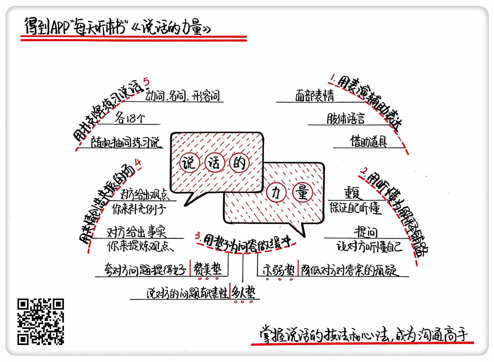

《说话的力量》| 乐多解读
=================================

购买链接：[亚马逊](https://www.amazon.cn/说话的力量-有效说服他人的策略和技巧-弗兰克·伦茨/dp/B01N9SM0WA/ref=sr_1_1?ie=UTF8&qid=1506607090&sr=8-1&keywords=说话的力量)

听者笔记
------------------------------

> 要想要“会说话”，作者认为可以参考以下5点：
>
> 1. 表达的过程，要富有感染力，要感动到对方。
> 2. 不要假设交流双方已经听懂，可以用复述的方式来确认。
> 3. 说对方爱听的（文中用“垫子”一词），赞美、多人（表示对方的观点是普遍的）、示弱……
> 4. 共情力，对方陈述观点，你可以帮他列举事实，对方陈述事实，你可以帮他总结观点。
> 5. 刻意练习，作者用扑克牌练习法。

关于作者
---------------------------------

这本书的作者叫孙路弘，是国内营销领域的大神级人物，也是美国领导力培训中心授证的高级讲师。他从2000年开始与营销大师科特勒一起工作，深得科特勒的赏识。孙路弘曾为包括奔驰中国、奥迪汽车、万科集团、光大证券、阿里巴巴在内的数百家国内外企业，提供营销咨询以及企业内部培训。

关于本书
---------------------------------

这本书不是空谈理论的教科书，而是一本能够直接运用到工作和生活中的操作手册。它将告诉你如何通过训练，切实提高自己的沟通能力。

核心内容
---------------------------------

想要让说话更有力量，你需要以下五个技能：用表演辅助表达、用听懂为解释铺路、用“垫子”为问答做缓冲、用共情创造共振的场以及用扑克牌练习说话。

一、用表演辅助表达
---------------------------------

表达，就是通过特定的语言和形式来阐述看法和观点。想让你的表达更吸引人，就不能只是简单地说一遍，而是要借助表演来强化信息，进而达到影响听者的目的。

表演的形式有很多，小到一个眼神、一种语调，大到一个手势、一连串的肢体动作。此外，你还可以借助道具来辅助你完成表达。

【案例】

乔布斯在苹果发布会上经常会用表演来为自己加分。在推出 OS X 系统以后，乔布斯专门为 OS 9 系统开了一场追悼会式的发布会。他在现场为躺在水晶棺里的 OS 9 系统献了一朵红玫瑰，还深情地念了悼词。这就是很典型的表演型表达，这样做会让观众印象非常深刻。

二、用听懂为解释铺路
---------------------------------

当矛盾和误会发生时，如何解释就是最见功力的地方。想要让你的解释发挥正面作用，你要先学会听懂——既要保证自己听懂对方，重复对方的话显示自己听懂了；也要让对方听懂自己，用提问核实对方确实听懂了。这样沟通下来，也就顺利地完成了解释。

【案例】

家用电脑刚刚走进中国时，本书作者曾在一家电脑公司辅导售后电话服务。有一次，一位用户打来电话，说他上不了网了，问是怎么回事。客服先是问用户“猫”正常吗，又让客户找“我的电脑”，可是对方根本不明白这两个术语，整个沟通就是鸡同鸭讲。

正确的做法是，用提问来核实对方有没有听懂。客服可以这样问，“我现在在说的是屏幕上的东西，您把鼠标往左下角挪，有一个开始键，看见了吗？”直到确认用户正确地找到了，这样才算顺利完成一次解释。

三、用“垫子”为问答做缓冲
---------------------------------

这里说的“垫子”，就是指在双方说话时加上隔层，目的是创造舒服的说话环境和氛围。这个垫子起到缓冲作用，它能有效缓解你问我答的紧张状态。

有时候，这个垫子可以是赞美，简单说就是夸对方问题问得太好了；有时候，垫子可以是“多人垫”，就是说对方提的问题很普遍、很有代表性；还有一种垫子叫“示弱垫”，就是在回答问题之前，把自己的处境讲出来。为什么这么做呢？因为每个人的潜意识里都希望自己比别人强，你先示弱，就会更容易赢得对方的好感，降低对方对答案的质疑。

【案例】

当年有一个西方记者问周总理：中国人民银行有多少资金啊？这个问题带着明显的火药味，只听周总理回答到：“你这个问题确实不简单，有难度。”其实这就是一个垫子，它可以让记者收一收锋芒。

四、用共情创造共振的场
---------------------------------

这个方法说白了就是迎合。通过共情，快速对对方语言中的事实、观点进行逻辑分析，通过补充对方说的话等手段使对方认可自己。

在日常沟通情景里，怎么去迎合呢？很简单，如果对方说的是看法和观点，你就补充一些符合他观点的现象；如果对方陈述的是事实，那你就把他的事实做一个总结和概况，提炼出一个观点。这样做可以快速拉近你和对方的距离，并且让对方觉得自己说得很有道理。

【案例】

同事小王跟你说：“今年夏天可真够热的！”你说：“啊，是热，呵呵。”然后聊天就此终止，没法继续。其实小王说的是个人看法，也是一个结论，这时你可以接着说：“可不是，43度呢，40多年来最高纪录了！”这样你就为他的结论补充上一个具体的事实，他就会觉得跟你有共鸣。

五、用扑克牌练习说话
---------------------------------

怎么做呢？随意找出名词、动词、形容词各18个，三类词总共凑成54个，18个形容词里面再分成9个褒义词和9个贬义词，把这些词打印在纸上，剪下来贴到扑克牌上，这样就做好了一副沟通扑克牌。

练习的方法：随便抽一张牌，用牌上的词语造句。比如牌上写的是“优秀”，你就用“优秀”来口头造句，注意必须是复杂的疑问句，比如说：“每个企业中都有优秀的员工，也有平庸的员工。那么，如何判断一个员工是否优秀呢？”接着再抽一张牌，然后用第二张牌上面的词去回答刚才你提出的问题。比如你又抽到了一张“学习”，就可以这样回答：“我们公司是从三个角度来评价一个员工是否优秀的。首先，这个员工要有上进心，追求卓越，这是他不断进步的前提条件；其次，他学习能力要强，这样才能跟上时代的步伐；最后，他还要服从组织管理，尊重他人，有团队合作精神。”这样，才算完成了一轮说话训练。

当你已经能够熟练地用一个词语说出一大段话之后，就可以继续用两张甚至三张牌来练习了。你还可以再限制话题，提高训练难度。这样反复操练，直到你可以自然流畅地回答问题，并且能够引出新的问题，一直持续下去。    

金句
---------------------------------

1. 对于今天社会上的绝大多数人来说，说话决定发展，说话决定命运。
2. 每一个个体有机会发言的时候，其实都是对自我的一种营销，通过传播来影响大众、影响消费者，每个人都应该学会从沟通开始管理自己的传播。
3. 任何人都可以训练出卓越的沟通能力。

撰稿：乐多

脑图：摩西

讲述：于浩