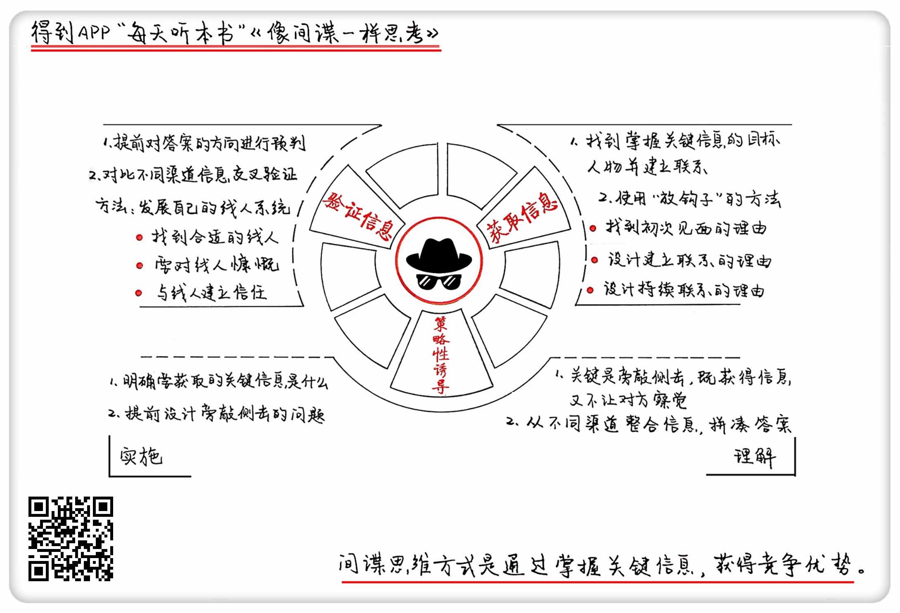

《像间谍一样思考》| 成甲解读
==================================

购买链接：[亚马逊](https://www.amazon.cn/像间谍一样思考-CIA情报官首度公开出奇制胜的商业技巧-J•C•卡尔森/dp/B00EF12E5Y/ref=sr_1_1?ie=UTF8&qid=1508397024&sr=8-1&keywords=像间谍一样思考)

听者笔记
----------------------------------

> 在商业和生活中，可以运用间谍的思路来获得竞争优势。这里作者主要想要说的是，如何获取更有效的信息。
>
> 有效的信息，通常掌握在关键人物手里，所以要先知道谁是关键人物，然后通过“放钩子”（投其所好）的策略和关键人物搭上钩。
> 
> 通常不能上来就直接问想知道的信息，这样通常都得不到想要的答案，可以通过策略诱导的方式来获得信息，可以旁敲侧击，也可以整合各种琐碎的信息。为了更好地完成这个步骤，就需要明确目标，提前设计。
>
> 通过对答案的预判，同时掌握多方渠道的信息，来综合判断所获得的信息是否准确。

关于作者
----------------------------------

J.C.卡尔森，前美国中情局特工。她毕业于康奈尔大学，曾在星巴克、百特国际、泰克等公司工作，之后在美国中情局工作八年。当她离开中情局再次回到平常生活中发现，在今天的商业社会里，间谍的思考方式同样能给人们带来竞争优势。

关于本书
----------------------------------

本书披露了美国中情局间谍的工作方式，教你运用间谍思维在商业和生活中获得竞争优势。

核心内容
----------------------------------

一、如何找到并与拥有核心信息的目标人物建立联系；二、如何让目标人物说出你想知道的事情；三、如何确保获得的信息真实有效。
 

一、如何找到并与拥有核心信息的目标人物建立联系？
----------------------------------

1. 两个难点

（1）如何找到目标人物？关键在于确定是谁掌握重要情报。

（2）如何与目标人物建立联系？使用“放钩子”的方法。

【案例】美国中情局通过房东获取恐怖组织的情报。

2. 放钩子

钩子，指和对方认识的机会，以及对方可能对你感兴趣的事情。整个放钩子的过程，有三个步骤：

（1）找到初次见面的理由；

（2）设计建立联系的理由；

（3）设计持续见面的理由。

【案例】小马宋认识罗振宇老师的经历。

二、如何让目标人物说出你想知道的事情？
----------------------------------

1. 策略诱导

（1）核心是旁敲侧击，避免直接问对方要答案，既获得信息又不让对方察觉。

（2）从不同渠道整合信息，拼凑推导出你想要的答案。

【案例】某国通过策略诱导从不同渠道获取美国导弹防御系统的信息。

2. 策略诱导的两个关键

（1）明确要获取的关键信息是什么。

（2）提前设计旁敲侧击的问题。

【案例】应聘者通过巧妙的设问让面试官无意中透露了用人标准。

三、如何确保获得的信息真实有效？
----------------------------------

1. 提前对答案的方向进行预判

在生活中进行思维训练，训练自己在短时间内对信息快速预判的能力，并对比真实情况不断提升预判的准确率。这个方法属于经验判断，要注意存在误判的情况。

2. 对比不同渠道信息交叉验证

对比不同渠道信息进行交叉验证，并在第一时间作出反应，方法就是发展自己的线人系统。

（1）找到合适的线人。

（2）要对线人慷慨。

（3）与线人建立信任。

【案例】三国司马懿装病严防奴婢泄密。     

金句
----------------------------------

1. 间谍思维，是一种通过获取重要信息而获得更多竞争优势的新思维。
2. 在埋头努力工作之余，要重视情报和信息的作用，它们能够给我们带来竞争优势。
3. 策略诱导的关键在于旁敲侧击，既获得信息又不让对方察觉。
4. 和关键信息有关的人物都可能成为你的线人，那些看起来越不起眼的基层人员越可能是合适的线人。
5. 为情报付费，不是看情报人员有多值钱，而是看你要做的事有多值钱。

撰稿、讲述：成甲

脑图：摩西