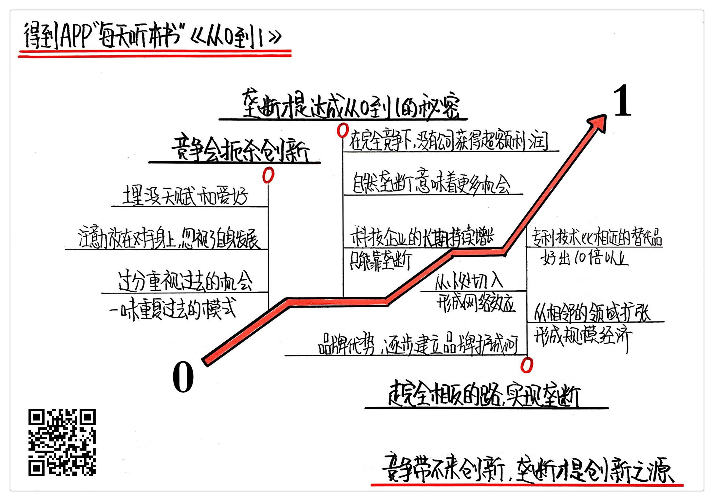

《从0到1》| 大卫解读
================================

购买链接：[亚马逊](https://www.amazon.cn/从0到1-开启商业与未来的秘密-彼得·蒂尔/dp/B00RWP6BOU/ref=sr_1_1?ie=UTF8&qid=1509111346&sr=8-1&keywords=从0到1)

听者笔记
--------------------------------

> 彼得蒂尔认为竞争会扼杀创造性、会分散精力、造成低水平的重复和跟风。
>
> 垄断是达成0到1的秘密。垄断者可能会假装自己是弱者，而避免被认为是垄断。垄断可以为创新赢得空间和时间。
>
> 要实现垄断，就需要：有专利技术、从小的切入点进入、且必须是一个普遍的领域借助规模效应达到垄断目的、要建立生态借助生态的力量巩固自己的垄断地位。

关于作者
--------------------------------

彼得·蒂尔，硅谷著名的创业者，曾在1998年创办了 PayPal，并在2002年以15亿美元出售给 eBay。后专注于金融投资和创业投资，曾投资过 Facebook 等著名企业。

布莱克·马斯特斯，2012年在斯坦福大学法学院就读时，选修彼得·蒂尔的“初创企业”课，把课堂笔记发布到网络后引发200多万次点击。这本书就是根据这份笔记修改、编辑成的。

关于本书
--------------------------------

这本《从0到1》是最近两年最火的商业畅销书之一，它不是一本单纯讲述创业方法论的工具书，而是一本创业哲学书，书中对创业圈的很多流行观念做了深刻的反思。这本书出现之后，很快就被扎克伯格、埃隆·马斯克、周鸿祎、徐小平、刘强东等商业圈大佬推荐。

核心内容
--------------------------------

在传统时代，成功企业的商业模式是一个从1到 N 的过程，也就是在现有的基础上，复制之前的经验，通过竞争不断扩大自己的市场影响力。而在互联网时代，成功的企业却是一个从无到有、从0到1创造市场的过程，要实现这个过程，必须规避竞争、建立垄断。
 

第一、经济学对市场竞争的鼓吹误导了创业者，竞争其实会扼杀创新
--------------------------------

1. 彼得·蒂尔年轻的时候，曾痴迷于竞争，他考上了著名的斯坦福大学法学院，年年拿奖学金，标准的三好学生。但是，他毕业那年去考最高法院的书记员，结果没通过。但幸亏他当年竞争失败了，不然就不会后来创立 PayPal，走上另一条道路。彼得·蒂尔从自身的经历上，看到了竞争造成的可怕后果。
2. 竞争会让你把注意力都放在竞争对手身上，忽视了自己的发展。当年谷歌崛起的时候，对微软造成了很多威胁，两家企业大打出手。谷歌去做浏览器、操作系统、办公软件，微软去做搜索，这两家争斗的结果是什么呢？坐山观虎斗的苹果冒出来了，而且一举压倒了他们的优势。2013年，苹果的市值比谷歌、微软加起来都多。
3. 竞争还会造成非常低水平的重复和跟风。你看现在的智能手机市场，每年出的品牌旗舰机越来越像，处理器、摄像头、指纹解锁，几乎都是一模一样。原因就是智能手机这个市场竞争实在是太激烈了，大家都在低水平地重复过去的策略，没有人有空创新。
4. 经济学家对竞争的推崇，其实源于物理学，物理学研究的是系统和各部分之间的关系，发现各部分经过博弈最终趋于平衡。经济学借鉴了这套逻辑，推崇市场内的企业、个体充分竞争达到平衡。但实际情况是，商业世界是动态的，无法像物理模型那样不受干扰，所以这个理论是错的。

第二、创业成功的标志是建立垄断，垄断才是达成从0到1的秘密
--------------------------------

1. 美国所有航空公司每年运送几百万人，这为美国创造的价值比谷歌要更大。但谷歌的市值比所有航空公司加起来都要高，航空公司从每位乘客身上赚37美分，谷歌的利润率是航空业的100倍。这里面的根本原因在于，航空公司是竞争激烈的，而谷歌在搜索领域是垄断的。
2. 普通人很少感觉到谷歌垄断，是因为谷歌把自己打扮成一个弱者。比如，政府说谷歌占了全球搜索市场的68%是垄断，谷歌就会说它的收入95%靠广告，而在广告行业，谷歌只是一条小得不能再小的小鱼。甚至，它会把自己定位成科技消费品公司，那谷歌的市场占比几乎可以忽略不计了。
3. 垄断可以为创新带来空间。谷歌因为处于绝对的垄断地位，不担心其他竞争对手的追赶，有充分的自由和空间去探索更多的可能性，比如无人驾驶、人工智能。就算谷歌的座右铭“不作恶”，也是垄断者的专利，一个追赶者根本没有余力去思考道德规范。
4. 科技行业的模式是前几年亏损烧钱，盈利需要一个长线来实现。这就意味着，创新必须放弃短期利益，追求一个长线的目标。从这个意义上来说，只有垄断才能实现创新，才能创造创新所需要的不看短、看长的环境。

第三、要想实现垄断，要避开主流的创业方法论，走完全相反的路
--------------------------------

1. 要实现垄断，必须要有专利技术，而且这种专利技术必须要比竞品好出10倍以上。这就是说，发现市场上的产品的弱点和漏洞，补上这个漏洞，这种做法是很难实现垄断的，因为改良思维造不出好10倍以上的产品。
2. 一个好10倍以上的产品，在执行层面要从小切口入手。比如 Facebook，从哈佛大学的校园起家，第一批用户是哈佛的大学生，然后扩展到其他的常春藤大学学生，之后才扩展到全美的所有大学生人群，最后才开放面向全社会，这是一个一步一步扩张的过程。
3. 需要注意规模效应。eBay 也是从小小的拍卖市场开始切入做线上交易的，但它并没有像亚马逊、淘宝一样长成巨无霸的企业，最重要的原因是拍卖是个小市场，拍卖的东西都是邮票、钱币一类的小物件，这些物件的交易逻辑和日常消费品不一样，很难从拍卖小物件扩展到日常购买。
4. 形成内容生态系统，可以帮你打造品牌优势。苹果之所以在全球智能手机市场独领风骚，不仅是因为苹果的专利技术或者产品设计，更重要的在于，它有一个内容生态系统，有了亿万用户之后，会有很多开发者在苹果手机的系统里开发应用软件，这都能帮助苹果公司扩大自身的优势。

金句
--------------------------------

1. 竞争会让你把注意力都放在竞争对手身上，忽视了自己的发展。
2. 不存在完美的市场均衡，在经济理论之外的现实世界里，每个企业的成功，恰恰是因为它打破了均衡，它做到了其他企业不能做的事情，也就是从0到1的事情，而不是它跟其他企业做一样的事儿。
3. 谷歌把自己定义成什么，取决于什么能给它省去麻烦，不被人攻击是垄断。你觉得它不垄断，是因为它成功转移开了你的注意力。
4. 如果你不处于垄断地位，你就只能着眼于短期的利益，不可能对未来进行长期规划，所以你每天都是在苟延残喘。
5. 要想实现垄断，要避开主流的创业方法论，走完全相反的路。

撰稿：大卫

脑图：摩西

讲述：孙潇