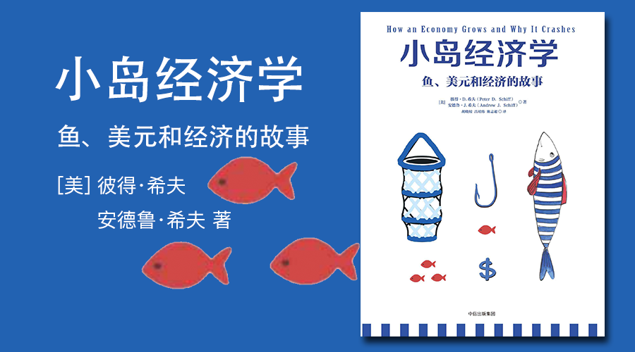

小岛经济学
========================================

鱼、美元和经济的故事

How an Economy Grows and Why It Crashes

[美]彼得·希夫（Peter D. Schiff）、安德鲁·希夫（Andrew J. Schiff）著

胡晓娇 吕靖纬 陈志超 译

推荐序
----------------------------------------

作者：时寒冰

当下中国面临的困境：

1. 不加息，流动性泛滥，通货膨胀必然日益严重。
2. 加息，由于不能对政府投资产生足够的影响力，反而加速了民营企业的大面积死亡，而这些企业所提供的商品恰恰是市场所需的。这意味着，当这些生产企业次第倒闭，供应减少，反而会加速中国的通货膨胀！

而产生这些局面的原因在于：

政府成为经济的主导者，成为经济的主角。这种困局只有当政府的职能从主导经济向提供公共服务的角色过渡以后，才能真正得以改变。

对经济的过度干预，是催生天量货币不断被滥发的根源。

珍藏版序言
----------------------------------------

序言
----------------------------------------

写在前面
----------------------------------------

第一章 一个好点子出炉了
----------------------------------------

第二章 把财富分享给别人
----------------------------------------

第三章 信用卡的多种用途
----------------------------------------

第四章 经济到底是如何发展的
----------------------------------------

第五章 在鱼被指定为货币之后
----------------------------------------

第六章 为什么会有储蓄
----------------------------------------

第七章 基础设施与贸易
----------------------------------------

第八章 一个共和国就这样诞生了
----------------------------------------

第九章 政府的职能开始转变了
----------------------------------------

第十章 不断缩水的鱼就像货币一样
----------------------------------------

第十一章 中岛帝国：远方的生命线
----------------------------------------

第十二章 服务业是如何崛起的
----------------------------------------

第十三章 “鱼本位”的破灭
----------------------------------------

第十四章 棚屋价格是如何涨上去的
----------------------------------------

第十五章 快了！快了！棚屋市场要崩溃了
----------------------------------------

第十六章 情形怎么变得如此糟糕
----------------------------------------

第十七章 缓兵之计
----------------------------------------

第十八章 占领华孚街
----------------------------------------

第十九章 无鱼不起浪
----------------------------------------

后记
----------------------------------------

致谢
----------------------------------------