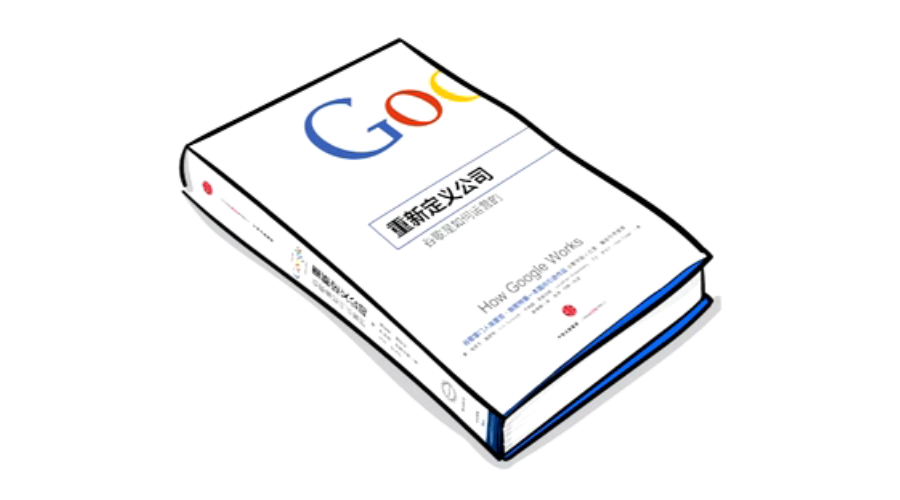

Google 重新定义公司（谷歌是如何运营的）
==================================

作者：埃里克·施密特

第一章 文化：相信自己的口号
----------------------------------

企业文化应该是在企业创立之初就应该非常认真地思考，并在企业的运营过程中，被认同并执行。谷歌所奉行的很多企业文化，如“着眼于长远”、“为用户服务”、“不作恶”以及“让世界更美好”等，依旧是谷歌行事方式的真实写照。

谷歌的办公环境相对拥挤，但设置了很多游乐设施场所。他们认为在拥挤的办公室里更容易促成沟通激发活力，而当你需要休息的时候，则可以选择在咖啡馆和小型厨房里僻静的位子上休整。

将不同职能的员工混合安排座位，更有利于每个人都能从不同的领域汲取经验，在互联网时代，产品经理懂管理、懂技术才能把最符合用户需求的产品打造出来。

谷歌在办公资源的配置上能省就省，那些凌乱的办公摆设也是员工创意不受限制的一种表现，办公室涂鸦甚至成为了一种文化。而对于员工工作中必须用到的资源，如数据中心、整体软件平台等，则不惜倾力投入。

网景公司前首席执行官吉姆巴克斯代尔有一句话：“如果我们手上有数据，那就依数据行事。如果大家只有想法而没有数据，那就按我的想法办。”这种思路也反映了不能让企业中弥散着“屁股决定脑袋”的事情，如果因为员工三缄其口而让不尽如人意的构想占了上风，那么这些员工也难辞其咎。谷歌是一家“不看身份地位，只看实干成绩”的企业。

企业经常将组织结构的调整作为解决企业问题的方法，但最终并没有一种最优的方案能一劳永逸。谷歌为了能够达到扁平，以减少沟通成本，采用“7的法则”来作为一般性指导。当管理层桌上的文件不少于7份的时候，管理者哪还有闲工夫对你的工作事事插手呢？

谷歌坚持以职能划分部门（垂直管理），而不以业务或产品线为基础，因为这样会造成“各成一家”的局势，从而对人员和信息的自由流动形成扼制。而从公司收益的角度，那些不盈利的业务线则不再潜心研发那些能为企业真正赢利的高质量产品，而是一心盘算着如何提高会计等式结尾的那几个阿拉伯数字。

完美的组织机构是不存在的，不必枉费心机去苦心设计，你只需尽力做出接近完美的设计，剩下的事就让你的创意精英们去完成吧。

亚马逊创始人杰夫贝佐斯的“两个披萨”原则：团队人数不能多到两个披萨还吃不饱。这是从效率、凝聚力等方面考虑的。

苹果公司前人力资源主管黛比碧昂多利洛：你的头衔可以让你成为管理者，但让你成为领导者的，是你的员工。一旦找出了最有影响力的人，就应当赋予他们重任。把担子交到你最出色的员工手里时，你要相信他们会乐于承担，达到极限时他们会如实告诉你。

一家企业的品格是所有成员品格的总和，因此如果你想打造一家高品格的企业，就必须要求员工也有高品格。你不能给恶棍留任何钻空子的机会。汤姆彼得斯：所谓的“小恶”是不存在的。

最理想的企业文化会让员工无论在家或办公室都有许多有趣的事情去做，这是在鼓励大家以合理的方式“过度工作”。把控制权交到创意精英的手上，他们通常会自己找到工作和生活之间的平衡点。

康涅狄格大学前校长、美国学者迈克尔霍根：说“好”，是我的第一条忠告。这个字说得越多越好。“好”能帮你大忙，“好”能够促进事物的发展，“好”能带来新的体验，而新的体验能让你获取新的知识与智慧……在这个变化无常的时代，说“好”的态度可以伴随你披荆斩棘。

多数企业都试图制造“快乐”，但其实快乐都不是强扭的乐趣，快乐是无法伪装的。那些团建活动、奢侈的消费都不是快乐的必然因素。那些设计精良的团队建设活动往往包括了绳索课程、烹饪课程、性格测试以及解决团队问题。而谷歌认为在拓展活动的时候就不应该去考虑“团队建设”，让大家好好去玩就行了。

对现有的企业文化做出改变对一家企业的成功更为关键，因为对于大部分创意精英而言，停滞不前、流于形式的企业文化就是他们的大敌。

领导者们践行了平等理念：我们同舟共济，职责共担。因此类似于“冲啊”的口号会被“跟我来”所取代。

每一家企业都应该“不作恶”，这句话就如北极星一般，为管理方式、产品计划以及办公室政治指明了方向。

营造根基扎实的企业文化，最根本的价值就在于此。这成为你于企业行事的基础，也能防治企业偏离正确的轨道——因为企业文化本身就是正确的轨道。

第二章 战略：你的计划是错误的
----------------------------------

只要是MBA式的商业计划，无论经过怎样的深思熟虑，一定在某些方面存在硬伤。成功的团队懂得如何发现计划中的瑕疵，并及时做出调整。

用基于技术洞见的创新方式解决重大难题，优化规模而非收入，让能影响每个人的优秀产品带动市场增长。所谓的技术洞见，是指用创新方式应用科技或设计，以达到生产出来的产品，可以与同类竞争产品拉开显著差距。

大多数情况下，技术洞见都来之不易，因此多数企业都不愿意以技术洞见为企业战略的基础，而是运用传统的MBA模式依据企业的最有利条件（竞争优势）来做决策，并利用最有利条件扩张到邻近市场。如果你的企业已经在运转中，且用利润百分比来衡量企业的业绩，这样的手段的确非常有效。但如果你仅仅想靠发展企业竞争优势来占领相关市场，那么你绝不可能敲开行业大门或实现业务转型，也休想将最优秀的创意精英招入麾下。

如果你是一家墨守成规、对市场占有率的数字斤斤计较的企业，那么渐进式的创新方法已经绰绰有余了。但如果你想从事一番新事业，或是对既有企业实施改革，那么这种方法的力量就稍显不足了。

诺贝尔经济学奖得主罗纳德科斯：如果在企业内部组织的一笔额外交易与通过在公开市场上完成同一笔交易或是在另一个企业中组织同样交易的成本相同，企业将倾向于扩张。但是现在企业不再对封闭式的体系进行最大限度的扩展，而是将越来越多的业务外包出去，与更多且更多样化的合作伙伴建立网络。唐塔普斯科特在《维基经济学》一书中说得好：“互联网的出现，使交易成本急剧下滑。现在我们应该把科斯法则倒过来：如果企业内部交易的成本不再高于外部交易的成本，企业将倾向于缩小。”多数企业采取这种方式纯粹是为了方便运营和降低成本：通过将工作外包给劳动力较为廉价的市场，企业可以削减成本。但是，企业忽略了重要的一点：在互联网时代，创建网络不仅仅是为了降低成本和方便运营，更是为了从根本上提高产品质量。重视了后面这一点，才能把握住巨大的良机。（专业的事情让专业的人/团队去完成）

开放和封闭都能实现规模和利润的双丰收。开放，虽然放松了控制权，却换来了规模和创新。开放有助于吸收创意也可以降低互补性元素的成本。开放还可以让成千上万的人才为你所用。开放也证明了无所隐瞒，是不作恶的有力证明。开放也让用户享受了自由，来去自如，反向鞭策员工只有对产品付出努力才能留住用户。而封闭则强调了控制权，苹果基于自己非同寻常的技术洞见也得以成功。

不要被竞争对手牵着鼻子走。必须以你的敌人为傲，这样，敌人的成功就能变成你自己的成功。但不要追随他们。

第三章 人才：招聘是你最重要的工作
----------------------------------

招聘方式需要投入许多时间和精力，但即便如此，这也将是你最好的投资。

招聘A级的人，它们会招揽来A级的人，招聘B级的人，则有可能招来C级和D级的人，用这种羊群效应来招聘最优秀的人，避免团队混入害群之马。

寻找有激情的人，而不是仅仅把激情挂在嘴上的人。寻找学习型的人，并让他们继续学习。

谷歌范儿也是招人的条件：上进心和抱负、团队精神、服务精神、倾听及沟通能力、行动力、效率、人际交往技巧、创造力以及品行等特质。

客观评价人才，而不仅仅是寻找与自己一摸一样的人，让一家企业听到各不相同的观点，恰恰也是避免失败的一种方法。寻找这种和你在智慧、创意以及谷歌范儿的其他方面势均力敌的人，进行思想上的碰撞，也会让团队受益。

在筛选人才的时候，应该放大眼光，不应局限在一些特定技能的人身上。有一些在目标技能上可能不是完全符合的人，因为拥有非常出众的才华（别的领域），也可能是合适的人选。

每个人都有认识一些创意精英，鼓励全员进行招聘而不是把招聘局限在招聘官身上，将为企业笼络更多有用的人才。

面试是最重要的技能，要将面试的时间控制在30分钟，并且不要超过4轮的面试，过多的面试次数只会增加选人的成本，而提供不到1%差异化建议。

在谷歌，我们从四个方面对应聘者做出评价：领导力（团队协作以及对团队的贡献）、职务相关知识（专业知识）、一般认知能力（思维方式）、谷歌范儿/个人特质（不斤斤计较、敢于行动、乐于合作等）

在招聘中使用大量的数据作为评判的标准，坚持宁缺毋滥的原则。

给优秀人才超出常规的回报，但并不是指应该大手笔的给新入职的员工高薪，而是要在实际的工作过程中给优秀的人才足够的上升空间。

为了避免员工过于安逸而选择离职，就要为他们准备充实的工作和刺激的挑战，但即便如此他们还会选择另谋高就。要尽力挽留那些明星员工，并帮助他们找到在公司继续发展的职业规划，如果还是执意要走，就应该对他的新工作表示祝贺。

你的团队里有没有即便告知你想要离职，你也不想努力挽留的人呢？那么就要审视招聘环境的漏洞，看看是怎么把他们招聘进来的。

第四章 决策：共识的真正含义
----------------------------------

美国哲学家兼作家约翰杜威：把问题解释清楚，就如同问题解决了一半。

会议上达成共识的意思不是大家一致同意，而是要达成对公司最有利的决策，并围绕决策共同努力。

要以数据来做决策，并且要设立最后期限，必要的时候将决策交给别人来做（特指CEO把决策交给创始人）。如果你是一个CEO，你就不应该多做决策，而是分析数据、鼓励讨论、引导大家达成共识、凭借你过人的才识做出决策。

会议规模应以便于管理为宜。与会的每个人都应有权发表自己的意见，如果其他人必须要对会议结果有所了解，那么应该把会议的结果传达给他们，而不是让他们来当会议的旁听者。会议中如果有旁听者在场，会影响会议质量，还会让大家对畅所欲言有所顾虑。

第五章 沟通：当最牛的路由器
----------------------------------

婉转地向权威者传达坏消息有几个建议：事后讨论会，让全体成员聚在一起讨论哪些做对哪些做错了，然后公布讨论结果让大家知悉。讨论的过程是最大的收获，不要错过鼓励公开、透明、诚恳沟通的机会。

现在的企业要求管理者能够掌握细节，这些细节可能不是从下级管理者那里获得的，因为那通常是有悖于真相的细节。为具体干事儿的人营造一种讲真话的安全的环境对于获得细节也有很大的帮助。

作为管理者可以每周留出几个小时的“接访时间”欢迎任何人来谈心，这样就能洞察具体的问题。

有时候为了传达某个理念，需要长达甚至20次的重复。但即便如此也有可能失效，所以沟通的技巧非常重要。你是否传达了深入人心的核心理念呢？你的沟通方法是否有效？是否有趣、鼓舞人心？发自肺腑？沟通对象是否合适？沟通媒介是否合适？

做自我评价或者让手下来给自己提意见，都有助于自我改进，也能让自我评价形成一种风气。

董事会成员应该讨论战略和产品，而不是管理方式和诉讼纠纷。

企业与合作伙伴之间的关系，必须认识到彼此之间的不同，还应承认和接受这些不同是无法根除的。与你合作的国家或企业同样有权拥有自己的理论体系，他们的价值观与你一样根深蒂固，因此，如果要建立有效的合作关系，就必须把你的道德评判标准搁置起来。

埃里克遵循“三周原则”，也就是说在接受新职位的前三周里，你不必做什么。你只需要听取大家的心声，看看他们的问题和关注点在哪里，了解他们、关心他们、赢得他们的信任。其实你并非什么也没有做，因为你正在为良好的关系奠定基础。另外，不要忘记为大家带来笑容。在管理中，人们对赞美的使用不足，也低估了赞美的价值。该赞美的时候，不要吝啬。

第六章 创新：缔造原始的混乱
----------------------------------

苹果公司崇尚控制的模式之所以有效，不仅是因为乔布斯过人的能力，也与他组织企业的方法有关。与谷歌一样，苹果的领导者也是拥有科技背景的产品研发人员。如果你能召集一群顶尖的创意精英，再指派这世界上数一数二的创意精英负责管理，那么你所做的决策十有八九是正确的。在这样的前提下，严格的控制模式就能激发出无穷的创造力。

如果你的能力与乔布斯不相上下，如果你也拥有常人难以企及的直觉和洞见，那么你就应该大胆去走他的路。但如果你仅仅是跟我们一样的普通人，那么在这里，我们提供了几条别的创新途径供你尝试。

创新的东西不仅要新颖、出人意料，还要非常实用。

首席执行官必须兼任首席创新官，创新不是某个团队的事情，应该是全员的事情，创新这件事情，指派专人负责是不行的。

在设计产品的时候必须要聚焦用户，在互联网时代，用户的信赖非常重要，要让企业获得持续的成功，除了依靠产品质量以外别无他法。

“你想得不够大”这句话可以用来刺激工程师和产品经理，以避免拘泥于老旧闭塞的思维方式。同时拥有大胆想法的创意也是留住创意精英的好办法。

将70%的资源配置给核心业务，20%分配给新兴产品，剩下的10%投在全新产品上。没有什么比过度投资更能损害创意的发展。建筑大师弗兰克劳埃德赖特所：人类建筑的最为辉煌的时期，就是那些限制最多的时期。

谷歌“20%时间”工作方式，允许工程师拿出20%的时间来研究自己喜欢的项目。该制度的重点在于自由，而不在时间长短。

创意无处不在，不仅局限在管理者，也不局限在员工，作为一款互联网产品应该放眼全世界，公司以外的资源。

采用交付-迭代的方式，尽快将产品推向市场，在得到正向反馈之后再决定加大投入。这不是指可以随便将糟糕的产品推向市场，而是可以在一开始推出功能有限制但是仍然卓越的产品，等到市场认同这款产品之后，再加大对它的投入。而错误的思想是，一款产品已经投入了巨大的资金，只有继续投入才能挽回它。以数据为据，则可抵制此谬误的诱惑。

世界上多数伟大发明的最终用途与最初设想都是天差地别的。因此在放弃一个项目时，要仔细审视其组成部分，看看有无可能重新投放在其他领域。拉里说过，如果你的眼光够远大，那就很难全盘皆输。失败中往往会隐藏着珍宝。

结语
----------------------------------

随着21世纪的到来，我们也迎来了一个新旧更迭的时期，这与19世纪西方国家由封建经济转为工业经济的历史异曲同工。

如果企业继续延续老路，仅仅把科技当成提高经营效率和扩大收益的工具，而不借助科技的力量脱胎换骨。仍然扭转不了败局，因为科技和变革的力量势不可挡。

政府应该鼓励破坏性创新，而不是制定严格的法律法规保护现有企业的利益。如果实际数据表明新的方法要优于老旧的方法，那么政府就不应该阻碍变化。

信息的爆炸性增长以及信息的处理速度提升都将帮助做出正确的决策。

拥抱这些新出现的技术，那些传统行业不仅能在竞争中获得新生，而且未来一片光明。