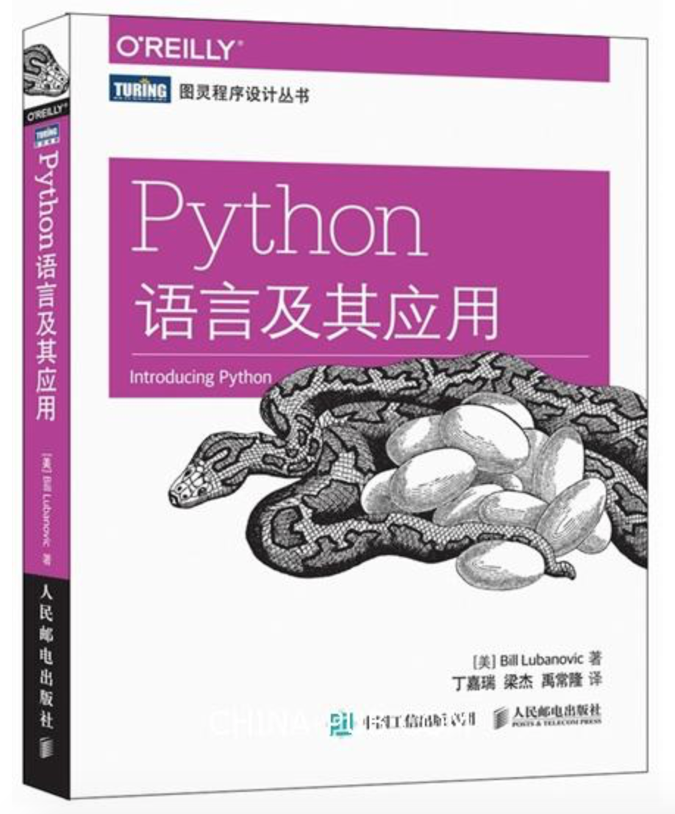

Python语言及其应用
============================================

Introducing Python

[美]Bill Lubanovic著
丁嘉瑞 梁杰 禹常隆 译



前言
--------------------------------------------

介绍了本书的每一章节的主体内容。总体来说，这本书是面向初学者的读物。

第1章 Python初探
--------------------------------------------

### 1.1 真实世界中的Python

Python无处不在，从命令行、图形界面、移动设备、甚至是云都存在。既可以写简单的代码，也可以写复杂的产品。

### 1.2 Python与其他语言

- shell：超过百行后扩展性差，比其他语言速度慢
- C/C++：难学，很多细节需要自己处理，因为太难了所以容易引起问题，重视性能
- Java：比C/C++简单容易，但是代码更长，也有更多限制
- Perl：扩展丰富，适应面广，但是语法难用
- Ruby：和Python很多场景相同，非常类似
- PHP：很少用于Web以外的领域，语言本身有许多缺陷

静态语言：语言中的变量不能改变类型，需要告诉计算机它的类型（会使用多少内存），然后被编译成机器语言来执行。

动态语言：由解释器来解释类型是什么类型，比如x=5，那么x就是整形。但相比静态语言也会更慢。

### 1.3 为什么选择Python

- 可读性强
- 语法简洁
- 流行
- 免费
- 运行环境多样
- 标准库很有用
- 广受喜欢

### 1.4 何时不应该使用Python

追求性能的时候，可以用C/C++/Java来替代，但是可以通过优化算法、减少网络延迟提高CPU利用率、用C扩展、不断优化/升级解释器、更换为Go语言等。

### 1.5 Python 2与Python 3

Python 2和Python 3不兼容，用后者编写的程序无法很好运行于前者的系统中。

但二者差别不大，本书以Python 3为主。

### 1.6 安装Python

参考附录D。

### 1.7 运行Python

可以使用：

- 交互式解释器（IDLE）：安装后自带
- 保存成文件用`python`命令执行：`python hello.py`

### 1.8 禅定一刻

在Python中输入`import this`会有彩蛋：

```
>>> import this
The Zen of Python, by Tim Peters

Beautiful is better than ugly.
Explicit is better than implicit.
Simple is better than complex.
Complex is better than complicated.
Flat is better than nested.
Sparse is better than dense.
Readability counts.
Special cases aren't special enough to break the rules.
Although practicality beats purity.
Errors should never pass silently.
Unless explicitly silenced.
In the face of ambiguity, refuse the temptation to guess.
There should be one-- and preferably only one --obvious way to do it.
Although that way may not be obvious at first unless you're Dutch.
Now is better than never.
Although never is often better than *right* now.
If the implementation is hard to explain, it's a bad idea.
If the implementation is easy to explain, it may be a good idea.
Namespaces are one honking great idea -- let's do more of those!
```

### 1.9 练习

无

第2章 Python基本元素：数字、字符串和变量
--------------------------------------------

### 2.1 变量、名字和对象

Python中布尔值、整型、浮点数、字符串、甚至大型数据结构、函数以及程序，都是以对象（object）的形式存在的。

它是强类型的（strongly typed），你永远无法修改一个已有对象的类型，即使它包含的值是可变的。

所谓变量就是在程序中为了方便地引用内存中的值而为它取的名称。

Python中的变量有一个非常重要的性质：它仅仅是一个名字。赋值操作并不会实际复制值，它只是为数据对象取个相关的名字。名字是对对象的引用而不是对象本身。你可以把名字想象成贴在盒子上的标签。

`type( thing )`可以查看对象的类型。

```
a = 10
print(type(a))

a = 10.1
print(type(a))

<class 'int'>
<class 'float'>
```

### 2.2 数字

`/`是浮点数除法，7/2=3.5，即便可以整除，也是浮点型，如a=10/5，那么a是浮点型。

`//`是整数除法，7//2=3

`**` 是幂，3**4=81（3的4次方）

#### 2.2.1 整数

`+123` 和 `123` 等价，都表示正整数。

`9 % 5` 可以得到余数`4`，用 `divmod(9, 5)` 可以同时得到商和余数`(1, 4)`。

#### 2.2.2 优先级

可以使用优先级表来判断优先级，也可以使用括号来使它更明确。

#### 2.2.3 基数

这里是指不同的进制：

- 不带前缀代表十进制，10
- 0b或者0B前缀代表二进制，0b10 => 2
- 0o或者0O前缀代表八进制，0o10 => 8
- 0x或者0X前缀代表十六进制，0x10 => 16

#### 2.2.4 类型转换

使用`int(xxx)`可以进行类型转换，也可以转换字符串，但字符串必须是一个整数，不接受小数点和指数的字符串。

不同类型的数字之间进行运算的时候，会完成自动类型转换。

#### 2.2.5 一个int有多大

python2中int是32位，long是64位，python3中没有long类型，int的范围可以是任意大小甚至超过64位。

#### 2.2.6 浮点数

可以使用`float(xxx)`将其他数字类型转换为浮点型。如果待转换的类型是字符串，那么字符串的内容可以是数字、正负号、小数点、指数及指数的前缀e。

#### 2.2.7 数学函数

附录C会包含数学函数。

### 2.3 字符串

Python的字符串不可改变，但可以复制。

#### 2.3.1 使用引号创建

可以使用单引号或双引号。可以使用三个引号来建立多行文本。

#### 2.3.2 使用str()进行类型转换

可以将其他类型转换为字符串类型

#### 2.3.3 使用\转义

`\t`、`\n`、`\\`、`\"`等都是常见的转义字符。

#### 2.3.4 使用+拼接

可以将多个字符串用`+`拼接，不会自动在中间添加空格。

但是使用print(a,b,c)，默认则会在输出中，每个变量之间添加空格，并在最后添加换行符。

#### 2.3.5 使用*复制

能把一个字符串复制多份，如`a='Na'*4`，那么`a=NaNaNaNa`。

#### 2.3.6 使用[]提取字符

可以用[x]来提取字符串中的字符，其中x是偏移量。

无法直接修改字符串中的字符，比如`a[2]='H'`，需要用`x=a.replace(...)`或者`x=a[:3] + '3' + a[4:]`。

#### 2.3.7 使用`[start:end:step]`分片

一个极端的例子：

```
a = '123456789'
b = a[-7:-2:2]
print(b)
357
In [24]:

a = '123456789'
b = a[-2:-7:-2]
print(b)
864
```

- 每个参数都可以是正数和负数，正数从左往右，负数从右往左。
- step为负数，则会从右往左，所以start应该是大于end的（正常是小于）。

#### 2.3.8 使用len()获得长度

空字符串的长度为0。

#### 2.3.9 使用split()分割

split如果传递参数，则按参数进行分割，如果不传参数，则使用空白字符分割，包括换行符、空格、制表符。

#### 2.3.10 使用join()合并

`'\n'.join(['a', 'b', 'c'])`，其中join前面的是连字符。

#### 2.3.11 熟悉字符串

- startswith(x)：是否开始于x
- endswith(x)：是否结束于x
- find(x)：从左往右查x
- rfind(x)：从右往左查x
- count(x)：x出现次数
- x.isalnum()：x中是否都是字母或数字

#### 2.3.12 大小写与对齐方式

- x.strip('.')：去掉行尾的字符'.'（可以替换成别的）
- x.capitalize()：让字符串首字母变成大写
- x.title()：让所有单词的开头字母变成大写
- x.upper()：让所有字母都变成大写
- x.lower()：让所有字母都变成小写
- x.swapcase()：让所有字母的大小写转换
- x.center(N)：在N个字符中居中
- x.ljust(N)：在N个字符中居左
- x.rjust(N)：在N个字符中居右

#### 2.3.13 使用replace()替换

x.replace('a ', 'a famous ', 100)：把所有`a `替换成`a famous `，只替换前100个。

#### 2.3.14 更多关于字符串的内容

https://docs.python.org/3/library/stdtypes.html#string-methods 可以查到更多的方法。

### 2.4 练习

无

第3章 Python容器：列表、元祖、字典与集合
--------------------------------------------

### 3.1 列表和元组

元组是不可变的，一旦赋值就再也无法修改。

列表是可变的，可以随意地插入或删除其中的元素。

### 3.2 列表

#### 3.2.1 使用[]或list()创建列表

列表是有顺序的、其中的值是允许重复的。

如果不在乎顺序，建议使用集合（set）。

#### 3.2.2 使用list()将其他数据类型转换成列表

可以将字符串、元组转换成列表。也可以用字符串的`split`方法将其分割成列表。

#### 3.2.3 使用[offset]获取元素

offset从0开始，从左往右计数。

offset从-1开始，从右往左计数。

#### 3.2.4 包含列表的列表

列表可以包含各种类型的元素，也可以多级嵌套。

#### 3.2.5 使用[offset]修改元素

可以用`a[offset]=b`修改元素，元素的类型和之前的可以不同。

不能用该方法修改字符串。

#### 3.2.6 指定范围并使用切片提取元素

可以通过切片提取出子列表。

可以正向提取，也可以逆向提取。

```
marxes = ['Groucho', 'Chico', 'Harpo']

'''从指定位置0开始2（2-0）个元素'''
print(marxes[0:2]) 

'''从指定位置2开始1（3-2）个元素'''
print(marxes[2:3]) 

'''从列表最左端开始2（偏移量为2，不含2）个元素'''
print(marxes[::2]) 

'''从右往左2（从右往左第2个元素开始，直到最左的元素结束）个元素'''
print(marxes[::-2]) 

'''列表逆序（从右往左第1个元素开始，直到最左的元素结束）'''
print(marxes[::-1]) 

['Groucho', 'Chico']
['Harpo']
['Groucho', 'Harpo']
['Harpo', 'Groucho']
['Harpo', 'Chico', 'Groucho']
```

#### 3.2.7 使用append()添加元素至尾部

```
marxes = ['Groucho', 'Chico', 'Harpo']
marxes.append('Zeppo')
print(marxes)

['Groucho', 'Chico', 'Harpo', 'Zeppo']
```

#### 3.2.8 使用extend()或+=合并列表

```
marxes = ['Groucho', 'Chico', 'Harpo']
others = ['Gummo', 'Karl']
marxes.extend(others)
print(marxes)

['Groucho', 'Chico', 'Harpo', 'Gummo', 'Karl']
```

#### 3.2.9 使用insert()在指定位置插入元素

```
marxes = ['Groucho', 'Chico', 'Harpo']
marxes.insert(3, 'Gummo')
print(marxes)

marxes.insert(10, 'Karl')
print(marxes)

['Groucho', 'Chico', 'Harpo', 'Gummo']
['Groucho', 'Chico', 'Harpo', 'Gummo', 'Karl']
```

#### 3.2.10 使用del删除指定位置的元素

del是Python语句而不是列表方法——无法通过marxes[-2].del()调用。

```
marxes = ['Groucho', 'Chico', 'Harpo']
del marxes[2]
print(marxes)

['Groucho', 'Chico']
```

#### 3.2.11 使用remove()删除具有指定值的元素

```
marxes = ['Groucho', 'Chico', 'Harpo', 'Gummo', 'Zeppo']
marxes.remove('Gummo')
print(marxes)

['Groucho', 'Chico', 'Harpo', 'Zeppo']
```

#### 3.2.12 使用pop()获取并删除指定位置的元素

pop()等价于pop(-1)。

```
marxes = ['Groucho', 'Chico', 'Harpo', 'Gummo', 'Zeppo']

a = marxes.pop()
print(a)
print(marxes)

b = marxes.pop(1)
print(b)
print(marxes)

Zeppo
['Groucho', 'Chico', 'Harpo', 'Gummo']
Chico
['Groucho', 'Harpo', 'Gummo']
```

#### 3.2.13 使用index()查询具有特定值的元素位置

```
marxes = ['Groucho', 'Chico', 'Harpo', 'Gummo', 'Zeppo']
print(marxes.index('Harpo'))

2
```

#### 3.2.14 使用in判断值是否存在

```
marxes = ['Groucho', 'Chico', 'Harpo', 'Gummo', 'Zeppo']
print('Groucho' in marxes)
if('Groucho' in marxes):
    print('A')
else:
    print('B')

True
A
```

#### 3.2.15 使用count()记录特定值出现的次数

```
marxes = ['Groucho', 'Chico', 'Harpo', 'Gummo', 'Zeppo']
print(marxes.count('Groucho'))

print(marxes.count('Bob'))

snl_skit = ['cheeseburger', 'cheeseburger', 'cheeseburger']
print(snl_skit.count('cheeseburger'))

1
0
3
```

#### 3.2.16 使用join转换为字符串

`join`是字符串方法，因此是`'*'.join(['a', 'b', 'c'])`。

```
friends = ['Harry', 'Hermione']
separator = ' * '
joined = separator.join(friends)
print(joined)

friends01 = joined.split(separator)
print(friends01)

Harry * Hermione
['Harry', 'Hermione']
```

#### 3.2.17 使用sort()重新排列元素

- 列表方法sort()会对原列表进行排序，改变原列表内容；
- 通用函数sorted()则会返回排好序的列表副本，原列表内容不变。

```
marxes = ['Groucho', 'Chico', 'Harpo', 'Gummo', 'Zeppo']
sorted_marxes = sorted(marxes)

print(sorted_marxes)
print(marxes)

marxes.sort()
print(sorted_marxes)

['Chico', 'Groucho', 'Gummo', 'Harpo', 'Zeppo']
['Groucho', 'Chico', 'Harpo', 'Gummo', 'Zeppo']
['Chico', 'Groucho', 'Gummo', 'Harpo', 'Zeppo']
```

#### 3.2.18 使用len()获取长度

```
marxes = ['Groucho', 'Chico', 'Harpo', 'Gummo', 'Zeppo']
print(len(marxes))

5
```

#### 3.2.19 使用=赋值，使用copy()复制

复制一个列表，可以用下面三种方法：

- 列表copy()函数
- list()转换函数
- 列表分片[:]

```
a = [1,2,3]
b = a
a[0] = 'hello'
print(a)
print(b)

c = a.copy()
d = list(a)
e = a[:]
a[1] = 'world'
print(a)
print(c)
print(d)
print(e)

['hello', 2, 3]
['hello', 2, 3]
['hello', 'world', 3]
['hello', 2, 3]
['hello', 2, 3]
['hello', 2, 3]
```

### 3.3 元组

#### 3.3.1 使用()创建元组

- 空元组：`empty_tuple = ()`
- 1个元素元组，需要以逗号结尾。`one_marx='Groucho',`
- 多个元素元组，最后逗号可以省略。`marx_tuple='Groucho', 'Chico', 'Harpo'`
- 括号是可有可无的。`marx_tuple=('Groucho', 'Chico', 'Harpo')`
- 元组解包：可以一次将多个值复制给多个对象，每个对象按顺序获得一个值。`a,b,c=marx_tuple`，其中`a='Groucho'`、`b='Chico'`、`c='Harpo'`。
- 利用元组解包可以巧妙进行多个变量交换。`password, icecream = icecream, password`
- `tuple()`函数可以用其他类型的数据来创建元组。

#### 3.3.2 元组与列表

列表比元组灵活，但元组仍然有用，原因在于：

- 元组占用的空间较小
- 不会意外修改元组的值
- 可以将元组用作字典的键
- 命名元组可以作为对象的替代
- 函数的参数是以元组形式传递的

### 3.4 字典

字典（dictionary）与列表类似，但是它通过键来访问元素。

它可以用任意不可变类型作为键，如字符串、布尔型、整形、浮点型、元组，以及一些其他不可变类型。

字典可以增加、删除或修改键值对。

#### 3.4.1 使用{}创建字典

```
empty_dict = {}
print(empty_dict)

word_dict = {
    "hello": "world",
    "good": "luck",
}
print(word_dict)

{}
{'hello': 'world', 'good': 'luck'}
```

字典的最后一个元素后面可以添加逗号。

#### 3.4.2 使用dict()转换为字典

可以转换双值子序列的序列为字典：

列表：
```
lol = [['a','b'], ['c', 'd'], ['e', 'f']]
print(dict(lol))

lol = [['a','b'], ['e', 'f'], ['c', 'd']]
print(dict(lol))

{'a': 'b', 'c': 'd', 'e': 'f'}
{'a': 'b', 'e': 'f', 'c': 'd'}
```

包含双值元组的列表：
```
lot = [('a','b'), ('c', 'd'), ('e', 'f')]
print(dict(lot))

{'a': 'b', 'c': 'd', 'e': 'f'}
```

包含双值列表的元组：

```
tol = (['a','b'], ['c', 'd'], ['e', 'f'])
print(dict(tol))

{'a': 'b', 'c': 'd', 'e': 'f'}
```

双字符串的字符串组成的列表：（如果字符中包含3个字母，长度必须为2，则会出现异常）

```
los = ['ab', 'cd', 'ef']
print(dict(los))

{'a': 'b', 'c': 'd', 'e': 'f'}
```

双字符的字符串组成的元组：（如果字符中包含3个字母，长度必须为2，则会出现异常）

```
tos = ('ab', 'cd', 'ef')
print(dict(tos))

{'a': 'b', 'c': 'd', 'e': 'f'}
```

#### 3.4.3 使用[key]添加或修改元素

如果创建字典的时候同一个键出现了两次，那么后面出现的值会取代之前的值。

```
a = {'a':'b', 'a':'c', 'a':'d'}
print(a)

tos = ('ab', 'ac', 'ad')
print(dict(tos))

{'a': 'd'}
{'a': 'd'}
```

#### 3.4.4 使用update()合并字典

```
a = {'a':'b', 'c':'d', 'e':'f'}
b = {'a':'x', 'd':'e'}
a.update(b)
print(a)
print(b)

{'a': 'x', 'c': 'd', 'e': 'f', 'd': 'e'}
{'a': 'x', 'd': 'e'}
```

#### 3.4.5 使用del删除具有指定键的元素

```
a = {'a':'b', 'c':'d', 'e':'f'}
b = {'a':'x', 'd':'e'}
a.update(b)
print(a)
print(b)
del a['d']
print(a)

{'a': 'x', 'c': 'd', 'e': 'f', 'd': 'e'}
{'a': 'x', 'd': 'e'}
{'a': 'x', 'c': 'd', 'e': 'f'}
```

#### 3.4.6 使用clear()删除所有元素

```
a = {'a':'b', 'c':'d', 'e':'f'}
a.clear()
print(a)
```

#### 3.4.7 使用in判断是否存在

```
a = {'a':'b', 'c':'d', 'e':'f'}
print('a' in a)
print('Y' in a)
print(1 in a)

True
False
False
```

#### 3.4.8 使用[key]获取元素

- 如果key存在，则返回对应的value
- 如果key不存在，则产生异常
    - 使用in进行提前判断
    - 使用get()方法进行获取
        - 使用`a.get(key, default_value)`可以在键不存在的时候返回指定值

```
a = {'a':'b', 'c':'d', 'e':'f'}

print(a['a'])

print(a.get('c'))

print(a.get('x', 'No this value'))

if('x' in a):
    print("a contains 'x'")
else:
    print("a not contains 'x'")

b
d
No this value
a not contains 'x'   
```

#### 3.4.9 使用keys()获取所有键

```
a = {'a':'b', 'c':'d', 'e':'f'}
b = a.keys()
print(b)
print(list(b))

dict_keys(['a', 'c', 'e'])
['a', 'c', 'e']
```

python3中keys()返回dict_keys，python2中返回list。

区别在于dict_keys性能好，返回list则需要时间和空间来创建这个list。

#### 3.4.10 使用values()获取所有值

和keys()很像，不过是返回了dict_values类型。

```
a = {'a':'b', 'c':'d', 'e':'f'}
b = a.values()
print(b)
print(list(b))

dict_values(['b', 'd', 'f'])
['b', 'd', 'f']
```

#### 3.4.11 使用items()获取所有键值对

和keys()很像，不过是返回了dict_items类型。

```
a = {'a':'b', 'c':'d', 'e':'f'}
b = a.items()
print(b)
print(list(b))

dict_items([('a', 'b'), ('c', 'd'), ('e', 'f')])
[('a', 'b'), ('c', 'd'), ('e', 'f')]
```

#### 3.4.12 使用=赋值，使用copy()复制

与列表一样，对字典内容进行的修改会反映到所有与之相关联的变量名上，可以用copy()来避免。

```
a = {'a':'b', 'c':'d', 'e':'f'}
b = a
c = a.copy()
a['a'] = 'x'
print(a)
print(b)
print(c)

{'a': 'x', 'c': 'd', 'e': 'f'}
{'a': 'x', 'c': 'd', 'e': 'f'}
{'a': 'b', 'c': 'd', 'e': 'f'}
```

### 3.5 集合

集合类似于字典的键。

#### 3.5.1 使用set()创建集合

empty_set = set()

even_numbers = {1, 2, 3, 4, 5}

之所以不能使用`{}`来创建集合，是因为这个符号创建的是字典。

#### 3.5.2 使用set()将其他类型转换为集合

创建后，重复的值只会出现一次。如果是从字典类型转换，则只有键会被使用。

可以从列表、字符串、元组、字典来创建。

#### 3.5.3 使用in测试值是否存在

```
a = {1, 2, 3, 4, 5}
print(1 in a)
print('1' in a)

True
False
```

#### 3.5.4 合并及运算符

- 交集：set1 & set2，仅保留两者相同的。小技巧：任何集合 & 空集 等于空集。也可以用a.intersection(b)来替代。
- 并集：set1 | set2，将两者合并，相同的会自动去重复。也可以用a.union(b)来替代。
- 差集：set1 - set2，保留set1中有，但是set2中没有的部分，删掉set2中重复的部分。也可以用a.difference(b)来替代。
- 异或集：set1 ^ set2，仅在集合中出现一次的，去掉两者都有的。也可以用a.symmetric_difference(b)来替代。
- 子集：set1 <= set2，则set1是set2的子集。也可以用a.issubset(b)来替代。
- 真子集：set1 < set2，则set1是set2的真子集。
- 超集：set1 >= set2，则set1是set2的超集，和子集概念相反。也可以用a.issuperset(b)来替代。
- 真超集：set1 > set2，则set1是set2的真超集。

### 3.6 比较几种数据结构

```
marx_list = ['Groucho', 'Chico', 'Harpo']
marx_tuple = 'Groucho', 'Chico', 'Harpo'
marx_dict = {'Groucho':'banjo', 'Chico':'piano', 'Harpo':'harp'}
marx_set = {'Groucho', 'Chico', 'Harpo'}
print(marx_list)
print(marx_tuple)
print(marx_dict)
print(marx_set)

['Groucho', 'Chico', 'Harpo']
('Groucho', 'Chico', 'Harpo')
{'Groucho': 'banjo', 'Chico': 'piano', 'Harpo': 'harp'}
{'Chico', 'Harpo', 'Groucho'}
```

其中，list、tuple和dict都可以用[]进行访问。

当元组仅包含1个元素的时候，需要以逗号结尾。

### 3.7 建立大型数据结构

可以使用各种内置的数据结构自由组合成更大、更复杂的结构。

### 3.8 练习

无

第4章 Python外壳：代码结构
--------------------------------------------

### 4.1 使用#注释

\#号只能做单行注释，Python中没有多行注释的符号。

### 4.2 使用\连接

- 多行连成一行，需要在行尾加上\
- 表达式占用多行的时候，也需要行连接符\，比如：

```
a = 1 + 2 \
    + 3
print(a)

6
```

### 4.3 使用if、elif和else进行比较

- 使用if、elif和else可以进行条件判断
- 表达式通过换行和缩进来区别语句块
- 条件指令行末尾需要用冒号（:）否则会出错

判断语句对布尔值进行判断，如果是个表达式，则会计算后再进行判断。

下面的语句是一样的：

- 5 < x and x < 10
- (5 < x) and (x < 10)
- 5 < x < 10

下面的值也被认为是False，除此以外都被认定为True：

- 布尔：False
- null类型：None
- 整形：0
- 浮点型：0.0
- 空字符串：''
- 空列表：[]
- 空元组：()
- 空字典：{}
- 空集合：set()

### 4.4 使用while进行循环

#### 4.4.1 使用break跳出循环

和C语言一样。

#### 4.4.2 使用continue跳到循环开始

和C语言一样。

#### 4.4.3 循环外使用else

如果while语句是正常执行结束，而不是遇到break结束，则执行这个else。

如果遇到了break结束，则不会执行这个else。

```
x = 3
y = 6
i = 0
while i < x:
    if i == y: #never
        print("i == " + str(y))
        break
    else:
        print("i == " + str(i))
    i += 1
else:
    print("not match y, no encounter break")


i == 0
i == 1
i == 2
not match y, no encounter break
```

### 4.5 使用for迭代

```
x = {"a":1, "b":2, "c":3}
for key, value in x.items():
    print("key:" + key + ", value:" + str(value))

key:a, value:1
key:b, value:2
key:c, value:3
```

#### 4.5.1 使用break跳出循环

和while一致。

#### 4.5.2 使用continue跳到循环开始

和while一致。

#### 4.5.3 循环外使用else

和while一致。

#### 4.5.4 使用zip()并行迭代

使用zip()函数可以遍历多个序列，在具有相同位移的项之间创建元组。

zip()函数在最短序列“用完”时就会停止。

```
a = ['i', 'j', 'k']
b = ['1', '2', '3', '4']

c1 = zip(a, b)
c2 = zip(a, b)

d = list(c1)
e = list(c1)
f = dict(c2)

print(type(c1))
print(type(c2))
print(c1)
print(c2)
print(d)
print(e)
print(f)

<class 'zip'>
<class 'zip'>
<zip object at 0x10e4cf048>
<zip object at 0x10e4cfcc8>
[('i', '1'), ('j', '2'), ('k', '3')]
[]
{'i': '1', 'j': '2', 'k': '3'}
```

注意到这个例子中，c1被两次转换成了list，第二次得到的结果是空。

#### 4.5.5 使用range()生成自然数序列

range()函数返回在特定区间的自然数序列，不需要创建和存储复杂的数据结构，例如列表或元组。这允许在不使用计算机全部内存的情况下创建较大的区间，也不会使你的程序崩溃。

`range(start, stop, step)`：

- start默认为0。
- stop产生的最后一个数的值是stop的前一个，唯一必填的值。
- step的默认值是1，反向创建自然数序列，可以使用-1。

```
for i in range(3, 23, 5):
    print(str(i))
    
print('-----')
for i in range(23-5, 3-1, -5):
    print(str(i))

3
8
13
18
-----
18
13
8
3
```

#### 4.5.6 其他迭代方式

第8章将介绍文件之间的迭代。
在第6章中，你会看到如何在自己创建的对象之间迭代。

### 4.6 推导式

#### 4.6.1 列表推导式

```
[ expression for item in iterable ]

[ expression for item in iterable if condition]

[ expression for item1 in iterable if condition for item2 in iterable if condition]
```

expression：列表生成值，可以是表达式。把循环的结果放在结果列表中。

```
rows = range(1,4)
cols = range(1,3)
cells1 = [(row, col) for row in rows for col in cols]
for cell in cells1:
    print(cell)
    
print('-------')

rows = range(1,12)
cols = range(1,8)
cells2 = [(row, col) for row in rows if row % 2 == 0 for col in cols if col % 3 == 0]
for cell in cells2:
    print(cell)

(1, 1)
(1, 2)
(2, 1)
(2, 2)
(3, 1)
(3, 2)
-------
(2, 3)
(2, 6)
(4, 3)
(4, 6)
(6, 3)
(6, 6)
(8, 3)
(8, 6)
(10, 3)
(10, 6)
```

#### 4.6.2 字典推导式

```
{ key_expression : value_expression for expression in iterable }
```

下面的例子统计每个字母在字符串中出现的次数：

```
str1 = '{ key_expression : value_expression for expression in iterable }'

x = { letter : str1.count(letter) for letter in str1 }
print(x)

# 优化，避免遍历相同的字符太多次
x = { letter : str1.count(letter) for letter in set(str1) }
print(x)

{'{': 1, ' ': 8, 'k': 1, 'e': 10, 'y': 1, '_': 2, 'x': 3, 'p': 3, 'r': 5, 's': 6, 'i': 5, 'o': 4, 'n': 4, ':': 1, 'v': 1, 'a': 2, 'l': 2, 'u': 1, 'f': 1, 't': 1, 'b': 1, '}': 1}
{'o': 4, 'n': 4, 'i': 5, 'r': 5, 'v': 1, ' ': 8, 'u': 1, 's': 6, '}': 1, '_': 2, 'p': 3, 'y': 1, 'l': 2, 'k': 1, ':': 1, 't': 1, '{': 1, 'x': 3, 'a': 2, 'f': 1, 'b': 1, 'e': 10}
```

#### 4.6.3 集合推导式

```
{ expression for expression in interable}
```

和字典类似：

```
x = { number for number in range(1,6) if number % 3 == 1}
print(x)

{1, 4}
```

#### 4.6.4 生成器推导式

```
number_thing = (number for number in range(1,6))
print(type(number_thing))

<class 'generator'>
```

一个生成器只能运行一次。列表、集合、字符串和字典都存储在内存中，但是生成器仅在运行中产生值，不会被存下来，所以不能重新使用或者备份一个生成器。

```
number_thing = (number for number in range(1,6))
number_list = list(number_thing)
try_again = list(number_thing)
print(number_list)
print(try_again)

[1, 2, 3, 4, 5]
[]
```

### 4.7 函数

如果函数不显式调用return函数，那么会默认返回None。

#### 4.7.1 位置参数

意思是按照函数声明的参数的位置，调用时候依次传递参数。

#### 4.7.2 关键字参数

```
def func(p1, p2, p3):
    return {'p1':p1, 'p2':p2, 'p3':p3}

print(func(p2='Hello', p1='Hi', p3='Hey'))

{'p1': 'Hi', 'p2': 'Hello', 'p3': 'Hey'}
```
如果同时使用位置参数和关键字参数两种方式调用函数，位置参数必须放置于关键字参数之前。如果参数被传递多次，则会报错。

```
def func(p1, p2, p3):
    return {'p1':p1, 'p2':p2, 'p3':p3}

print(func('Hello', p3='Hi', p2='Hey'))

{'p1': 'Hello', 'p2': 'Hey', 'p3': 'Hi'}
```

#### 4.7.3 指定默认参数值

默认参数值在函数定义时已经计算出来，而不是在程序运行时。

```
def buggy(arg, result=[]):
    result.append(arg)
    print(result)
    
buggy('a')
buggy('b')
buggy('c')
buggy('d')

['a']
['a', 'b']
['a', 'b', 'c']
['a', 'b', 'c', 'd']
```

```
def buggy(arg, result=None):
    if result is None:
        result = []
    result.append(arg)
    print(result)
    
buggy('a')
buggy('b')
buggy('c')
buggy('d')

['a']
['b']
['c']
['d']
```

#### 4.7.4 使用*收集位置参数

当参数被用在函数内部时，星号将一组可变数量的位置参数集合成参数值的元组。

```
def print_args(yourname, *args, last):
    print('Hi, ' + yourname)
    print('Positional argument tuple:', args)
    print(type(args))
    print(last)
    
print_args('volnet',1,2,3,4,'Thanks', last='Bye!')

Hi, volnet
Positional argument tuple: (1, 2, 3, 4, 'Thanks')
<class 'tuple'>
Bye!
```

#### 4.7.5 使用**收集关键字参数

使用两个星号可以将参数收集到一个字典中，参数的名字是字典的键，对应参数的值是字典的值。

```
def print_kwargs(**kwargs):
    print('Keyword arguments:', kwargs)
print_kwargs(Name='volnet', Age=50)

Keyword arguments: {'Name': 'volnet', 'Age': 50}
```

```
def print_args_kwargs(*args, **kwargs):
    print(args)
    print('----')
    print(kwargs)
    
print_args_kwargs('0',1,2,3,4,'Thanks', last='Bye!')

('0', 1, 2, 3, 4, 'Thanks')
----
{'last': 'Bye!'}
```
如果把`*args`和`**kwargs`的位置参数混合起来，它们必须按照顺序出现。

#### 4.7.6 文档字符串

在函数内第一行可以写单行或多行注释。

可以用`help()`和`print(funcname.__doc__)`查看注释。

```
def echo1(a):
    'echo1 returns its input argument'
    return a

def echo2(*args):
    '''
    echo2 returns its input arguments
    multiline
    '''
    return b

help(echo1)
print('-------')
help(echo2)
print('-------')
print(echo1.__doc__)
print('-------')
print(echo2.__doc__)


Help on function echo1 in module __main__:

echo1(a)
    echo1 returns its input argument

-------
Help on function echo2 in module __main__:

echo2(*args)
    echo2 returns its input arguments
    multiline

-------
echo1 returns its input argument
-------

    echo2 returns its input arguments
    multiline
    
```

#### 4.7.7 一等公民：函数

函数和数字、字符串、元组、列表、字典等一样，都是python的一等公民。

函数也可以作为参数进行传递，传递函数的名字（不包含括号）。函数后面的括号表示调用函数。

#### 4.7.8 内部函数

可以在函数的内部再定义一个函数。

```
def knights(saying):
    def inner(quote):
        return "We are the knights who say: '%s'" % quote
    return inner(saying)

print(knights('Ni!'))

"We are the knights who say: 'Ni!'"
```

#### 4.7.9 闭包

内部函数可以看作一个闭包。闭包是一个可以由另一个函数动态生成的函数，并且可以改变和存储函数外创建的变量的值。

```
def knights2(saying):
    def inner2():
        return "We are the knights who say: '%s'" % saying
    return inner2

a = knights2('Duck')
b = knights2('Hasenpfeffer')

print(a())
print(b())

We are the knights who say: 'Duck'
We are the knights who say: 'Hasenpfeffer'
```

#### 4.7.10 lambda()函数

```
lambda param : expression
```

```
def hello(func, arg1, arg2):
    func(arg1, arg2)
    
def my_func(items1, items2=None):
    for arg in list(items1):
        print('1.' + arg.capitalize())
    if arg is not None:
        for arg in list(items2):
            print('2.' + arg)
        
hello(my_func, 'how', 'are')
print('-----')
hello(lambda item1,item2: print(item1 + ' ' + item2), 'what', 'is')

1.H
1.O
1.W
2.a
2.r
2.e
-----
what is
```

### 4.8 生成器

返回值使用`yield`语句声明而不是`return`。

```
def my_range(first=0, last=10000, step=1):
    number = first
    while number < last:
        yield number
        number += step
        
for i in my_range(0,5):
    print(i)

0
1
2
3
4
```

### 4.9 装饰器

一个函数可以有多个装饰器。

靠近函数定义（def上面）的装饰器最先执行。

```
def document_it(func):
    print('-- document_it run')
    def new_function1(*args, **kwargs):
        print('---- new_function1 run')
        print('Running function:', func.__name__)
        print('Positional arguments:', args)
        print('Keyword arguments:', kwargs)
        result = func(*args, **kwargs)
        print('Result:', result)
        return result
    return new_function1

def add_ints(a, b):
    return a + b

x = add_ints(3, 5)
print(x)

cooler_add_ints = document_it(add_ints)
y = cooler_add_ints(3, 5)
print('i =', y)

print('-------')

def square_it(func):
    print('-- square_it run')
    def new_function2(*args, **kwargs):
        print('---- new_function2 run')
        result = func(*args, **kwargs)
        return result * result
    return new_function2

@document_it
@square_it
def add_ints1(a, b):
    return a + b

print('j =', add_ints1(3, 5))

print('-------')

@square_it
@document_it
def add_ints2(a, b):
    return a + b
print('k =', add_ints2(3, 5))

8
-- document_it run
---- new_function1 run
Running function: add_ints
Positional arguments: (3, 5)
Keyword arguments: {}
Result: 8
i = 8
-------
-- square_it run
-- document_it run
---- new_function1 run
Running function: new_function2
Positional arguments: (3, 5)
Keyword arguments: {}
---- new_function2 run
Result: 64
j = 64
-------
-- document_it run
-- square_it run
---- new_function2 run
---- new_function1 run
Running function: add_ints2
Positional arguments: (3, 5)
Keyword arguments: {}
Result: 8
k = 64
```

### 4.10 命名空间和作用域

- 在局部作用域中不能修改全局作用域的内容
- 如果需要使用到全局作用域的变量，则需要使用`global xxx`关键字
- 使用`locals()`, `globals()`函数可以显示局部和全局变量
- 使用`_`和`__`的开头和结束的名称都是Python的保留用法。

```
animal = 'bird'
def local_func1():
    animal = 'monkey'
    print(animal)

def local_func2():
    global animal
    print('animal=', animal) # 一旦使用，就被认为局部作用域内的animal是全局变量了。
    animal = 'monkey'
    print(animal)
    
def local_func3():
    print('animal=', animal) # 一旦使用，就被认为局部作用域内的animal是全局变量了。
    animal = 'monkey'
    print(animal)
    
    
local_func1()
print('-------')
local_func2()
print('-------')
local_func3()

monkey
-------
animal= bird
monkey
-------
---------------------------------------------------------------------------
UnboundLocalError                         Traceback (most recent call last)
<ipython-input-84-50e43398b0a1> in <module>()
     20 local_func2()
     21 print('-------')
---> 22 local_func3()

<ipython-input-84-50e43398b0a1> in local_func3()
     11 
     12 def local_func3():
---> 13     print('animal=', animal) # 一旦使用，就被认为局部作用域内的animal是全局变量了。
     14     animal = 'monkey'
     15     print(animal)

UnboundLocalError: local variable 'animal' referenced before assignment

```

```
animal = 'bird'
def local_func4():
    animal = 'monkey'
    print(animal)
    print('locals:', locals())
    
print('globals:', globals())
local_func4()

globals: {'__name__': '__main__', '__doc__': 'Automatically created module for IPython interactive environment', '__package__': None, '__loader__': None, '__spec__': None, '__builtin__': <module 'builtins' (built-in)>, '__builtins__': <module 'builtins' (built-in)>, '_ih': ['', "animal = 'bird'\ndef local_func4():\n    animal = 'monkey'\n    print(animal)\n    print('locals:', locals())\n    \nprint('globals:', globals())\nlocal_func4()"], '_oh': {}, '_dh': ['/Users/gongcen/VolnetGitHub/volnet.github.io/docs/book/IntroducingPython/samples/chapter03'], 'In': ['', "animal = 'bird'\ndef local_func4():\n    animal = 'monkey'\n    print(animal)\n    print('locals:', locals())\n    \nprint('globals:', globals())\nlocal_func4()"], 'Out': {}, 'get_ipython': <bound method InteractiveShell.get_ipython of <ipykernel.zmqshell.ZMQInteractiveShell object at 0x1096fb6a0>>, 'exit': <IPython.core.autocall.ZMQExitAutocall object at 0x1097456d8>, 'quit': <IPython.core.autocall.ZMQExitAutocall object at 0x1097456d8>, '_': '', '__': '', '___': '', '_i': '', '_ii': '', '_iii': '', '_i1': "animal = 'bird'\ndef local_func4():\n    animal = 'monkey'\n    print(animal)\n    print('locals:', locals())\n    \nprint('globals:', globals())\nlocal_func4()", 'animal': 'bird', 'local_func4': <function local_func4 at 0x10981e488>}
monkey
locals: {'animal': 'monkey'}
```

### 4.11 使用try和except处理错误

```
try:
    expression
except exceptiontype as name:
    expression
except exceptiontype as name:
    expression
except:
    expression_default
```

### 4.12 编写自己的异常

```
# 定义异常
class CustomException(Exception):
    pass

# 抛出异常
raise CustomException(params)
```
```
class MyException1(Exception):
    pass
class MyException2(Exception):
    print('MyException2 definition')
    
def my_func1(item):
    raise MyException1(item)
def my_func2(item):
    raise MyException2(item)
def my_func3(item):
    raise item / 0
    
def run(func, arg):
    try:
        func(arg)
    except MyException1 as exp1:
        print('MyException1 catched.')
    except MyException2 as exp2:
        print('MyException2 catched.')
    except:
        print('OtherException catched.')
        
print('1.')
run(my_func1, 'a1')
print('-------')
print('2.')
run(my_func2, 'a2')
print('-------')
print('3.')
run(my_func3, 'a3')

MyException2 definition
1.
MyException1 catched.
-------
2.
MyException2 catched.
-------
3.
OtherException catched.
```

第5章 Python盒子：模块、包和程序
--------------------------------------------

### 5.1 独立的程序

将代码保存成文件（通常以`.py`为后缀），然后用`python xxx.py`来运行。

### 5.2 命令行参数

使用`sys.argv`可以读取命令行参数。

@commandline.py

```
import sys
print('Program arguments:', sys.argv)
```

`python commandline.py hello tra lala`

```
Program arguments: ['commandline.py', 'hello', 'tra', 'lala']
```

### 5.3 模块和import语句

#### 5.3.1 导入模块

模块是一个python文件，例如：filename.py。模块名称是文件名（不含.py）。

用语句`import filename`可以在另一个文件中导入模块。

用语句`from filename import functionname`可以导入单个函数。

用语句`filename.functionname`或者`functionname`均可调用函数，后者不应该与程序中的其他对象同名。

可以在文件的开头写这些，也可以在函数里写这些。

#### 5.3.2 使用别名导入模块

用语句`import filename as xx`或者`from filename import functionname as fn`可以给模块或函数定义别名。

#### 5.3.3 导入模块的一部分

用`from filename import functionname as fn`定义函数的别名后，在调用的时候，不仅可以直接写`functionname`也可以使用别名`fn`。

#### 5.3.4 模块搜索路径

用这个语句可以查看模块搜索的路径，路径优先级从上往下，找到后就不往后找了。

```
import sys
for place in sys.path:
    print(place)


/Users/username/anaconda3/lib/python36.zip
/Users/username/anaconda3/lib/python3.6
/Users/username/anaconda3/lib/python3.6/lib-dynload
/Users/username/anaconda3/lib/python3.6/site-packages
/Users/username/anaconda3/lib/python3.6/site-packages/aeosa
/Users/username/anaconda3/lib/python3.6/site-packages/IPython/extensions
/Users/username/.ipython
```

需要特别注意的是，返回值中的第一行是空行，代表当前路径。

### 5.4 包

可以把多个模块组织成文件层次，称之为包。

书中例子是这样组织目录的：

```
boxes/weather.py
boxes/sources/daily.py
boxes/sources/weekly.py
boxes/sources/__init__.py
```

于是整个`boxes`就是一个包。

weather.py文件中可以这么调用：

```
from sources import daily, weekly
……
```

### 5.5 Python标准库

- Python官方文档：http://docs.python.org/3/library
- 官方使用指南：https://docs.python.org/3.3/tutorial/stdlib.html
- Doug Hellmann的网站Python Module of the Week：http://pymotw.com/2/contents.html
- Doug Hellmann的书《[The Python Standard Library by Example](https://www.amazon.cn/dp/0134291050/ref=sr_1_1?ie=UTF8&qid=1524667895&sr=8-1&keywords=The+Python+Standard+Library+by+Example)》

#### 5.5.1 使用setdefault()和defaultdict()处理缺失的键

setdefault的含义：仅在原有Key不存在的时候，会在字典中添加一项。

```
periodic_table = {'Hydrogen':1, 'Helium':2}

print(periodic_table['Hydrogen'])
print(periodic_table.get('Hydrogen'))

periodic_table['Hello'] = 3

# setdefault的含义：仅在原有Key不存在的时候，会在字典中添加一项

# 如果Key不存在，则设定对应的值
periodic_table.setdefault('World', 4)
# 如果Key已经存在，则维持原来的值不变
periodic_table.setdefault('Hello', 999)

print(periodic_table)

1
1
{'Hydrogen': 1, 'Helium': 2, 'Hello': 3, 'World': 4}
```

defaultdict的含义是设定字典的默认值。

```
from collections import defaultdict

table0 = defaultdict(int)
table1 = defaultdict(lambda: 'default value')

def myDefaultValue():
    return 100;

table2 = defaultdict(myDefaultValue)

print(table0)
print(table1)
print(table2)
print('-----------')
print(table0['Hello'])
print(table1['Hello'])
print(table2['Hello'])

defaultdict(<class 'int'>, {})
defaultdict(<function <lambda> at 0x104eb8598>, {})
defaultdict(<function myDefaultValue at 0x104eb89d8>, {})
-----------
0
default value
100
```

#### 5.5.2 使用Counter()计数

https://docs.python.org/3.3/library/collections.html?highlight=counter#collections.Counter

Counter函数类似SQL中的聚合函数，可以对可迭代的对象进行计数，Counter对象还可以进行`+`、`-`、`&`、`|`的操作。

`.most_common([n])`按降序返回Count数值比n大的元素，如果不设置n，则按降序返回所有值。

```
from collections import Counter
counter1 = Counter(['Hello', 'Hello', 'World', 'World', 'World', 'ViVi'])
counter2 = Counter(['Hello', 'World', 'Volnet', 'MacBook Pro', 'MacBook Pro'])
print(counter1)
print(counter2)
print(counter1['Hello'])
print(counter1['WithoutKey'])
print(counter1)
print('--------')
counter1SortedDescAll = counter1.most_common()
counter1SortedDescMoreThan2 = counter1.most_common(2)
print(counter1SortedDescAll)
print(counter1SortedDescMoreThan2)
print('--------')
counterAdd = counter1 + counter2
counterSubstract = counter1 - counter2
counterAnd = counter1 & counter2
counterOr = counter1 | counter2
print(counterAdd)
print(counterSubstract)
print(counterAnd)
print(counterOr)

Counter({'World': 3, 'Hello': 2, 'ViVi': 1})
Counter({'MacBook Pro': 2, 'Hello': 1, 'World': 1, 'Volnet': 1})
2
0
Counter({'World': 3, 'Hello': 2, 'ViVi': 1})
--------
[('World', 3), ('Hello', 2), ('ViVi', 1)]
[('World', 3), ('Hello', 2)]
--------
Counter({'World': 4, 'Hello': 3, 'MacBook Pro': 2, 'ViVi': 1, 'Volnet': 1})
Counter({'World': 2, 'Hello': 1, 'ViVi': 1})
Counter({'Hello': 1, 'World': 1})
Counter({'World': 3, 'Hello': 2, 'MacBook Pro': 2, 'ViVi': 1, 'Volnet': 1})
```

#### 5.5.3 使用有序字典OrderedDict()按键排序

一般的字典，添加键是按顺序的，但是实际上运行迭代器的时候，不一定按照添加的顺序来返回。

使用OrderedDict，则会记住添加键的顺序，然后运行迭代器的时候，按照添加顺序来返回。

```
from collections import OrderedDict
orderDict = OrderedDict([('Hello', 'Ok'), ('World', 'Yes'), ('Asia', 'No')])
orderDict['Nick'] = 'Bye'
print(orderDict)
for item in orderDict:
    print(item)
```

#### 5.5.4 双端队列：栈+队列

- `popleft()`：从左侧移出
- `pop()`：从右侧移出
- `word[::-1]`可以实现类似`reverse()`的效果。

```
def palindrome(word):
    from collections import deque
    dq = deque(word)
    while(len(dq) > 1):
        a = dq.popleft()
        b = dq.pop()
        print('left:' + a + ' right:' + b)
        if a != b:
            return False
    return True

print(palindrome('abccba'))
print('----------------')
print(palindrome('abcba'))
print('----------------')
print(palindrome('a'))
print('----------------')
print(palindrome('ab'))
print('################')

def palindrome2(word):
    return word == word[::-1]

print(palindrome2('abccba'))
print('----------------')
print(palindrome2('abcba'))
print('----------------')
print(palindrome2('a'))
print('----------------')
print(palindrome2('ab'))

left:a right:a
left:b right:b
left:c right:c
True
----------------
left:a right:a
left:b right:b
True
----------------
True
----------------
left:a right:b
False
################
True
----------------
True
----------------
True
----------------
False
```

#### 5.5.5 使用itertools迭代代码结构

itertools包含一些迭代器函数。

- `chain`：将多个元素组合到一个迭代器中
- `cycle`：循环输出迭代结果
- `accumulate`：在迭代的时候，累积执行前面的值，第二个参数可以指定一个累积函数，未指定累积函数的，默认使用累加。

```
import itertools
for item in itertools.chain([1, 2], ['a', 'b']):
    print(item)
    
print('----------------')

stop = 0
for item in itertools.cycle([1, 2]):
    stop += 1
    print(item)
    if stop == 3:
        break
print('----------------')

for item in itertools.accumulate([1, 2, 3, 4]):
    print(item)
print('----------------')    

def mutiply(a, b):
    return a * b
for item in itertools.accumulate([1, 2, 3, 4], mutiply):
    print(item)

1
2
a
b
----------------
1
2
1
----------------
1
3
6
10
----------------
1
2
6
24
```

#### 5.5.6 使用pprint()友好输出

增加输出结果的可读性。

```
import pprint
stuff = ['spam', 'eggs', 'lumberjack', 'knights', 'ni']
stuff.insert(0, stuff[:])
pp = pprint.PrettyPrinter(indent=4)
pp.pprint(stuff)
print('-------------')

pprint.pprint(stuff)
print('-------------')

pp = pprint.PrettyPrinter(width=41, compact=True)
pp.pprint(stuff)
print('-------------')
tup = ('spam', ('eggs', ('lumberjack', ('knights', ('ni', ('dead',('parrot', ('fresh fruit',))))))))
pp = pprint.PrettyPrinter(depth=6)
pp.pprint(tup)


[   ['spam', 'eggs', 'lumberjack', 'knights', 'ni'],
    'spam',
    'eggs',
    'lumberjack',
    'knights',
    'ni']
-------------
[['spam', 'eggs', 'lumberjack', 'knights', 'ni'],
 'spam',
 'eggs',
 'lumberjack',
 'knights',
 'ni']
-------------
[['spam', 'eggs', 'lumberjack',
  'knights', 'ni'],
 'spam', 'eggs', 'lumberjack', 'knights',
 'ni']
-------------
('spam', ('eggs', ('lumberjack', ('knights', ('ni', ('dead', (...)))))))
```

### 5.6 获取更多Python代码

可以从PyPi（ http://pypi.python.org ）、github（ http://github.com/Python ）、readthedocs（ https://readthedocs.org/ ）获得代码。

### 5.7 练习

无

第6章 对象和类
--------------------------------------------

### 6.1 什么是对象

数字是对象，字符串也是对象，也可以自定义对象，对象由数据/特性/变量（attribute）和方法（函数）构成。

### 6.2 使用class定义类

最简单的类

```
class Person():
    pass

a = Person()
print(a)

<__main__.Person object at 0x1081dda58>
```

使用`__init__`定义对象初始化方法，第一个参数self指向了这个正在被创建的对象本身。它在Python中约定为“self”，尽管它被命名为别的也可以运行。

```
class Person():
    def __init__(self):
        print('__init__:')
        print(self)

a = Person()
print('Outside:')
print(a)

__init__:
<__main__.Person object at 0x10820f358>
Outside:
<__main__.Person object at 0x10820f358>
```

可以通过“self”读写对象内部的特性。在class外部则通过对象的名字来使用。

```
class Person():
    def __init__(self, name):
        self.name = name

a = Person('Amily')
print(a.name)

Amily
```

### 6.3 继承

继承的语法就是将父类的类名，放在定义子类的括号中（如下所示）。

值得注意的是，一般的方法的第一个参数，仍然是`self`。

```
class Car():
    def exclaim(self):
        print("I'm a Car!")
        
class Yugo(Car):
    pass

give_me_a_car = Car()
give_me_a_yugo = Yugo()

give_me_a_car.exclaim()
give_me_a_yugo.exclaim()

I'm a Car!
I'm a Car!
```

### 6.4 覆盖方法

直接在子类中定义一个同名的方法，即可覆盖（override）父类中的方法。

`__init__`也是可以被覆盖（override）的。

```
class Car():
    def exclaim(self):
        print("I'm a Car!")
        
class Yugo(Car):
    def exclaim(self):
        print("I'm a Yugo! Much like a Car, but more Yugo-ish.")

give_me_a_car = Car()
give_me_a_yugo = Yugo()

give_me_a_car.exclaim()
give_me_a_yugo.exclaim()

I'm a Car!
I'm a Yugo! Much like a Car, but more Yugo-ish.
```

### 6.5 添加新方法

在子类中添加父类中没有的方法，即可。

### 6.6 使用super从父类得到帮助

使用`super()`可以调用父类的方法。

```
class Person():
    def __init__(self, name):
        self.name = name
        
class EmailPerson(Person):
    def __init__(self, name, email):
        super().__init__(name)
        self.email = email
        
class PhoneEmailPerson(EmailPerson):
    def __init__(self, name, email, phone):
        super().__init__(name, email)
        self.phone = phone

a = EmailPerson('Amily', 'amily@github.com')
print(a.name + ', ' + a.email)

b = PhoneEmailPerson('Amily', 'amily@github.com', '123456')
print(b.name + ', ' + b.email + ', ' + b.phone)

Amily, amily@github.com
Amily, amily@github.com, 123456
```

### 6.7 self的自辩

Python要求必须把self设置为实例方法的第一个参数。Python在调用方法的时候做了两件事：

- 查找对象（a）所属的类（Car）
- 把对象作为self参数传给类（Car）所包含的调用的方法（exclaim）。

因此下面两种方法的效果完全一样。

```
class Car():
    def __init__(self, name):
        self.name = name
    def exclaim(self):
        print("I'm a Car! My Name is " + self.name)
        
a = Car('Jucy')
a.exclaim()

b = Car('Lily')
Car.exclaim(b)

I'm a Car! My Name is Jucy
I'm a Car! My Name is Lily
```

### 6.8 使用属性对特性进行访问和设置

可以使用两种方式来设置属性。

- 使用property方法，将getter和setter函数传进去
- 使用@property装饰器和@xxxx.setter装饰器来实现

使用属性，可以在内部进行修改的时候，外部不必都做修改。

```
class Car():
    def get_name(self):
        print('inside get_name')
        return self.hidden_name
    def set_name(self, input_name):
        self.hidden_name = input_name
        print('inside set_name')
    name = property(get_name, set_name)
    
    @property
    def color(self):
        print('inside name getter')
        return self.hidden_color
    @color.setter
    def color(self, input_color):
        print('inside name setter')
        self.hidden_color = input_color
    
    @property
    def sale_price(self):
        return self.inner_price * 1.2

tesla = Car()
print('------------')
tesla.name = "V's TESLA"
print('------------')
print(tesla.name)
print('------------')
print(tesla.hidden_name)
print('------------')
print(tesla.get_name())
print('------------')
tesla.color = 'Red'
print('------------')
print(tesla.color)
print('------------')
tesla.inner_price = 100
print('tesla.inner_price=' + str(float(tesla.inner_price)))
print('tesla.sale_price=' + str(tesla.sale_price))

------------
inside set_name
------------
inside get_name
V's TESLA
------------
V's TESLA
------------
inside get_name
V's TESLA
------------
inside name setter
------------
inside name getter
Red
------------
tesla.inner_price=100.0
tesla.sale_price=120.0
```

### 6.9 使用名称重整保护私有特性

使用`__xxxx`命名规范，在外部调用的时候，Python会将其转化为`_ClassName__xxxx`。

```
class Car():
    def __init__(self, input_name):
        self.__name = input_name
    def get_name(self):
        print('inside get_name')
        return self.__name
    def set_name(self, input_name):
        self.__name = input_name
        print('inside set_name')
    name = property(get_name, set_name)
    
car = Car('BMW')
print(car.name)
print(car._Car__name)
print(car.__name) #error: 'Car' object has no attribute '__name'

inside get_name
BMW
BMW
---------------------------------------------------------------------------
AttributeError                            Traceback (most recent call last)
<ipython-input-21-81de2b28e2cc> in <module>()
     13 print(car.name)
     14 print(car._Car__name)
---> 15 print(car.__name) #error

AttributeError: 'Car' object has no attribute '__name'
```

### 6.10 方法的类型

可以为类设置`@classmethod`和`@staticmethod`的方法。

- `@classmethod`，会作用于整个类，对类作出的任何改变会对它的所有实例对象产生影响。第一个参数是`cls`（通常都用这个缩写，因为class是关键字，无法使用，所以用缩写）
- `@staticmethod`，既不会影响类，也不会影响类的对象。仅仅是为了放在类里面方便使用。它既不需要self参数也不需要class参数。

```
class A():
    count = 0
    def __init__(self):
        A.count += 1
        A.length = 0
    def exclaim(self):
        print("I'm an A!")
    @classmethod
    def kids(cls):
        print("A has", cls.count, "little objects")
    @staticmethod
    def kids2():
        print("A has", A.count, "little objects")
    
    @classmethod
    def addOne(cls):
        cls.length += 1
    def printLength(self):
        print("Length", A.length)
        
easy_a = A()
breezy_a = A()
wheezy_a = A()
A.kids()
A.kids2()

easy_a.printLength()
breezy_a.printLength()
wheezy_a.printLength()
A.addOne()
easy_a.printLength()
breezy_a.printLength()
wheezy_a.printLength()

A has 3 little objects
A has 3 little objects
Length 0
Length 0
Length 0
Length 1
Length 1
Length 1
```

### 6.11 鸭子类型

传统类型的多态，要求对象是同一个父类派生出来的。但是Python中，只要调用的方法相同即可。

```
class A1():
    def hello(self):
        print('A1: hello')
class A2(A1):
    def hello(self):
        print('A2: hello')
class A3(A2):
    def hello(self):
        print('A3: hello')
class B:
    def hello(self):
        print('B: hello')

def say_hello(obj):
    obj.hello()
    
say_hello(A1())
say_hello(A2())
say_hello(A3())
say_hello(B())

A1: hello
A2: hello
A3: hello
B: hello
```

### 6.12 特殊方法

在这里（ https://docs.python.org/3/reference/datamodel.html#special-method-names ）可以找到更多的特殊方法。

```
class SpecialMethod():
    def __eq__(self, other):
        print('self == other')
    def __ne__(self, other):
        print('self != other')
    def __lt__(self, other):
        print('self < other')
    def __gt__(self, other):
        print('self > other')
    def __le__(self, other):
        print('self <= other')
    def __ge__(self, other):
        print('self >= other')
        
    def __add__(self, other):
        print('self + other')
    def __sub__(self, other):
        print('self - other')
    def __mul__(self, other):
        print('self * other')
    def __floordiv__(self, other):
        print('self // other')
    def __truediv__(self, other):
        print('self / other')
    def __mod__(self, other):
        print('self % other')
    def __pow__(self, other):
        print('self ** other')
        
    def __str__(self):
        print('str(self)')
        return ''
    def __repr__(self):
        print('repr(self) -- 在交互式解释器的时候会输出')
        return ''
    def __len__(self):
        print('len(self)')
        return 0
        
a = SpecialMethod()
b = SpecialMethod()

a == b
a != b
a < b
a > b
a <= b
a >= b

print('----------')
a + b
a - b
a * b
a // b
a / b
a % b
a ** b

print('----------')
str(a)
repr(a)
len(a)

self == other
self != other
self < other
self > other
self <= other
self >= other
----------
self + other
self - other
self * other
self // other
self / other
self % other
self ** other
----------
str(self)
repr(self) -- 在交互式解释器的时候会输出
len(self)
Out[24]:
0
```

### 6.13 组合

继承体现的是`is-a`的关系，而组合体现的是`has-a`的关系。

直接把类对象和python自建对象一样对待即可。

### 6.14 何时使用类和对象而不是模块

模块可以实现类似单例模式的效果。不管模块在程序中被引用多少次，始终只有一个实例被加载。

如果需要封装一组数据并需要反复使用，建议封装成类。

尽可能使用字典、列表和元组（以及命名元组），多使用内置类型和数据结构。

**命名元组**

命名元组的好处：

- 它无论如何看起来还是使用起来都和不可变对象非常相似。
- 与使用对象相比，使用命名元组在时间和空间上效率更高。
- 可以使用点号（.）对特性进行访问，而不需要使用字典风格的方括号。
- 可以把它作为字典的键。

```
from collections import namedtuple
Duck = namedtuple('Duck', 'value1 value2')
duck = Duck('what', 'how')
print(duck)
print(duck.value1)
print(duck.value2)

parts = {'value1': 'when', 'value2': 'which'}
duck2 = Duck(**parts)
print(duck2)

duck3 = duck2._replace(value1='where', value2='while')
print(duck3)

Duck(value1='what', value2='how')
what
how
Duck(value1='when', value2='which')
Duck(value1='where', value2='which')
```

### 6.15 练习

第7章 像高手一样玩转数据
--------------------------------------------

### 7.1 文本字符串

#### 7.1.1 Unicode

使用`\u`后紧跟4个十六进制数字，`\U`后紧跟8个。`\N{name}`来引用某一个字符。

```
print('\u2415')
print('\N{SYMBOL FOR NEGATIVE ACKNOWLEDGE}')

␕
␕
```

`unicodedata.name(char)`可以读取一个字符的Unicode名字，从 http://www.unicode.org/charts/charindex.html 可以查到Unicode字符的官方名字（如果遇到“,”分割的名字，在Python3中，需要倒序并去掉逗号分割）。

`unicodedata.lookup(unicode_name)`接受不区分大小写的标准名称，返回一个Unicode字符。

```
def unicode_test(value):
    import unicodedata
    name = unicodedata.name(value)
    value2 = unicodedata.lookup(name)
    print('value="%s", name="%s", value2="%s"' % (value, name, value2))
    
unicode_test('A')

value="A", name="LATIN CAPITAL LETTER A", value2="A"
```

```
print('\u2415')
standard_name = 'ACKNOWLEDGE, SYMBOL FOR NEGATIVE'
standard_name_python3 = 'SYMBOL FOR NEGATIVE ACKNOWLEDGE'
import unicodedata
value = unicodedata.lookup(standard_name_python3)
print(value)

␕
␕
```

使用UTF-8编码和解码

UTF-8用一种动态的编码方案解决了Unicode字符占用空间过长的问题（是ASCII的3-4倍），同时又能包容世界上绝大多数的语言。

```
def word_encode(word):
    print(len(word))
    dsUTF8 = word.encode('utf-8') # ascii, utf-8, latin-1, cp-1252, unicode-escape, ...
    print('UTF-8:', dsUTF8)
    # dsASCII = word.encode('ascii')
    # print('ASCII:', dsASCII)
    # dsLatin1 = word.encode('latin-1')
    # print('Latin-1:', dsLatin1)
    dsUnicodeEscape = word.encode('unicode-escape')
    print('UnicodeEscape:', dsUnicodeEscape)
    # dsCP1252 = word.encode('cp-1252') # only available in Windows Platform, windows-1252
    # print('CP-1252:', dsCP1252)
    
word_encode('\u2603')

1
UTF-8: b'\xe2\x98\x83'
UnicodeEscape: b'\\u2603'
```

```
place = 'caf\u00e9'
place_bytes_utf8 = place.encode('utf-8')
print(place_bytes_utf8)
print(place_bytes_utf8.decode('utf-8'))
print(place_bytes_utf8.decode('ascii', 'ignore'))
print('-----------')
place_bytes_ascii = place.encode('ascii', 'replace')
print(place_bytes_ascii)
print(place_bytes_ascii.decode('utf-8'))
print(place_bytes_ascii.decode('ascii'))

b'caf\xc3\xa9'
café
caf
-----------
b'caf?'
caf?
caf?
```

#### 7.1.2 格式化

1. 使用%的旧式格式化

2. 使用{}和format的新式格式化

```
print('|%s|' % '$42#')
print('|{}{}|'.format('$4', '2#'))
print('|{0}{1}|'.format('$4', '2#'))
print('|{1}{0}|'.format('$4', '2#'))
print('|{first}{second}|'.format(first='$4', second='2#'))

d = {'n': 42, 'f': 7.03, 's': 'string cheese'}
print('|{0[n]}{0[f]}{0[s]}^{1}-{k}|'.format(d, 'cheep', k=200))
print('|{0:s}|'.format('$42#'))

print('------------------')
print('|%10s|' % '$42#')
print('|{0:>10s}|'.format('$42#'))

print('------------------')
print('|%-10s|' % '$42#')
print('|{0:<10s}|'.format('$42#'))

print('------------------')
print('|%s|' % 42)
print('|{0}|'.format(42))

print('------------------')
print('|%3d|' % 42)
print('|{0:3d}|'.format(42))

print('------------------')
print('|%8.3f|' % 42)
print('|{0:8.3f}'.format(42))

print('------------------')
print('|%-10s|' % 42)
print('|{0:<10s}|'.format(str(42)))
print('|{0:<10d}|'.format(42))

print('------------------')
print('|%9.3f|' % 42.1415926)
print('|{0:9.3f}|'.format(42.1415926))

print('------------------')
print('|%o|' % 42)
print('|{0:o}|'.format(42))

print('------------------')
print('|%x|' % 42)
print('|{0:x}|'.format(42))

print('------------------')
print('|%g|' % 42.141592614)
print('|{0:g}|'.format(42.141592614))

print('------------------')
print('|%.2f%%|' % 42)
print('|{0:.2f}%|'.format(42))

print('------------------')
print('|{0:!^20s}|'.format('$42#'))
print('|{0:!<20s}|'.format('$42#'))
print('|{0:!>20s}|'.format('$42#'))

|$42#|
|$42#|
|$42#|
|2#$4|
|$42#|
|427.03string cheese^cheep-200|
|$42#|
------------------
|      $42#|
|      $42#|
------------------
|$42#      |
|$42#      |
------------------
|42|
|42|
------------------
| 42|
| 42|
------------------
|  42.000|
|  42.000
------------------
|42        |
|42        |
|42        |
------------------
|   42.142|
|   42.142|
------------------
|52|
|52|
------------------
|2a|
|2a|
------------------
|42.1416|
|42.1416|
------------------
|42.00%|
|42.00%|
------------------
|!!!!!!!!$42#!!!!!!!!|
|$42#!!!!!!!!!!!!!!!!|
|!!!!!!!!!!!!!!!!$42#|
```

#### 7.1.3 使用正则表达式匹配

正则表达式的库是`re`。使用`.match`可以匹配以模式串作为开头的源字符串。

使用`.compile`可以先对模式进行编译以加快匹配速度。可以直接使用编译好的模式进行匹配。

还可以使用：

- `search()`会返回第一次成功匹配，如果存在的话；
- `findall()`会返回所有不重叠的匹配，如果存在的话；
- `split()`会根据pattern将source切分成若干段，返回由这些片段组成的列表；
- `sub()`还需要一个额外的参数replacement，它会把source中所有匹配的pattern改成replacement。

```
import re

source = 'String for test!String for test!String for test!'
m1 = re.match('Str', source)
print(m1)
if m1:
    print(m1.group())
    print(m1.groups())
print('----------------')
p2 = re.compile('Str')
m2 = p2.match(source)
if m2:
    print(m2.group())
    
def print_re_func(pattern, source, re_func):
    print('func:', re_func)
    m = re_func(pattern, source)
    if m:
        try:
            print('pattern:', pattern, 'result:', m.group())
        except:
            print('pattern:', pattern, 'result:', m)
    else:
        print('pattern:', pattern, 'result:', 'none!')
    print('-------------')
        
print_re_func('tes', source, re.match)
print_re_func('.*tes', source, re.match)
print_re_func('tes', source, re.search)
print_re_func('tes', source, re.findall)
print_re_func('tes', source, re.split)

m = re.sub('tes', '?', source) # replace 'tes' to '?'
print(m)


<_sre.SRE_Match object; span=(0, 3), match='Str'>
Str
()
----------------
Str
func: <function match at 0x1051f1510>
pattern: tes result: none!
-------------
func: <function match at 0x1051f1510>
pattern: .*tes result: String for test!String for test!String for tes
-------------
func: <function search at 0x1052c91e0>
pattern: tes result: tes
-------------
func: <function findall at 0x1052c9400>
pattern: tes result: ['tes', 'tes', 'tes']
-------------
func: <function split at 0x1052c9378>
pattern: tes result: ['String for ', 't!String for ', 't!String for ', 't!']
-------------
String for ?t!String for ?t!String for ?t!
```

一些基本的模式：

- 普通的文本值代表自身，用于匹配非特殊字符；
- 使用.代表任意除\n外的字符；
- 使用*代表任意多个字符（包括0个）；
- 使用?代表可选字符（0个或1个）。

**模式：特殊的字符：**

| 模式    | 匹配                                 |
|:------:|:-------------------------------------|
| \d     | 一个数字字符                           |
| \D     | 一个非数字字符                          |
| \w     | 一个字母或数字字符                      |
| \W     | 一个非字母或数字字符                     |
| \s     | 空白符                                 |
| \S     | 非空白符                               |
| \b     | 单词边界（一个\w与\W之间的范围，顺序可逆）   |
| \B     | 非单词边界                             |

不仅可以匹配ASCII的值，还可以匹配Unicode的值。

```
import re, string
print(string.printable)

print(re.findall('\s', string.printable))
print(re.findall('\w', 'abc' + '-/*' + '\u00ea' + '\u0115')) # Unicode

0123456789abcdefghijklmnopqrstuvwxyzABCDEFGHIJKLMNOPQRSTUVWXYZ!"#$%&'()*+,-./:;<=>?@[\]^_`{|}~ 	

[' ', '\t', '\n', '\r', '\x0b', '\x0c']
['a', 'b', 'c', 'ê', 'ĕ']
```

**模式：使用标识符：**

| 模式    | 匹配                                 |
|:------:|:-------------------------------------|
| `abc`     | 文本值abc                           |
| `(expr)`     | expr                           |
| `expr1 | expr2`     | expr1或expr2                           |
| `.`     | 除\n外的任何字符                          |
| `^`     | 源字符串的开头                           |
| `$`     | 源字符串的结尾                           |
| `prev?`     | 0个或1个prev                           |
| `prev*`     | 0个或多个prev，尽可能多地匹配               |
| `prev*?`     | 0个或多个prev，尽可能少地匹配               |
| `prev+`     | 1个或多个prev，尽可能多地匹配               |
| `prev+?`     | 1个或多个prev，尽可能少地匹配               |
| `prev{m}`     | m个连续的prev               |
| `prev{m,n}`     | m到n个连续的prev，尽可能多地匹配               |
| `prev{m,n}?`     | m到n个连续的prev，尽可能少地匹配       |
| `[abc]`     | a或b或c（和a|b|c一样）             |
| `[^abc]`     |  非（a或b或c）                   |
| `prev(?=next)`     |  如果后面为next，返回prev                   |
| `prev(?!next)`     |  如果后面非next，返回prev                   |
| `(?<=prev>)next`     |  如果前面为prev，返回next                   |
| `(?<!prev>)next`     |  如果前面非prev，返回next                   |

更多实际操作请参看原书（P141-P143）。

### 7.2 二进制数据

#### 7.2.1 字节和字节数组

- `bytes`：字节是不可变的，像字节数据组成的元组；
- `bytearray`：字节数组是可变的，像字节数据组成的列表；

```
blist = [1,2,3,255]
the_bytes = bytes(blist)
the_byte_array = bytearray(blist)
print(the_bytes)
print(the_byte_array)
the_byte_array[1] = 127
print(the_byte_array) # changable

b'\x01\x02\x03\xff'
bytearray(b'\x01\x02\x03\xff')
bytearray(b'\x01\x7f\x03\xff')
```

#### 7.2.2 使用struct转换二进制数据

使用`struct.unpack`和`struct.pack`可以生成struct结构。

```
import struct
data1 = b'\x01\x02\x03\x04\x01\x02\x03\x04'
data2 = b'\x04\x03\x02\x01\x04\x03\x02\x01'
print(len(data))
x, y = struct.unpack('>LL', data1)
print(x, y)
x, y = struct.unpack('<LL', data2)
print(x, y)
x, y = struct.unpack('<LL', data1)
print(x, y)

8
16909060 16909060
16909060 16909060
67305985 67305985
```

其中`L`代表4字节无符合长整数（unsigned long），`LL`代表8字节无符合长整数（unsigned long），以此类推，`>`或`<`代表大端方案（big-endian）和小端方案（little-endian）。

更多实际操作请参看原书（P147-P148）。

#### 7.2.3 其他二进制数据工具

一些第三方包提供了更直观的类似struct的功能。如`bitstring`、`construct`、`hachoir`、`binio`等。

#### 7.2.4 使用binascii()转换字节/字符串

标准binascii模块提供了在二进制数据和多种字符串表示（十六进制、六十四进制、uuencoded，等等）之间转换的函数。

```
import binascii
valid_png_header = b'\x89PNG\r\n\x1a\n'
a = binascii.hexlify(valid_png_header)
print(a)
b = binascii.unhexlify(a)
print(b)

b'89504e470d0a1a0a'
b'\x89PNG\r\n\x1a\n'
```

#### 7.2.5 位运算符

可以使用`&`、`|`、`^`、`~`、`<<`、`>>`进行比特级别的操作。

### 7.3 练习

无

第8章 数据的归宿
--------------------------------------------

### 8.1 文件输入/输出

使用`fileobj = open(filename, mode)`，可以读写文件。

```
text = """中文Chinese
汉字，文言文
^localhost"""

print(text)

print('-------write file 1-------')
fileobj1 = open('text_wt_test', 'wt')
print('fileobj1', fileobj1.write(text))
fileobj1.close()

print('-------write file 2-------')
fileobj2 = open('text_wb_test', 'wb')
b = text.encode('utf-8')
print('fileobj2.len', len(b))
print('fileobj2', fileobj2.write(b))
fileobj2.close()

print('-------read file 1-------')
fileobj3 = open('text_wt_test', 'rt')
print(fileobj3.read())
fileobj3.close()

print('-------read file 2-------')
fileobj4 = open('text_wt_test', 'rt')
for line in fileobj4:
    print(line, end = '')
fileobj4.close()
print('')

print('-------read file 3-------')
fileobj5 = open('text_wt_test', 'rt')
while True:
    line = fileobj5.readline()
    if not line:
        break
    print(line, end='')
fileobj5.close()

中文Chinese
汉字，文言文
^localhost
-------write file 1-------
fileobj1 27
-------write file 2-------
fileobj2.len 43
fileobj2 43
-------read file 1-------
中文Chinese
汉字，文言文
^localhost
-------read file 2-------
中文Chinese
汉字，文言文
^localhost
-------read file 3-------
中文Chinese
汉字，文言文
^localhost
```

不仅可以用write写文件，还可以用print来写文件。

因为print默认会在多个参数之间默认增加空格，在执行完成后会增加回车，因此需要在使用print输入文件的时候，设定参数。

- sep分隔符：默认是一个空格' '
- end结束字符：默认是一个换行符'\n'

```
text = """中文Chinese
汉字，文言文
^localhost"""

fout = open('print_to_file_test', 'wt')
print(text, text, file=fout, sep='', end='')
fout.close()

中文Chinese
汉字，文言文
^localhost中文Chinese
汉字，文言文
^localhost
```

需要在每个文件对象用完后都调用close方法，否则在函数执行完成之后python会自动关闭。更好的做法是用`with open(filename, mode) as fileobj:`它执行完成后会自动关闭文件对象。

```
text = """中文Chinese
汉字，文言文
^localhost"""

with open('print_to_file_use_with_test', 'wt') as fout:
    print(text, text, file=fout, sep='', end='')
```

使用`fileobj.seek(n)`可以改变位置，使用`fileobj.tell()`可以读取当前位置。

### 8.2 结构化的文本文件

#### 8.2.1 CSV

可以用`import csv`来引入csv库。

书中介绍了读写内容，也介绍了带有表头的内容读写。

```
import csv
villains = [
    ['Doctor', 'No'],
    ['Rosa', 'Klebb']
]

with open('villains.csv', 'wt') as fout:
    csvout = csv.writer(fout)
    csvout.writerows(villains)

with open('villains.csv', 'rt') as fin:
    csvin = csv.reader(fin)
    villains2 = [row for row in csvin]

print('villains2', villains2)

with open('villains.csv', 'rt') as fin:
    csvin = csv.DictReader(fin, fieldnames=['first', 'last'])
    villains3 = [row for row in csvin]
print('villains3', villains3)

villains4 = [
    {'first': 'Doctor', 'last': 'No'},
    {'first': 'Rosa', 'last': 'Klebb'}
]
with open('villains4.csv', 'wt') as fout:
    csvout = csv.DictWriter(fout, ['first', 'last'])
    csvout.writeheader()
    csvout.writerows(villains4)
    
with open('villains4.csv', 'rt') as fin:
    csvin = csv.DictReader(fin)
    villains4_1 = [row for row in csvin]
print('villains4', villains4_1)


villains2 [['Doctor', 'No'], ['Rosa', 'Klebb']]
villains3 [OrderedDict([('first', 'Doctor'), ('last', 'No')]), OrderedDict([('first', 'Rosa'), ('last', 'Klebb')])]
villains4 [OrderedDict([('first', 'Doctor'), ('last', 'No')]), OrderedDict([('first', 'Rosa'), ('last', 'Klebb')])]
```

#### 8.2.2 XML

书中介绍了使用`import xml.etree.ElementTree as et`的方法读写XML的方法。

#### 8.2.3 HTML

主要用于显示，不用于数据传输。所以文章没有详细介绍。

#### 8.2.4 JSON

书中介绍了使用`import json`的方法`loads()`文本到JSON对象，`dumps()`JSON对象到稳步的方法。

其中JSON不支持datetime类型。可以使用继承`JSONEncoder`的方式来实现。也可以直接转换成字符串进行存储。

```
import json
import datetime
from time import mktime
class DTEncoder(json.JSONEncoder):
    def default(self, obj):
        if isinstance(obj, datetime.datetime):
            return int(mktime(obj.timetuple()))
        return json.JSONEncoder.default(self, obj)
now = datetime.datetime.utcnow()
t = json.dumps(now, cls=DTEncoder)
print(t)

1525679875
```

#### 8.2.5 YAML

介绍了`pyyaml库`的使用，主要也是`load`和`dump`方法。

#### 8.2.6 安全提示

将一些大尺寸的文件读入内存的时候，可能遇到文件内描述了循环，而导致内存撑爆的情况。

作者用XML的例子使用`defusedxml.ElementTree`的parse取代了`xml.etree.ElementTree`的parse。

#### 8.2.7 配置文件

书中使用`configparser`模块处理Windows风格的初始化.ini文件。

#### 8.2.8 其他交换格式

还有很多其他的数据交换格式，如`MsgPack`、`Protocol Buffers`、`Avro`、`Thrift`等。

#### 8.2.9 使用pickle序列化

pickle可以将python对象以二进制形式保存下来，并以同样的方式还原。

```
import pickle
import datetime
now1 = datetime.datetime.utcnow()
pickled = pickle.dumps(now1)
print(type(pickled))
now2 = pickle.loads(pickled)
print(now1)
print(now2)

<class 'bytes'>
2018-05-07 16:05:12.276980
2018-05-07 16:05:12.276980
```

### 8.3 结构化二进制文件

#### 8.3.1 电子数据表

可以用xlrd库操作Microsoft Excel。

#### 8.3.2 层次数据格式

层次数据格式（HDF5）适用于海量数据集，一次写入多次读取的场景。

`h5py`库提供底层级别的接口，`PyTables`库提供较为高级的接口。

### 8.4 关系型数据库

书中介绍了数据库的概念，这部分比较初级，不作展开。

#### 8.4.1 SQL

书中介绍了SQL的特点，这部分比较初级，不作展开。

#### 8.4.2 DB-API

python的数据库交互规范，类似jdbc。

定义了connect, cursor, execute, executemany, fetchone, fetchmany, fetchall等方法。

#### 8.4.3 SQLite

文件级别的数据库，几个示例描述了如何操作数据库。

使用`import sqlite3`语句引入。

#### 8.4.4 MySQL

MysqlDB库比较流行，但不支持python3。

可以使用`MySQL Connector`，`PYMySQL`，`oursql`等库来连接。

#### 8.4.5 PostgreSQL

可以用`psycopg2`，`py-postgresql`等库来连接。

#### 8.4.6 SQLAlchemy

不同品牌数据库有不同的SQL差异，SQLAlchemy为了消除不同数据库之间的差异而产生。

SQLAlchemy提供了：

- 引擎层：类似DB-API的方式，允许直接执行SQL语句。
- SQL表达式层：用一些辅助的对象，来间接操作数据库。
- 对象关系映射ORM：把表直接映射为Python对象/类，来间接操作数据库。

至于用户应该用哪一层，在业界存在争议。作者的观点更倾向于直接使用SQL。

### 8.5 NoSQL数据存储

#### 8.5.1 dbm family

dbm提供了一种键值对的数据管理方式，数据会自动保存到磁盘的数据库中。

```
import dbm
db = dbm.open('definitions', 'c')
db['mustard'] = 'yellow'
db['ketchup'] = 'red'
db['pesto'] = 'green'
print(len(db))
db.close()
```

#### 8.5.2 memcached

可以使用`python3-memcached`库来连接memcached。它是基于内存的。

#### 8.5.3 Redis

和memcached比，可以落地磁盘，保持旧数据，提供多种数据结构。

使用`redis-py`库来连接。

书中用较长篇幅介绍了Redis的操作及使用。

#### 8.5.4 其他的NoSQL

书中列举了其他一些NoSQL库，及他们对应的Python库。（P189）

### 8.6 全文数据库

书中列举了全文数据库，及他们对应的Python库。（P189）

### 8.7

无

第9章 剖析Web
--------------------------------------------

### 9.1 Web客户端

#### 9.1.1 使用telnet进行测试

可以telnet网站（通常是80端口），进行连接。

#### 9.1.2 Python的标准Web库

主要有`http`和`urllib`，其中，后者是前者的高层库。

#### 9.1.3 抛开标准库：requests

可以使用`requests`取代`urllib`，可以更简洁地处理Web请求。

### 9.2 Web服务端

#### 9.2.1 最简单的Python Web服务器

可以调用命令`python -m http.server`来启动命令，默认使用8000端口来访问，它不能处理动态内容，也不应该被用在产品级的部署上，适合于测试。

#### 9.2.2 Web服务器网关接口

CGI的出现理由以及它的简要工作方式。

#### 9.2.3 框架

现在大家都使用各种框架来编写网站，它至少要具备处理客户端请求和服务端响应的能力。还可能会包含下面的一种或多种能力：路由、模板、认证和授权、Session等。

#### 9.2.4 Bottle

```
pip install bottle
```

bottle是一个轻量级的Web框架，可以用来响应Web请求。

示例1：返回一段文本

```
from bottle import route, run

@route('/')
def home():
    return "It isn't fancy, but it's my home page"
run(host="localhost", port=9999)
```

示例2：返回静态文件

```
from bottle import route, run, static_file

@route('/')
def main():
    return static_file('index.html', root='.')
run(host="localhost", port=9999)
```

示例3：返回模板文件

```
from bottle import route, run, static_file

@route('/')
def main():
    return static_file('index.html', root='.')
@route('/echo/<thing>')
def echo(thing):
    return 'Echo:' + thing

run(host="localhost", port=9999)
```

#### 9.2.5 Flask

```
pip install flask
```

flask也是一个轻量级的Web框架，可以用来响应Web请求，比bottle更为强大一点。自带的werkzeug WSGI库和jinja2库非常强大。

```
from flask import Flask, render_template, request
app = Flask(__name__, static_folder='.', static_url_path='')

@app.route('/')
def home():
    return app.send_static_file('index.html')

@app.route('/echo/<thing>')
def echo(thing):
    place = request.args.get('place')
    return render_template('flask2.html', thing=thing, place=place)

app.run(port=9999)
```

#### 9.2.6 非Python的Web服务器

在生产环境中可以使用Apache+mod_wsgi模块和nginx+uWSGI应用服务器作为服务器。

#### 9.2.7 其他框架

其他Web框架有：django、web2py、pyramid、turbogears、wheezy.web。

其他Python Web服务器有：uwsgi、cherrypy、pylons，以及一些事件服务器，如：tornado、gevent、gunicorn。

### 9.3 Web服务和自动化

#### 9.3.1 webbrowser模块

输入下面的语句，会调用标准库的webbrowser模块并让你的浏览器显示一个Python入门网页。

```
import antigravity
```

使用webbrowser可以操控浏览器。

```
import webbrowser
url = 'http://www.python.org'
webbrowser.open(url + '?op=open')
webbrowser.open_new(url + '?op=open_new')
webbrowser.open_new_tab(url + '?op=open_new_tab')
```

#### 9.3.2 Web API和表示性状态传递

一些关于REST概念的简要介绍。

#### 9.3.3 JSON

将Web作为应用间传递数据的接口，数据格式经常是JSON。

#### 9.3.4 抓取数据

可以使用Scrapy来作为企业级爬虫。

#### 9.3.5 用BeautifulSoup来抓取网页

和Scrapy相比简单一点，可以解析HTML。

示例：抓取指定网页中的所有超链接。

```
def get_links(url):
    import requests
    from bs4 import BeautifulSoup as soup
    result = requests.get(url)
    page = result.text
    doc = soup(page)
    links = [element.get('href') for element in doc.find_all('a')]
    return links

if __name__ == '__main__':
    urls = ['https://www.python.org/']
    for url in urls:
        print('Link in', url)
        for num, link in enumerate(get_links(url), start=1):
            print(num, link)
        print()
```

### 9.4 练习

无

第10章 系统
--------------------------------------------

### 10.1 文件

#### 10.1.1 用open()创建文件

```
fout = open('oops.txt', 'wt')
print('Oops, I created a file.', file=fout)
fout.close()
``` 

#### 10.1.2 用exists()检查文件是否存在

即可以用来检查文件，也可以用来检查路径。

```
import os
print(os.path.exists('sample.ipynb'))
print(os.path.exists('.'))

True
True
```

#### 10.1.3 用isfile()检查是否为文件

```
import os
print(os.path.isfile('sample.ipynb'))#是否是个文件，文件必须存在
print(os.path.isdir('.'))#是否是个目录，路径必须存在
print(os.path.isabs('.'))#是否是个绝对路径名，路径可以不存在
print(os.path.isabs('/'))

True
True
False
True
```

#### 10.1.4 用copy()复制文件

```
import shutil
shutil.copy('sample.ipynb', 'sample-test-copy.ipynb') 
shutil.move('sample-test-copy.ipynb', 'sample-test-copy-2.ipynb') # 复制一个文件并删除原始文件
```

#### 10.1.5 用rename()重命名文件

```
import os
os.rename('sample-test-copy-2.ipynb', 'sample-test-copy.ipynb') 
```

#### 10.1.6 用link()或者symlink()创建链接

- link()等同于类Unix的`ln existfile newfile`，是指创建了一个新的索引，指向了原来的文件的文件块。这个文件块的索引数增加1。
- symlink()等同于类Unix的`ln -s existfile newfile`，是指创建了一个新的文件，文件的内容是existfile的索引，打开symlink的时候，会进一步打开这个索引指向的文件块。因此文件块的索引并不增加1。symlink是另一个单独的文件。

```
import os
os.link('sample-test-rename.ipynb', 'sample-test-link.ipynb')
os.path.isfile('sample-test-link.ipynb') 

True
```

```
import os
os.symlink('sample-test-rename.ipynb', 'sample-test-symlink.ipynb')
os.path.isfile('sample-test-symlink.ipynb')

True
```

#### 10.1.7 使用chmod()修改权限

仅限于类Unix系统。

```
os.chomd('oops.txt', 0o400)
```
或者

```
import stat
os.chmod('oops.txt', stat.S_IRUSR)
```

#### 10.1.8 用chown()修改所有者

仅限于类Unix系统。

```
uid = 5
gid = 22
os.chown('oops.txt', uid, gid)
```

#### 10.1.9 用abspath()获取路径名

用此函数可以将一个相对路径扩展为绝对路径。

```
import os
os.path.abspath('sample.ipynb')
```

#### 10.1.10 用realpath()获取符号的路径

```
import os
print(os.path.realpath('sample.ipynb'))
print(os.path.realpath('sample-test-link.ipynb'))
print(os.path.realpath('sample-test-symlink.ipynb'))

.../chapter10/sample.ipynb
.../chapter10/sample-test-link.ipynb
.../chapter10/sample-test-rename.ipynb
```

#### 10.1.11 用remove()删除文件

```
import os
os.remove('sample-test-rename.ipynb')
os.remove('sample-test-link.ipynb')
os.remove('sample-test-symlink.ipynb')
```

### 10.2 目录

#### 10.2.1 使用mkdir()创建目录

```
os.mkdir('dirname')
```

#### 10.2.2 使用rmdir()删除目录

```
os.rmdir('dirname')
```

#### 10.2.3 使用listdir()列出目录内容

```
os.listdir('dirname')
```

#### 10.2.4 使用chdir()修改当前目录

可以从一个目录跳转到另一目录。

```
os.chdir('dirname')
os.listdir('.')
```

#### 10.2.5 使用glob()列出匹配文件

会使用Unix shell规则来匹配文件和目录，而不是用正则表达式。

```
import glob
glob.glob('*.ipynb')
```

### 10.3 程序和进程

```
import os
print(os.getpid()) # 进程号
print(os.getcwd()) # 当前运行路径
print(os.getuid()) # 用户id
print(os.getgid()) # 用户组id
```

#### 10.3.1 使用subprocess创建进程

```
import subprocess
ret = subprocess.getoutput('date') # 使用shell
print(ret)

ret = subprocess.getoutput('date -u') # 使用shell
print(ret)

ret = subprocess.getoutput('date -u | wc') # 使用shell
print(ret)

ret = subprocess.check_output(['date', '-u']) # 不使用shell，返回的是字节类型的输出
print(ret)
print(ret.decode('utf-8'))

ret = subprocess.getstatusoutput('date -u') # 使用shell，返回包含状态码和返回值的元组，返回值0代表子进程成功退出
print(ret)

ret = subprocess.call('date') # 默认不使用shell，所以不能带参数-u，使用call只返回退出状态码，不返回执行结果
print(ret)

ret = subprocess.call('date -u', shell=True) # 使用shell，所以可以带参数-u，使用call只返回退出状态码，不返回执行结果
print(ret)

2018年 5月10日 星期四 23时54分06秒 CST
2018年 5月10日 星期四 15时54分06秒 UTC
       1       5      48
b'2018\xe5\xb9\xb4 5\xe6\x9c\x8810\xe6\x97\xa5 \xe6\x98\x9f\xe6\x9c\x9f\xe5\x9b\x9b 15\xe6\x97\xb654\xe5\x88\x8606\xe7\xa7\x92 UTC\n'
2018年 5月10日 星期四 15时54分06秒 UTC

(0, '2018年 5月10日 星期四 15时54分06秒 UTC')
0
0
```

#### 10.3.2 使用multiprocessing创建进程

允许在一个进程中运行多个子进程。

```
import multiprocessing
import os

def do_this(what):
    whoami(what)
def whoami(what):
    print("Process %s says: %s" % (os.getpid(), what))
    
if __name__ == '__main__':
    whoami("I‘m the main program")
    for n in range(4):
        p = multiprocessing.Process(target=do_this, args=("I'm function %s" % n, )) # 当只有一个参数的时候，元组最后的逗号不可以省略。
        p.start()
```

#### 10.3.3 使用terminate()终止进程

```
p = multiprocessing.Process(target=do_this, args=("I'm function %s" % n, ))

p.terminate()
```

### 10.4 日期和时间

```
import calendar
print(calendar.isleap(1990)) # 不是闰年
print(calendar.isleap(2000)) # 是闰年
```

Python的标准库中有很多日期和时间模块：datetime、time、calendar、dateutil，等等。

#### 10.4.1 datetime模块

```
from datetime import date
print(date(2018, 5, 11))
d = date(2018, 5, 11)
print(d.year, d.month, d.day)

today = date.today()
print(today)

from datetime import time
print(time(10, 22, 23))
t = time(10, 22, 23, 222)
print(t.hour, t.minute, t.second, t.microsecond)
zero = time()
print(zero)
print(date.min, date.max, time.min, time.max)

from datetime import timedelta
one_day = timedelta(days=1)
tomorrow = date.today() + one_day
yesterday = date.today() - one_day
print(tomorrow, yesterday)

from datetime import datetime
some_day = datetime(2014,1,2,3,4,5,6)
print(some_day)
print(datetime.now())

from datetime import datetime, date, time
print(datetime.combine(date(2014, 1, 3), time(7, 12, 15, 938)))

2018-05-11
2018 5 11
2018-05-12
10:22:23
10 22 23 222
00:00:00
0001-01-01 9999-12-31 00:00:00 23:59:59.999999
2018-05-13 2018-05-11
2014-01-02 03:04:05.000006
2018-05-12 00:11:15.241272
2014-01-03 07:12:15.000938
```

#### 10.4.2 使用time模块

```
import time # 不同于datetime模块的time
print(time.time()) # 纪元值，1970年至今的秒数
print(time.ctime(time.time())) # 把纪元值转换成一个字符串
print(time.localtime(time.time())) # 把纪元值转换成一个本地时间，是个time.struct_time对象，只能精确到秒
print(time.gmtime(time.time())) # 把纪元值转换成一个格林威治时间，是个time.struct_time对象，只能精确到秒
print(time.mktime(time.localtime(time.time()))) # 把本地时间转换为纪元值
print(time.mktime(time.gmtime(time.time()))) # 把格林威治时间转换为纪元值

1526055404.7887511
Sat May 12 00:16:44 2018
time.struct_time(tm_year=2018, tm_mon=5, tm_mday=12, tm_hour=0, tm_min=16, tm_sec=44, tm_wday=5, tm_yday=132, tm_isdst=0)
time.struct_time(tm_year=2018, tm_mon=5, tm_mday=11, tm_hour=16, tm_min=16, tm_sec=44, tm_wday=4, tm_yday=131, tm_isdst=0)
1526055404.0
1526026604.0
```

#### 10.4.3 读写日期和时间

```
import datetime
print(date.today().isoformat())
print(datetime.datetime.now().strftime('%Y-%m-%d %H:%M:%S'))
print(datetime.datetime.strptime('2018-05-12 00:21:37', '%Y-%m-%d %H:%M:%S'))

print('-------------')

import time
print(time.strftime('%Y-%m-%d %H:%M:%S', time.localtime(time.time())))
print(time.strftime('%Y-%m-%d %H:%M:%S', time.gmtime(time.time())))
print(time.strptime('2018-05-12 00:21:37', '%Y-%m-%d %H:%M:%S'))
print(time.strptime('2018-05-12 00:21:37', '%Y-%m-%d %H:%M:%S'))

print('-------------')

import locale
from datetime import date
halloween = date(2014, 10, 31)
for lang_country in ['en_us', 'fr_fr', 'de_de', 'es_es', 'is_is', ]:
    locale.setlocale(locale.LC_TIME, lang_country)
    print(halloween.strftime('%A, %B %d'))

2018-05-12
2018-05-12 00:30:01
2018-05-12 00:21:37
-------------
2018-05-12 00:30:01
2018-05-11 16:30:01
time.struct_time(tm_year=2018, tm_mon=5, tm_mday=12, tm_hour=0, tm_min=21, tm_sec=37, tm_wday=5, tm_yday=132, tm_isdst=-1)
time.struct_time(tm_year=2018, tm_mon=5, tm_mday=12, tm_hour=0, tm_min=21, tm_sec=37, tm_wday=5, tm_yday=132, tm_isdst=-1)
-------------
Friday, October 31
Vendredi, octobre 31
Freitag, Oktober 31
viernes, octubre 31
föstudagur, október 31
```

#### 10.4.4 其他模块

- arrow，https://arrow.readthedocs.io/en/latest/ ，这个模块有许多日期和时间函数，并提供了简单易用的API。
- dateutil，http://labix.org/python-dateutil ，这个模块可以解析绝大多数日期格式，并且可以很好地处理相对日期和时间。
- iso8601，https://pypi.org/project/iso8601/ ，这个模块会完善标准库中对于ISO8601格式的处理。
- fleming，https://github.com/ambitioninc/fleming ，这个模块提供了许多时区函数。

### 10.5 练习

无

第11章 并发和网络
--------------------------------------------

### 11.1 并发

使用队列可以来管理多任务。

#### 11.1.1 队列

我们用队列来管理分布式任务，这种队列也称为工作队列或者任务队列。

#### 11.1.2 进程

```
import multiprocessing as mp

def washer(dishes, output):
    for dish in dishes:
        print('Washing', dish, 'dish')
        output.put(dish)
        
def dryer(input):
    while True:
        dish = input.get()
        print('Drying', dish, 'dish')
        input.task_done()
        
dish_queue = mp.JoinableQueue()
dryer_proc = mp.Process(target=dryer, args=(dish_queue,))
dryer_proc.daemon = True
dryer_proc.start()

dishes = ['salad', 'bread', 'entree', 'dessert']
washer(dishes, dish_queue)
dish_queue.join()

$ python3 dishes_multiprocessing.py 
Washing salad dish
Washing bread dish
Washing entree dish
Washing dessert dish
Drying salad dish
Drying bread dish
Drying entree dish
Drying dessert dish
```

使用jupyter notebook结果会反过来（先Dry后Wash）

#### 11.1.3 进程

```
import threading, queue
import time

def washer(dishes, dish_queue):
    for dish in dishes:
        print("Washing", dish)
        time.sleep(5)
        dish_queue.put(dish)
        
def dryer(dish_queue):
    while True:
        dish = dish_queue.get()
        print("Drying", dish)
        time.sleep(10)
        dish_queue.task_done()

dish_queue = queue.Queue()
for n in range(2):
    dryer_thread = threading.Thread(target=dryer, args=(dish_queue, ))
    dryer_thread.start()
    
dishes = ['salad', 'bread', 'entree', 'dessert']
washer(dishes, dish_queue)
dish_queue.join()

$ python3 dishes_threading.py
Washing salad
Washing bread
Drying salad
Washing entree
Drying bread
Washing dessert
Drying entree
Drying dessert
```

multiprocessing和threading的区别之一就是threading没有terminate()函数。很难终止一个正在运行的线程，因为这可能会引起代码和时空连续性上的各种问题。

在Python中，线程不能加速受CPU限制的任务，原因是标准Python系统中使用了全局解释器锁（GIL）。GIL的作用是避免Python解释器中的线程问题，但是实际上会让多线程程序运行速度比对应的单线程版本甚至是多进程版本更慢。

总而言之，对于Python，建议如下：

- 使用线程来解决I/O限制问题；
- 使用进程、网络或者事件（下一节会介绍）来处理CPU限制问题。

#### 11.1.4 绿色线程和gevent

一个基于事件的程序会运行一个核心事件循环，分配所有任务，然后重复这个循环。ngnix Web服务器就是基于事件的设计，通常来说比Apache快。

[gevent](http://www.gevent.org) 就是一个基于事件的很棒的库：你只需要编写普通的代码，gevent会神奇地把它们转换成协程。协程就像可以互相通信的生成器，它们会记录自己的位置。gevent可以修改许多Python的标准对象，比如socket，从而使用它自己的机制来代替阻塞。协程无法处理C写成的Python扩展代码，比如一些数据库驱动程序。

```
pip install gevent
```

第一种方法，使用gevent中的库来替换。

```
import gevent
from gevent import socket
hosts=["www.github.com", "www.amazon.com"]
jobs = [gevent.spawn(gevent.socket.gethostbyname, host) for host in hosts]
gevent.joinall(jobs, timeout=5)
for job in jobs:
    print(job.value)

$ python3 gevent_test.py 
13.250.177.223
23.13.186.212
```

第二种方法，使用monkey，它会修改标准模块，比如socket，直接让它们使用绿色线程而不是调用gevent版本。如果想在整个程序中应用gevent，这种方法非常有用，即使那些你无法直接接触到的代码也会被改变。

```
import gevent
from gevent import monkey; monkey.patch_all()
import socket
hosts=["www.github.com", "www.amazon.com"]
jobs = [gevent.spawn(socket.gethostbyname, host) for host in hosts]
gevent.joinall(jobs, timeout=5)
for job in jobs:
    print(job.value)

$ python3 gevent_monkey.py 
13.229.188.59
23.13.186.212
```

使用gevent还有一个潜在的危险。对于基于事件的系统来说，执行的每段代码都应该尽可能快。尽管不会阻塞，执行复杂任务的代码还是会很慢。

#### 11.1.5 twisted

[twisted](http://twistedmatrix.com/trac)（http://twistedmatrix.com/trac） 是一个异步事件驱动的网络框架。你可以把函数关联到事件（比如数据接收或者连接关闭）上，当事件发生时这些函数会被调用。这种设计被称为回调（callback），如果你以前用过JavaScript，那一定不会陌生。如果是第一次见到回调，可能会觉得它有点过时。对于有些开发者来说，基于回调的代码在应用规模变大之后回很难维护。

```
pip install twisted
```

knock_server.py

```
# -*- coding: utf-8 -*-

from twisted.internet import protocol, reactor

class Knock(protocol.Protocol):
    def dataReceived(self, data):
        print("Client:", data)
        if data.startswith("Knock knock".encode('ascii')):
            response = "Who's there?"
        else:
            response = str(data) + " who?"
        print("Server:", response)
        self.transport.write(response.encode('ascii'))
        
class KnockFactory(protocol.Factory):
    def buildProtocol(self, addr):
        return Knock()

reactor.listenTCP(8000, KnockFactory())
reactor.run()

```

knock_client.py

```
# -*- coding: utf-8 -*-

from twisted.internet import reactor, protocol

class KnockClient(protocol.Protocol):
    def connectionMade(self):
        self.transport.write("Knock knock".encode('ascii'))
        
    def dataReceived(self, data):
        if data.startswith("Who's there?".encode('ascii')):
            response = "Disappearing client"
            self.transport.write(response.encode('ascii'))
        else:
            self.transport.loseConnection()
            reactor.stop()
class KnockFactory(protocol.ClientFactory):
    protocol = KnockClient
    
def main():
    f = KnockFactory()
    reactor.connectTCP("localhost", 8000, f)
    reactor.run()
    
if __name__ == '__main__':
    main()
```

```
$ python knock_server.py 
Client: b'Knock knock'
Server: Who's there?
Client: b'Disappearing client'
Server: b'Disappearing client' who?
```

```
$ python knock_client.py 
```

#### 11.1.6 asyncio

asyncio是Python作者为了调停回调、绿色线程以及其他并发方法的模块。

它提供了一种通用的事件循环，可以兼容twisted、gevent和其他异步方法。目标是提供一种标准、简洁、高性能的异步API。

#### 11.1.7 Redis

作者用Redis的rpush和blpop方法模拟了队列。

#### 11.1.8 队列之上

一些基于Python的队列包添加了这种额外的控制层（用多个列表来管理待进行、进行中、已完成）：

- celery（ http://www.celeryproject.org/ ）：它可以同步或者异步执行分布式任务，使用了我们之前介绍的方法：multiprocessing、gevent等。
- thoonk（ https://github.com/andyet/thoonk.py ）：这个包基于Redis构建，可以创建任务队列并实现发布-订阅。
- rq（ http://python-rq.org/ ）：这是一个处理任务队列的Python库，同样基于Redis。
- Queues（ http://queues.io/ ）：这个网站介绍了队列化软件，其中有些是基于Python开发的。

### 11.2 网络

#### 11.2.1 模式

- 请求-响应／客户端-服务器：同步的，用户会一直等待服务器响应。
- 推送（push）或者扇出（这里译者意思是push）：把数据发送到一个进程池中，空闲的工作进程会进行处理。
- 拉取（pull）或者扇入（这里译者意思是pull）：从一个或多个源接收数据。
- 发布-订阅：和推送模式不同，可能会有多个订阅者收到数据。

#### 11.2.2 发布-订阅模型

1. Redis

作者用Redis的publish和subscribe演示了发布订阅模式。

2. ZeroMQ

作者用ZeroMQ的send_multipart和recv_multipart方法演示了发布订阅模式。

3. 其他发布-订阅工具

- RabbitMQ：pika是它的Python API。
- pypi.python.org：搜索pubsub。有类似[pypubsub](https://pypi.org/project/PyPubSub/) 这样的Python包。
- pubsubhubbub：https://github.com/pubsubhubbub/PubSubHubbub 允许订阅者注册对应发布者的回调函数。

#### 11.2.3 TCP/IP

作者介绍了UDP、TCP的基本概念，并描述了TCP/IP的基本工作原理。

#### 11.2.4 套接字

udp_server.py

```
from datetime import datetime
import socket

server_address = ('localhost', 6789)
max_size = 4096

print('Starting the server at', datetime.now())
print('Waiting for a client to call.')
server = socket.socket(socket.AF_INET, socket.SOCK_DGRAM)
server.bind(server_address)

data, client = server.recvfrom(max_size)

print('At', datetime.now(), client, 'said', data)
server.sendto(b'Are you talking to me?', client)
server.close()
```

udp_client.py

```
import socket
from datetime import datetime

server_address = ('localhost', 6789)
max_size = 4096

print('Starting the client at', datetime.now())
client = socket.socket(socket.AF_INET, socket.SOCK_DGRAM)
client.sendto(b'Hey!', server_address)
data, server = client.recvfrom(max_size)
print('At', datetime.now(), server, 'said', data)
client.close()
```
按顺序启动udp_server.py、udp_client.py，得到如下结果：

```
$ python udp_server.py 
Starting the server at 2018-05-29 20:36:36.007946
Waiting for a client to call.
At 2018-05-29 20:36:52.606674 ('127.0.0.1', 50087) said b'Hey!'

$ python udp_client.py 
Starting the client at 2018-05-29 20:36:52.605319
At 2018-05-29 20:36:52.606749 ('127.0.0.1', 6789) said b'Are you talking to me?'
localhost:chapter11 gongcen$
```

AF_INET表示要创建一个因特网（IP）套接字。（还有其他类型的Unix域套接字，不过那些只能在本地运行。）SOCK_DGRAM表示我们要发送和接收数据报，换句话说，我们要使用UDP。

tcp_server.py

```
from datetime import datetime
import socket

address = ('localhost', 6789)
max_size = 1000

print('Starting the server at', datetime.now())
print('Waiting for a client to call.')
server = socket.socket(socket.AF_INET, socket.SOCK_STREAM)
server.bind(address)
server.listen(5)

client, addr = server.accept()
data = client.recv(max_size)

print('At', datetime.now(), client, 'said', data)
client.sendall(b'Are you talking to me?')
client.close()
server.close()
```

tcp_client.py

```
import socket
from datetime import datetime

address = ('localhost', 6789)
max_size = 1000

print('Starting the client at', datetime.now())
client = socket.socket(socket.AF_INET, socket.SOCK_STREAM)
client.connect(address)
client.sendall(b'Hey!')
data = client.recv(max_size)
print('At', datetime.now(), 'someone replied', data)
client.close()
```

按顺序启动tcp_server.py、tcp_client.py，得到如下结果：

```
$ python tcp_server.py 
Starting the server at 2018-05-29 21:50:23.316354
Waiting for a client to call.
At 2018-05-29 21:50:26.358545 <socket.socket fd=6, family=AddressFamily.AF_INET, type=SocketKind.SOCK_STREAM, proto=0, laddr=('127.0.0.1', 6789), raddr=('127.0.0.1', 51440)> said b'Hey!'

$ python tcp_client.py
Starting the client at 2018-05-29 21:50:26.356516
At 2018-05-29 21:50:26.358683 someone replied b'Are you talking to me?'
```

#### 11.2.5 ZeroMQ

ZeroMQ是一个库，有时候也被称为打了激素的套接字，ZeroMQ套接字实现了很多你需要但是普通套接字没有的功能：

- 传输完整的消息
- 重连
- 当发送方和接受方的时间不同步时缓存数据

访问 http://zguide.zeromq.org 可以获得在线教程。

```
pip install pyzmq
```

zmq_server.py

```
import zmq

host = '127.0.0.1'
port = 6789
context = zmq.Context()
server = context.socket(zmq.REP)
server.bind("tcp://%s:%s" % (host, port))
while True:
    # 等待客户端的下一个请求
    request_bytes = server.recv()
    request_str = request_bytes.decode('utf-8')
    print('That voice in my head says: %s' % request_str)
    reply_str = "Stop saying: %s" % request_str
    reply_bytes = bytes(reply_str, 'utf-8')
    server.send(reply_bytes)
```

zmq_client.py

```
import zmq

host = '127.0.0.1'
port = 6789
context = zmq.Context()
client = context.socket(zmq.REQ)
client.connect("tcp://%s:%s" % (host, port))
for num in range(1, 6):
    request_str = "message #%s" % num
    request_bytes = request_str.encode('utf-8')
    client.send(request_bytes)
    reply_bytes = client.recv()
    reply_str = reply_bytes.decode('utf-8')
    print("Sent %s, received %s" % (request_str, reply_str))
```

按顺序启动tcp_server.py、tcp_client.py，得到如下结果：

```
$ python zmq_server.py &
[1] 6005
$ python zmq_client.py 
That voice in my head says: message #1
Sent message #1, received Stop saying: message #1
That voice in my head says: message #2
Sent message #2, received Stop saying: message #2
That voice in my head says: message #3
Sent message #3, received Stop saying: message #3
That voice in my head says: message #4
Sent message #4, received Stop saying: message #4
That voice in my head says: message #5
Sent message #5, received Stop saying: message #5
```

以上代码演示了请求-响应模式。它不需要任何消息分发者，因此名为“Zero”。任何数量的REQ客户端都可以connect()到一个REP服务器。服务器是同步的，一次只能处理一个请求，但是并不会丢弃这段时间到达的其他请求。

虽然ZeroMQ不需要任何核心分发者（中间人），但是如果需要，你可以搭建一个。举例来说，可以使用DEALER和ROUTER套接字异步连接到多个源和/或目标。

另一种网络模式被称为通风口，使用PUSH套接字来发送异步任务，使用PULL套接字来收集结果。

最后一个需要介绍的ZeroMQ特性是它可以实现扩展和收缩，只要改变创建的套接字连接类型即可：

- tcp适用于单机或者分布式的进程间通信
- ipc适用于单机的进程间通信
- inproc适用于单个进程内线程间通信

最后的inproc是一种线程间无锁的数据传输方式，可以替代11.1.3节中的threading示例。

#### 11.2.6 scapy

它是一个Python数据包分析工具，但是因为还不支持Python3且太复杂了，因此作者并没有展开演示。

#### 11.2.7 网络服务

1. 域名系统
```
import socket

# 返回主机IP地址
host = socket.gethostbyname('www.github.com')
print("host=", host)

# 返回名称、一个可选名称列表和一个地址列表
host_ex = socket.gethostbyname_ex('www.github.com')
print("host_ex=", host_ex) 

# 查询可以用于创建套接字的IP和端口
addrinfo = socket.getaddrinfo('www.github.com', 80)
print("addrinfo=", addrinfo)

addrinfo_udp = socket.getaddrinfo('www.github.com', 80, socket.AF_INET, socket.SOCK_DGRAM)
print("addrinfo_udp=", addrinfo_udp)

addrinfo_tcp = socket.getaddrinfo('www.github.com', 80, socket.AF_INET, socket.SOCK_STREAM)
print("addrinfo_tcp=", addrinfo_tcp)

# IANA为特定服务的保留端口号查询
port = socket.getservbyname('http')
name = socket.getservbyport(80)
print(name, port)

port = socket.getservbyname('https')
name = socket.getservbyport(443)
print(name, port)

port = socket.getservbyname('telnet')
name = socket.getservbyport(23)
print(name, port)
```

2. Python的Email模块

- smtplib使用简单邮件传输协议（SMTP）发送邮件；
- email用来创建和解析邮件；
- poplib可以使用邮递协议（POP3）来读取邮件；
- imaplib可以使用因特网消息访问协议（IMAP）来读取邮件。

https://docs.python.org/3/library/email.examples.html 这里可以查看示例代码。

3. 其他协议

ftp模块可以看：https://docs.python.org/3/library/ftplib.html

更多协议可以看：https://docs.python.org/3/library/internet.html

#### 11.2.8 Web服务和API

使用爬虫可以爬取给用户看的界面，但是界面一旦变化，就需要更新爬虫。但是调用WebAPI则会轻松一点，它通常不怎么变化。

#### 11.2.9 远程处理

本节介绍了在本地调用远程Python命令的几种方法。一种是类似xmlrpc的调用方式，本地方法会被注册到远端服务器中，并在本地进行远程调用。一种是fabric，可以用类似SSH的方式来调用。

#### 11.2.10 大数据和MapReduce

作者简要介绍了Hadoop和Spark，也有很多优秀的Python模块可以使用。

#### 11.2.11 在云上工作

作者简单介绍了Google Cloud，Amazon AWS，以及OpenStack。它们也都对Python有着很好的支持。

### 11.3 练习

无

第12章 成为真正的Python开发者
--------------------------------------------

### 12.1 关于编程

编程是一项左右脑平衡的训练，也有一些更细的方向，比起数学能力，逻辑思考的能力更重要。

### 12.2 寻找Python代码

可以从多个地方找到Python的成熟代码：

- Python标准库：http://docs.python.org/3/library
- PyPi：https://pypi.org
- GitHub：https://github.com/trending?l=python
- Python Menu：http://code.activestate.com/recipes/langs/python/

### 12.3 安装包

有多种安装Python包的方法：

- pip安装
- 操作系统自带的包管理工具
- 从源代码安装
- 发行版，例如：Anaconda

#### 12.3.1 使用pip

easy_install被pip取代了，但是它也不是标准的Python安装工具。从Python3.4开始，pip成为Python的一部分。下面的方法可以用来安装一个包：

```
pip install flask
pip install flask==0.9.0
pip install 'flask>=0.9.0'
pip -r requiremenets.txt
```

requiremenets.txt可以类似下面的格式，可以一次安装多个Python包：

```
flask==0.9.0
django
psycopg2
```

#### 12.3.2 使用包管理工具

- Mac OS X：[homebrew](http://brew.sh) 和 [ports](http://www.macports.org/)
- Linux：apt-get、yum、dpkg、zypper等
- Windows：msi安装包

#### 12.3.3. 从源代码安装

下载源码后，使用`python install setup.py`安装。

### 12.4 集成开发环境

#### 12.4.1 IDLE

包含在标准发行版中，比较简单。

#### 12.4.2 PyCharm

有社区版可以免费使用。

#### 12.4.3 IPython

http://ipython.org/ ，包含在附录C中。

### 12.5 命名和文档

- 可以用`AAA_BB_CC`来表示常量。
- Python中实际上没有常量，所以最好不要放到函数内部，而要放在模块顶部，这样就不用每次调用的时候都进行计算了。

### 12.6 测试代码

#### 12.6.1 使用pylint、pyflakes和pep8检查代码（风格）

```
pylint xxx.py
```

或者

```
pep8 style3.py
```

#### 12.6.2 使用unittests进行测试

作者用书中的例子来说明了unittest的用法，也强调了测试的重要性。（作者并没有给出最后一次测试的正确结果，我自己实现了一次，仅供参考。

cap.py

```
import re
def just_do_it(text):
    # return text.capitalize()
    # return text.title()
    
    # from string import capwords
    # return capwords(text)

    if text:
        lastCharIsEmpty = False
        result = ""
        for i in range(0, len(text)):
            currentChar = text[i]
            if currentChar.isspace():
                result += currentChar
                lastCharIsEmpty = True
                continue
            elif re.match("\W",currentChar):
                result += currentChar
                if i == 0:
                    lastCharIsEmpty = True
                    continue
                else:
                    lastCharIsEmpty = False
                    continue
            elif currentChar.isalpha():
                if i == 0:
                    result += currentChar.upper()
                else:
                    if lastCharIsEmpty:
                        result += currentChar.upper()
                    else:
                        result += currentChar.lower()
                lastCharIsEmpty = False
                continue
            else:
                result += currentChar
                lastCharIsEmpty = False
                continue
        return result
    else:
        return text
```

test_cap.py

```
import unittest
import cap

class TestCap(unittest.TestCase):
    def setUp(self):
        "在每个测试方法执行之前执行"
        pass

    def tearDown(self):
        "在每个测试方法执行之后执行"
        pass

    def test_None(self):
        text = None
        result = cap.just_do_it(text)
        self.assertEqual(result, None)

    def test_one_word(self):
        text = 'duck'
        result = cap.just_do_it(text)
        self.assertEqual(result, 'Duck')

    def test_multiple_words(self):
        text = 'a veritable flock of ducks'
        result = cap.just_do_it(text)
        self.assertEqual(result, 'A Veritable Flock Of Ducks')

    def test_words_with_apostrophes(self):
        text = "I'm fresh out of ideas"
        result = cap.just_do_it(text)
        self.assertEqual(result, "I'm Fresh Out Of Ideas")
    
    def test_words_with_quotes(self):
        text = "\"You're despicable,\" said Daffy Duck"
        result = cap.just_do_it(text)
        self.assertEqual(result, "\"You're Despicable,\" Said Daffy Duck")

    def test_words_with_more_upper(self):
        text = "\"You're desPICable,\" said Daffy Duck"
        result = cap.just_do_it(text)
        self.assertEqual(result, "\"You're Despicable,\" Said Daffy Duck")

if __name__ == '__main__':
    unittest.main()
```

运行测试

```
$ python test_cap.py
......
----------------------------------------------------------------------
Ran 6 tests in 0.002s

OK
```

#### 12.6.3 使用doctest进行测试

doctest是在原始的方法的文档部分编写测试，既是测试，也是文档。

参考下面的格式：

```
def just_do_it(text):
    """
    >>> just_do_it('duck')
    'Duck'
    >>> just_do_it('a veritable flock of ducks')
    'A Veritable Flock Of Ducks'
    >>> just_do_it("I'm fresh out of ideas")
    "I'm Fresh Out Of Ideas"
    """
    from string import capwords
    return capwords(text)

if __name__ == '__main__':
    import doctest
    doctest.testmod()
```

直接执行这个python文件即可：`python cap_doctest.py`，如果测试失败，则会提示具体的内容，如果成功，则不会提示。可以使用`python cap_doctest.py -v`来查看测试过程。

#### 12.6.4 使用nose进行测试

```
pip install nose
```

和unittest的区别在于：

- nose不要求建立一个用于测试的类
- 要求方法名中包含`test`就可以

详见如下代码：

test_cap_nose.py

```
import cap
from nose.tools import eq_

def test_None():
    text = None
    result = cap.just_do_it(text)
    eq_(result, None)

def test_one_word():
    text = 'duck'
    result = cap.just_do_it(text)
    eq_(result, 'Duck')

def test_multiple_words():
    text = 'a veritable flock of ducks'
    result = cap.just_do_it(text)
    eq_(result, 'A Veritable Flock Of Ducks')

def test_words_with_apostrophes():
    text = "I'm fresh out of ideas"
    result = cap.just_do_it(text)
    eq_(result, "I'm Fresh Out Of Ideas")

def test_words_with_quotes():
    text = "\"You're despicable,\" said Daffy Duck"
    result = cap.just_do_it(text)
    eq_(result, "\"You're Despicable,\" Said Daffy Duck")

def test_words_with_more_upper():
    text = "\"You're desPICable,\" said Daffy Duck"
    result = cap.just_do_it(text)
    eq_(result, "\"You're Despicable,\" Said Daffy Duck")
```

运行方法如下

```
$ nosetests test_cap_nose.py
......
----------------------------------------------------------------------
Ran 6 tests in 0.002s

OK
```

#### 12.6.5 其他测试框架

可以试试tox（ http://tox.readthedocs.org/en/latest/ ）和py.test（ http://pytest.org/latest/ ）

#### 12.6.6 持续集成

可以试试：

- buildbot：http://buildbot.net/
- jenkins：http://jenkins-ci.org/
- travis-ci：http://travis-ci.com/

### 12.7 调试Python代码

- 可以使用`print(vals())`输出本地变量。
- 也可以使用装饰器来输出每个函数的输入输出。

### 12.8 使用pdb进行调试

pdb（ https://docs.python.org/3/library/pdb.html ）是标准的Python调试器。

在命令行中`-m pdb`可以导入pdb模块。

```
$ python -m pdb capitals.py cities2.csv
```

- 输入`c`表示继续，直到程序结束或者遇到错误。
- 输入`s`表示单步调试，会进入函数内部。
- 输入`n`表示但不调试，不会进入函数内部。
- 输入`l`查看之后的几行。默认会显示上次使用`l`之后直到现在的所有代码。输入`l 行数`表示从第几行开始输出。
- 输入`b 行数`设置断点。仅输入`b`列出所有的断点。
- 输入`p 变量`打印变量值。

### 12.9 记录错误日志

```
import logging

# 默认是level==logging.WARN
logging.basicConfig(level=logging.DEBUG)

logging.debug('.....')
logging.info('.....')
logging.warn('.....')
logging.error('.....')
logging.critical('.....')

logger = logging.getLogger('Name')
logger.debug('.....')
```

### 12.10 优化代码

#### 12.10.1 测量时间

- 可以用[time](https://docs.python.org/3/library/time.html)模块来测量代码的执行时间
- 也可以用[timeit](https://docs.python.org/3/library/timeit.html)模块来测量

```
from time import time

t1 = time()
num = 5
num *= 2
print(time() - t1)

from timeit import timeit
print(timeit('num = 5; num *= 2', number=1))

from timeit import repeat
print(repeat('num = 5; num *= 2', number=1, repeat=3))
```

#### 12.10.2 算法和数据结构

不同的算法和数据结构，性能也是不一样的。

```
from timeit import timeit

def make_list_1():
    result = []
    for value in range(1000):
        result.append(value)
    return result

def make_list_2():
    return [value for value in range(1000)]

print('make_list_1 takes', timeit(make_list_1, number=1000), 'seconds')
print('make_list_2 takes', timeit(make_list_2, number=1000), 'seconds')

make_list_1 takes 0.08883798699935141 seconds
make_list_2 takes 0.03552798100099608 seconds
```

#### 12.10.3 Cython、NumPy和C扩展

Cython（http://cython.org/）混合了Python和C，它的设计目的是把带有性能注释的Python代码翻译成C代码。

NumPy就是用C写的。

#### 12.10.4 PyPy

标准的Python实现，是C写的，通常被称为CPython（不同于Cython）。

PyPy（http://pypy.org/）是一个新出现的Python解释器，实现了许多Java中的加速技术。它的基准测试（http://speed.pypy.org/）显示PyPy几乎完全超越了CPython——平均快6倍，最高快20倍。它支持Python2和Python3。

### 12.11 源码控制

#### 12.11.1 Mercurial

Mercurial（ http://mercurial.selenic.com/ ）是用Python写成的源代码管理器。

#### 12.11.2 Git

下载本书示例源代码：

```
git clone https://github.com/madscheme/introducing-python
```

作者简要介绍了git的一些用法：`git clone`、`git init`、`git commit`、`git diff`、`git status [file]`、`git commit -m "[comment]"`、`git add [file]`、`git log [file]`等。

### 12.12 复制本书代码

```
git clone https://github.com/madscheme/introducing-python
```

### 12.13 更多内容

#### 12.13.1 书

作者介绍了几本书：

- Head First Python
- Python Essential Reference(4th Edition)
- Python Cookbook(3rd Edithion)
- Core Python Applications Programming(3rd Edition)
- Python for Data Analysis: Data Wrangling with Pandas, NumPy, and IPython
- Python in Pratice: Create Better Programs Using Concurrency, Libraries, and Patterns

#### 12.13.2 网站

……

#### 12.13.3 社区

- meetups：https://python.meetup.com
- https://wiki.python.org/moin/LocalUserGroups

#### 12.13.4 大会

……

### 12.14 后续内容

无

附录A Python的艺术
--------------------------------------------

作者列举了2D图形、用户图形界面（GUI）、3D图形和动画、平面图、曲线图和可视化、游戏、音频和音乐等方面的诸多Python工具。

附录B 工作中的Python
--------------------------------------------

作者列举了Office文件、数据处理、金融Python工具、地图数据处理等一系列Python资源。

附录C Python的科学
--------------------------------------------

作者简单回顾了一下math库在一些基础数学上面的作用，引入了NumPy用于多维数组计算，提到了SciPy库是NumPy的一个升级扩展，并解释了Pandas是在金融数据背景下产生的更完整的数据处理工具。

附录D 安装Python 3
--------------------------------------------

作者介绍了如何安装标准Python、安装Anaconda、安装pip和virtualenv、使用pip和conda。

附录E 习题解答
--------------------------------------------

无

附录F 速查表
--------------------------------------------

作者列举了关于字符串的一些常用函数。

作者介绍
--------------------------------------------

无

封面介绍
--------------------------------------------

无