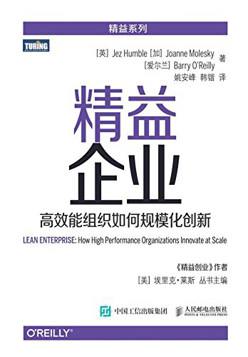

精益企业——高效能组织如何规模化创新
=============================

Lean Enterprise —— How High Performance Organizations Innovate at Scale

[英]Jez Humble [加]Joanne Molesky [爱尔兰]Barry O'Reilly 著

[美]埃里克·莱斯 丛书主编

姚安峰 韩锴 译

译者序
-----------------------------

这是一本系统阐述一个组织应该采取怎样的策略才能真正有效地发生转变，将这些理念变成组织普遍接受的日常行为，从转变中获得最大的收益的书。

译者总结了7条使用了传统“大规模敏捷”框架，也没有本质改变的问题点（查看原书）。

> 下面的这句话，让我感触很深，原文摘录：

而过去多年来，企业在软件开发上大规模采用外包以及外包低端化的趋势使得上面的问题进一步恶化。企业以控制成本为目的，而供应商将员工的“人天”视为创收来源，对员工的持续成长没有足够投入也从不真正关心。外包员工对工作的实际成效更是不关心不负责。供应商一边持续招人，一边稍有经验的人又不断离开，员工无成就感也无归属感，每个人都只是一颗螺丝钉，“码农”这个词确实是对这群人的真实写照。

生产和软件和传统建筑行业等不太一样，具有“不确定性”、“隐性质量”、“智力活动”的特点。

> 下面的这句话，让我感触很深，原文摘录：

彼得·德鲁克的《卓有成效的管理者》一书被很多人奉为经典。他在这本书中提到：“我们无法对知识工作者进行严密和细致的督导，只能协助他们。知识工作者本人必须自己管理自己，自觉地完成任务，自觉地做出贡献，自觉地追求工作成效……谁也不知道一位知识工作者在想些什么。然而，思考正是他的本分，他在思考，也就是在工作……”

本书旨在真正将精益的两条最高原则“以人为本”和“持续改进”应用到一个企业的方方面面。

组织各有各的不同，方法可能也会随着时间推移而不适用，最重要的是，要让每一个组织单元、每一位员工都学会如何适应变化，也就是要具备根据所获得的信息来进行实验，从而找到最佳方法来解决问题的能力和权力。

前言
-----------------------------

任何公司能否长期生存都取决于其能否理解和驾驭文化与技术的力量，这种力量能够持续地加快创新周期。

关注用户体验设计、技术和流程的进步，都能够快速地创造和演化出颠覆性的产品和服务，并将其规模化。通过快速迭代、原型体验，再最终影响设计，来改进产品和业务。

商业社会对待IT的态度正在发生变化。过去很多传统企业将IT外包，是因为IT只是企业运转的辅助，大量的IT成本都用于维持系统稳定，但现在的企业开始将IT搬回到公司内部，IT不再只是维持内部运作，而是作为竞争优势的一个重要来源。

传统的IT项目管理模式不适合快速的创新周期。但是它的思想却根植在方方面面。

本书仔细剖析了产生高绩效的文化，这是组织能够规模化快速创新的关键因素。

第一部分 启航
-----------------------------

企业/公司/组织的目的是 **它能为其他人做什么** ，“管理者和员工必须设身处地为消费者着想。

目的，不是 **愿景声明** （组织渴望成为什么样子），也不是 **使命** （组织所从事的业务）。

企业经营者的职责：

- 创建、调整和传达公司的 **目的** 。
- 创建一个帮助公司达成其目的的 **战略** 。
- 发展一种保障其战略取得成功所必要的 **文化** 。

为什么 **共同目的** 不是追求利润最大化？

- 使得人们倾向于追求短期成果
- 牺牲长期利益，如提升员工能力、增进客户关系。
- 容易扼杀创新（为了在战术上削减短期成本）
- 容易忽略无形价值，如员工的能力、知识产权、以及外部性，如对环境造成的影响。

关注利润最大化通常只会适得其反，降低投资回报率。

第1章 导论
-----------------------------

传统的欧美管理实践，是根据泰勒的理论，管理者的职责就是对工作进行分析，并将其分解为更小的较独立的任务。这些任务由专门的工人来执行，而工人们不需要理解任何东西，只需要尽可能高效地完成分配给他们的具体任务。泰勒主义根本上是将组织视为机器，需要将其分解为零部件来分析和理解。

丰田生产系统（TPS）的核心是创造一种高度信任的文化。在这样的文化下，所有人都以按需打造高质量产品为共同目标，而工人和管理者能够跨职能协作，持续对系统进行改进——有时甚至是彻底重新设计。在所有层级上保持目标一致和自治，进而产生一种专注于持续改善（kaizen）的高度信任文化，这些来自丰田生产系统的理念是产生一个能够快速适应不断变化条件的大型组织所必不可少的。

丰田生产系统的成功不是因为它的具体某项实践和工具，而是得益于它的文化。

行为科学家经常将工作分为两种类型：

- 例行任务：能够通过遵循一个规则来实现唯一正确的结果，称为“演算性工作”。
- 非例行任务：需要创造性和试错过程的工作称为“启发性工作”。—— **内在激励** 会产生最好的成效（让员工为工作感到自豪）。像奖金和绩效评估中给员工评级这类 **外部激励手段** 反倒会降低绩效。

### 1.1 精益企业首先是由人构成的系统

弄清精益企业的关键在于要认识到它首先是一个关于“人”的系统。

在具有持续改善文化的组织里，这些对策（精益和敏捷团队所采用的特定实践和工具）很自然就会在团队里出现，并且在失去价值后被舍弃。创建一个精益企业的关键在于，要让那些实际开展工作的员工能够按照与更广泛组织的战略方向一致的方式来解决客户的问题。要做到这一点，就需要员工能够自己做出局部性的决策，并且这个决策在组织战略层面上是合理的——无疑，这高度依赖于信息的流动，包括反馈环。

调查结果显示，团队文化不仅与组织绩效有很强的关联，它还是工作满意度的一个重要风向标。结果非常清楚：一个高度信任的生机型文化不仅对创造一个安全的工作环境非常重要，更是打造高绩效组织的基础。

### 1.2 使命式指挥：替代命令与控制

拿破仑利用一个小型的机动部队击败普鲁士军队（典型计划驱动的组织）后，重建普鲁士军队的时候，人们重新审视了失败，并将这些经验应用到“任务导向指挥系统”或者叫“使命式指挥”的理念中。

这个理念最核心的内容就是：多个层级管理中，最上级仅传达极其必要的命令，每一级需补充认为必要的进一步说明，而执行的细节则交给口头指示或一句简短的指令。要遵循的规则是，一条命令应该包含且只包含其下级要达成某个特定目的时无法自己作出判断的内容。

之所以要这么做，通常是因为现实的情况往往存在大量的 **摩擦** ，表现为不完整的信息、意料之外的副作用、人为因素（比如人为犯错或误解），以及一系列事件的累积效应。

摩擦会导致三种差距：

- 认知差距：制定计划的时候可能信息不对称导致执行计划的时候解读不同。
- 一致性差距：一旦无法按照原计划执行，就会导致不一致出现。
- 影响差距：环境或其他外部条件导致的差距。

弥合差距的方法：

- 认知差距：将方向限定在定义和传达意图。
- 一致性差距：允许每一级定义如何实现上一级的意图，并“反向简报”。
- 影响差距：让个体在意图一致的前提下自由调整行动。

### 1.3 遵循使命原则，在大范围内形成一致目标

如何才能让组织成员做出正确的决定——以对组织最有利的方式行动？

唐纳德·赖纳森基于使命式指挥理论，提出了“使命原则”，要求我们“详细指定最终状态、目的，并将制约因素尽量最小化”。根据使命原则，建立目标一致性并不是通过制定如何实现目标的详细计划，而是通过说明使命的意图，并传达我们之所以肩负这一使命的原因。

使命原则的关键在于建立一致性和实现自主性。这需要设定明确的高阶目标状态，并附上各方认可的时间表——条件的不确定性越高，该时间表就越宽泛——然后具体如何达成目标状态的细节就由各团队自行决定。这种方法可以用于组织的不同层级，每一层级缩小一些范围，同时提供更多的上下文细节。

### 1.4 人就是你的竞争优势

一个企业的长期价值不在于产品或者知识产权的价值，而在于它能够通过创新持续提升为客户带来的价值并同时开拓新客户的能力。

很多人都会找到错误的阻止高绩效的障碍物，规模、法规、可感知的复杂性、遗留技术、或者所经营的业务领域内其他的一些特征，其实都不是障碍物，而是我们的挑战，而组织改进最严重的障碍是来自于组织文化、领导力和组织战略。

若想获得成功，就必须在整个组织里，包括供应商，培养一种生机型的文化和组织战略。

第2章 管理企业动态的投资组合
-----------------------------

所有企业都必然会参与的两个关键活动：

- 探索：探索新的产品类别和商业模式
- 拓展（执行）：拓展已经过验证的产品类别和商业模式

探索和拓展的区别：

|              |                探索                |                拓展                |
|:------------:|:---------------------------------:|:----------------------------------:|
| 策略          | 彻底的或颠覆性的创新，新商业模式创新    | 渐进式创新，持续优化现有商业模式        |
| 组织结构       | 跨职能、全能型小团队                 | 多个团队通过使命原则保持目标一致        |
| 文化  | 对于实验和风险有高的容忍度，接受失败，专注于获得认知 | 渐进式改善和优化，专注于质量和客户端满意度 |
| 风险管理       | 最大的风险是没有找到产品市场匹配点     | 针对每一种产品和服务综合考虑很多因素进行取舍 |
| 目标          | 打开新市场，或在现有的市场下发现新机会  | 从已占有市场上最大化收益，比竞争对手更高效地经营 |
| 衡量进度       | 达到产品市场匹配点                  | 超越预期，实现计划的里程碑和目标         |

在一个企业里，成功的投资组合管理的关键是理解如何在探索新商业模式与拓展已验证的现有商业模式之间取得平衡，以及如何将业务从一种状态成功地转换到另一种状态。

### 2.1 探索新的想法

精益创业方法论不仅适用于创业领域，同样也适用于企业环境，只要我们牢牢记住它的目的： **发现潜在的颠覆性新商业模式并投入生产，同时快速抛弃那些无法成功的商业模式。**

要让企业能够吸引到大批忠实的客户，就要验证两个假说：

- 价值假说：能够解决某个真实的问题。
- 成长性假说：能够快速、低成本获取新用户，并迅速达到被普遍接受的程度。

在精益创业中，我们采用一种系统性的方法，以迭代的方式走过这个过程。组织在启动新项目时倾向于采用很大的团队，一方面是因为他们（错误地）认为这样有助于项目尽早完成。另一方面也是因为他们想要尽可能多的占满预算。但是这样做往往导致系统功能膨胀、复杂性和依赖管理的难度增加，以及低效和糟糕的质量。

更好的做法是，“突破性改善（kaikaku）”。也就是说，我们要用一个相对较小的跨职能团队进行尝试，团队中有一些属于“创新者”一类的人。这些人必须对提出的过程实验很感兴趣并且有必须的能力来执行实验。而当某种改变被证明是有价值的，这个团队能够帮助其他团队采纳它，这样这种改变就有可能在更广泛的组织内“跨越鸿沟”，直到成为组织标准的工作方式。

### 2.2 拓展已验证的商业模式

在企业里开展工作，项目构成了传统管理范式的基础。先编写商业理据，然后争取到预算，产生预先计划、设计和分析。然后执行计划。项目成功的标准是：是否在计划的时间和成本内完成了任务，而不是以是否为客户、为组织带来价值为判断依据。

在业务拓展这个领域，如何运作大型项目，可以遵循如下这些原则：

1. 定义、度量和管理“成效”，而非“产出”。
2. 管理吞吐量，而非容量或利用率。
3. 确保员工是因为从系统层面进行长期考虑而受到奖励，而不是因为追求短期的功能性目标。

### 2.3 平衡企业投资组合

巴格海在《增长炼金术》一书中提出“三地平线”模型对此进行了描述：

1. 第一地平线：核心产品类别和业务，也就是当前业务：产生今天的现金流。0～12个月。
2. 第二地平线：新兴业务，也就是高成长性业务：今天的收入增长+明天的现金流。12～36个月。需要做渐进式创新。
3. 第三地平线：成长性选项：未来高成长性业务的可能选项。也是精益创业的领域，需要能够低成本试错。36～72个月。需要做商业模式创新。

不同的地平线，需要用不同的管理和支撑实践。

在平衡不同的地平线时，除非高层管理者非常积极地进行投资管理，在不同的地平线部署恰当的管理实践，并关注组织对各层管理者是否有恰当的激励方式，否则那些第一地平线的核心业务总会寻找各种办法来排挤并最终扼杀掉其他地平线的业务。有一种办法来解决这个问题，就是分拆剥离出尽可能独立的业务单元。

### 2.4 结论

如果希望第三地平线的想法可以孵化出来，可以采取可选性原则，假设其中很多都会失败但有少数能够成功。运用精益创业方法对这些想法的商业模式进行快速尝试和转向。

第二部分 探索
-----------------------------

采用这些实验性方法：

- 定义想要达成的可衡量的业务成效；
- 构建尽可能小的原型，能够表明的确在向着业务目标前进；
- 证明所提出的方案确实能为目标受众带来价值。

我们可以有效地管理风险，让团队能够做出更好的决策和判断。

第3章 投资风险建模与度量
-----------------------------

精益创业让我们可以快速地抛弃那些无法带来价值或无法很快被接受的想法，这样避免为其浪费宝贵的资源。

### 3.1 投资风险建模

在大多数企业里，从构思到产品真正进入市场，有30%～50%的时间都花在了一些对降低投资风险来说几乎没有任何价值的活动上。这些几乎没有价值的活动主要是由财务管理和计划过程驱动的。

每一份用来证明企业项目可行的商业理据里面都包含了40～80个变量，但是实践证明，这些变量中的大多数信息价值都趋近于0，而影响决策最重要的单一未知数是这个项目是否会被取消，然后下一个重要的变量是系统的使用率，包括我们能多快推出该系统，以及是否有人会使用。但是为了完成这份商业理据已经花费了大量的时间，这会导致多种不好的结果：

- 时间周期长，降低回报。
- 推迟了得到客户反馈的时间。
- 这类市场研究活动，对一些全新的类别甚至经常判断失误。
- 如果没有数据进行支撑，可能就会把钱投在自己钟爱的项目，导致浪费。

### 3.2 将科学方法应用于产品开发

要验证一个商业模式或产品构想，最低效的方法是，计划并创造出完整的产品，然后看预期的市场是不是真的存在。

这个问题的一部分在于我们用来描述产品开发流程的用语。比如“需求”一词，它们是谁的需求？是用户的需求吗？相比于“需求”一词，用“假说”代替更合适。我们需要不断验证假说。

- 不要花很长时间建立一个复杂的商业模式。
- 收集信息来判断这个问题是不是值得解决的。
- 设计最小可行产品（MVP），持续迭代。
- 在持续迭代的过程中，持续更新商业模式画布。

两项关键革新：

- 不是制定非常详细的计划，而是进行低成本实验。
- 不是只创建一个计划，而是用迭代的方式找到产品市场匹配点。

一个关键的原则：当某些可变因素的不确定性非常高时，只需要很少的一点信息就能显著地降低其不确定性。

精益创业方法成功的一个重要因素是要限制探索团队的大小和团队可用的资源（包括时间）。这将激发人们充分发挥创造性，并专注于学习而不是追求“完美”的方案。收集信息，才是这个阶段的主要目的，而不是打造完美的产品。

如果进行一次实验度量的成本远远低于信息预期价值（EVI=出错的几率✖出错的成本）（或者说，低一个数量级），显然这就很值得去做。因此，探索的项目风险越高成本越高，通过采用精益创业方法，你的投入所产生的价值就越高。

### 3.3 探索的原则

我们基于观察和综合分析提出一些新的假说，设计实验来验证这些假说，然后根据实验的结果选择修正或抛弃我们的理论（该理论构成了我们判断的一部分）。

### 3.4 科学管理对比科学方法

这里所说的科学管理是指“泰勒的科学管理”，这里所说的科学方法是指本书描述的“科学实验性方法”。

前者，分析和决策都由管理者进行，而实际完成工作的人多多少少都像一部机器，简单重复地劳动。在实验性方法里，领导和管理的工作是设计、改进和运作一套体系，使在该体系内实际工作的人能够获得必要的技能和资源去进行他们自己的实验，从而个体和团队都能不断学习、发展和增长知识。

传统项目计划对比精益创业

| 技能或行为       | 传统计划方法               |  实验性方法               |
|:--------------:|:------------------------:|:------------------------:|
| 计划的变更       | 一旦计划确定之后，任何变更都被认为是出了问题，说明过程中发生了错误 | 在我们的预期里，最初的计划在与真正的客户接触时会被否决掉，我们以尽可能快地验证失败和转向为目的 |
| 所需技能        | 需求收集，分析，成本估算，资源和依赖规划，获取政治支持的能力 | 设计实验和进行度量，数据收集和分析，在跨职能团队中高效工作的能力，与更广泛组织进行沟通的能力 |
| 如何衡量成功     | 计划是否得到批准且获得预算   | 我们能够多快地通过学习周期，并退出探索阶段，要么推迟或取消工作，要么继续进入到拓展阶段 |
| 如何遵从规则     | 是否严格遵循了恰当的流程，是否已经得到了必要的签字确认 | 是否识别出了对相关利益者的实际风险，并收集了相关信息对风险进行有效管理 | 

### 3.5 结论

科学实验性方法的竞争力是源于能在整个组织中建立一个共同的方向，使得工作其中的人能够通过一个实验过程不断产生和实践新的能力。这些活动使我们能够更有效地发觉所处环境的变化并进行分析，了解其他组织的决策过程，然后采取行动——以此更好地服务于我们的客户，并改变所处环境。

第4章 从探索不确定性发现机会
-----------------------------

本章引入“发现”的概念来制定业务假说，达成对问题的共识。提供规范、科学、实证的方法进行实验，支持决策。

### 4.1 发现

通过将设计思维的原则与精益创业实践相结合，我们能够在产品开发周期里建立一个基于真实用户和客户的持续反馈环。基本原则就是要投入最小化的成本获得最大化的学习认知，并且利用实验的结果作为我们要转向、坚持或终止的决策基础。

客户，是指为构建产品买单的人，用户，是指使用产品的人。将二者都作为关键干系人参与到产品、服务或过程改进的共同创造过程中是极其重要的。

团队的特性：跨职能、多学科、只包含对问题域探索的必要能力、小团队、包容的环境、完全投入、在同一地点工作（为了快）、承担交付的责任主体、有权力做必要决策、客户和用户也是团队的成员。

#### 4.1.1 营造共识

1. 有挑战性和清晰的共同的愿景。
2. 给予参与者足够的决策授权。
3. 要有空间和机会去精通他们的领域，而不是满足于“刚好”。

“发现”的基本手段之一是采用可视化工具、模型和信息辐射体来交流和呈现团队知识。

#### 4.1.2 不确定性的结构化探索

一开始不要只有一个想法，而要用发散思维产生很多个想法，再用收敛思维从中识别出潜在的方案。

### 4.2 认清商业模式

要不断随着环境调整自己的产品，而不能指望一成不变的解决方案。

#### 4.2.1 商业计划源于对业务问题的理解

- 现存业务：可以使用传统的商业计划。
- 新业务：则需要对商业模式提出假设，并进行验证（并迭代和转向直到验证其成立）。

在确认商业模式正确之前，不要绑死在一份商业计划上。团队必须识别出商业模式假说里风险最高的假设因素，设计实验来验证那些假设，并丰富我们所能获得的信息，降低不确定性。

[商业模式画布](https://assets.strategyzer.com/assets/resources/the-business-model-canvas.pdf)作为一个可视化模版工具，列出了探索商业模式的各个维度，花时间填写这个模版，有助于分析出多种商业模式，不断验证和调整这些部分，来适应业务。

#### 4.2.2 理解客户和用户

为客户和用户建立人物画像，并不断在产品迭代的过程中迭代画像。生成人物画像是为了更好地满足某一类特征用户群体对产品的真实需求。

站在客户和用户的角度去感同身受（移情）是一种需要刻意练习的强大的力量。在基于主观体验的移情作用和对形势的客观分析之间建立一个平衡，以此不断迭代我们的产品。

#### 4.2.3 将洞察与数据变成优势

数据分析可以让我们反转发现的过程——先观察客户是怎样使用现有服务的，然后再向前预测商业模式、产品或服务的新机会。

大数据是一种工具，不是解决方案。关键是它不能代替“移情”。我们仍然需要人的直觉和创新思考来提升对问题域的分析，识别出客户和用户访谈都是有力的工具，可以让我们更有效、更快速地设计出实验。

#### 4.2.4 基于洞察形成假说和实验

跨职能团队的很多成员都会对组织、客户、业务、渠道或市场存在有趣和有价值的见解，应该鼓励他们分享。

通过展现这些信息并展开讨论，基于当前的约束条件和明确的问题声明，我们可以尝试从中识别出适合企业的新商业模式和价值主张。

### 4.3 用最小可行产品加速实验

最小可行产品让我们可以用最小化的投入产生最大化的学习收获。尽可能以低成本、快速有效地进行实验来检验假说中的各种假设因素。

最小可行产品，同时包含下面四个特征，注意是同时，而不是其中之一：

- 切实可行的
- 有价值的
- 可用的
- 令人愉悦的

#### 4.3.1 愿景与最小可行产品如何协同

- 愿景，描述你想要提供的服务类型，你想要服务的客户类别，通常跨越2-5年的时间范围。
- 最小可行产品，不断验证产品是否符合愿景的中间产品。

当验证成功的最小可行产品达到一个产品市场匹配点之后，现金的保持就不及支出重要了（不需要太把低成本要求作为目标了），就可以开始着手建立一个可规模化的方案。

#### 4.3.2 单一关键指标（OMTM）

单一关键指标，不应该是滞后的指标，应该是前置的指标。目的是获得客观的证据来证明我们在对产品做的修改对客户的行为产生了可量化的影响。滞后的指标只有在达到了产品市场匹配点之后，才变得有意义。

### 4.4 结论

产生想法，通过最小可行产品进行快速低成本实验，基于实验所收集的信息来制定决策，将更多的时间和资源投入到真正能为客户带来价值的想法上，或者创造全新的业务。

第5章 判断产品市场匹配点
-----------------------------

这一章主要讨论怎样识别什么时候达到产品市场匹配点，以及如何退出探索阶段并开始在既定市场拓展产品。

### 5.1 创新核算

对新产品、新商业模式或任何新举措中的创新所取得的真正进展进行定义、实验、度量和交流。要了解我们的产品是否有价值，并为其承担责任，我们就需要努力获得真实可信的证据并制定一个合理的探索路线。

创新事务通常需要不同的工具的，传统的财务指标，像**经营绩效**、**现金流**、**投资回报率（ROI）**、**财务比率分析**这样的盈利性比率指标，通常都不合适。

很多指标都是形同虚设，比如：访问次数、网站停留时间、访问页面数、单纯的垃圾邮件、下载次数，取而代之的可以是漏斗分析、每用户会话次数、针对邮件进行的后续反馈、用户激活数（针对下载）。简单地说，应该关注到实际的效果。

度量：明确你真正想要的（最重要的）成效，举出一些实例，并确定如何对其进行观测，那就可以制定出合理的度量方法。

方法一：麦克卢尔提出的“海盗指标”提供了一种优雅的方式来对**面向服务的业务**进行建模。

|       名称          |         目的              |
|:------------------:|:-------------------------:|
| 获取（Acquisition） | 访问服务的人数               |
| 激活（Activation）  | 有一个良好初始体验的人数      |
| 保留（Retention）   | 返回多次访问的人数           |
| 收益（Revenue）     | 参与到收益创造活动中的群体人数 |
| 推荐（Referral）    | 推荐其他用户的群体人数        |

值得一提的是，需要进行分群组进行度量，一个群组是一组具有共同特征的人。

可以基于此进行漏洞分析。

方法二：第三地平线的成长指标。

|       度量          |         目的              |         计算示例            |
|:------------------:|:-------------------------:|:-------------------------:|
| 客户获取成本         | 获取一个新客户或用户花费多少成本？ | 总销售与市场支出除以获取的客户或用户数 |
| 维里系数（K）        | 对产品扩散性的一种量化度量 | 每个用户发出的平均邀请数乘以每个邀请的平均转化率 |
| 客户终身价值（CLV）   | 预测我们从一个客户身上所能获得的总净利润 | 在一个客户与公司的整个业务往来过程中，由他可能带来的未来现金流的现值 |
| 每月燃烧率           | 运作团队所需要的资金数量，这关系到实现盈利前我们能运转多长时间 | 每月所消耗的人力与资源总成本 |

### 5.2 小处着手，步步为营

#### 5.2.1 客户亲密度

通过保持小规模的初始用户群，始终和客户保持紧密联系，倾听客户心声，让我们的产品能够帮到早起采集者。

#### 5.2.2 以问题探路、而非堆砌需求

可以用故事地图的方式来帮助我们理解客户的真实目标和需要解决的问题。而不是以做大规模为目标，堆砌功能需求，打造一个不实用的产品。

#### 5.2.3 探索的工程实践

建议从一开始就坚持：持续集成和少量的基本单元测试与用户轨迹测试。

一旦产品从实验阶段到了被验证阶段，就要开始积极偿还技术债务（重构）。

### 5.3 增长动力

有多种增长策略：

- 病毒：现有客户推荐给新用户。
- 有偿：拿着现有付费客户的钱，去作为获取新客户的成本投入。客户终身价值和综合获取客户平均成本的价差，决定利润率和增长率。
- 粘性：让用户沉溺于产品。
- 扩展：从一个初始商业模式过度成其他商业模式。如亚马逊从网上书店变成网上商城。
- 平台：建立平台并和合作伙伴共建生态系统。

### 5.4 跨越地平线，发展与转型

从探索过渡到拓展的五个关键增长动力：

- 市场：选择合适的市场。充分使用好早期采纳者资源。
- 盈利模式：必须要想好，因为后期不好改变。
- 客户采纳：如何让客户使用我们的产品。
- 忘掉大爆炸式的发布：持续地测试和验证产品，控制住冒进的势头。
- 团队参与：团队必须要紧密协作，坚守创新文化。

### 5.5 结论

用前置指标数据来确定后续方向。

需要考虑三个关键领域：

1. 必须找到客户担当价值的共同创造者。
2. 专注于学习而不是盈利，主要目标不是实现需求，而是搞清楚哪些是待解决的问题。
3. 关注用户参与的实际结果。

第三部分 拓展
-----------------------------

第6章 有效进行持续改善
-----------------------------

高绩效的组织，应该是优先考虑“追求IT和业务目标一致”，还是优先考虑“执行力”呢？

本书的答案是“执行力”，只有先做出来，然后才能够持续改进，再去追求业务优先级的一致性才能事半功倍。

过去，IT被认为是“提升经营效率的工具”，现在则需要和业务一起为外部客户创造价值。

这两者之间也需要不断进行平衡。

### 6.1  惠普LaserJet固件案例分析

惠普固件研发团队在传统软件开发方式的指导下，总是无法按时交付。

他们想要从头开始创建一个新的固件平台。这个新的FutureSmart平台要实现两个主要的架构目标。

- 第一个目标：提升质量的同时降低新固件发布所需的手动测试工作量

    团队希望通过以下措施达到该目标：

    - 持续集成实践
    - 大量投资自动化测试
    - 创建一套硬件模拟器以便测试可以在虚拟平台上运行
    - 在开发人员的工作站上重现测试失败

- 第二个目标：团队不再需要花时间在分支之间移植代码
- 第三个目标：减少成员花在详细计划活动上的时间。

### 6.2 以采用改善形的持续过程创新来降低成本

明确方向 -> 掌握当前状态 -> 建立下一个目标状态 -> 迭代式迈向目标状态

#### 6.2.1 明确方向

要立足于愿景，并遵循使命原则，我们必须清楚了解当前的工作在整个组织层面和价值流层面的方向。

#### 6.2.2 计划：掌握当前状态和建立目标状态

当前状态必须要量化，也是为了能够指导并描绘目标状态。

目标状态确定要提升的工艺流程，设置我们期望达到指定状态的日期，并且给我们希望建立的流程指定可衡量的细节。目标状态的例子包括在制品数量的限制，看板或持续集成过程的实施，期望的每日成功构建次数，等等。

#### 6.2.3 迈向目标状态

采用改善形的话，每个人应能够以天为单位进行实验。每天团队成员都要依次回答下面五个问题：

1. 目标状态是什么？
2. 现在的实际状态是什么？
3. 你认为有哪些障碍在阻挠你达成目标状态？你现在正在解决哪个障碍？
4. 你下一步做什么？（新的PDCA周期开始）你的期望是什么？
5. 什么时候可以看到采取这个步骤所得到的收获？

#### 6.2.4 改善形和其他方法论的区别

采用改善形不需要让现有的流程完全按那些框架里指定的方法来，你所采用的流程和实践应该随着时间不断演进。

### 6.3 惠普LaserJet固件团队如何实施改善形

他们设定了三个概要目标：

1. 创建一个单一平台支持所有设备
2. 提高质量并减少在发布之前用于稳定代码的工作量
3. 减少花在计划上的时间

以迭代的方式工作，并缩短达成每个目标状态的周期，持续改进并逼近目标。

只有在团队大量并持续地投入测试自动化和持续集成的基础上，才有可能产生如此巨大的成本节省和生产率提升。

### 6.4 管理需求

我们通常会出现“业务需求”的概念，规定了各种要完成的“特性”，然后研发团队去实现这些特性而忘记了愿景，至于这些特性是否能满足愿景，则变得不可控。

为了改变这种现状，我们需要将需求的管理也变成改善形的。

针对不同的文化有不同的方式：

- 生机型组织：将业务目标作为团队工作的目标状态，让团队自己去想应该有哪些特性，而不是规定有哪些特性让团队去实现。通过反复实验最终确定哪些特性才是真正有价值的。
- 传统组织：通常会有一个按业务线或产品责任人划分的项目群级别的清单，将工作项按优先级排序。可以实施看板方法，让团队每次只领取限量的任务，并且每一项任务完成后都要能够达到可以使用的目标。

### 6.5 建立敏捷企业

采用基本的敏捷原则来让一个企业变得敏捷。小团队可以轻松用一些敏捷框架和方法来实施，然后持续达到项目群目标，这样整个组织就能够慢慢接受敏捷。这也需要在制度和预算方面，放松对非目标直接相关的工作环节的限制，比如搭建持续集成工具链，这个和目标并不直接相关，业务也并不关心。

惠普创始人比尔·休利特和戴维·帕卡德倡导“走动式管理”策略：

> 一旦发现一个问题，我们就会去询问那个遇到困难的团队或人需要什么帮助。这时我们就发现了一个改进的机会。如果人们因为没有达成目标或度量指标而受到惩罚，一个后果就是他们开始在工作结果和信息上造假，让自己看起来已经达到了目标。获得真实有效的实时度量数据能帮助管理者更好地知道实际发生了什么。

### 6.6 结论

改善形，通过设定目标，并将其分解为一个个小的、渐进的成果（目标状态），使我们能够逐步接近目标。

改善形的关键特征：

- 迭代性
- 能够驱动一种实验性的方法来达到期望的目标状态

这些特征使其适合于在不确定条件下的工作。

第7章 识别价值与加速流动
-----------------------------

大多数企业每天都有和客户价值无关的计划外工作占用了大量的精力，精益思维提供了另一种已得到证明的方法：

1. 准确地描述特定产品的价值
2. 识别每种产品的价值流
3. 使价值顺畅流动不被中断
4. 让客户从生产者拉动价值
5. 追求卓越

### 7.1 马士基案例分析

阿诺德和于杰采用了一种新的流程来管理需求。

动态优先级列表：当新特性被提出时，进行快速分类，触发对待办清单的优先级进行重新排列。当团队有了空余的开发产能，就从清单中“拉”出优先级最高的特性。

采用“延迟成本”方法来排列优先级。该方法通过计算假如一个特性没有及时被实现我们会损失多少钱来估算其价值。

用于排列特性优先级的实际数字被成为“时分延迟成本”（或“CD3”）。它的计算方法是，一个特性的延迟成本除以我们估计开发和交付该特性所需要的时间。如果两个特性有相同的延迟成本，但其中一个预计的开发时间是另一个的两倍，那么我们就应该优先开发那个时间较短的特性。

阿诺德和于杰提出了导致交付周期缩短的两个因素：通过“延迟成本”计算提高了特性的紧迫性；通过将工作拆分成更小的单元提高“时分延迟成本”，从而降低了每个交付批次的大小。此外，试点产品的客户满意度也得到了显著提升。

### 7.2 加速流动

#### 7.2.1 画出你的产品价值流图

每一条价值流都会跨组织内的多个职能，我们要画出产品价值流图，然后进行分析。首先要选择研究的产品或服务，并画出已存在的价值流来描述当前状态。避免只是对局部进行优化，而是要画出未来价值流图。

可以将参与到价值流中的各个部分的能够做决策的人聚集到一起，一定不要超过10个人，共同工作1～3天。

对产品交付涉及的整个范围内的各种过程组进行定义，将价值流拆分成不同的过程组。考察每个过程组包含的工作量以及过程组之间的任务队列。记录三个关键指标：交付周期、处理时间、完整且准确比率。

通过让人们更好地了解工作如何在组织内流转，价值流图能够让所有干系人有更加一致的目标，增进移情和共识。

创建一个未来状态价值流图，描述我们希望将来整个价值流如何运作。进行这项设计活动是以提升绩效为目的。设计的工作流要消除延迟，提升质量，并减少不必要的成本、付出和失败。

一条好的经验法则就是以显著缩短交付周期和提升滚动完整且准确比率（表明我们更好地完成了内建质量工作）为目标。

#### 7.2.2 限制在制品数量

可以使用看板方法：

1. 可视化工作流。
2. 限制在制品数量。
3. 定义服务类别。确定不同服务的优先级。
4. 建立拉动系统。当每个过程组有可用容量的时候，可以发起一个例行会议，决定哪些工作应该优先处理。
5. 进行定期“运作评审”。对每个过程组内干系人的表现进行评估，并调整在制品数量限制和服务类别，以及每个环节接收工作的机制。

在企业里，能告诉我们在制品过多的一个信号就是很多人同时被分配到多个项目。这种有害的实践不可避免地会导致更长的交付周期和更低的质量，因为这些人不断在不同上下文间切换。不要把人员分配到多个项目。我们可以建立一个集中式的团队，按需为各个团队提供额外的专家支持，但并不将这些人分配到任何具体团队，并小心地监控，保证他们的利用率始终低于100%。

### 7.3 延迟成本：一种去中心化的经济性决策框架

在整个组织范围内运用 **延迟成本** 让我们可以将决策制定去中心化，并且使决策受经济考量的约束。

PMO的指责不再是实际制定决策，而是建立维护决策制定的框架：和财务与具体项目共同建立标准紧迫性曲线及其模版，收集和分析数据，在整个组织范围推广延迟成本，并建立反馈环来对决策制定过程的质量持续改进。而实际的决策则可以由基层的团队制定，并在有新的工作到来或原有计算所依赖的假设发生改变时根据延迟成本数据进行调整。

延迟成本不适用于所有场景，如果你并没有很长的任务队列和过多的工作，采用延迟成本带来的整体价值可能并不是太大。

### 7.4 结论

在高绩效组织里，领导者和管理者会敏锐地关注组织正在为其客户所创造的价值。为追求有挑战性的目标而科学地工作，必然要求识别并消除或避免无增值的活动，这就是精益思维的精髓。

第8章 采用精益工程实践
-----------------------------

将软件作为竞争优势的企业都应该尽可能缩短软件集成到生产环境的时间，这将加快我们根据反馈来更新产品或原型，并再次实验，获得认知的速度。所以本章将关注持续交付背后的原则和实践。

### 8.1 持续交付基础

- 安全：先进行自动化测试及部分手动验证来验证变更的安全性，然后将其发布到准生产再到生产。
- 快速：快速通过测试，并快速反馈问题，同时也能降低修复成本。需要在架构设计的时候把可测试性和可部署性考虑进去。
- 可持续：小批量方式进行交付动作，而不是汇集大量工作后发布。

持续交付的两条黄金法则：

- 完成：提交到版本库的主干并可发布之后。
- 保持系统可部署优先级应大于开展新工作。

### 8.2 持续集成和测试自动化

应该基于一个主干进行开发，并保持小批量提交，并在每次提交都自动构建。这条原则不仅适用于小团队也适用于大团队。

不提倡将不同特性放在不同分支上进行开发，这样会不可避免遭遇“集成地狱”，也就无法真正意义上做到持续集成（的精髓：小批量提交）。

主干版本要始终保持可以上线的状态，完成所有的回归测试（自动的）。如果主干版本出现错误又不能在较短的时间修复，就应该第一时间将其回滚并保持主干版本的随时可用。

### 8.3 部署流水线

部署流水线定义了从交付到发布的全过程，同时也是所有参与人员的一个统一的工作界面，它同时记录了所有变更的过程，便于责任的界定和后期审计，拒绝了有风险或降低质量的变更。

任何需要手动完成的活动都应该尽可能简化和自动化，它可能包括：

- 构建：通过脚本的方式可以直接从源代码构建可部署的软件包。
- 环境准备：所有基于环境的变量都应该被源代码统一管理并可以被任何人重建。
- 部署：任何人都可以随时基于源代码部署出一套可用的环境。
- 测试：任何开发人员都可以在他们的机器上运行所有的测试。

### 8.4 将部署与发布解耦

部署是指将代码部署到生产环境，而发布则是让用户可见。这两个词经常被混为一谈。

可以采用蓝绿部署和灰度发布的技术来将它们分开。

移动应用的发布，不是将新的移动应用直接发布到应用商店，而是另外创建一个品牌来进行部署和验证，然后才将其发布到正式品牌中。

### 8.5 结论

强烈建议首先实现完善的配置管理、持续集成和基于主干开发。建立一个由开发人员实现测试自动化的文化也很重要，而这又要求我们能够按需准备测试环境。根据经验，要想解决发布或运维的问题，若没有持续集成、测试自动化和自动环境准备，就很难产生显著的改善。

第9章 以实验性方法进行产品开发
-----------------------------

本章讨论“对齐目标”——如何运用已经具备的能力来确保为客户、用户和组织创造正确的东西。

### 9.1 采用影响地图为下个迭代创建假说

要驱动产品开发，在迭代计划过程中，不仅仅产生过程改进的目标状态（之前的章节讨论到的方法），也产生基于客户和组织成效的产品目标状态。

重点在于描述客户目标或业务目标，而应该避免直接提出解决方案、工作事项清单，这些工作应该留给团队去做，留给他们用那些验证、修订的迭代方式来做。

原因有两点：

- 我们最初提出的方案很可能不是最好的。通过产生、验证和修订多种选择来发现解决当前问题的最佳途径，才能得到更好的解决方案。
- 只有实现解决方案的人对用户需求和业务策略都有深刻的理解并能提出自己的想法，组织才可能大规模地快速前进。

可以用影像地图来分析，但这只是一个假说，一种推理，可以用下面的方法画出影像地图（一个思维导图）：

1. 第一级列举出所有的和目标状态相关的干系人。
2. 第二级描述这些干系人能够以那些方式帮助或妨碍目标状态的实现。
3. 第三级提出如何达到目标状态的各种选择。
    - 优先级最高的是不要写任何代码的方案
    - 提出解决方案并不是必须的，留给团队去提出的方案可能更好。

要让正确的人参与到影响地图的分析活动中。可能是一个跨职能的小团队，包含了不同角色的所有人。

影响地图区别于其他工具的区别主要有：

- 没有项目群级别的特性列表
- 没有详细估算
- 没有“架构史诗”：不是设计一套宏伟的架构，而是要把架构和目标状态的实现一同考虑，如果架构是影响目标状态的因素之一，那么调整并优化架构就应该是一个需要去做的事项。

### 9.2 进行用户研究

先选择一个看起来最短的路径，然后对方案进行验证——同时也验证它的假设——看它是不是真的能够带来预期的价值。

通过低成本的手段获取用户的数据，来加强我们的目标的认识，并提出改进意见不断优化我们的方案。

### 9.3 在线受控实验

通过设计一些A/B测试的案例，并提供数据进行支持，可以识别出那些看似不错的想法是否真的有用。

测试的成本应该远低于完美实现、量化的数据可以客观地说明问题、开发能带来80%预期收益的那20%功能。

### 9.4 一个A/B测试的例子

让实验的失败是安全的：可以为实验定义约束、限制和阈值，可以控制用户空间范围，这样就可以在边界范围内进行安全实验。

### 9.5 以实验性方法进行产品开发的前提

- 正确的工作流程，瀑布式必定是与之相悖的
- 不屈服于沉没成本，做的不好的该舍弃的就应该舍弃
- 改变看待工作成效的方式，成效不仅仅是得到验证的想法，也包括我们在实验过程中所得到的信息。
- 以小批量方式工作产生“流”，要采用整体性的方法来考虑目标状态
- 要能够克服设计实验的复杂性，要防止不同实验之间的互相干扰
- 要能够加强产品、设计、开发等不同角色之间的协作

### 9.6 结论

大多数美好的想法可能都带不来价值，需要有收集用户数据的方法不断来验证和改进想法，最终实现用户价值。

第10章 实现使命式指挥
-----------------------------

第四部分 转型
-----------------------------

第11章 培养创新文化
-----------------------------

第12章 治理、风险与合规管理拥抱精益思想
-----------------------------

第13章 驱动产品创新的财务管理
-----------------------------

第14章 让IT成为一种竞争优势
-----------------------------

第15章 立即开始
-----------------------------