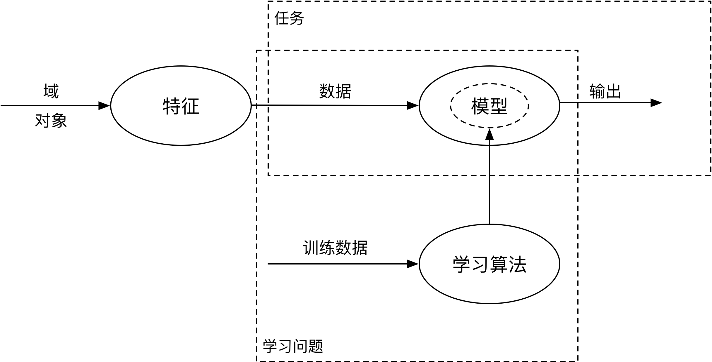
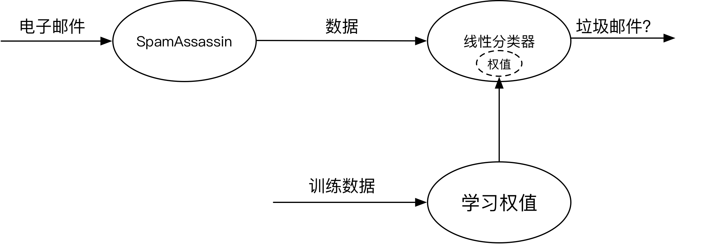

机器学习（Machine Learning）
==============================

作者：[英]Peter Flach 著

段菲 译

The Art and Science of Algorithms that Make Sense of Data

推荐序
------------------------------

本书对经典机器学习框架中的模型做了非常系统的梳理和分类，涵盖了机器学习基础知识的主要部分。

序
------------------------------

作为一本导论性质的读物，作者想要保持机器学习各个领域的统一性和多样性：
- 统一性：通过将“任务”和“特征”分开处理。
- 多样性：覆盖大量逻辑模型、几何模型和概率模型。

机器学习是统计学和知识表示“联姻”的产物。

绪论 机器学习概述
------------------------------

作者从一个垃圾邮件过滤器（[SpamAssassin](http://spamassassin.apache.org)）入手来讲解机器学习。从而给出了机器学习的定义：

> 机器学习是对依据经验提升自身性能或丰富自身知识的各种算法和系统的系统性研究。

从SpamAssassin的例子中，“经验”对应一组正确标注的训练数据，而“性能”对应识别垃圾邮件的能力。

作者使用了线性分类的方式，讲解了SpamAssassin的分类规则。

一个机器学习问题往往存在多种解决方案，同时可能引出多种问题：

- 可能1，过拟合：在一味追求系统在训练数据上的性能，很容易造成一种貌似喜人、实则存在巨大隐患的现象——[过拟合（overfitting）](https://en.wikipedia.org/wiki/Overfitting)。（类似死记硬背某种答案无法真正灵活运用某种知识）
- 可能2，训练数据不符合实际情况：更换训练数据可以改变这种结果。但是也有可能无法找到合适的训练数据，可以用下面两个方法来处理：
    - 1、可能其中某些数据产生了噪声，可以标记为无视它们。
    - 2、尝试描述能力更强的分类器（比如添加一条新的规则共同决策）

除了线性分类，作者又使用了贝叶斯文本分类，来完成相同的任务：通过概率论，估算关键字在文本分类器的词汇表中出现的概率，来判定是否是垃圾邮件。贝叶斯分类的好处是进一步的依据可在原有的基础上使用（如一封邮件同时命中了两个垃圾邮件关键词，那么它是垃圾邮件的概率也将提升）。

然后作者又介绍了基于规则的案例，它将可能独立出现，和可能同时出现的词进行了区分，比如一个“伟哥”和“蓝色药片”可能会同时出现，但是和“彩票”通常不会同时出现，如果单纯使用贝叶斯文本分类方法可能会将同时出现的场景重复计算两次，而基于规则的判定，会仅在“伟哥”的后面才会判断“蓝色药片”出现的概率。

上面这些为了将垃圾邮件分为两类的方法，统称为_二元分类_或_两类分类_(binary classification)。要完成该任务，需要将每封电子邮件转化为一组变量或特征。

通过分析带有正确标注信息的电子邮件训练集，发现样本特征与其所属类别之间的联系，这种联系通常称为_模型_。

作者通过对线性分类、贝叶斯文本分类、规则分类进行了介绍，讲述了机器学习的一些基本的概念。

任务、模型及特征是机器学习的三大“原料”。下面的图是运用机器学习解决给定问题的示意：

要完成一项任务，需要建立从用特征描述的数据到输出的恰当映射（即模型）。学习问题的中心任务就是研究如何从训练数据中获取这样的映射。

同时列出SpamAssassin的相同模型来参考：

机器学习所关注的问题是使用正确的特征来构建正确的模型，以完成既定的任务。

第1章 机器学习的构成要素
------------------------------

第2章 两类分类及相关任务
------------------------------

第3章 超越两类分类
------------------------------

第4章 概念学习
------------------------------

第5章 树模型
------------------------------

第6章 规则模型
------------------------------

第7章 线性模型
------------------------------

第8章 基于距离的模型
------------------------------

第9章 概率模型
------------------------------

第10章 特征
------------------------------

第11章 模型的集成
------------------------------

第12章 机器学习的实验
------------------------------

后记 路在何方
------------------------------

记忆要点
------------------------------

参考文献
------------------------------