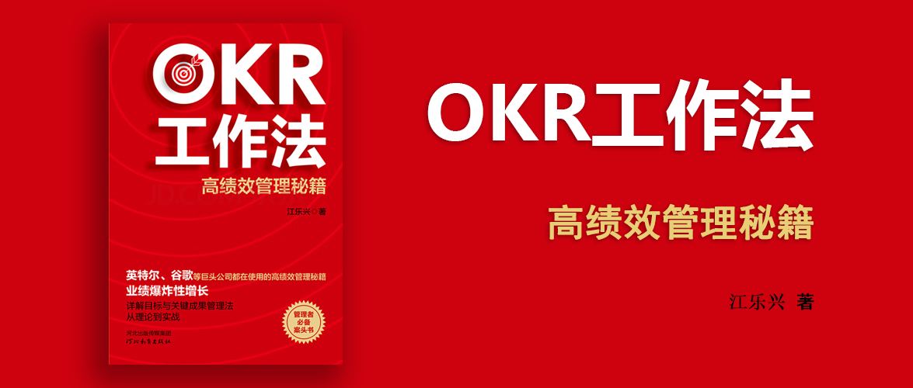

# OKR工作法 - 高绩效管理秘籍

江乐兴 著

## 前言

OKR工作模式自发明以来，就帮助企业进行目标管理，OKR绩效考核就是将目标划分到人，由单个个体对所定的目标负责。该方法让员工能够为目标负责，至于过程和方法，员工则拥有了更多的自主选择权。

## PART 1 OKR起步阶段

### 第1章 开始了解OKR，OKR的由来

通过OKR工作法我们可以：

- 全面协调个人行动与战略目标；
- 制定员工生产计划并跟踪进度及计划实施情况；
- 可以协调个人与团队之间重要事件及业务的优先处理顺序；
- 可以帮助我们专注于最重要的目标，避免被看似紧急却次要的目标分心。

OKR工作法可以从O和KR两个维度来区分：
- O：代表了
- KR：代表了应该具体怎么做，这里的怎么做不是具体的工作方法，而是**描述成果**，即根据目标设定可衡量的里程碑事件。

也可以从表现形式上来区分：
- 愿景型OKR：一时半会可能无法实现，但是有可能实现。这种没有完成也需要被持续保留。
- 承诺型OKR：通过调整工作时间、资源配置等一定可以实现的OKR。这种没有完成需要找原因做改进。

OKR工作法的发展经历了三个理论阶段：

1. 彼得·德鲁克提出的“目标管理理论”。现实中的管理者大都致力于成为自己所在领域的专业人士，并且用这样的标准去衡量和评估他们的下属。所以，目标管理理论阐明管理者再实施目标管理时要做的事情，比如公司各个层级共同商量得出公司目标，并通过与目标相关且简单合理的自我管理方式来评估个人绩效。
2. 安德·格鲁夫提出的“高产出管理理论”。提出了“管理杠杆率”概念：
    - 把有限的精力放在最能提高公司利益的几个最重要的目标上；
    - 培养员工的自我管理能力，让几个最重要的目标具有自上而下和自下而上的双向互动过程；
    - 改变以前常见的以年度为周期的目标设定频率，改为以季度、月度等更短的周期为主；
    - 目标设置得更具挑战性，以提高员工的工作效率。
3. 约翰·杜尔提出的“谷歌的OKR模型”。将谷歌公司的OKR分为四个层级：
    - 公司层级的OKR：公司高层的核心目标与预期；
    - 部门层级的OKR：各部门的目标和预期目标；
    - 团队层级的OKR：各团队的目标和分解指标；
    - 员工层级的OKR：员工个人的目标和预期指标；

OKR的基本思想可以分为以下几点：

1. OKR是一种聚焦目标的思维。
2. OKR是一种公司、团队与个人的协同思维。上下目标要对齐，能力要匹配。
3. OKR是一种成长型思维。喜欢挑战、拥抱变化、寻找可能、从失败中学习，遇到困难时有足够的自信去解决困难，越战越勇，最终走向成功。
4. OKR是一种敏捷型思维。需要根据数据的持续跟踪、分析、检验和刷新来验证目标的达成情况。
5. OKR是一种结构型思维。把管理者的想法、思考和判断整理并归纳到目标与关键成果之中，形成一个系统的结构框架，让你的想法有了切实可行的依据。

OKR的设置：

1. 野心要有实际意义：跳一跳能够够得着。
2. 设置要适当：建议3个O，每个O 3个KR。
3. 注意时间：尽量在一个周期（季度、半年、一年）完成，尽量不要跨周期。
4. 公开透明：公开带来责任感，提升团队协作水平，再通过一些OKR管理软件来实现敏捷。

OKR和KPI的关系：

1. OKR监督我要做的事情，KPI监督要我做的事情。
2. P20，提供了一张表格1-1 OKR与KPI之间的六大区别。

OKR适用于那些：目标不太清晰、目标会随外部环境经常变化、组织结构不固定人员协作多等公司，如存在考核问题的公司、创业公司、高科技公司、创新公司等。

### 第2章 启动OKR前的准备工作

在公司当中推行OKR实际上是在推行“人人有责”的原则，这就要求员工在工作当中撇开职位上的差异，充分地调动起每一个人的力量来推动事业的发展，让每个人的OKR与团队的OKR有机结合，推动企业迅速成长。

OKR制度要实施，也看它是否损害了他人的利益，根据经验，70%的概率会失败。

> 愿景和战略有具体的达成时限，但使命应该是永远不可达的。它就像是你工作中的灯塔，始终照亮你的前方。你可以无限接近它，但永远无法到达。
> 
> 愿景是对使命发展方向的具体描述，它会让使命当中的内容落地。
> 
> 愿景应该包含时间和数值形式的描述。如：10年内实现业务量翻番。

通过“基础四问”谈战略：

1. 驱动力量是什么？通常可选项为：
    1. 产品以及服务
    2. 客户以及市场。这里让我想到了[创新变现-以价格为核心的产品设计策略](../创新变现-以价格为核心的产品设计策略/README.md)一书中提到的围绕产品价值来打磨产品，换句话说，就是找到聚焦于客户和市场的需求，进而提供产品和服务。
    3. 容量或能力
    4. 技术支撑
    5. 销售渠道
    6. 原始材料
2. 战略重点是什么？这个问题如果没有回答好，就会出现“业务覆盖面太广”的问题。
3. 受众群体的定位是什么？
4. 销售体系是哪种？这是四个问题中最重要的，这个意思是“你是如何为客户创造价值的 或者说 客户为什么到你这里买东西”。
    1. 提供低成本的产品或服务，如沃尔玛、麦当劳。
    2. 提供差异化的产品或服务，
        1. 培养客户的黏性，让客户变成企业的忠实用户。例如：微信？（书中没有举例，微信是我自己举例的）
        2. 为产品添加与众不同的功能或者最新技术。例如：苹果公司。

通过“四个镜像”谈战略：

1. 财务镜像：你有足够的财力支撑战略的推进吗？
2. 社会-文化镜像：例如：
    - 举办宣传活动。
    - 公司的底层逻辑是技术驱动的，这时候突然希望以客户和市场为驱动，则可能会带来组织文化上的影响。
3. 人力镜像：例如：
    - 培训员工掌握某一技能。
    - 招聘信任。
4. 技术镜像：例如：投资新技术。

## PART 2 OKR实施阶段

### 第3章 明确目标O，拆解目标达成的方向

可以围绕道德、责任、规则、追求四个方面来设计愿景。

OKR目标的几个必要条件：

1. 有一定的难度
2. 有一定的可执行性
3. 有时间节点
4. 目标控制在3-4个
5. 目标一定要针对根源

厉害的团队通常是采用黄金圈分解法则来思考的：

1. 为什么（Why）：这是最核心的关注点，即我为什么要掏钱买你的电脑，你的产品能给我带来什么？
2. 如何做（How）：也就是实现目标的方法，即你凭什么说你的产品出色？
3. 做什么（What）：这才是事情的结果，即你的产品到底哪些地方出色？

制定OKR目标，常犯的错有：

1. 目标脱离实际，过于夸张。
2. 公司的OKR用到了部门OKR，即达成部门OKR所需的条件并不具备。

OKR的制定要做水平对齐（横向部门对齐）和上下对齐（对齐上级的O，而不是KR），要努力防止每一个O都完成了，但是公司的O没有完成的问题（引入“目标差值”来解决，看看问题在哪里）。

OKR设定之后（检查是否是合格的OKR），应该可以起到激励员工的作用，通常以下方法可以确保它是激励员工的：不与绩效挂钩、主动工作（让员工围绕目标努力，而不是强加干涉过程）、目标契合度（员工的个人发展和公司的OKR之间应该高度契合，这样员工就能有自驱力来完成这个目标）、时刻提醒（通过定期会议对齐目标等方式，时刻提醒员工达成进度，并做横向对比，如果自己进度落后于其他团队，则可能会激励员工努力达成目标）。

### 第4章 创建目标的关键结果——KR

### 第5章 To Do，制定每个KR的行动计划

## PART 3 OKR实战阶段

### 第6章 OKR与常态化管理

### 第7章 影响OKR的关键事项

### 第8章 个人OKR的制定流程

### 第9章 企业OKR的日常运用

### 第10章 名企的OKR应用案例
