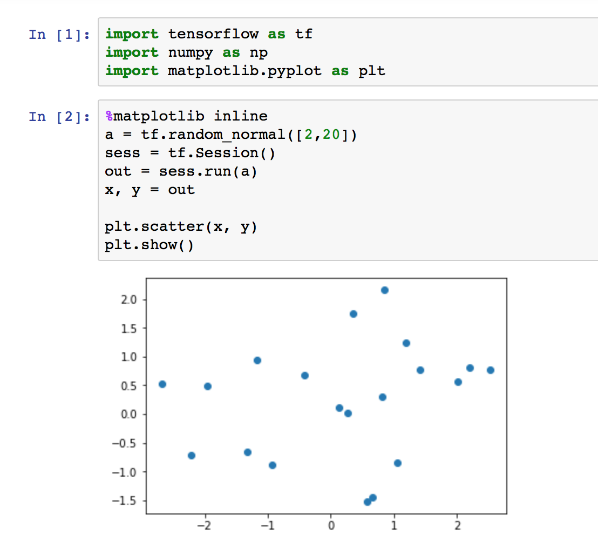
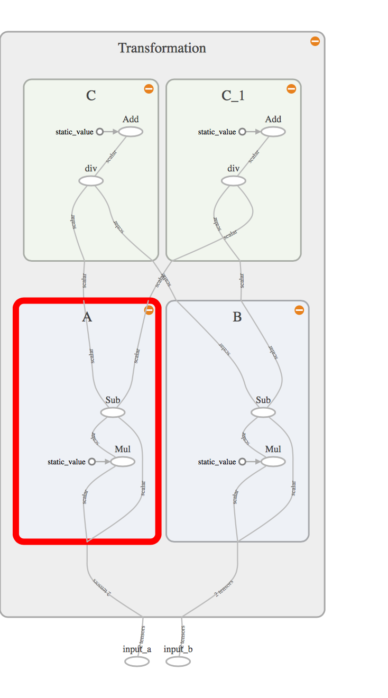

面向机器智能的TensorFlow实践
==============================


作者：Sam Abrahams, Danijar Hafner, Erik Erwitt, Ariel Scarpinelli 著

段菲 陈澎 译

译者序
------------------------------

TensorFlow是Google的第二代分布式机器学习框架。

TensorFlow的“不足”较为突出，接口过于复杂，对初学者的编程技能和知识水平要求偏高，学习曲线过陡。

这不是一本机器学习理论或深度学习的入门读物，阅读本书需要对经典机器学习理论和算法、深度卷积网络、循环神经网络的基本原理有初步了解，并对Python编程和常用的Python库（如NumPy和matplotlib）较为熟悉。

这本书的代码是基于0.8版的，译者对0.9版所做的接口变动以“译者注”的形式做了部分说明。

前言
------------------------------

通过这一节，讲述了本书的主体结构。同时指出了“其他机器学习库”：

- Caffe 专注于卷积神经网络和图像处理，使用C++语言编写。
- Chainer 是另一个灵活的机器学习Python库，支持单机多GPU运算。
- CNTK 是微软公司的首个开源机器学习库，它拥有自己的模型定义语言，支持声明式的分布式模型构建。
- Deeplearning4j 是一个专门针对神经网络的Java库，它易于与Spark、Hadoop和其他基于Java的分布式软件集成，具有良好的可伸缩性。
- Nervana Neon 是一个高效的Python机器学习库，支持单机多GPU运算。
- Theano 是一个极为灵活的Python机器学习库，因其出众的用户友好性以及可以用异常简单的方式定义复杂模型等特点，在科研领域深受欢迎。TensorFlow的API与Theano API最为相似。
- Torch 是一个专注于GPU实现的机器学习库，它是用Lua语言编写的，并由来自若干家大公司的研究团队提供支持。 

第一部分 开启TensorFlow之旅
------------------------------

第1章 引言
------------------------------

### 1.1 无处不在的数据

各种数据从无穷无尽的渠道不断涌入，存储以PB为单位存储。

计算机性能也持续提升。虽然CPU的发展速度放缓，但是并行处理架构取得了爆炸式的发展。GPU也被大量运用于通用计算领域。

近年来，一种特殊类型的机器学习范式在几乎所有领域都取得了无数巨大的成功，它就是深度学习。

### 1.2 深度学习

深度学习是指多层神经网络。它是一类极为灵活的可利用种类繁多的数学方法以及不同数学方法组合的模型。这类模型极为强大，但直到最近几年，人们才有能力卓有成效地利用神经网络，其背后原因：

- 获取足够量的数据成为现实（数据越来也多）
- GPU快速发展，多层神经网络拥有了超越其他机器学习方法所必须的计算能力。
- 更有效的训练算法（by译者）

一个调校好的深度学习模型可以接收所有的参数，并自动确定输入值的有用高阶组合。

相关数学概念几十年前便提出，但致力于创建和训练这些深度模型的编程库是近年才出现的。

深度学习长期面临的两个问题：

- 灵活性：这些编程库在灵活性和生产价值之间进行取舍
- 研究和生产使用不同类型的库：即便出现了可托管在分布式硬件上的快速、高效的库，但它们往往专注于特定类型的神经网络，并不适合研究新的和更好的模型。

TensorFlow就是为了在上面二者之间取得平衡而设计的。

### 1.3 TensorFlow：一个现代的机器学习库

TensorFlow的前身：[DistBelief](https://static.googleusercontent.com/media/research.google.com/zh-CN//archive/large_deep_networks_nips2012.pdf)

它的设计目标：

- 灵活性
- 高效性
- 良好的可扩展性
- 可移植性：任何形式和尺寸的计算机都可以运行。

如果你和你的同事：

- 拥有数据
- 一个有待求解的问题
- 一台可工作的计算机

TensorFlow正是你们一直寻找的“武林秘籍”。

### 1.4 TensorFlow：技术概要

TensorFlow的前身[DistBelief](https://static.googleusercontent.com/media/research.google.com/zh-CN//archive/large_deep_networks_nips2012.pdf)来自于Google Brain团队。TensorFlow汲取了它的经验和教训，现已被成功运用于自然语言处理、人工智能、计算机视觉和预测分析等领域。

### 1.5 何为TensorFlow

在TensorFlow的官网有两句话：

> TensorFlow is an Open Source Software Library for Machine Intelligence

> TensorFlow is an open source software library for numerical computation using data flow graphs.

后面一个声明体现了TensorFlow的几个特点：

- open source（开源）
- library for numerical computation（数值计算库）：TensorFlow提供了一个可使用户用数学方法从零开始定义模型的函数和类的广泛套件。这使得具有一定技术背景的用户可迅速而直观地创建自定义的、具有较高灵活性的模型。
- data flow graphs（数据流图）：可以直观地体现将一个计算任务拆分成多个计算任务的过程。
- 分布式功能
- 软件套件
    - TensorFlow：用于定义模型，由C++写成，有Python接口
    - TensorBoard：可视化软件
    - TensorFlow Serving：可以运行模型的服务器，只有C++接口

### 1.6 何时使用TensorFlow

- 研究、开发和迭代新的机器学习架构。
- 将模型从训练直接切换到部署。
- 实现已有的复杂架构。
- 大规模分布式模型。
- 为移动／嵌入式系统创建和训练模型。

### 1.7 TensorFlow的优势

- 易用性：稳定的API、与NumPy兼容、不用编译、有多种高层接口如Keras和SkFlow
- 灵活性：各种设备都可以使用、分布式可提高速度、可以同时利用CPU和GPU
- 高效性：性能好、且有开放的社区使它更好
- 幕后支持：谷歌支持、社区支持好、已经发布了多个免费模型
- 额外特性：TensorBoard提供的可视化和TensorFlowServing提供的能力是其他平台所没有的

### 1.8 使用TensorFlow所面临的挑战

- 分布式支持尚不成熟
- 实现定制代码的技巧性较强
- 某些特性仍然缺失

### 1.9 高歌猛进

后续将对它的安装、核心库和环境进行全面讲解。

第2章 安装TensorFlow
------------------------------

### 2.1 选择安装环境

为了避免软件包依赖，作者介绍了三种方法：

- 代码库内部的软件包依赖：重复太多，不推荐
- 使用依赖环境：Python的标准版则使用Virtualenv或者[Anaconda](https://www.continuum.io/anaconda-overview)的话，则使用[Conda](https://conda.io/docs/)
- 使用容器：步骤略多一点，适用于部署到一台或多台服务器。

### 2.2 Jupyter Notebook与matplotlib

Jupyter Notebook可交互式地编写包含代码、文本、输出、LaTeX及其他可视化结果的文档。

典型的TensorFlow程序已经被划分为“计算图的定义”和“运行计算图”两部分。

matplotlib是一个绘图库，它允许用户使用Python创建动态的、自定义的可视化结果。

### 2.3-2.7 [省略]

这几节主要讲述的是安装的过程，与[官方文档](https://www.tensorflow.org/versions/master/install/install_linux)描述基本一致，但我各种原因没有成功。还好有Docker安装的方案，参考[官方文档](https://hub.docker.com/r/tensorflow/tensorflow/)

```
docker run -it -p 8888:8888 tensorflow/tensorflow
```

### 2.8 测试TensorFlow、Jupyter Notebook及matplotlib

在Jupyter Notebook中，New一个Python2的Notebook，输入下面的代码

```
import tensorflow as tf
import numpy as np
import matplotlib.pyplot as plt
```

```
%matplotlib inline 
a = tf.random_normal([2,20])
sess = tf.Session()
out = sess.run(a)
x, y = out

plt.scatter(x, y)
plt.show()
```

%matplotlib inline这是一条专门的命令，用于通知笔记本将matplotlib图表直接显示在浏览器中。

下面逐行分析代码：

1. 用TensorFlow定义一个由随机数构成的2X20的矩阵，并将其赋给变量a。
2. 启动TensorFlow Session，并将其赋予一个sess对象。
3. 用sess.run()方法执行对象a，并将输出（NumPy数组）赋给out。
4. 将这个2X20的矩阵划分为两个1X10的向量x和y。
5. 利用pyplot模块绘制散点图，x对应横轴，y对应纵轴。



第二部分 TensorFlow与机器学习基础
------------------------------

第3章 TensorFlow基础 
------------------------------

### 3.1 数据流图简介

#### 3.1.1 数据流图基础

作者从一个最简单的数据流图开始，仅包含两个输入，一个圆形，以及一个输出。其中圆形代表节点，而输入和输出的箭头代表边。

- 节点（node）：通常以圆圈、椭圆、方框来表示，代表了对数据所做的运算或某种操作。
- 边（edge）：对应于Operation传入和Operation传出，通常以箭头表示。

接下来，是一个更符合实际使用的流图，有input的概念。

- input节点，只负责输入，而不需要在数据输入的环节，显示调用内部的运算节点，只需要将数据准备好即可。
- 执行顺序：不同节点之间的计算顺序是无法估计的。

#### 3.1.2 节点的依赖关系

- 直接依赖：a->b，则b直接依赖于a
- 间接依赖：a->b->c，则c间接依赖于a
- 循环依赖：TensorFlow无法执行循环依赖，因为它有很多问题，比如计算无限循环，依赖节点数量变得无穷大，数值上溢、下溢或者趋近于0从而变得没有意义。

可以使用数据流图的“展开”（unrolling）来处理循环依赖的问题，将一个循环依赖的问题，横向摆开有限次。

### 3.2 在TensorFlow中定义数据流图

TensorFlow的工作流非常容易记忆，它只包含两个步骤：

1. 定义数据流图。
2. 运行数据流图（在数据上）。

#### 3.2.1 构建第一个TensorFlow数据流图


```
import tensorflow as tf

a = tf.constant(5, name="input_a")
b = tf.constant(3, name="input_b")
c = tf.multiply(a, b, name="mul_c")
d = tf.add(a, b, name="add_d")
e = tf.add(c, d, name="add_e")

sess = tf.Session()
output = sess.run(e)

```

TensorFlow Session对象在运行时负责对数据流图进行监督，并且是运行数据流图的主要接口。

在上面的例子之后，我们可以将这个数据流图保存下来，原著中的版本不再适用于APIr1.2，这里我做了更新。（[参考这里>>](https://github.com/tensorflow/tensorflow/blob/r1.2/tensorflow/tensorboard/README.md)）

```
writer = tf.summary.FileWriter('./my_graph', sess.graph)
```

这样在根目录就多出一个`my_graph`文件夹。

可以使用`tensorboard --logdir="my_graph"`，打开tensorboard，并点击Graph菜单，可以看到我们刚刚用python代码编写的数据流图的图形化表示。

完成数据流图的构造之后，需要将对象关闭，可以使用下面的语句。

```
writer.close()
sess.close()
```

> 补充说明：因为这里我们使用了docker的方式来运行，和之前介绍的启动docker的默认方法不同，我们使用了下面的语句：

```
docker run -it -p 6006:6006 -p 8888:8888 tensorflow/tensorflow /bin/bash
```

> 这样就进入了命令行模式。在命令行下，使用python shell执行上面所列出来的python脚本，然后再在宿主服务器上通过`http://localhost:6006`访问tensorboard。
> 如果出现了docker无法exit的情况（There are stopped jobs.），可以使用`jobs -l`查看未停止的jobs，然后用`kill %1`来杀死这个进程，其中这个1是job的编号。

> 上面的方法虽然搞定了tensorboard，但是无法同时使用jupyter notebook和tensorboard，而且每次关闭后，之前保存的东西就没有了，为此我做了个持久化的版本，详见这里：[volnet/tf-notebook](https://hub.docker.com/r/volnet/tf-notebook/)或者[volnet/tf-tensorboard](https://hub.docker.com/r/volnet/tf-tensorboard/)。

#### 3.2.2 张量思维

所谓张量，即n维矩阵的抽象。因此，1D张量等价于向量，2D张量等价于矩阵，对于更高维数的张量，可称“N维张量”或“N阶张量”。


```
import tensorflow as tf

a = tf.constant([5,3], name="input_a")
b = tf.reduce_prod(a, name="prod_b")
c = tf.reduce_sum(a, name="sum_c")
d = tf.add(c, d, name="add_d")
```

1. Python原生类型：TensorFlow可以接收Python数值、布尔值、字符串或由它们构成的列表。但是TensorFlow的类型比Python的类型分地更细，如数值型，TensorFlow有很多种，而Python只有一种。
2. NumPy数组：TensorFlow的数据类型是基于NumPy的数据类型的。实际上，语句np.int32==tf.int32的结果为True。但是字符串数据类型，受限于NumPy中并无与tf.string精确对应的类型，因此TensorFlow可以从NumPy中完美地导入字符串数组，只是不要在NumPy中显式指定dtype属性。

```
import numpy as np

# 元素类型为32位整数的0阶张量
t_0 = np.array(50, dtype=np.int32)

# 元素为字节字符串类型的1阶张量
# 注意：在NumPy中使用字符串时，不要显式指定dtype属性
t_1 = np.array([b"apple", b"peach", b"grape"])

# 元素为布尔型的2阶张量
t_2 = np.array([[True, False, False],
                [True, False, False],
                [True, False, False]],
                dtype=np.bool)

# 元素为64位整数的3阶张量
t_3 = np.array([[ [0,0], [0,1], [0,2] ],
                [ [0,0], [0,1], [0,2] ],
                [ [0,0], [0,1], [0,2] ]]
                dtype=np.int64)
```

#### 3.2.3 张量的形状

shape是TensorFlow的专有术语，它同时刻画了张量的维（阶）数以及每一维的长度。

既可以列表（list）也可以用列表（tuple）来描述张量的形状（shape）。

除了能够将张量的每一维指定为固定长度

```
# 具有任意长度的向量的形状
s_1_flex = [None]

# 行数任意、列数为3的矩阵的形状
s_2_flex = (None, 3)

# 第1维上长度为2，第2维和第3维上长度任意的3阶张量
s_3_flex = [2, None, None]

# 形状可为任意值的张量
s_any = None
```

如果需要在数据流图的中间获取某个张量的形状，可以使用tf.shape Op。它的输入为希望获取其形状的Tensor对象，输出为一个int32的向量：

```
import tensorflow as tf

# ...创建某种类型的神秘张量

# 获取上述张量的形状
shape = tf.shape(mystery_tensor, name="mystery_shape")
```

#### 3.2.4 TensorFlow的Operation

Op是一些对（或利用）Tensor对象执行运算的节点。计算完毕后，它们会返回0个或多个张量，可在以后为数据流图中的其他Op所使用。

- 无输入、输出的运算：有些Op没有输入也没有输出，Op并不只限于计算，也可以用于如状态初始化这样的任务（非数学Op）。

##### 运算符重载

也可以用`c=a+b`来表示`c = tf.add(a, b)`。


#### 3.2.5 TensorFlow的Graph对象

创建一个新的数据流图可以通过`tf.Graph()`来完成，默认的情况下，并不需要用户自行创建一个Graph对象，TensorFlow库在被加载时，它会自动创建一个Graph对象，并将其作为默认的数据流图。

```
import tensorflow as tf

# 创建一个新的数据流图
g = tf.Graph()
```

下面的方法可以拿到默认的Graph对象。

```
import tensorflow as tf

# 获得默认数据流图的句柄
default_graph = tf.get_default_graph()
```

我们还可以使用`with`语句，切换当前的默认Graph对象。

```
import tensorflow as tf

g = tf.Graph()
with g.as_default():
    # 像往常一样创建一些Op；它们将被添加到Graph对象g中
    a = tf.multiply(2, 3)

# 由于不在with语句块中，下面的Op将放置在默认数据流图中
also_in_default_graph = tf.subtract(5,1)
```

当需要在单个文件中定义多个数据流图时，最佳实践是**不适用默认数据流图，或为其立即分配句柄**。这样可以保证各节点按照一致的方式添加到每个数据流图中。

#### 3.2.6 TensorFlow Session

Session类负责数据流图的执行。构造方法tf.Session()接收3个可选参数：

- target指定了所要使用的执行引擎。对于大多数应用，该参数取为默认的空字符串。在分布式设置中使用Session对象时，该参数用语连接不同的tf.train.Server实例
- graph参数指定了将要在Session对象中加载的Graph对象，其默认值为None，表示将使用当前默认数据流图。
- config参数允许用户指定配置Session对象所需的选项，如限制CPU或GPU的使用数目，为数据流图设置优化参数及日志选项等。

一旦创建完Session对象，便可利用其主要的方法run()来计算所期望的Tensor对象的输出：

[Session.run()](https://www.tensorflow.org/api_docs/python/tf/Session#run)方法接收一个参数fetches，以及其他三个可选参数（`feed_dict`，`options`，`run_metadata`）：

- fetches参数：可以传入张量也可以传入Op，可以是单个数值也可以是个数组
- feed_dict参数：用于覆盖数据流图中的Tensor对象值，它需要Python字典对象作为输入。它可以替代TensorFlow中的中间值，在一个规模较大的数据流图中，可以利用它提供一些虚构的值对某些部分进行测试。
- options、run_metadata尚在实验阶段。

Session使用完了之后需要调用`.close()`关闭。

#### 3.2.7 利用占位符点添加输入

占位符的行为与Tensor对象一致，但在创建时无须为它们指定具体的数值。它们的作用是为运行时即将到来的某个Tensor对象预留位置，因此实际上变成了“输入”节点。

```
import tensorflow as tf
import numpy as np

# 创建一个长度为2、数据类型为int32的占位向量
a = tf.placeholder(tf.int32, shape=[2], name="my_input")

# 将该占位向量视为其他任意Tensor对象，加以使用
b = tf.reduce_prod(a, name="prod_b")
c = tf.reduce_sum(a, name="prod_c")

d = tf.add(b, c, name="add_d")

# 定义一个TensorFlow Session对象
sess = tf.Session()

# 创建一个将传给feed_dict参数的字典
# 键：'a'，指向占位符输出Tensor对象的句柄
# 值：一个值为[5,3]、类型为int32的向量
input_dict = {a: np.array([5,3], dtype=np.int32)}

# 计算d的值，将input_dict的“值”传给a
sess.run(d, feed_dict=input_dict)
```

placeholder的值是无法计算的——如果试图将其传入Session.run()，将引发一个异常。

#### 3.2.8 Variable对象

创建Variable对象

Tensor对象和Op对象都是不可变的（immutable），但机器学习任务的本质决定了需要一种机制保存随时间变化的值。

可以通过`tf.Variable()`创建对象。

```
import tensorflow as tf

# 为Variable对象传入一个初始值3
my_var = tf.Variable(3, name="my_variable")

add = tf.add(5, my_var)
mul = tf.multiply(8, my_var)

sess = tf.Session()
print( sess.run(add, {my_var: 3}) )
print( sess.run(mul, {my_var: 3}) )
```

TensorFlow提供了大量的辅助Op用于初始化`tf.zeros()`、`tf.ones()`、`tf.random_normal()`、`tf.random_uniform()`，每个Op都接收一个shape参数，以指定所创建的Tensor对象的形状。

```
import tensorflow as tf

# 2x2的零矩阵
zeros = tf.zeros([2, 2])

# 长度为6的全1向量
ones = tf.ones([6])

# 3x3x3的张量，其元素服从0~10的均匀分布
uniform = tf.random_uniform([3, 3, 3], minval=0, maxval=10)

# 3x3x3的张量，其元素服从0均值、标准差为2的正态分布
normal = tf.random_normal([3, 3, 3], mean=0.0, stddev=2.0)

# 3x3x3的张量，其元素服从任何偏离均值不会超过2倍标准差的值，从而可以防止有一个或两个元素与该张量中的其他元素显著不同的情况出现
truncated = tf.truncated_normal([3, 3, 3], mean=5.0, stddev=1.0)

sess = tf.Session()
out_zeros = sess.run(zeros)
out_ones = sess.run(ones)
out_uniform = sess.run(uniform)
out_normal = sess.run(normal)
out_truncated = sess.run(truncated)

print( out_zeros )
print( out_ones )
print( out_uniform )
print( out_normal )
print( out_truncated )
```

Variable对象的初始化

可以使用`tf.global_variables_initializer()`（原书使用`tf.initialize_all_variables()`）Op传给Session.run()完成的。

> WARNING:tensorflow:From /usr/local/lib/python2.7/dist-packages/tensorflow/python/util/tf_should_use.py:170: initialize_all_variables (from tensorflow.python.ops.variables) is deprecated and will be removed after 2017-03-02.
> Instructions for updating:
> Use `tf.global_variables_initializer` instead.

如果只需要对数据流图中定义的一个Variable对象子集初始化，可使用`tf.initialize_variables()`。

```
import tensorflow as tf

var1 = tf.Variable(0, name="initialize_me")
var2 = tf.Variable(1, name="no_initialization")

#init = tf.initialize_variables([var1], "init_var1")
init = tf.variables_initializer([var1], "init_var1")

sess = tf.Session()
out = sess.run(init)

print(out)
```

Variable对象的修改

要修改Variable对象的值，可使用`Variable.assign()`方法。该方法的作用是为Variable对象赋予新值。需要注意的是，Variable.assign()是一个Op，要使其生效必须在一个Session对象中运行：

```
import tensorflow as tf

# 创建一个初值为1的Variable对象
my_var = tf.Variable(1)

# 创建一个Op，使其在每次运行时都将该Variable对象乘以2
my_var_times_two = my_var.assign(my_var * 2)

# 初始化Op
init = tf.global_variables_initializer()

sess = tf.Session()

# 初始化Variable对象
sess.run(init)

# 将Variable对象乘以2，并将其返回
out1 = sess.run(my_var_times_two)
print(out1)
# 输出：2

# 将Variable对象乘以2，并将其返回
out2 = sess.run(my_var_times_two)
print(out2)
# 输出：4

# 将Variable对象乘以2，并将其返回
out3 = sess.run(my_var_times_two)
print(out3)
# 输出：8
```

对于Variable对象的简单自增和自减，TensorFlow提供了`Variable.assign_add()`方法和`Variable.assign_sub()`

```
import tensorflow as tf

my_var = tf.Variable(1)
out1 = my_var.assign_add(5)
out2 = my_var.assign_sub(2)

# 初始化Op
init = tf.global_variables_initializer()

sess = tf.Session()
sess.run(init)
print( sess.run(out1) )
## 6
print( sess.run(out2) )
## 4

# 如果希望将所有Variable对象的值重置为初始值，则只需要再次调用global_variables_initializer，也就是运行sess.run(init)
sess.run(init)
print( sess.run(out2) )
## -1
```

### 3.3 通过名称作用域组织数据流图

名称作用域的基本用法是将Op添加到`with tf.name_scope(<name>):`语句块中，且名称作用域可以嵌套。

```
import tensorflow as tf

graph = tf.Graph()

with graph.as_default():
    in_1 = tf.placeholder(tf.float32, shape=[], name="input_a")
    in_2 = tf.placeholder(tf.float32, shape=[], name="input_b")
    const = tf.constant(3, dtype=tf.float32, name="static_value")
    
    with tf.name_scope("Transformation"):
        
        with tf.name_scope("A"):
            A_mul = tf.multiply(in_1, const)
            A_out = tf.subtract(A_mul, in_1)
            
        with tf.name_scope("B"):
            B_mul = tf.multiply(in_2, const)
            B_out = tf.subtract(B_mul, in_2)
            
        with tf.name_scope("C"):
            C_div = tf.div(A_out, B_out)
            C_out = tf.add(C_div, const)
            
        with tf.name_scope("C"):
            D_div = tf.div(B_out, A_out)
            D_out = tf.add(D_div, const)
            
writer = tf.summary.FileWriter('../logs', graph=graph)
print("ok")
writer.close()
```

使用TensorBoard显示如下：



### 3.4 练习：综合运用各种组件

#### 3.4.1 构建数据流图

```
import tensorflow as tf
graph = tf.Graph()
with graph.as_default():
    with tf.name_scope("variables"):
        # 记录数据流图运行次数的Variable对象
        global_step = tf.Variable(0, dtype=tf.int32, trainable=False, name="global_step")
        
        # 追踪该模型的所有输出随时间的累加和的Variable对象
        total_output = tf.Variable(0.0, dtype=tf.float32, trainable=False, name="total_output")
    with tf.name_scope("transformation"):
        with tf.name_scope("input"):
            # 创建输出占位符，用于接收一个向量
            a = tf.placeholder(tf.float32, shape=[None], name="input_placeholder_a")
        
        with tf.name_scope("intermediate_layer"):
            b = tf.reduce_prod(a, name="product_b")
            c = tf.reduce_sum(a, name="sum_c")
            
        # 独立的输出层
        with tf.name_scope("output"):
            output = tf.add(b, c, name="output")
    with tf.name_scope("update"):
        # 用最新的输出更新Variable对象total_output
        update_total = total_output.assign_add(output)
        # 将前面的Variable对象global_step增1，只要数据流图运行，该操作便需要运行
        increment_step = global_step.assign_add(1)
    with tf.name_scope("summaries"):
        avg = tf.div(update_total, tf.cast(increment_step, tf.float32), name="average")
        
        # 为输出节点创建汇总数据
        tf.summary.scalar(b'Output', output)
        tf.summary.scalar(b'Sum_of_outputs_over_time', update_total)
        tf.summary.scalar(b'Average_of_outputs_over_time', avg)
    with tf.name_scope("global_ops"):
        # 初始化Op
        init = tf.global_variables_initializer()
        # 将所有汇总数据合并到一个Op中
        merged_summaries = tf.summary.merge_all()
# 用明确创建的Graph对象启动一个会话
sess = tf.Session(graph=graph)
# 开启一个Summary.FileWriter对象，保存汇总数据
writer = tf.summary.FileWriter('../logs', graph=graph)
# 初始化Variable对象
sess.run(init)

def run_graph(input_tensor):
    """
    辅助函数；用给定的输入张量运行数据流图，并保存汇总数据
    """
    feed_dict = {a: input_tensor}
    _, step, summary = sess.run([output, increment_step, merged_summaries], feed_dict=feed_dict)
    writer.add_summary(summary, global_step=step)
    
    
# 用不同的输入运行该数据流图
run_graph([2, 8])
run_graph([3, 1, 3, 3])
run_graph([8])
run_graph([1, 2, 3])
run_graph([11, 4])
run_graph([4, 1])
run_graph([7, 3, 1])
run_graph([6, 3])
run_graph([0, 2])
run_graph([4, 5, 6])

# 将汇总数据写入磁盘
writer.flush()

# 关闭Summary.FileWriter对象
writer.close()

# 关闭Session对象
sess.close()
```

#### 3.4.2 运行数据流图

展开GRAPHS菜单可以看到以上代码的图形化展示：


展开SCALARS菜单可以看到最后的输出结果：


### 3.5 本章小结

本章介绍了TensorFlow的基础内容，后续将学习机器学习。

第4章 机器学习基础
------------------------------

### 4.1 有监督学习简介

在这类问题中，我们的目标是依据某个带标注信息的输入数据集（即其中的每个样本都标注了真实的或期望的输出）去训练一个推断模型。该模型应能覆盖一个数据集，并可对不存在于初始训练集中的新样本的输出进行预测。

推断模型即运用到数据上的一系列数学运算。具体的运算步骤是通过代码设置的，并由用语求解某个给定问题的模型确定。模型确定后，构成模型的运算也就固定了。在各运算内部，有一些与其定义相关的数值，如“乘以3”、“加2”。这些值都是模型的参数，且在训练过程中需要不断更新，以使模型能够学习，并对其输出进行调整。

虽然不同的推断模型在所使用的运算的数量、运算的组合方式以及所使用的参数数量上千差万别，但对于训练，我们始终可采用相同的一般结构：


书中创建了一个训练闭环，它具有如下功能：

1. 对模型参数初始化。通常采用对参数随机赋值的方法，但对于比较简单的模型，也可以将各参数的初值均设为0。
2. 读取训练数据（包括每个数据样本及期望输出）（inputs）。通常人们会在这些数据送入模型之前，随机打乱样本的次序。
3. 在训练数据上执行推断模型（inference）。这样，在当前模型参数配置下，每个训练样本都会得到一个输出值。
4. 计算损失（loss）。损失是一个能够刻画模型在最后一步得到的输出与来自训练集的期望输出之间差距的概括性指标。
5. 调整模型参数（train）。这一步对应于实际的学习过程。给定损失函数，学习的目的在于通过大量训练步骤改善各参数的值，从而将损失最小化。最常见的策略是使用梯度下降算法。

上述闭环会依据所需的学习速率、所给定的模型及其输入数据，通过大量循环不断重复上述过程。

当训练结束后，便进入评估阶段（evaluate）。在这一阶段中，我们需要对一个同样含有期望输出信息的不同测试集依据模型进行推断，并评估模型在该数据集上的损失。该测试集中包含了何种样本，模型是预先无法获悉的。通过评估，可以了解到所训练的模型在训练集之外的推广能力。一种常见的方法是将原始数据集一分为二，将70%的样本用于训练，其余30%的样本用于评估。

### 4.2 保存训练检查点

为了避免多个训练周期运行的过程失败（如断电等原因），内存中的数据丢失，TensorFlow提供了保存检查点的方法。

`tf.train.Saver`可以用来存储。

```
saver.save(sess, 'my-model', global_step=0) ==> filename: 'my-model-0'
...
saver.save(sess, 'my-model', global_step=1000) ==> filename: 'my-model-1000'
```

`tf.train.get_checkpoint_state`可以用于验证之前是否有检查点文件被保存下来，可以使用`tf.train.Saver.restore`来恢复。

第三部分 用TensorFlow实现更高级的深度模型
------------------------------

第5章 目标识别与分类
------------------------------

第6章 循环神经网络与自然语言处理
------------------------------

第四部分 其他提示、技术与特性
------------------------------

第7章 产品环境中模型的部署
------------------------------

第8章 辅助函数、代码结构和类
------------------------------

附加信息
------------------------------

1. 1.2版API中和原书中的一些方法不一致，可以参考：https://www.tensorflow.org/api_guides/python/math_ops#Arithmetic_Operators 